# HackTheBox 的小点心

> 原文：<https://infosecwriteups.com/nibbles-from-hackthebox-e03e8ff93e40?source=collection_archive---------2----------------------->

## 带有 Metasploit 的简单淘汰的 Linux 系统

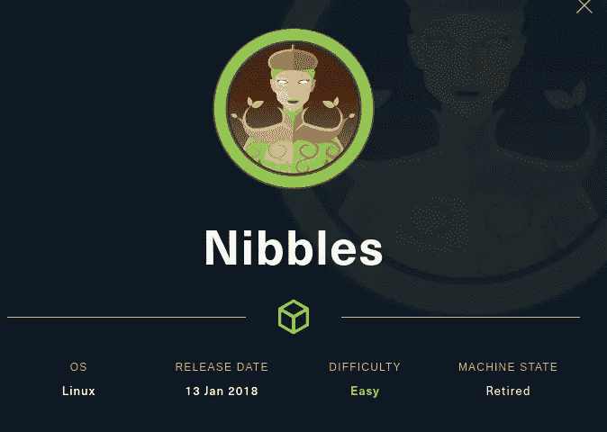

你好，了不起的黑客，我希望你做得很好。今天我们要吃黑盒子里的小吃。这是一个容易退休的 Linux 机器。所以，不要浪费任何时间，让我们开始黑客攻击。

我们将首先从 NMAP 扫描开始

有两个端口打开， **22 (ssh)** 和**端口 80** (Apache httpd 2.4.18)。我们将关注**端口 80** ，因为它具有**更大的攻击面**。但在此之前，我想运行 **searchsploit** 。

我们没有发现任何有趣的东西。我在我们的 nmap 扫描上运行了 **searchsploit** ，因为有些时候像 **Apache 这样的服务或者任何其他正在运行的服务**可能会有**漏洞**。

现在我们将探索**端口 80**

检查端口 80

这是一个简单的页面，显示“ **Hello world！**“现在检查它的源代码。

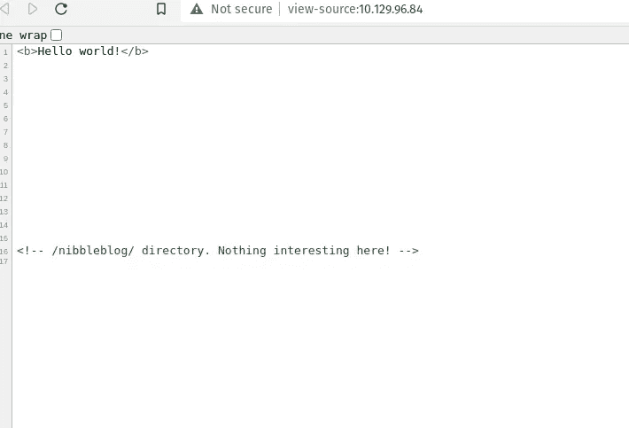

我们得到了一个方向。

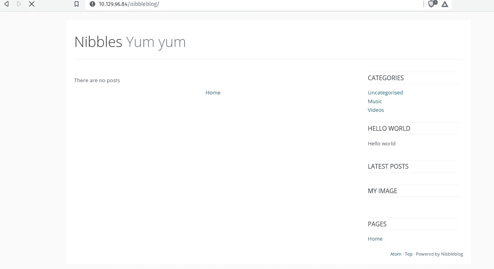

正在检查/ **半字节块**

现在我们将运行 **Gobuster**

在检查 **/README 时，**我得到了 **nibbleblog** 版本号。

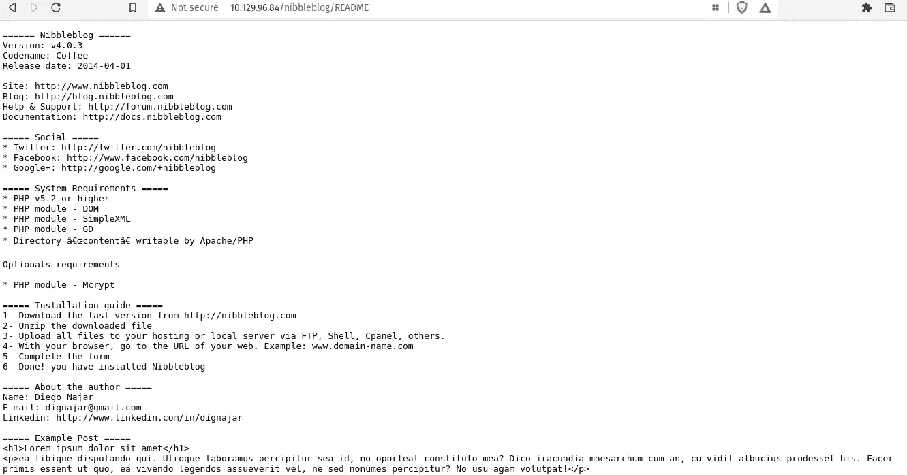

获得了 nibbleblog 版本号

我使用 **searchsploit** 来检查那个版本的 **nibbleblog** 是否易受攻击(你可以使用 Google tooo)。它很脆弱。

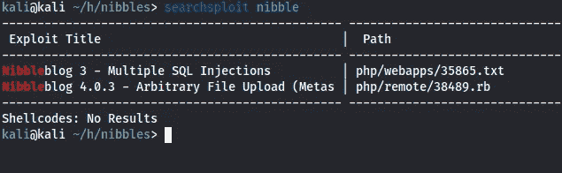

现在我试着检查它的 **metasploit** 模块，但遗憾的是我们需要一个用户名&密码。我们将继续列举。

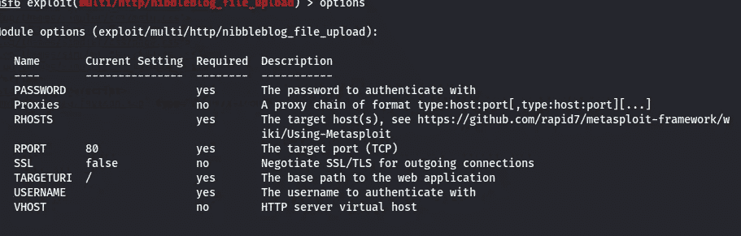

我试着检查了一下 **/admin** 目录，但是没有发现任何有趣的东西。

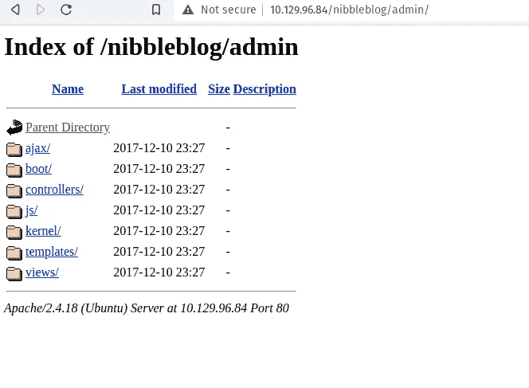

还有 **/admin.php** 这是一个登录页面，但我没有证书，所以我现在要离开 admin.php。

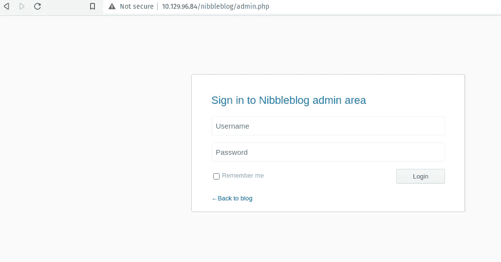

admin.php(登录页面)

然后我在**/nibble blog/content/private/users . XML**中得到用户名

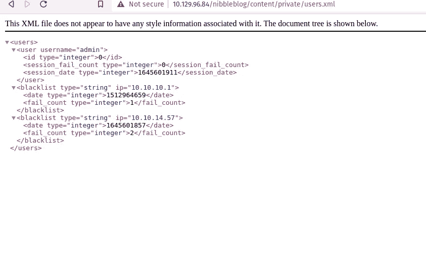

我不断列举密码，但没有运气。所以我尝试了像 admin:admin，admin:password，admin:nibble，admin:nibbles 这样的 cred。并且**管理员:nibbles** 为我工作。现在我有了用户名和密码，我回到了 metasploit 模块。

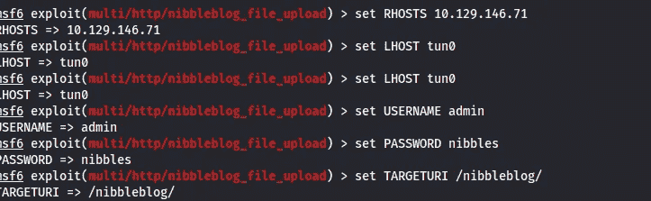

# 现在我们需要将我们的权限提升到 root 用户。

私人视频

我们的用户可以 root 身份运行**/home/nibbler/personal/stuff/monitor . sh**，并且我们还拥有对该文件的写权限。所以我们可以简单地在上面上传我们的反向外壳。我们可以作为根用户运行该脚本(我们必须解压缩 personal.zip 文件)。

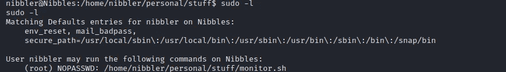

须岛一号

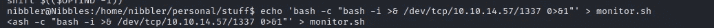

添加 rev shell

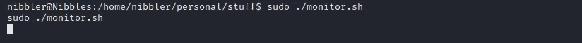

以 root 用户身份运行 monitor.sh

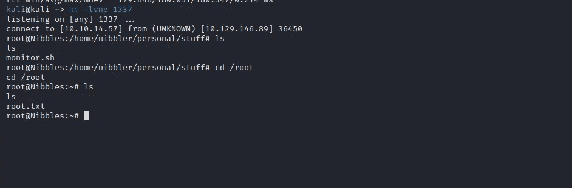

我们找到根了！！！！！！！

感谢你阅读这篇文章，我希望你喜欢它。如果你有任何疑问，你可以在推特上联系我[https://twitter.com/Hac10101](https://twitter.com/Hac10101)

# 🔈 🔈Infosec Writeups 正在组织其首次虚拟会议和网络活动。如果你对信息安全感兴趣，这是最酷的地方，有 16 个令人难以置信的演讲者和 10 多个小时充满力量的讨论会议。[查看更多详情并在此注册。](https://iwcon.live/)

 [## IWCon2022 - Infosec 书面报告虚拟会议

### 与世界上最优秀的信息安全专家建立联系。了解网络安全专家如何取得成功。将新技能添加到您的…

iwcon.live](https://iwcon.live/)