# njRAT 恶意软件分析

> 原文：<https://infosecwriteups.com/njrat-malware-analysis-8e90dce07a9e?source=collection_archive---------2----------------------->

图片来源:bleepingcomputer.com([https://www . bleeping computer . com/news/security/YouTube-bit coin-scams-pushing-the-NJ rat-back door-info stealter/](https://www.bleepingcomputer.com/news/security/youtube-bitcoin-scams-pushing-the-njrat-backdoor-infostealer/))

# 介绍

njRAT(又名 Bladabindi)被描述为“远程访问特洛伊木马(RAT)能够记录击键、访问受害者的摄像头、窃取存储在浏览器中的凭据、打开反向外壳、上传/下载文件、查看受害者的桌面、执行进程、文件和注册表操作，并且能够让攻击者更新、卸载、重启、关闭、断开 RAT 并重命名其活动 ID。通过命令和控制(CnC)服务器软件，攻击者能够创建和配置恶意软件，通过 USB 驱动器传播。”[1]

# 技术分析

*   sha 256:0 f 22 FFB 2 a3 bb 386062 e7c 613 e5a 81 b 819 f 8615 C1 af8 b 45 EB 18778 b 714 cf 1 ea 78

对我来说幸运的是，njRAT 是用 C#语言编写的，这意味着我能够简单地在 dnSpy 中反编译示例并分析 C#源代码，而不是必须使用像 Ghidra 或 IDA 这样的反汇编程序，并用汇编语言和伪代码进行逆向工程。

## 互斥和初始化

该示例的主要函数调用方法 OK.ko()，该方法将执行一些初始操作，其中之一是创建一个新的互斥体。该恶意软件试图打开一个名为“9 e 352 ee BDA 58736627852 c 7 e 3c 9652 b”的新互斥体。这个互斥体名称字符串存储在 RG 字符串中(图 3)。

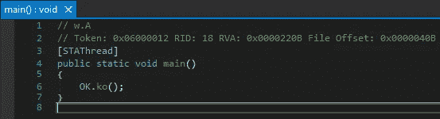

图一。调用 OK.ko()方法的主函数。

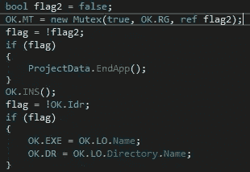

图二。正在打开新的互斥体。

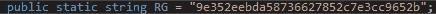

图 3。存储在 OK 中的互斥体名称字符串。RG 字符串。

如果恶意软件不能打开互斥体，它将使用 ProjectData 退出。EndApp()方法。

接下来，恶意软件将调用 OK。INS()方法，它可以被认为是一个初始化方法，因为在 njRAT 可以执行其全部功能之前，它会执行大量的“开销”工作。这种开销包括建立持久性和修改防火墙规则，但首先它会检查临时目录中是否有一个名为 server.exe 的文件。如果有，恶意软件会删除原始的 server.exe，将自身复制到一个新的 server.exe 文件中，然后作为一个新的 server.exe 进程继续执行。

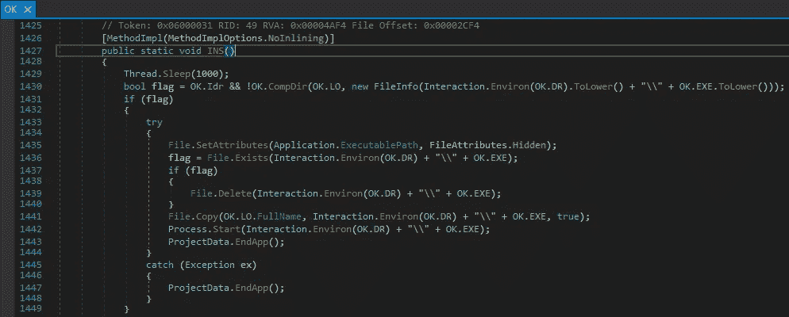

图 4。INS 方法对临时目录中的 server.exe 文件执行检查。

图 5。“TEMP”和“server.exe”字符串。

接下来，njRAT 添加了一个防火墙规则，允许它通过网络进行通信，允许它稍后连接到其 C2 服务器。

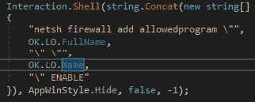

图 6。添加防火墙规则以允许 RAT 进行网络通信。

## 坚持

njRAT 使用两种非常简单的技术来建立冗余持久性。首先，恶意软件在 HKCU \软件\微软\Windows\CurrentVersion\Run 下创建一个名为“9e 352 eebda 58736627852 c 7 e 3c 9652 b”的子项，其值为 njRAT 可执行文件的名称，在本例中为 w.exe。然后，它在 HKLM 蜂巢中执行相同的过程，允许恶意软件在计算机上持续存在，跨越所有可能的用户。一旦创建了这些注册表子项，njRAT 通过再次复制自身添加了一个额外的持久性层，这一次是复制到位于用户的启动文件夹中的一个名为“9e 352 ee BDA 58736627852 c 7 e 3c 9652 b . exe”的隐藏文件中，这意味着该可执行文件将在每次 windows 启动时运行。

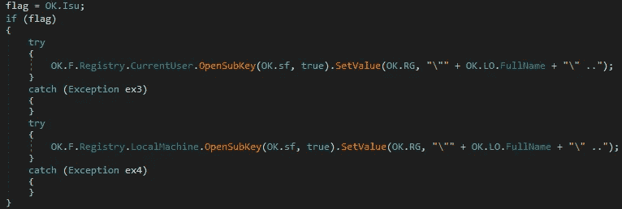

图 7。在注册表中建立持久性。

## 逃避/反分析

njRAT 采用了一些有趣的规避/反分析技术。也在 OK 之内。INS()方法，njRAT 试图在部署恶意软件之前杀死必须在构建器中指定的目标进程。下面的图片来自 github 的一个版本的 RAT [2]，展示了构建器的样子。注意“终止进程”对话框中的“Exsample.exe”。

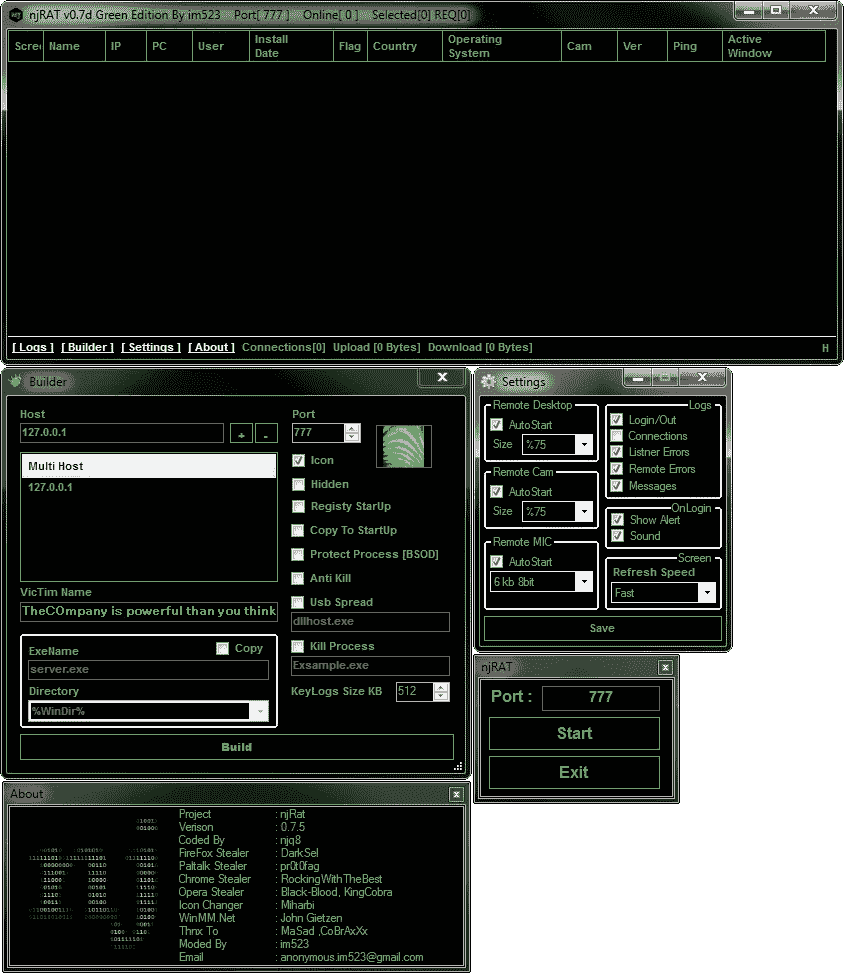

图 8。njRAT builder。

这个特定的示例似乎没有利用 kill process 功能，因为在反字符串中指定的目标进程是“Exsample.exe”，这是生成器中使用的默认字符串。

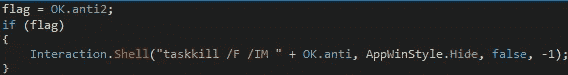

图 9。用于终止目标进程的 taskkill 命令，存储在 OK.anti 字符串中。

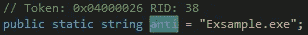

图 10。好的。反串。

njRAT 还检查一些感兴趣的进程是否正在运行，特别是任务管理器、进程查看器、进程黑客和进程浏览器。这些都是可以用来检查和终止正在运行的进程的工具。如果这些目标进程中的任何一个正在运行，njRAT 实际上会禁用这些进程中的进程终止按钮。

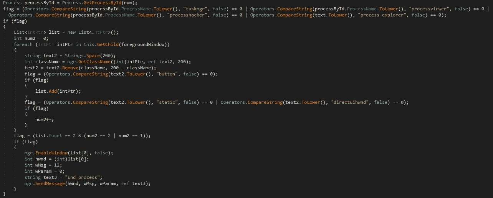

图 11。检查过程监控工具。

njRAT 使用了一个更有趣的技巧，这是我以前从未见过的。恶意软件使用 NtSetInformationProcess 和 GetCurrentProcess 来保护恶意软件进程不会以任何方式终止。当前进程的 PInformationClass 参数设置为值 0x1D(十进制 29)，相当于 BreakOnTermination，意味着如果手动终止恶意软件进程，被感染的计算机将 BSOD(蓝屏死亡)。[3]

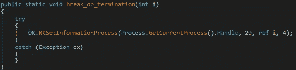

图 12。修改 njRAT 进程，使受感染的计算机在终止后崩溃。

## USB 传播

njRAT 还能够通过 USB 驱动器传播。如果 USB 驱动器连接到受感染的计算机，恶意软件会将 svchost 可执行文件从计算机复制到 USB 驱动器上的新 svchost 可执行文件中。然后，恶意软件将自身复制到 USB 驱动器的 svchost 可执行文件中，将恶意软件伪装成合法的可执行文件。恶意的 svchost 可执行文件然后被隐藏，所以它不会在 USB 驱动器上看到，除非用户专门寻找 USB 驱动器上的隐藏文件。然后，恶意软件将命令写入 autorun.inf 文件，以便在 USB 驱动器插入计算机时执行恶意的 svchost 可执行文件。现在，当 USB 驱动器插入计算机时，它将作为 svchost.exe 执行。值得注意的是，自 Windows Vista 以来，Windows 计算机将不会像过去那样自动从磁盘和 USB 驱动器执行 autorun 可执行文件。现在要求用户批准在计算机上自动运行。

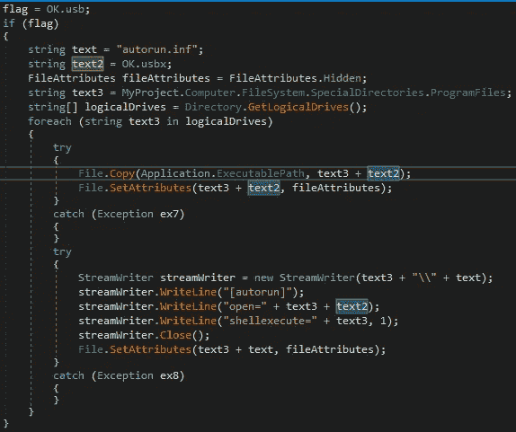

图 13。将 svchost.exe 复制到 USB 驱动器并写入 autorun.inf 文件。

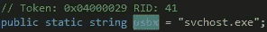

图 14。OK.usbx 字符串。

## 指挥和控制(C2)

njRAT 在连接时向 C2 服务器发送注册消息。此注册消息包含 Windows 操作系统版本、Windows 操作系统服务包、日期、用户名、附加网络摄像头、体系结构和选择注册表项等信息。

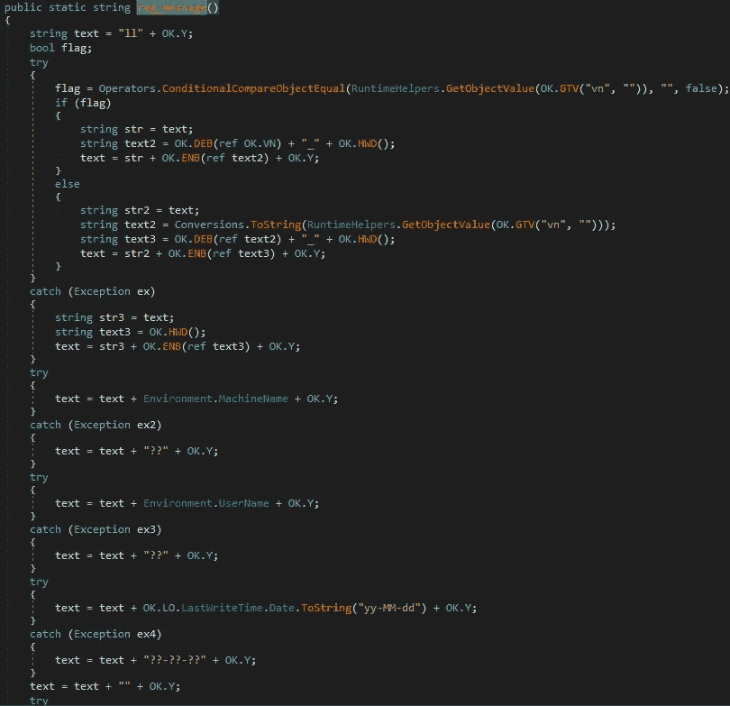

图 15。正在收集注册消息的系统信息。

注册消息一旦形成，就被发送到 C2 服务器。C2 IP 地址存储在 OK 中。指向 HH 字符串的 h 字符串，C2 监听端口存储在 OK。p 弦。

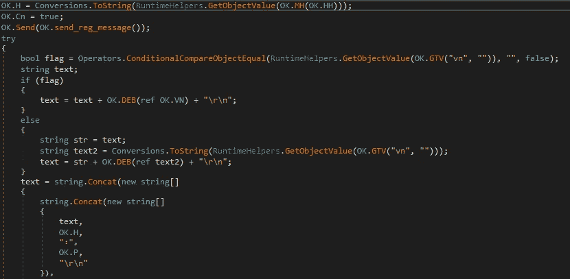

图 16。向 C2 服务器发送注册消息。

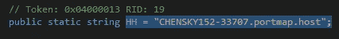

图 17。C2 服务器地址保存在 OK 中。HH 字符串

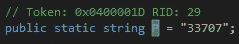

图 18。C2 服务器监听端口存储正常。p 弦。

有趣的是，C2 服务器的真实 IP 地址隐藏在 portmap.io 服务之后。Portmap.io 是一个免费的端口转发解决方案，它使用 VPN 和端口转发来隐藏使用该服务的客户的 IP 地址。过去已经观察到威胁行为者将此服务与其他恶意软件一起使用。

既然被感染的计算机已经连接到 C2 服务器，njRAT 现在将等待 C2 服务器发出命令。在 Ind 方法中，恶意软件然后使用 CompareString()方法将 C2 服务器发出的命令与它能够执行的已知命令进行比较。当存在匹配时，njRAT 执行命令的相应功能。

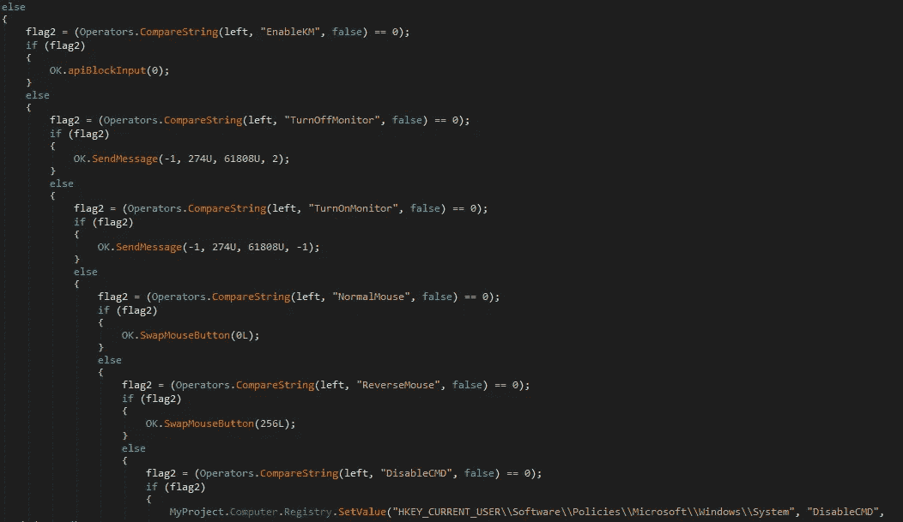

图 19。将 C2 发出的命令与 njRAT 能够执行的已知命令进行比较。

njRAT 能够执行的命令包括:从互联网下载文件、禁用任务管理器、禁用命令提示符、关闭监视器、键盘记录和关闭计算机等等。

## 自我删除

如果操作者愿意，njRAT 能够将自己从被感染的计算机中移除。恶意软件将删除它创建的注册表子项，删除它为其 C2 通信创建的防火墙规则，从启动文件夹中删除自身，并从磁盘中完全删除自身并结束其进程。

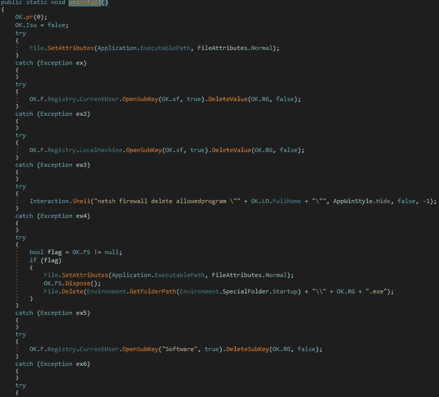

图 20。njRAT 自删除功能。

# 结论

查看我在 github 上的 yara rules repo！

*   [https://github.com/AaronS97/Yara-Rules](https://github.com/AaronS97/Yara-Rules)

我希望你喜欢这篇文章，并希望你会再次回来！一个关注和分享将是超级赞赏。反馈当然也是受欢迎的。

# 参考

[1]https://malpedia.caad.fkie.fraunhofer.de/details/win.njrat

[2][https://github . com/the 0 pany/NjRat-0.7D-Green-Edition-by-im 523](https://github.com/TheC0mpany/NjRat-0.7D-Green-Edition-by-im523)

[3][https://app sec-labs . com/portal/protecting-a-windows-application-from-premature-termination/](https://appsec-labs.com/portal/protecting-a-windows-application-from-premature-termination/)

## 来自 Infosec 的报道:Infosec 每天都有很多内容，很难跟上。[加入我们的每周简讯](https://weekly.infosecwriteups.com/)以 5 篇文章、4 个线程、3 个视频、2 个 GitHub Repos 和工具以及 1 个工作提醒的形式免费获取所有最新的 Infosec 趋势！