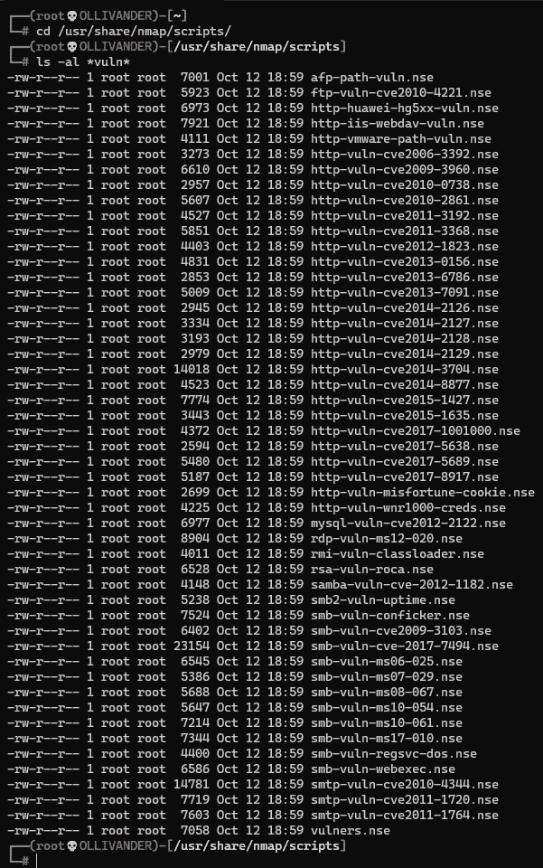
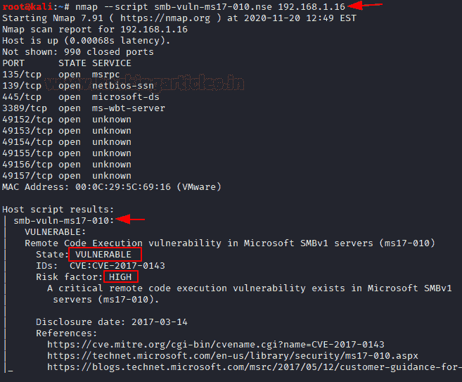
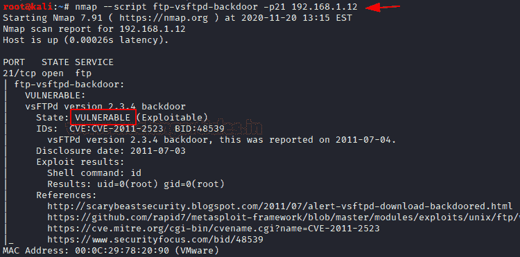
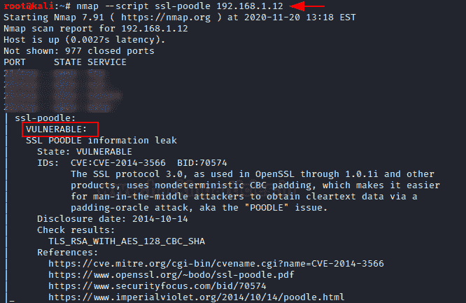
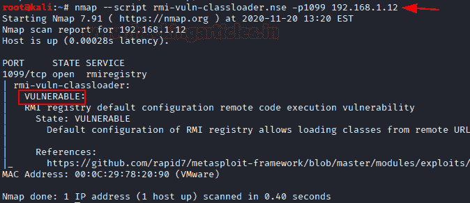
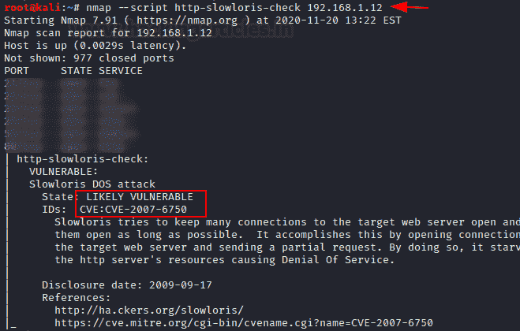
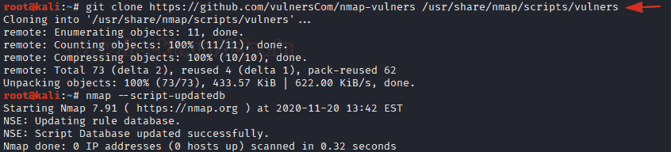
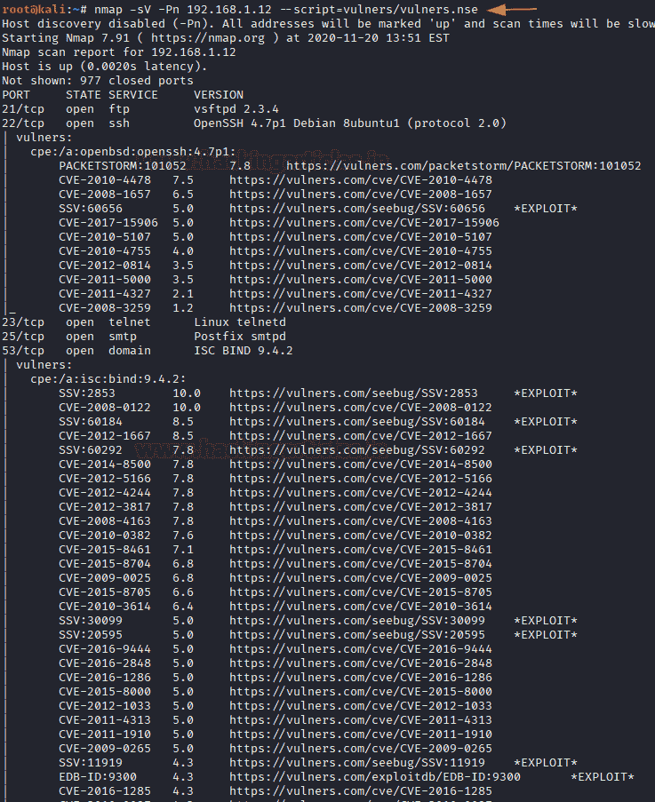
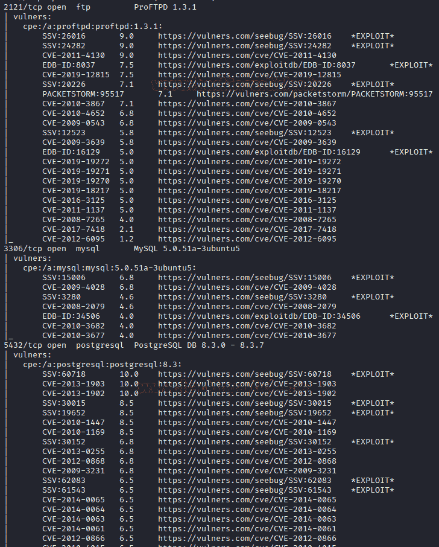

# NMAP 🕸漏洞

> 原文：<https://infosecwriteups.com/nmap-vulnerabilities-40fe8fe70ac6?source=collection_archive---------1----------------------->

# 介绍

地图脚本引擎(NSE)是 Nmap 最有效的功能之一，它允许用户准备和共享他们的脚本，以自动化网络中涉及的众多任务。我们知道 Nmap 的速度和。能力，它允许并行执行这些脚本。根据用户的需要，他们可以从一系列可用的脚本中选择，也可以根据需要创建自己的脚本。

**目录:**

*   **简介**
*   **。nse 脚本**
*   *ms17–010 漏洞*
*   *Vsftpd 后门*
*   *SSL-狮子狗漏洞*
*   *Rmi 类加载器漏洞*
*   *HTTP Slowloris 漏洞*
*   **Nmap-Vulners**
*   **结论**

因此，让我们从列出所有可用于发现漏洞的脚本开始。在这里，我们看到一个脚本列表可用于检测漏洞。我们将一个接一个地运行这些脚本并检查漏洞。

> #cd /usr/share/nmap/scripts/
> 
> #ls -al *vuln*

# MS17–010 漏洞:

该脚本检测微软系统中的 SMBv1 服务器是否容易受到远程代码执行的攻击，这通常被称为**永恒蓝色漏洞**。这个漏洞被 WannaCry 等勒索软件大量利用。这适用于 Windows XP、2003、7、8、8.1、10 以及 server 2008、2012 和 2016。

您会看到，在执行该脚本时，您会看到系统容易受到本质上具有高风险的漏洞的攻击。

> #nmap —脚本 sm b-vuln-ms17–010 . NSE 192 . 168 . 1 . 16

# Vsftpd 后门

该脚本通过尝试使用有害命令利用后门来检查是否存在 **vsFTPd 2.3.4 后门漏洞**。

> #nmap —脚本 ftp-vsftpd-backdoor -p 21

# SSL-狮子狗漏洞

SSL Poodle 是一种中间人攻击，其目的是利用运行在 SSL 上的安全软件。运行此脚本时，您会发现系统易受攻击。

> # nmap–编写 ssl 脚本-poodle 192.168.1.12

# RMI 类加载器漏洞

这个脚本检查 Java rmiregistry 是否允许类加载。rmiregistry 的默认配置允许从远程 URL 加载类，这可能导致远程代码执行。

> # nmap-script = RMI-vuln-class loader-p 1099 192 . 168 . 1 . 12

# HTTP Slowloris 漏洞

它会检查 web 服务器 Slowloris DoS 攻击中的漏洞，但不会发起实际的 DoS 攻击。该脚本将打开两个单独的服务器连接，然后在基本配置中请求 URL。

> # nmap–编写 http-slow loris-check 192 . 168 . 1 . 12 脚本

# SSL-CCS-注射

该脚本在运行时检查服务器是否易受 SSL/TLS“CCS 注入”漏洞的攻击。为了利用 MITM(中间人攻击)来利用此漏洞，攻击者将等待新的 TLS 连接，然后是客户端-服务器的“Hello”握手消息。

> # nmap–编写 SSL-CCS-注射脚本-p 5432 192.168.1.12

# Nmap-Vulners

**Nmap — Vulners** 是一个 NSE 脚本，使用一些众所周知的服务来提供漏洞信息。这个脚本完全依赖于软件版本信息，因此使用 **-sV** 标志。您可以使用 git hub 代码安装它。然后更新 NSE 数据库中的脚本。

> #git 克隆【https://github.com/vulnersCom/nmap-vulners 使用/共享/nmap/脚本/漏洞
> 
> #nmap —脚本-更新数据库

让我们加载脚本，并使用 nmap vulners 检查目标机器上可用的服务版本。在这里，我们看到所有脚本都已加载，可用于基于特定服务版本的漏洞检测。

> # nmap-sV-Pn 192 . 168 . 1 . 12-script = vulners/vulners . NSE

# 结论

因此，我们看到，使用 nmap 脚本，我们可以检测系统上存在的漏洞，这对 Pen 测试人员来说是一个好处。

感谢您的阅读！

> C ***在 LinkedIn 与我联系:***[***https://www.linkedin.com/in/amitnandi04***](https://www.linkedin.com/in/amitnandi04/)