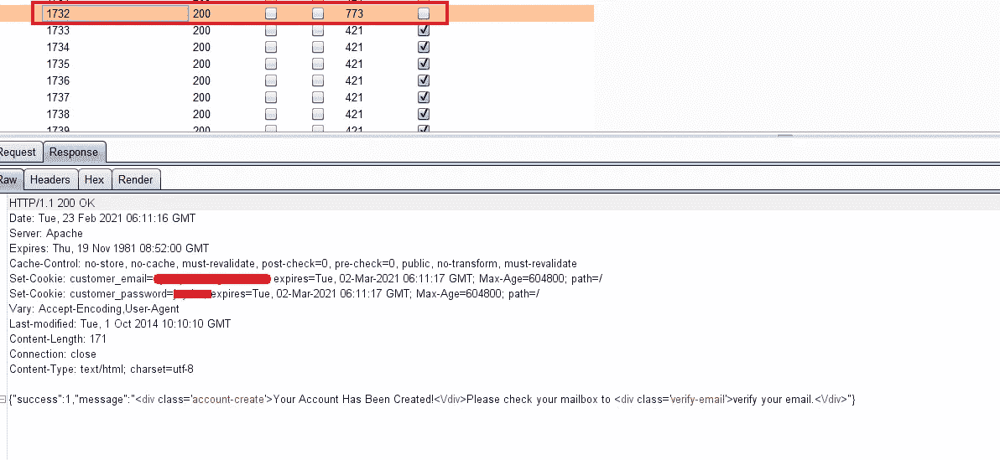
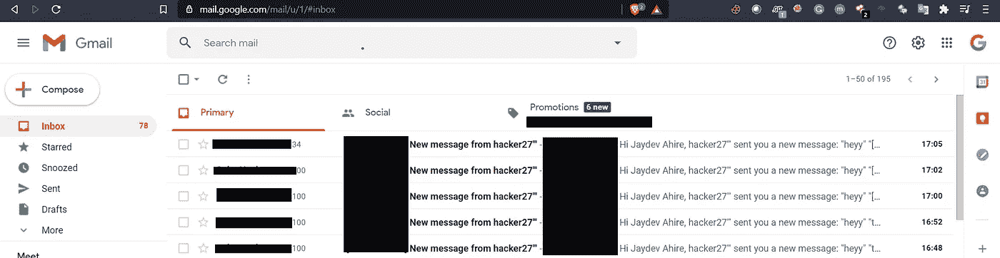

# 没有速率限制—像专业人士一样使用！

> 原文：<https://infosecwriteups.com/no-rate-limit-use-like-a-pro-33fc76744a17?source=collection_archive---------0----------------------->

大家好，感谢你对我之前(第一个)博客的精彩回复。

在这篇博客中，我将谈论我的有效错误，没有速度限制:

1.  对 OTP 旁路没有速率限制会导致验证旁路。
2.  无速率限制保护旁路使用空字节。
3.  通过发送消息来淹没用户邮箱的逻辑无速率限制。

让我们开始:

***OTP 旁路无速率限制导致验证旁路:***

我在 RDP 打猎。没有范围内/范围外的详细信息，也没有 HOF。但是他们只对 SQL 注入、RCE 等关键错误有固定的奖励范围。

我开始寻找低垂的虫子。在创建一个新账户时，他们要求提供一个电话号码和一封电子邮件，因为这是发送系统。对于电话号码验证，我们需要提交动态口令。因为没有超出“速率限制或暴力”范围的部分，所以我决定尝试绕过 OTP 验证。

我请求了 OTP，收到的 OTP 是 1732。出于概念验证和测试目的，我将有效负载计数设置为 50，即 1700–1750，并将限制设置为 3000 毫秒。开始攻击，得到回应。同一个 OTP 使用两次没有限制。

做了一个很酷的 POC，报给了公司:)

看完这篇文章后，你们中的许多人会想尝试将 OTP 密码重置为 ATO。等等，我的朋友，密码重置机制非常强大。密码重置时，(1)加大油门绕过 WAF。(2)您可以强制 OTP，但不能两次使用同一个 OTP，请通过粘贴正确的 OTP 响应来尝试响应操作。

***无速率限制保护旁路使用空字节:***

在这个场景中，我测试了密码重置链接的无速率限制。当我试图使用 IP 轮换绕过无速率限制保护时，我得到了一个奇怪的响应:200+429+200+429……。

我仍然能够用大量的有效载荷计数来淹没受害者的邮箱，所以我向 bugcrowd 报告了此事，并得到了回应:

我试图向他们解释，虽然有保护措施，但我能够淹没受害者的邮箱，但仍然不适用。第二天，我使用空字节，在我的邮件前面添加了%00，即“mymail@gmail.com%00 ”,然后砰！全部 200。进行了新的提交和报告。

***逻辑无速率限制，通过发送消息来淹没用户邮箱:***

有时候你不得不在没有速率限制的情况下使用逻辑，请看这个伟大的例子 [**这里**](https://youtu.be/9KKA3qQy0V4) 。

我在测试 RDP bug crowd。我尝试了无速率限制重置密码链接使用空字节，IP 旋转，但没有运气。在网站上呆了几个小时后，我注意到在向另一个用户发送消息后，该用户会在邮件上收到类似“嗨，用户 B，用户 A 向您发送了一条新消息”的通知警报。然后我发送了一条新消息，在 Burp 中捕获了请求，并将有效负载设置为 400+并成功收到了 400 多封电子邮件。

没有费率限制是唾手可得的，但如果你能合理运用逻辑，这是值得的。

谢谢大家！

如果您有任何疑问，请随时给我发邮件:)

[Linkedin。](https://www.linkedin.com/in/jaydev-ahire/)