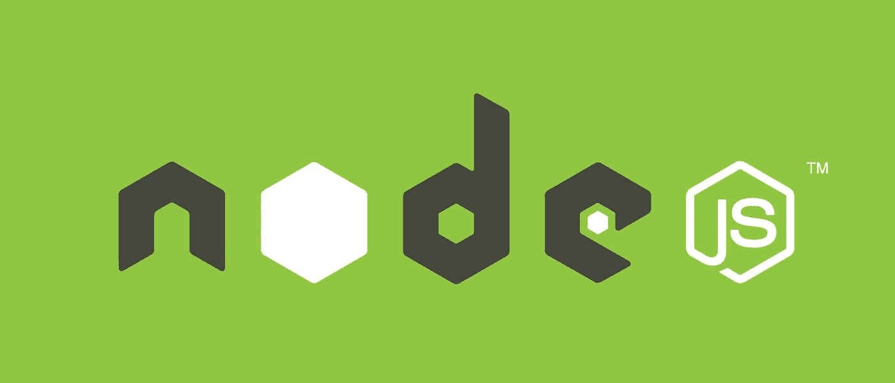
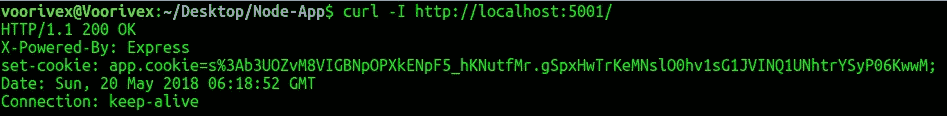

# NodeJS 应用程序测试提示-在 Express 中不正确的 URI 处理

> 原文：<https://infosecwriteups.com/nodejs-application-pentest-tips-improper-uri-handling-in-express-390b3a07cb3e?source=collection_archive---------0----------------------->

Web 应用程序渗透测试方法有许多共同的概念/测试。然而，每种语言和基础设施都有自己特定的漏洞类别和测试方式。表明一些:

1.  代码注入
2.  对象反序列化
3.  竞态条件
4.  正则表达式 DOS

在不久的将来，我会发表以上类别的新故事。



NodeJS

谈到 NodeJS，一种源自 JavaScript 的服务器端编程语言，渗透测试人员必须考虑一些至关重要的测试。我在谷歌上搜索了一些关于 NodeJS 应用程序安全性的信息，看看到底发生了什么，我得到的最多的是关于 [eval()函数](https://www.google.com/search?q=nodejs+eval+vulnearbility&oq=nodejs+eval+vulnearbility)导致[代码注入](https://www.google.com/search?q=code+injection&oq=code+injection)的提示，解释了漏洞和利用方式。我决定在一些故事中掩盖其他缺陷和攻击。

# 与其他 Web 服务器相比，Express

Express 与 Apache 等其他 web 服务器相比，有几个不同之处，尽管攻击概念仍然保持不变。作为一个例子，在 Apache web 服务器中，pentesters 通常通过诸如 [dirb](https://sourceforge.net/projects/dirb/) 这样的脚本进行文件/目录暴力攻击。然而，在 Express 中的站点，由于[路由和控制](https://developer.mozilla.org/en-US/docs/Learn/Server-side/Express_Nodejs/routes)的默认行为，需要更智能的暴力，例如，在端点上执行 [wfuzz](https://github.com/xmendez/wfuzz) 以达到未经授权的 API 访问。我将在后面的故事中讨论这个话题。

在另一个例子中，就 cookie 处理而言，在 Apache 和 PHP 集成的应用程序中，完全由程序员来处理。根据默认行为和常见的替换代码样式，客户端可以更改 cookie 的值。然而，在 Express 应用程序中，cookie 模块使 cookie 防篡改。

```
ssl_vpn.use(session({
    secret: 'h3r3 1s My s4cR3T K4y',
    name: 'app.cookie',
    resave: false,
    saveUninitialized: true,
}))
```

客户端 cookie:



# 一个缺陷—身份验证和会话处理

[破解认证](https://www.owasp.org/index.php/Top_10-2017_A2-Broken_Authentication)类别的漏洞因情况而异。它们没有像 SQL 注入那样的常规模式。我想指出一个我在 NodeJS 语言的断认证中看到的案例。最近，我谷歌了一个使用 session 的小应用程序，看看程序员是如何处理授权的，我得到了[这个代码](https://gist.github.com/smebberson/1581536)。正如在代码中看到的，有一个中间件函数处理授权:

```
function checkAuth (req, res, next) {
 console.log('checkAuth ' + req.url);// don't serve /secure to those not logged in
 // you should add to this list, for each and every secure url
 if (req.url === '/secure' && (!req.session || !req.session.authenticated)) {
  res.render('unauthorised', { status: 403 });
  return;
 }next();
}
```

应用程序有一个名为`secure`的端点，需要验证会话才能看到。这是一个阻止未授权用户访问的挑战，程序员解决了这个问题。`/secure?bypass`的漏洞很明显，很容易被砖头认证。攻击媒介:

```
curl [http://localhost:8999/secure?bypass](http://localhost:8999/secure?bypass)
```

其他攻击和缺陷可能正在发生，我不会在这个故事中涵盖更多的例子。

# 这种情况下的缓解

程序员一直试图用一种非常简单的方式来处理认证问题，以节省性能，但他失去了安全性的权衡。有几种方法可以解决这个问题，我的解决方案是编写一个回调函数来检查会话，在需要身份验证的部分的开始调用它(也可以使用中间位置)。

```
function check_auth(req, res, callback) {
    if (!req.session || !req.session.authenticated) {
        res.redirect('/login');
        return;
    }
    callback(req, res)
}
```

用法:

```
app.get('/', function (req, res) {
    redirect_if_auth(req, res, function (req, res) {
        res.render('index', {Vars});
    })
})
```