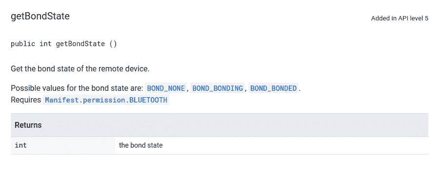
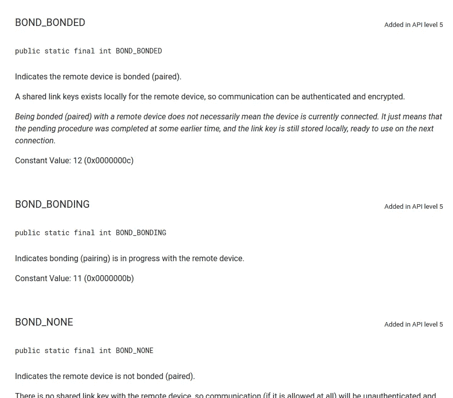
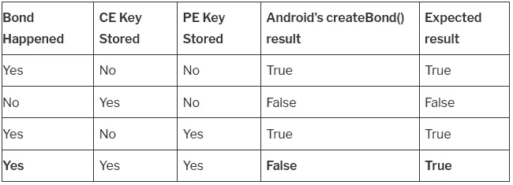
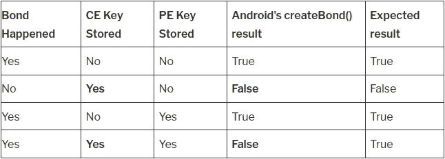
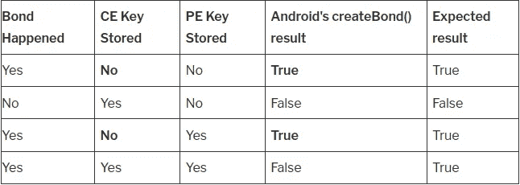
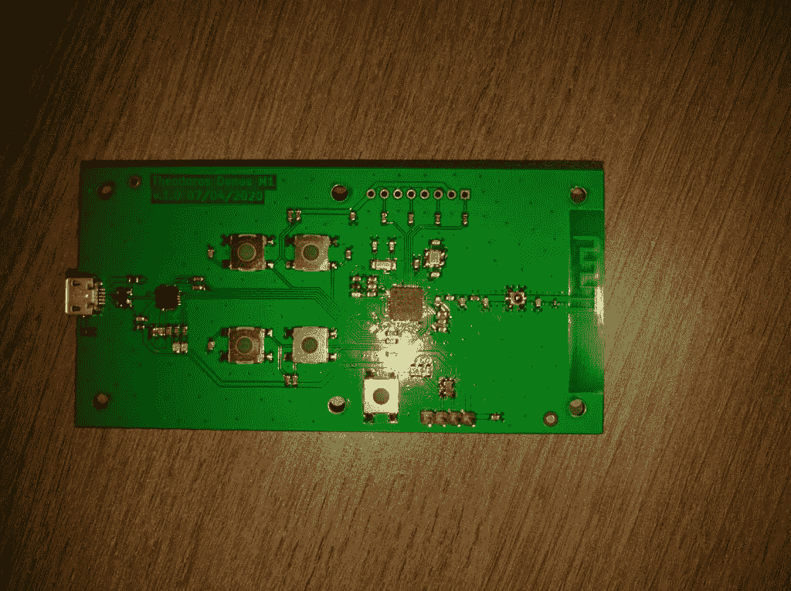

# Norec 攻击:从 Nordic 的库中剥离 BLE 加密(CVE-2020–15509)

> 原文：<https://infosecwriteups.com/norec-attack-stripping-ble-encryption-from-nordics-library-cve-2020-15509-9798ab893b95?source=collection_archive---------1----------------------->


塞巴斯蒂安·肖尔兹(努基)在 [Unsplash](https://unsplash.com?utm_source=medium&utm_medium=referral) 上拍摄的照片

本文讨论了我在一个几乎每个 android 应用程序都基于的库中发现的一个漏洞，并结合了一个导致该漏洞形成的 android bug。

# 蓝牙低能耗:结合

如今，许多应用程序希望对其流量进行加密，以保护传输数据的机密性。因此，在蓝牙低能量标准中，必须在加密之前进行一个称为绑定过程。当两个设备被绑定时，这意味着它们已经交换了 LTK 密钥，因此通信被加密。通信的安全性将在另一篇文章中分析，但是让我们假设 BLE 提供的保护是好的。此外，请记住，绑定不是必需的，必须由两个配对器件中的一个启动。

# 使用 Android API 作为中央设备绑定:困惑

Android 开发人员可以使用 createBond()函数来绑定 BLE 设备。理想情况下，如果创建了绑定，该函数应该返回 true。不幸的是，在 Android API 中有一个混乱(我已经报告过)，当双方都存储了密钥，并且在未来的绑定事件中使用这些密钥时，即使绑定发生了并且流量被加密，该函数也会返回 false。

# 站在脆弱巨人的肩膀上

Nordic Semiconductors 创建了少数几个易于使用的 Android 库，帮助开发人员轻松处理蓝牙低能耗连接。我在这个库中发现了一个漏洞，在这个漏洞中，对手可以剥离 BLE 加密，但是由于处理不当，用户认为流量是加密的。

Nordic 的两个半导体库受到影响:

*   【https://github.com/NordicSemiconductor/Android-BLE-Library 
*   [https://github.com/NordicSemiconductor/Android-DFU-Library](https://github.com/NordicSemiconductor/Android-DFU-Library)

开发人员使用安卓 BLE 库来处理 BLE 连接。
Android-DFU 库被开发者用来无线升级他们的 BLE 固件。

我只测试了几个随机的 BLE 应用程序，它们确实使用了 BLE 债券，并且利用了北欧图书馆的债券功能。我检查过的应用程序如下:

*   卡琳(一款价值约 200 美元的智能自行车锁的应用)——com . linka . Lock app . AOS
*   智能锁—services . singularity . smart Lock
*   一把价值 60 美元的智能锁
*   米洛克斯 ble
*   nRF 连接(北欧的产品)
*   Mi Home — com.xiaomi.smarthome

一个不依赖 nordic 库的应用程序是 phantom lock，然而 Phantom Lock(com . plantraco . coolapps . Phantom Lock)创建了一个绑定，而没有检查绑定过程的结果。

nordic 的两个图书馆的漏洞是一样的。所以我们将只检查两个库中的一个:Android-DFU-Library

该漏洞可在 no.nordicsemi.android.dfu/BaseDfuImpl 类中找到

```
/**
	 * Creates bond to the device. Works on all APIs since 18th (Android 4.3).
	 *
	 * @return true if it's already bonded or the bonding has started
	 */
	@SuppressWarnings("UnusedReturnValue")
	boolean createBond() {
		final BluetoothDevice device = mGatt.getDevice();
		if (device.getBondState() == BluetoothDevice.BOND_BONDED)
			return true;

		boolean result;
		mRequestCompleted = false;

		mService.sendLogBroadcast(DfuBaseService.LOG_LEVEL_VERBOSE, "Starting pairing...");
		if (Build.VERSION.SDK_INT >= Build.VERSION_CODES.KITKAT) {
			mService.sendLogBroadcast(DfuBaseService.LOG_LEVEL_DEBUG, "gatt.getDevice().createBond()");
			result = device.createBond();
		} else {
			result = createBondApi18(device);
		}

		// We have to wait until device is bounded
		try {
			synchronized (mLock) {
				while (!mRequestCompleted && !mAborted)
					mLock.wait();
			}
		} catch (final InterruptedException e) {
			loge("Sleeping interrupted", e);
		}
		return result;
	}
```

nordic 的函数 createBond 被开发者调用来保护移动设备和外围设备(例如，可以是心率监测设备)之间的通信。

开发人员调用 getBondState()来获取当前的绑定状态，而不是启动并强制启动加密过程。人们可能会认为这是正确的做法，因为在 android 文档中，乍一看，一切都很好:

[](https://developer.android.com/reference/android/bluetooth/BluetoothDevice#getBondState%28%29) [## 蓝牙设备|安卓开发者

### AccessibilityServiceMagnificationController . OnMagnificationChangedListener

developer.android.com](https://developer.android.com/reference/android/bluetooth/BluetoothDevice#getBondState%28%29) 

类 BluetoothDevice，方法 getBondState()，最新 Android API

通过检查这种方法，我们没有发现任何可能出错的地方。该函数返回远程设备的绑定状态，可以是 BOND_NONE、BOND_BONDING 或 BOND_BONDED。

我发现这具有误导性，因为它误导了开发人员，让他们误以为 getBondState()将返回刚刚发生的绑定状态。然而事实并非如此。让我们检查 BOND_BONDED 状态:



[https://developer . Android . com/reference/Android/蓝牙/蓝牙设备#BOND_BONDED](https://developer.android.com/reference/android/bluetooth/BluetoothDevice#BOND_BONDED)

如果密钥存储在设备上，getBondState()将返回状态(常量)BOND_BONDED。这并不一定意味着该设备当前与配对的设备绑定。这意味着通信可以是明文。请记住，即使移动设备根本没有与任何设备配对，也可能会返回此状态(BOND_BONDED)。这是因为状态 BOND_BONDED 只是一个指示，表明所检查的蓝牙设备已经在 android 系统上存储了密钥，并且可以使用。

开发人员显然被 android 的文档误导了，认为 getStateBond()方法将返回当前的绑定状态，因此如果状态为 BOND_BONDED，则返回 true。这可以解释为:如果密钥存在于设备上，则返回 true(加密开启),尽管绑定可能已经失败。

# 袭击

攻击的媒介有很多。最明显的一种是攻击外围设备，以消除可用于按键的插槽。每个物联网设备上的大多数 BLE 芯片组都具有有限的内存大小，因此旧密钥(不同设备的)会被新密钥替换。通过伪装 BDADDR，然后绑定几百次到目标外设，可以驱逐所有以前的密钥。这样，所有以前的 LTK 密钥都会被逐出，转储密钥会存储在设备上。最后，这将帮助我们实现我们的目标，因为库中的 bug 不会默认创建绑定，并且用户会被通知连接是安全的(我们不需要做任何进一步的步骤，流量将在没有任何进一步操作的情况下被加密)。

另一种攻击手段是在两个配对设备配对之前劫持通信。在连接请求时，对手可以劫持连接，并作为外围设备做出响应，指示外围设备的存储器中没有存储密钥。这不是一个很难实现的攻击，因为连接请求是在广告信道上发起的，并且这些信道是静态的(没有 FHSS)。

# 困惑= Bug =漏洞

下面我给出了一些我对每个设备状态的发现，android 的本地 createBond()方法的结果，以及预期的结果。



粘合 FSM 工作台

正如我们在最后一行中所观察到的，当密钥同时存在于两个设备上时，createBond()起初似乎有问题并返回 false。这使得开发人员开发健壮的包装器变得更加困难，并且经常会导致开发人员产生 bug，例如 nordic 的库的 bug，不幸的是，这是一个安全 bug。

请注意，即使 createBond()返回 false，通信仍然是加密的，并且发生了绑定。这是因为该调用是异步的，并且在蓝牙服务中发现，如果当前状态不是 BOND_NONE，则返回 false。这很令人困惑。

我和 nordic 的 PSIRT 团队有过一次交流:

> *…我们的团队确认了一个问题，尽管 Android 显示绑定状态为“已绑定”,但仍能连接到一个已擦除绑定信息的设备。
> 不过，问题似乎出现在安卓方面。每当绑定信息出现在客户端(Android)时，Android 上的方法 createBond()都会返回 false，当它出现在外围设备端时也是如此。因此，这两种情况(双方的有效债券和客户端的债券信息，因此未加密的链接)是不可区分的。……
> [*与北欧的 PSIRT 团队 *]* 沟通的一部分

nordic 告诉我的有一部分是真的。当客户机有密钥而 PE 没有时，它是安全的，应该返回 false，因为返回 true 将是一个主要的安全问题。这是因为如果外设没有密钥，用户应该得到警告(否则攻击可能已经发生)。如果可以强制执行重新配对，这是可以避免的，但 android 不支持这种中级操作。答案是部分正确的，因为正如我之前提到的，android 确实提供了一个令人困惑的返回输出。

# 第一个不安全补丁

> …为了检查设备是否配对(这不是 100%可靠)，我们确实要检查 CCCD 在重新连接后是否仍然启用。这是假设 CCCD 状态是为绑定的设备保留的，这通常是真的，并且可以在远程设备上伪装成该设备(相同的地址，默认启用 CCCD)。
> 因此，在 Android 上，如果不使用第三方加密机制从使用 GATT 的设备中获取这些信息，似乎无法检查您是否真正绑定。
> 在调用 createBond()之前不检查焊接状态会导致错误，即使器件焊接正确。
> 我们建议您就此问题联系谷歌……
> 【与 Nordic 的 PSIRT 团队沟通的一部分】

他们已经用远离安全解决方案的解决方案修补了库。

他们的改变显示如下(他们只改变了安卓-BLE-库，因为安卓-DFU-库还没有打补丁)。

易受攻击的函数 createBond()的修补版本:

```
private boolean internalCreateBond() {
    final BluetoothDevice device = bluetoothDevice;
    if (device == null)
        return false;

    log(Log.VERBOSE, "Starting bonding...");

    // Warning: The check below only ensures that the bond information is present on the
    //          Android side, not on both. If the bond information has been remove from the
    //          peripheral side, the code below will notify bonding as success, but in fact the
    //          link will not be encrypted! Currently there is no way to ensure that the link
    //          is secure.
    //          Android, despite reporting bond state as BONDED, creates an unencrypted link
    //          and does not report this as a problem. Calling createBond() on a valid,
    //          encrypted link, to ensure that the link is encrypted, returns false (error).
    //          The same result is returned if only the Android side has bond information,
    //          making both cases indistinguishable.
    //
    // Solution: To make sure that sensitive data are sent only on encrypted link make sure
    //           the characteristic/descriptor is protected and reading/writing to it will
    //           initiate bonding request.
    if (device.getBondState() == BluetoothDevice.BOND_BONDED) {
        log(Log.WARN, "Bond information present on client, skipping bonding");
        request.notifySuccess(device);
        nextRequest(true);
        return true;
    }

    if (Build.VERSION.SDK_INT >= Build.VERSION_CODES.KITKAT) {
        log(Log.DEBUG, "device.createBond()");
        return device.createBond();
    } else {
        /*
         * There is a createBond() method in BluetoothDevice class but for now it's hidden.
         * We will call it using reflections. It has been revealed in KitKat (Api19).
         */
        try {
            final Method createBond = device.getClass().getMethod("createBond");
            log(Log.DEBUG, "device.createBond() (hidden)");
            //noinspection ConstantConditions
            return (Boolean) createBond.invoke(device);
        } catch (final Exception e) {
            Log.w(TAG, "An exception occurred while creating bond", e);
        }
    }
    return false;
}
```

我觉得他们的解决方案有点幼稚。它不能解决问题，并假设外围设备具有客户端特征配置描述符(这也可能是伪造的)。这是疯狂和不安全的。

# 攻击缓解和推荐的补丁

我已经建议了一种缓解技术，这种技术很容易实现，并且在 google 修复他们的框架之前可以保证应用程序的安全。我建议的缓解措施是，每当用户希望进行加密通信时，调用 android 的本机 createBond()，然后检查结果。然后，检查当前的焊接状态。

如果结果为假，并且绑定状态为 BOND_BONDED，则只需移除密钥并重试。

如果失败并且绑定状态是 BOND_NONE，那么它只是失败了，现在您可以终止连接以保护用户的隐私。

为了理解如何解决这个问题，让我们检查一下下面的召回表:

在清除键之前



擦除该键后



开发人员必须注意的两个拐角情况是第二排情况和第四排情况。这是 createBond()失败的两种情况。我们不知道密钥是否存在于另一边的事实，以及 android 中存在令人困惑的方法的事实，使我们无法区分那两种情况。但是，我们可以删除该键，这将把手机的状态转移到第一排和第三排的情况。这改变了我们的状态，createBond 将在两种情况下返回 true。这样，我们的通信是安全的，解决方案也很棒！

# 攻击限制

当中心希望连接到认证的特征时，攻击是有限的，因此必须进行绑定。在这种情况下，createBond 无关紧要，绑定将正常发生，没有任何问题。

# 协调漏洞披露时间表

*   2020 年 6 月 23 日:发现漏洞
*   2020 年 6 月 24 日:向 Nordic 的 PSIRT 发送漏洞报告
*   01/07/2020: Nordic 的第一个补丁(仅在 Android-BLE-图书馆上)
*   2020 年 2 月 7 日:Nordic 确认了安全漏洞
*   2020 年 2 月 7 日:Nordic 收到关于不安全补丁的通知
*   2020 年 7 月 2 日:CVE 的请求
*   2020 年 7 月 2 日:CVE 被接收(CVE-2020-15509)
*   2020 年 7 月 3 日发布

# 履行

攻击是用一个自定义工具实现的，我将在以后的文章中讨论。



原型——Mark I——定制 BLE 评估套件，首开先河。

这是一个产品的原型，我将在接下来的几个月推出。

Java SDK 尚未发布。

使用定制 SDK 和定制硬件的攻击只用了不到 5 行代码就完成了。整个程序不到 100 行代码。

```
private static void startNoricAttack(CEController ce) throws Exception
	{
		for(int i=0; i<100; i++)
		{
                        selectRandomMac(); ce.connect(target, ConnectionTypesCommon.AddressType.RANDOM_STATIC_ADDR);
			ce.bondNow(true);
			try {Thread.sleep(100);}catch(InterruptedException iex) {}
			ce.disconnect(19);
			int peer_id = getPeerId();
			ce.deletePeerBond(peer_id);
		}
	}
```

更新:我创建了这个工具的一个精简版本，叫做 BLE:bit。它是开源和开放硬件的。可以在这里找到: **blebit.io**