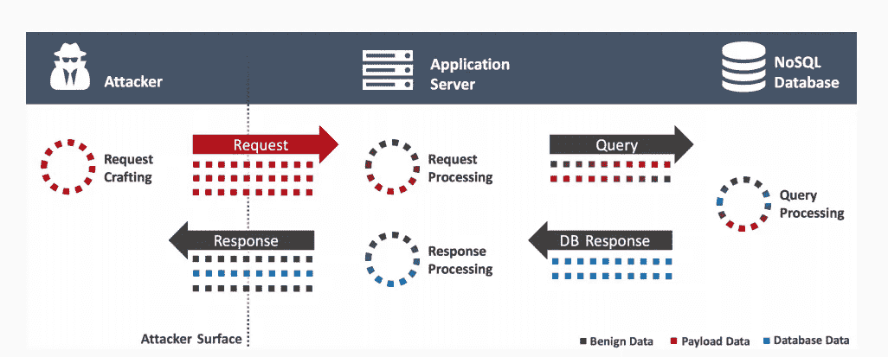
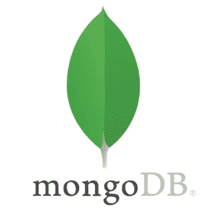
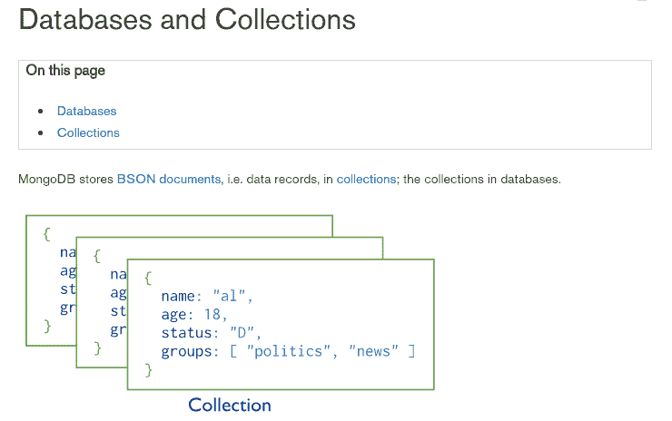
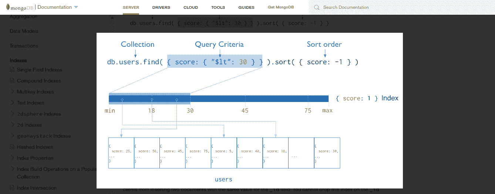
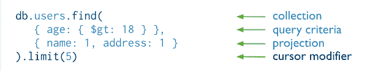
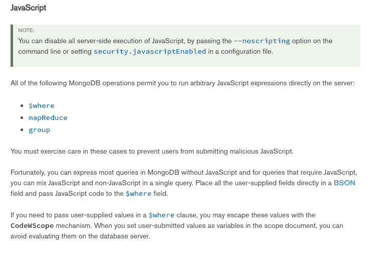

# 如何成功实施 NoSQL 注射攻击

> 原文：<https://infosecwriteups.com/nosql-injection-8732c2140576?source=collection_archive---------0----------------------->

## 从 NoSQL 注入到服务器端 Javascript 注入



[来源](https://www.owasp.org/images/e/ed/GOD16-NOSQL.pdf)

*NoSQL* (不仅仅是 SQL)扰乱了传统数据存储的使用。它引入了一个新的数据存储概念，与以前的存储机制不同，它是非关系的，因此在一致性方面提供了更宽松的限制。它有一个文档存储、键值存储和图表。由于现代应用程序的新需求，NoSQL 数据库已被广泛采用，它可以方便地将数据分布到多个服务器上。Nosql 数据库提供了广泛的可伸缩性，它们需要单个数据库节点来执行同一事务的所有操作

NoSQL 模型提供了一种新的数据模型和查询格式，使旧的 SQL 注入攻击变得无关紧要。然而，它们给了攻击者插入恶意代码的新方法。

让我们了解一下 MongoDB 中的 NoSQL 数据模型:



[来源](https://www.mongodb.com)



[来源](https://www.mongodb.com/nosql-explained)

下图说明了一个使用索引对匹配文档进行选择和排序的查询:



读取操作从[**集合**](https://docs.mongodb.com/manual/core/databases-and-collections/#collections) 中检索**[**文档**](https://docs.mongodb.com/manual/core/document/#bson-document-format) ，即查询文档集合。这是如何从 MongoDB 的集合中读取文档的方法:**



> db.items.find(queryObject)
> 
> db —当前数据库对象
> 
> 项目-当前数据库中的集合名称“项目”
> 
> find —对集合执行的方法
> 
> queryObject 用于选择数据的对象

```
queryObject = {amount:0}; //items with fixed value ‘amount’ is 0
```

在我们进一步深入之前，让我们快速分析一下传统 SQL 数据库中的攻击机制。

## SQL 注入

考虑一个简单的 SQL 语句，用于使用用户名和密码验证用户。

```
SELECT * FROM accounts WHERE username = ‘$username’ AND password = ‘$password’
```

如果开发人员没有合并准备好的语句来构造 SQL 查询，攻击者可以在用户名字段中提供 admin ’,绕过检查密码的条件来访问 admin 用户的帐户。被篡改的查询可能如下所示:

```
SELECT * FROM accounts WHERE username = ‘admin’ — AND password = ‘’
```

[](https://medium.com/@fiddlycookie/the-wrath-of-second-order-sql-injection-c9338a51c6d) [## 什么是二阶 SQL 注入，如何成功利用它？

### 什么是 SQL 注入

medium.com](https://medium.com/@fiddlycookie/the-wrath-of-second-order-sql-injection-c9338a51c6d) 

## NoSQL 注射液

使用一个驱动程序访问 NoSQL 数据库，该驱动程序公开了一个包装器，该包装器为数据库客户机提供多种语言的库。这些驱动程序本身可能不容易受到攻击，有时它们会提供不安全的 API，当应用程序开发人员不安全地实现这些 API 时，可能会为应用程序中的漏洞打开方便之门，从而允许对数据库进行任意操作。然而，这些数据库仍然容易受到注入攻击，即使它们没有使用传统的 SQL 语法。

MongoDB 期望 JSON 数组格式的输入。前面展示的 NoSQL MongoDB 数据库查询的等效查询是

```
db.accounts.find({username: username, password: password});
```

虽然这里我们不再处理查询语言，但攻击者仍然可以通过提供如下 JSON 输入对象来获得与 SQL 注入相同的结果:

```
POST /login HTTP/1.1 
Host: example.org 
Content-Type: application/json 
Content-Length: 38{
“username”: “admin”,
“Password”: {'$gt': “”}
}
```

如果不是 JSON 请求

```
POST /login HTTP/1.1 
Host: example.org 
Content-Type: application/x-www-form-urlencoded 
Content-Length: 29 user=admin&password[%24ne]=
```

## MongoDB 运算符

这里有一个两种情况下等价攻击的例子，攻击者设法在不知道密码的情况下检索管理员用户的记录。SQL 和 NoSQL 数据库都容易受到攻击。

利用 MongoDB 查询运算符:

MongoDB 有很多查询操作符

> $ne —不相等
> 
> $gt —大于
> 
> $regex —正则表达式
> 
> $ where 子句允许您指定一个脚本来过滤结果

## **$gt & $ne 查询运算符**

*db . items . find(query object)*

queryObject 用于选择数据的对象，例如:

```
queryObject = {amount:0}; //items with fixed value ‘amount’ is 0
```

如果我们注入$gt:0，我们将获得字段金额> 0 的所有项目。查询对象将如下所示:

```
queryObject = {amount: {$gt:0}}; //items with field amount >0
```

让我们考虑将下面的 JSON 请求发送给应用程序:

```
{desiredType: ‘shirt’}
{desiredType: {$ge:0}}
```

应用控制器

```
app.post(‘/products/find’,(req,res) => {
const query = {type: req.body.desiredType}
Document.find(query).exec().then((r)=>res.json(r));});
```

最终的查询如下所示:

```
{type: {$gt:0}}
```

在 MongoDB 中， ***$gt*** 选择字段值大于(即>)指定值的文档。因此，上面的语句将数据库中的类型与大于 0 的类型进行比较，返回 ***true*** 。

使用另一个比较运算符，如 ***$ne*** ，可以获得相同的结果。

## **$where 查询运算符**

***$where*** 子句允许您指定一个脚本来过滤结果。**MongoDB 中的这个操作符是一个最好避免的特性。**现在，我们为什么要避免一些允许我们指定脚本的特性呢？我们用一个简单的例子来理解这一点。假设我们有一个博客。我们的博客有很多可以公开阅读的文章，但我们也有一些供我们内部使用的私人文章，不应该发表。因此，我们在文档中隐藏了一个字段，它可以是 ***真*** 或 ***假*** ，这取决于我们的访问者是否应该看到文章。我们的 MongoDB 查询获取某个类别中所有文章的列表，并将其显示给网站访问者，如下所示:

```
db.articles.find({“$where”: “this.hidden == false && this.category == ‘“+category+”’” });
```

这应该可以确保没有人会看到我们隐藏的文章。是吗？当用户控制 category-variable 时，他们可以将它设置为该字符串的*'；return '' == '*

发送到数据库的 Javascript 代码片段如下:

```
this.hidden == false && this.category == ‘’; return ‘’ == ‘’
```

但是为什么我们不能简单地传递一个“；”'='

当您有一个 javascript 代码片段，其中有多个用分号“；”分隔的命令时，它们将作为一个函数执行，并且需要一个 return 语句来确定哪个值将被传递回调用者。这个函数将总是返回 true。这意味着用户还将看到我们收藏中的所有文章，包括那些应该隐藏的文章。

显然，MongoDB 和许多 NoSQL 数据库只不过是 JavaScript 处理引擎



[来源](https://www.mongodb.com/nosql-explained)

它的性能很糟糕，这不仅仅是因为它没有从索引中受益。几乎每一个常见的用例都可以用一个常见的查找查询或聚合来更有效地解决，尤其是像这样琐碎的事情。

## 我该如何预防？

以下是一些防止 SQL / NoSQL 注入攻击的措施，或者在攻击发生时将影响降至最低:

1.  准备好的语句:对于 SQL 调用，使用准备好的语句，而不是使用字符串连接构建动态查询。
2.  输入验证:验证输入以检测恶意值。对于 NoSQL 数据库，还要根据预期类型验证输入类型
3.  最低权限:为了将成功注入攻击的潜在损害降至最低，不要为您的应用程序帐户分配 DBA 或 admin 类型的访问权限。同样，最小化运行数据库进程的操作系统帐户的特权。
4.  HAPI 和快报

感谢阅读。我错过了什么吗？随时让我知道。

[](https://twitter.com/fiddlycookie) [## 精致的饼干

### Fiddly Cookie 的最新推文(@fiddlycookie)。我建造是为了打破。Pentester |研究员|开发工程师…

twitter.com](https://twitter.com/fiddlycookie) [](https://medium.com/@fiddlycookie/handling-threats-from-plagued-white-collar-robots-a-case-study-on-rpa-security-9dd379192e2b) [## 应对受困扰的“白领机器人”的威胁 RPA 安全案例研究

### 机器人过程自动化(RPA)是未来技术的新浪潮。随着时间的推移，自动化始于…

medium.com](https://medium.com/@fiddlycookie/handling-threats-from-plagued-white-collar-robots-a-case-study-on-rpa-security-9dd379192e2b) [](https://medium.com/@shukla.iitm/things-most-cyber-security-professionals-are-not-aware-about-ecf3a5d32609) [## 大多数网络安全专家不知道的事情

### 威瑞森数据泄露调查报告中关于安全事件和数据泄露的真实数据

medium.com](https://medium.com/@shukla.iitm/things-most-cyber-security-professionals-are-not-aware-about-ecf3a5d32609)