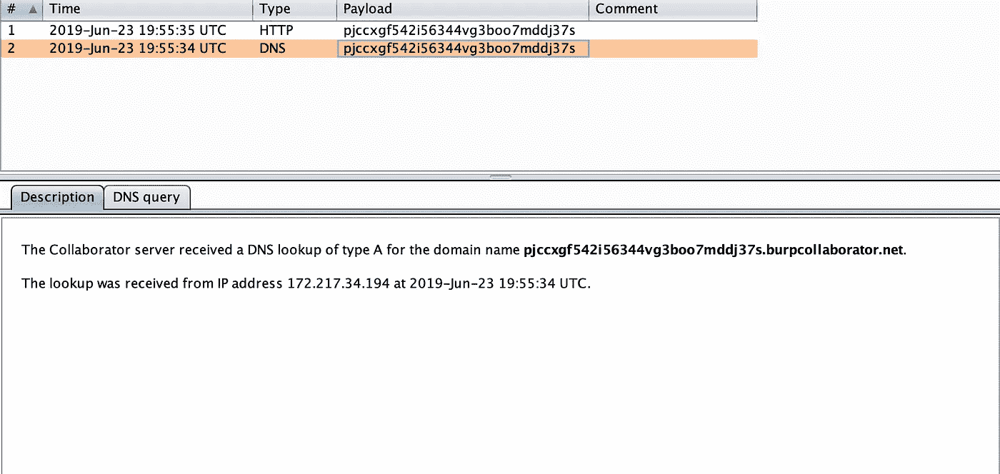
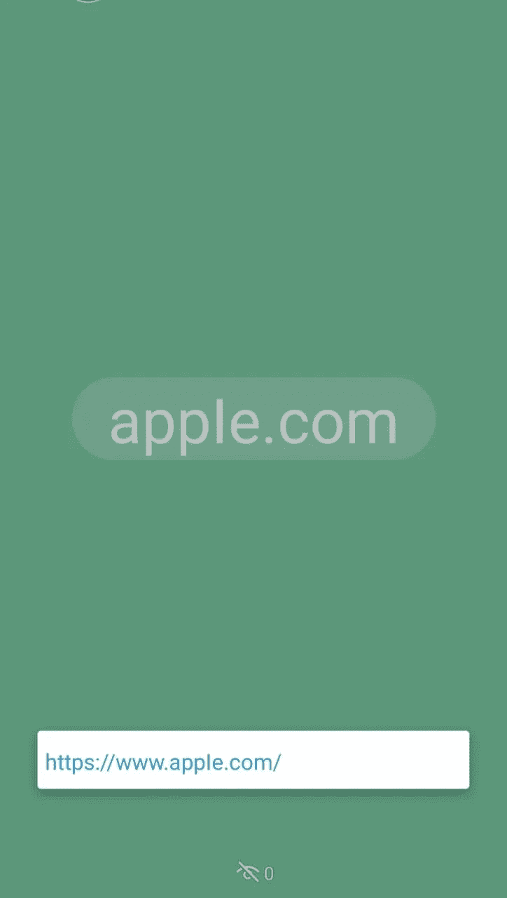
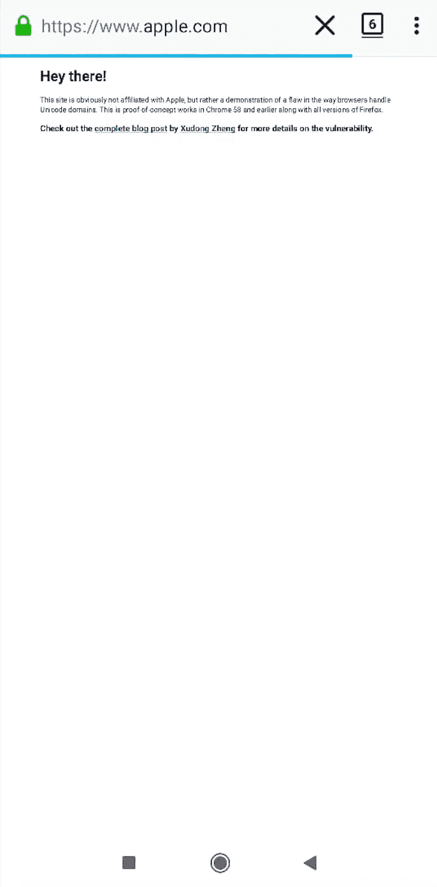
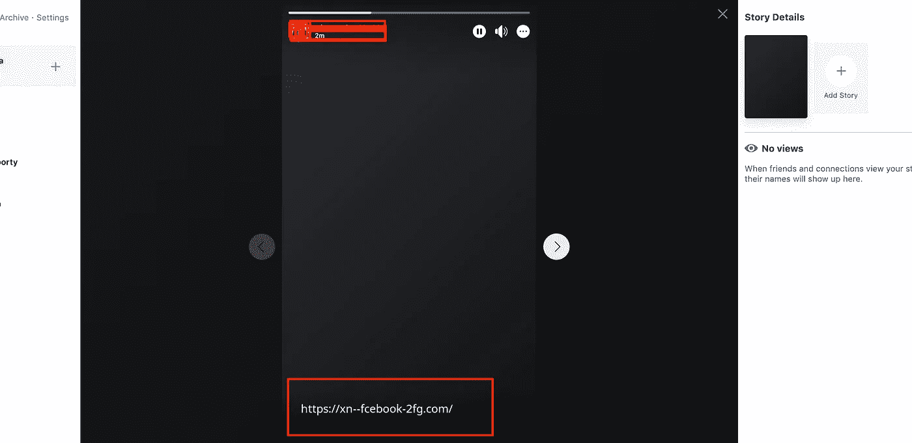

# 不适用:通过 Whatsapp 状态的同形异义攻击

> 原文：<https://infosecwriteups.com/not-applicable-homograph-attack-via-whatsapp-status-75441970c453?source=collection_archive---------0----------------------->

https://fаcebook.com/(国际化域名):是拉丁语[的同形异义词 https://xn-fcebook-2fg.com/](https://xn--fcebook-2fg.com/)。【аcebook.com/which】在 WhatsApp 上放一个状态，当放 URL 的时候显示 [https://f](https://f) 是一个 Punycode 域名，而不是真正的 facebook 域名。
在点击状态时，任何受信任的用户都可能认为他/她被重定向到了[https://f](https://f)аcebook.com/，但实际上，它被重定向到了一个同形异义 URL[https://xn-fcebook-2fg.com/](https://xn--fcebook-2fg.com/)
显示同形异义 URL[https://xn-fcebook-2fg.com/](https://xn--fcebook-2fg.com/)比显示[https://f](https://f)аcebook.com/(Unicode URL)更安全。
因此，如果我们使用 burp collaborator，我们可以看到来自我的 ISPs IP 地址和谷歌 DNS 的 DNS 和 HTTP 查询。这意味着该域是本地解析的。因此，如果域被解析，攻击者可以确保人们很好地尝试放置状态，这有助于创建更复杂的网络钓鱼攻击。

Burp 协作者 url 处于状态

在 Burp Collaborator 中查询 whatsapp 状态

## **影响:**

这种攻击侵犯了用户的隐私，因为 once 可以创建一个 Punycode URL，并将其放在状态中，然后发送给特定用户的列表。该用户可能点击链接，认为它是真正的 fаcebook，并被重定向到同形异义词 URL，该 URL 确认具有特定行为的用户更频繁地使用 fаcebook。

> 例如，
> 在一些水洞的情况下，网络钓鱼攻击者可以把不同的经常访问的网站的多个链接的状态。
> 那么在多个网站中，用户/群组可能会访问特定的网站。即使在这些 IDN 链接中的一个，如果用户由于疏忽而输入凭证，也可能使攻击成功。
> 
> 其他情况包括，如果浏览器由于 url 欺骗而无法解析 URL，或者需要时间来加载 punycode url，则用户可能会输入域的凭据。
> 
> 先放 [https://www](https://www) 吧。аррӏе.com/ in 状态的 whatsapp(这是来自[郑旭东](https://www.xudongz.com/blog/2017/idn-phishing/)的 POC)。现在，当我们在 firefox 上打开这个域名时，它在 punycode 上显示为 apple.com，这个问题已经在 [bugzilla](https://bugzilla.mozilla.org/show_bug.cgi?id=279099) 上讨论了 15 年。
> 如果受信任的用户将这种类型的域和联系人放在一起试图打开 suc 恶意域，则可能有人最终会下载恶意文件。

Whatsapp 状态显示假冒 apple.com

像 firefox 这样的浏览器仍然显示域名，而不把它们转换成域名。(链接:[***Bugzilla***](https://bugzilla.mozilla.org/show_bug.cgi?id=1332714)***)。***

火狐显示同形异义网址。# [错误 279099](https://bugzilla.mozilla.org/show_bug.cgi?id=279099)

## **预期行为:**

该页面应该显示像 facebook 个人资料状态的同形异义 URL。

## **解决方案:**

它包括显示 punycode 来代替实际的 UTF-8 文本。Punycode 是 Unicode 域名的 ASCII 表示，最初是因为域名服务基础设施不支持 Unicode 而实现的(Costello 2003)。对于特定的链接，悬停在地址栏和状态栏中通常会显示 Punycode 替代项。IDNA 问题可以在客户端处理，不需要任何域名服务器(DNS)的改变。

脸书已经为概况上的状态实现了这一点。它显示了 IDN URL 的 punycode 版本的状态。

punycode url 的脸书状态

## **参考:**

[https://www.xudongz.com/blog/2017/idn-phishing/](https://www.xudongz.com/blog/2017/idn-phishing/)
[https://bugzilla.mozilla.org/show_bug.cgi?id=279099](https://bugzilla.mozilla.org/show_bug.cgi?id=279099)
[https://www.charset.org/punycode?encoded=http%3A%2F%2Fxn-eby-7cd . com % 2F&decode = puny code+to+normal+text](https://www.charset.org/punycode?encoded=http%3A%2F%2Fxn--eby-7cd.com%2F&decode=Punycode+to+normal+text)
[https://en.wikipedia.org/wiki/Internationalized_domain_name](https://en.wikipedia.org/wiki/Internationalized_domain_name)
[https://bugzilla.mozilla.org/show_bug.cgi?id=1332714](https://bugzilla.mozilla.org/show_bug.cgi?id=1332714)
[https://www . word fence . com/blog/2017/04/chrome-Firefox-unicode-phishing](https://www.wordfence.com/blog/2017/04/chrome-firefox-unicode-phishing)
注:[http://ro.ecu.edu.au/cgi/viewcontent.cgi?article=1174&context = .](http://ro.ecu.edu.au/cgi/viewcontent.cgi?article=1174&context=ecuworks2012)

## 时间线:

5 月 25 日报告的错误在 6 月 19 日不适用(因为它超出了社会工程攻击的范围)。
6 月 22 日接受披露。

*注意:*
*即使这个 bug 不适用，我还是发布了这个报告，因为这种类型的攻击有可能被用于通过 whatsapp 状态进行网络钓鱼。
我想请求研究人员，如果有人有兴趣进一步了解此事，并上报此事，以展示此类攻击的实际影响或任何进一步的反馈或评论。我仍在计算这种攻击在野外的影响。SOC 中的安全分析师非常清楚公司中发生的此类攻击。*

