# NPST CTF 2021 —报道

> 原文：<https://infosecwriteups.com/npst-ctf-2021-write-up-96b58464151d?source=collection_archive---------3----------------------->

## PST 制作的 2021 CTF 圣诞挑战日历。


NPST CTF 2021 报道的宣传封面—作者

这是 NPST 为 2021 年 CTF[圣诞挑战写的一篇文章。下面这篇文章会陪你度过每一天，就像去年一样。如果您想了解去年的挑战，请点击此处:](http://npst.no/)

[](/npst-ctf-2020-write-up-79e47c1a7658) [## NPST CTF 2020 —报道

### 由 PST(挪威警方)为 2020 年 CTF 圣诞挑战赛撰写文章。这篇文章会陪你度过每一天…

infosecwriteups.com](/npst-ctf-2020-write-up-79e47c1a7658) 

一个 **简要回顾:**2019 年，被称为挪威安全警察的 PST(Politiets sikkerhets tjeneste)决定自愿发出一些广告，通知人们他们在这个圣诞节寻求帮助。NPST 是 Nordpolar Sikkerhetstjeneste(北极安全局)的首字母缩写，需要一些优秀的精灵侦探的帮助。圣诞节危在旦夕，只有我们才能奇迹般地拯救圣诞节。至少这是游戏的情节。这一共同之处是如此巨大的成功，以至于他们谨慎地决定自然地使它成为一年一度的事情。

每天倒数到快乐的圣诞节，一个创造性的任务被委托。对于每一个具体的任务，你满意地解决了，你就可以得到 10 分。当然，还有一些复活节彩蛋。复活节彩蛋不会给你任何分数，但是如果有人拥有相同的分数，它就可以打破僵局。谁不喜欢这些额外的小惊喜呢。整个 CTF 充满了“私人”笑话，并有一个伟大的圣诞主题，我衷心建议明年。

让我们从这篇报道开始吧！

# 第一天—改变桌面背景

第一个美好的一天，我们收到了一封欢迎邮件，通知我们继续让桌面更像家。整个游戏发生在一台虚拟计算机内，所以当然也有绘画。

```
Velkommen ...!Veldig hyggelig å ha deg ombord og fint å se at du har funnet veien inn til DASS. For at du skal finne deg mer til rette anbefaler jeg deg å sette ditt eget preg på systemet! Dette kan du gjøre ved å velge «Mal» fra startmenyen, mal din egen skrivebordsbakgrunn og velg Fil -> Sett som skrivebordsbakgrunn. Her er det bare kreativiteten som setter begrensninger, men i tilfelle du trenger litt starthjelp, legger jeg ved et eksempelbilde.Spent på å følge deg videre, lykke til!Hilsen HR[📎eksempel_bakgrunnsbilde.png](https://wiarnvnpsjysgqbwigrn.supabase.co/storage/v1/object/public/files/iH6GaQQb-36T_GvdcVtnQ/eksempel_bakgrunnsbilde.png)
```

为了开始，他们还提供了一个示例图像。神像可从以下网址获得:

[https://wiarnvnpsjysgqbwigrn . supabase . co/storage/v1/object/public/files/ih 6 gaqqb-36T _ GvdcVtnQ/eksempel _ bakgrunnsbilde . png](https://wiarnvnpsjysgqbwigrn.supabase.co/storage/v1/object/public/files/iH6GaQQb-36T_GvdcVtnQ/eksempel_bakgrunnsbilde.png)


第 1 天— eksempel_backgrunnsbilde.png。从 [npst.no](http://npst.no/) 检索—通过 pst

要破解这个下载安装 [zsteg](https://github.com/zed-0xff/zsteg) 。接下来在映像上运行它，您会得到以下输出:

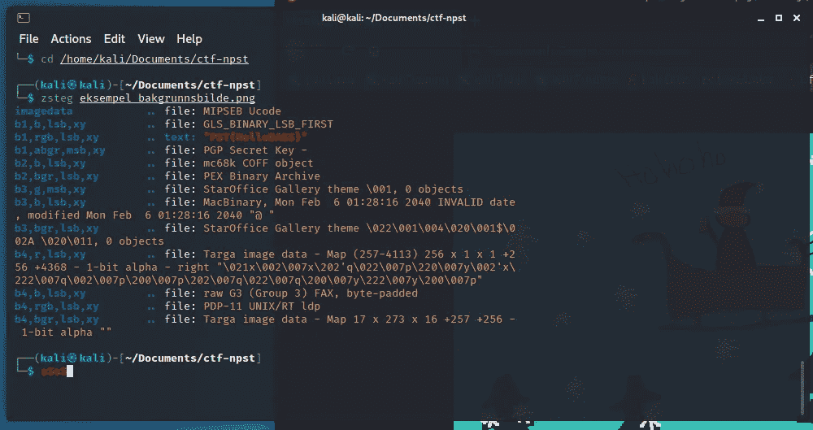

Zsteg 图像工具—作者

我们随后收到了今天的标志:**“PST { hello dass }”**

# 第二天——记笔记

去年，由于日冕的缘故，圣诞老人在运送所有礼物时遇到了麻烦。为了记住谁没有收到礼物，他做了一个记录。这是一个提示，告诉我们它可能与地理位置有关。

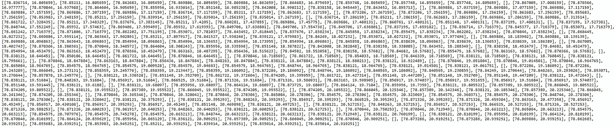

记住文件的图像-按作者

这个问题的答案实际上仅仅是这个。所有这些数不清的数字都是精确的坐标，当你小心翼翼地把它们放在地图上时，它们会正确地拼出今天的官方旗帜。

我的创新解决方案是把它们都放在一张传单地图上。你可以在下面的地图结果中看到我的代码。

第 2 天的解决方案代码—按作者

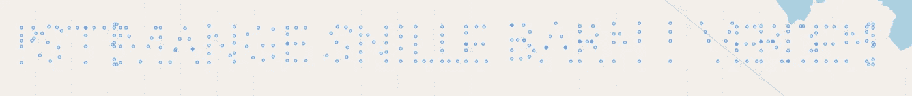

第二天地图上的结果-作者

这可能非常不直截了当，但如果你发挥一点想象力，你能看到它拼出**PST { MANGE SNILLE BARN I VERDEN }**。那就翻译成世界上很多好孩子。

# 第三天——可疑的圣诞卡

有一些奇怪的邮件寄到了北极。他们发现了一张看起来很奇怪的圣诞卡。他们问我们是否可以看一看，如果我们发现了什么，就向他们汇报。他们给我们提供了封面和封底。

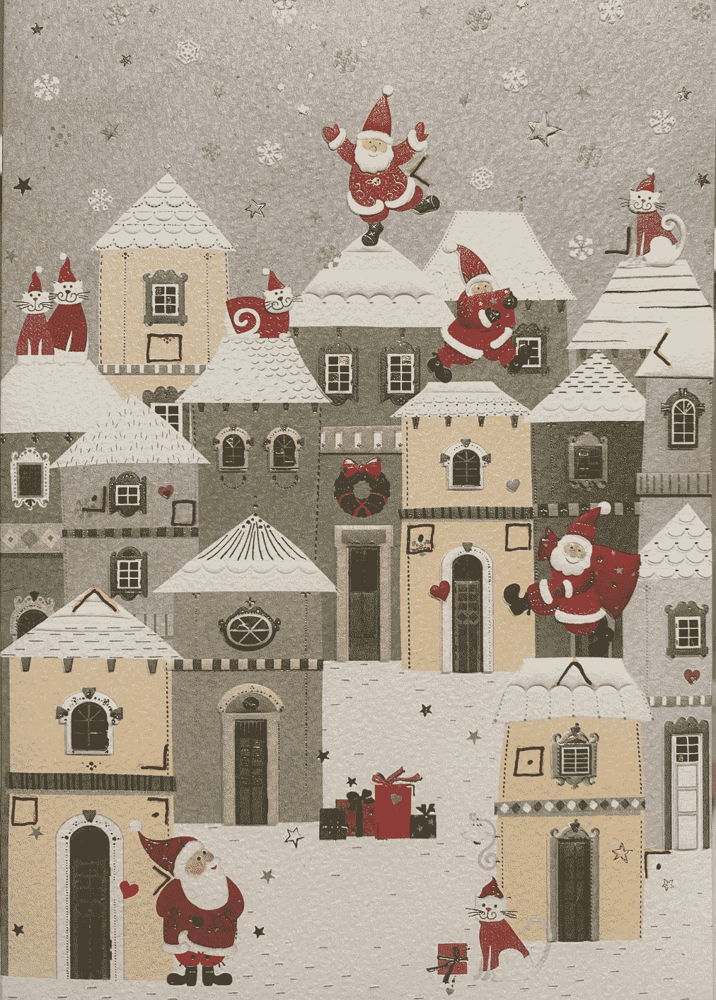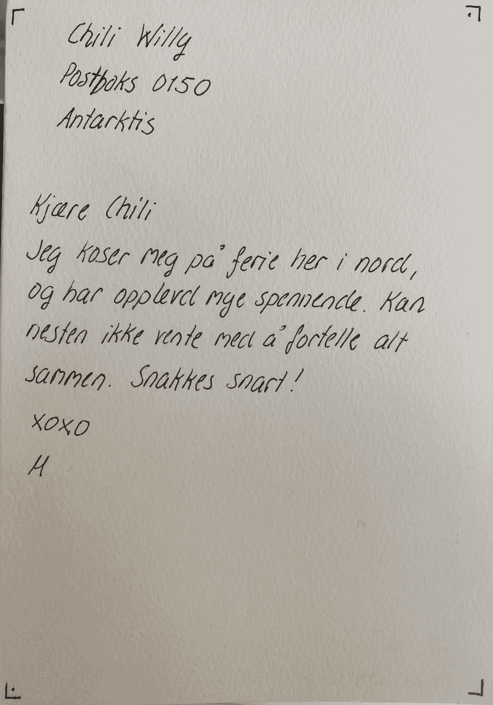

圣诞卡的正面和背面——作者 [NPST](http://npst.no)

你首先会观察到的是所有的黑色箭头和指针。此外，这些被认为是猪圈密码。

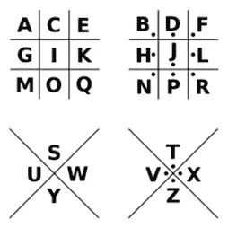

插图由 https://cybergamesuk.com/code-crackers[拍摄](https://cybergamesuk.com/code-crackers)

每个字母包含一个独特的符号。因此，我开始从上到下绘制图表，并输入到[https://www.dcode.fr/pigpen-cipher](https://www.dcode.fr/pigpen-cipher)女巫是这项任务的密码蛮力。但是什么都没有。这绝对只是一些不寻常的信件。LAELNEREMMARETKV 。但是后来我想，等等……事情不可能这么简单。

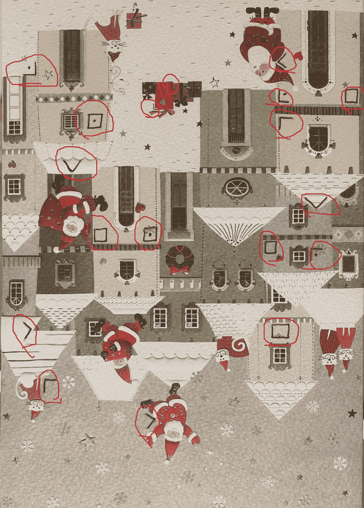

带圆圈的密码—作者从 [NPST](http://npst.no) 复制

结果我**把**图像上下颠倒了。再次进入形状，然后我得到了它！

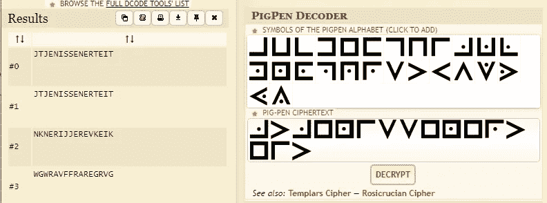

解密的密码——作者摘自[https://www.dcode.fr/pigpen-cipher](https://www.dcode.fr/pigpen-cipher)

这不是绝对令人愉快的，我想我可能以不正确的方式解释了一些符号，但它背后的具体含义是清楚的: **JTJENISSENERTEIT** 应该是**PST { julenisenerteit }**。这就是今天的旗帜。

# 第四天——凌乱的车间

今天的任务是在车间里建立秩序。已经检查过了，他们发现那里太乱了。我们得到一个文本文件，其中包含 elf workshop 的所有项目。有人问我们是否能对它有所了解。

这需要花费相当多的时间和精力来解决。特别是当解决方案非常简单的时候。你所要做的就是找出这一行中所有表示物品放置位置的数字，并把它转换成十进制，然后把十进制转换成 ascii。为了最终在车间里摆放桌子和工具。

最后但并非最不重要的是，处理所有不是字母数字的字符或像{}这样的标志字符。如果您完成了该操作，您将获得今天的标志: **PST{DetBlirFortRot}** 。翻译成 it 了得**乱得快**。下面是我最后的 python 代码，你可以用它来看看这个挑战是如何进行的。

# 第 5 天—数字存储

昨天之后，他们发现我们需要升级圣诞老人的存储系统。所以他们把它数字化了。如果你访问 https://varelager.p26e.dev/的[你会看到下面的页面:](https://varelager.p26e.dev/)

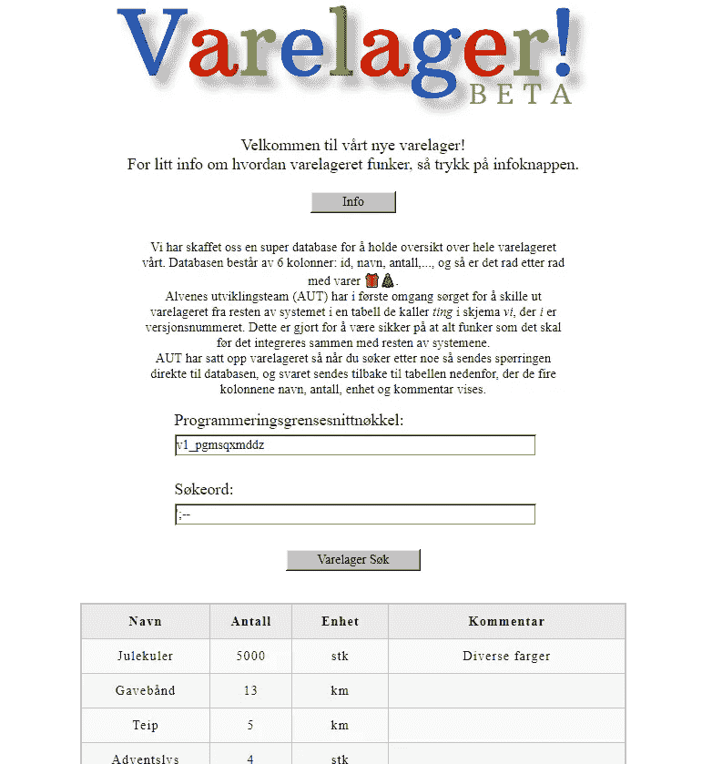

Varelager 插图—作者摘自[https://varelager.p26e.dev/](https://varelager.p26e.dev/)

我们也确实得到了一个使用编程键的键，就像他们说的: **v1_pgmsqxmddz** 。这很有可能是因为该站点稍后将被用于不同的任务。目前，它说所有输入的命令将被直接发送到数据库。你知道这意味着什么吗？是啊！sqlInjection。我试着简单用**' %【T11]来检查。并得到错误:**

接下来我试试:**’；—** 这是结束查询，看看会弹出什么。你知道什么？我得到了所有物品的清单。在这个查询中有一个标志:

第五天的旗帜是:**pst{5q1_1nj€ⓒt10n}**

# 第六天——休息一段时间

今天没有新的挑战。而不是一个独特的挑战，他们没有宣布胜利精灵员工的一周。每周都有一次抽奖，获得最高分的人将成为本周的小精灵。获胜者获得了 PST 提供的礼包，以及 PST 提供的一些 merch 和圣诞主题礼物。

这一周的结果可以在下面的图片中看到，这是一份来自比赛所在的操作系统 [**Dass**](http://dass.p26e.dev) 内部公告消息系统的副本。

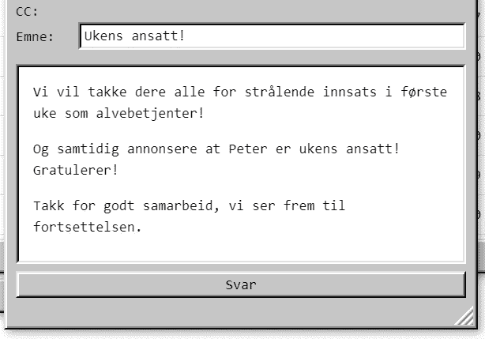

elf 周刊——作者来自 [dass.p26e.dev](http://dass.p26e.dev)

# 第 7 天—加密邮件

这是游戏中迄今为止最令人恼火的任务之一。我们收到了一条信息，但对正在发生的事情几乎没有任何提示。只是北极的精灵自然收集了一条他们无法解密的私人信息。问你能不能看一下？密码如下:

```
Y2MPyYU4kblEXrEfExry4AIRAjqdke+JyQQN50Uj5GuCu5rE66lEzQXB5bE VOlNGRoU06Ny4vh/gzSPFV0mHUrxaaAVt1BwN1WN1HFT7baIejtR5KyG6 JK8yC70CpuPZV610coCiWzdFICcgEtAdQaesScLrg495kxofzG3EGvA=
```

我尝试了几乎所有我能想到的方法，分析它，反转它，旋转它，使用已知的密码加密如 Rot13，Vigenere 等等。但是运气不好。这时一条新消息出现了:

```
Etterretningsalvdelingen informerer om at mottaker av den krypterte meldingen heter Chili Willy. Kanskje det kan være til hjelp for å dekryptere meldingen? — Mellomleder
```

告诉我们接收者是奇利·威利。等等，我们之前不是收到他的信息了吗？如果你看第三天的卡片，后面有 4 个没有意义的符号，也许它们代表钥匙？因此我解密了它，找到了 IPLA。但是利用这一点对我没有任何帮助。

到目前为止，很少有人实际上完成了这个任务，所以来自创造者的另一个暗示就被放弃了。

```
en Alvebetjent gjorde meg oppmerksom på at det kan ha foregått En nøkkelutveksling tidligere i desember, kanSkje det kan hjelpe i oppklaringen — Mellomleder
```

它告诉我们在 12 月初有一次密钥交换。这意味着它必须是 AES，至少我认为是。原来这一切的关键是第三天的标志: **PST{JULENISSENERTEIT}。**唯一的问题是区分大小写，我以前曾经尝试过用大写字母区分大小写。利用赛博咖啡馆，我能够抓住今天的旗帜:

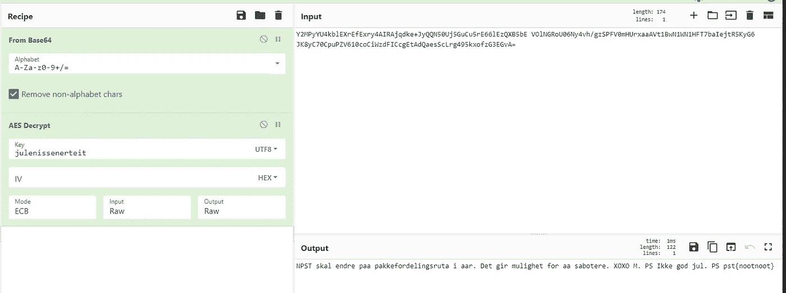

赛博咖啡馆的解决方案——作者

首先转换 base64 格式的信息，然后使用 AES 解密，以 ECB 和**julenisensenteit**为密钥。嘣，你就有了。今天的旗帜是 **pst{nootnoot}。**可在[这里](https://gchq.github.io/CyberChef/#recipe=From_Base64('A-Za-z0-9%2B/%3D',true)AES_Decrypt(%7B'option':'UTF8','string':'julenissenerteit'%7D,%7B'option':'Hex','string':''%7D,'ECB','Raw','Raw',%7B'option':'Hex','string':''%7D,%7B'option':'Hex','string':''%7D)&input=WTJNUHlZVTRrYmxFWHJFZkV4cnk0QUlSQWpxZGtlK0p5UVFONTBVajVHdUN1NXJFNjZsRXpRWEI1YkUgVk9sTkdSb1UwNk55NHZoL2d6U1BGVjBtSFVyeGFhQVZ0MUJ3TjFXTjFIRlQ3YmFJZWp0UjVLeUc2IEpLOHlDNzBDcHVQWlY2MTBjb0NpV3pkRklDY2dFdEFkUWFlc1NjTHJnNDk1a3hvZnpHM0VHdkE9)找到 cyberchef 解决方案的链接。

# **第 8 天——邮戳**

今天我们收到一条消息，告诉我们他们找到了一张邮票，想让我们看一看。它来自南极，他们担心可能有一些隐藏的信息。


邮票图像—作者 [NPST](https://p26e.dev/)

我做的第一件事是通过 zsteg、binwalker 以及这个在线网页 [stegonline](https://stegonline.georgeom.net/upload) 发送图像。在这里我发现了一些有趣的事情:

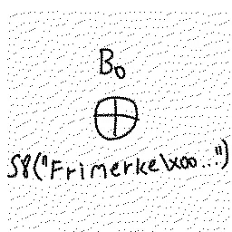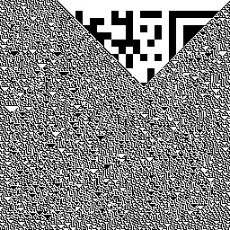

颜色层内的隐藏图像—按作者

所有的层里面都有隐藏的图像。甚至更多的秘密，让我们从第一张图片开始。这让我花了很长时间才弄明白，所以我将直接跳到解决方案。Bo 实际上是 0 中的 B0。I 是指图像中蓝色的 0 层。下一个是 XOR 的符号。最后一个是对他们去年制作的 slede8 程序的引用。因此，我们应该将第一个蓝色层与 slede8 程序的输出进行异或运算。

但是 slede8 程序在哪里呢？这部分我用了:[https://stegonline.georgeom.net/upload](https://stegonline.georgeom.net/upload)。如果您查看绿色层，可以看到图像中有一个 slede8 输出。

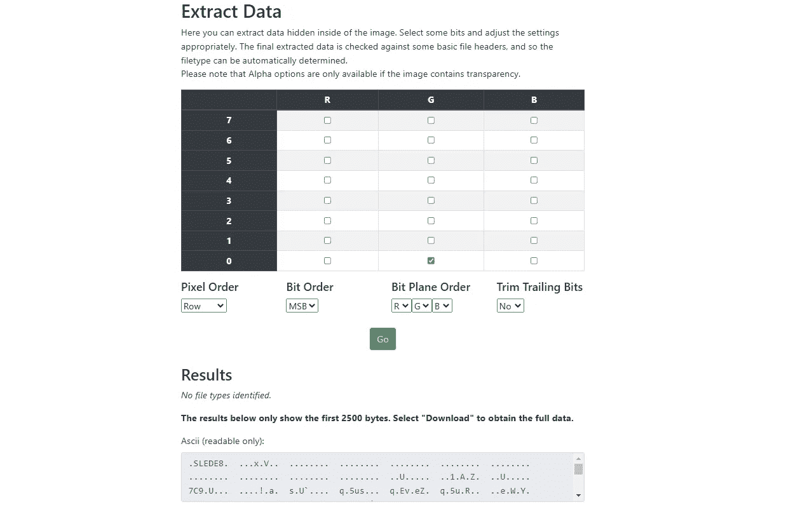

绿色图层输出——作者来自 [StegOnline](https://stegonline.georgeom.net/extract)

要理解这一点，我们需要一个调试器。去年的事件后，周围有很多人。所以你不必为自己做一个。我用的是这个:【https://github.com/julebokk/slede8dbg】T4

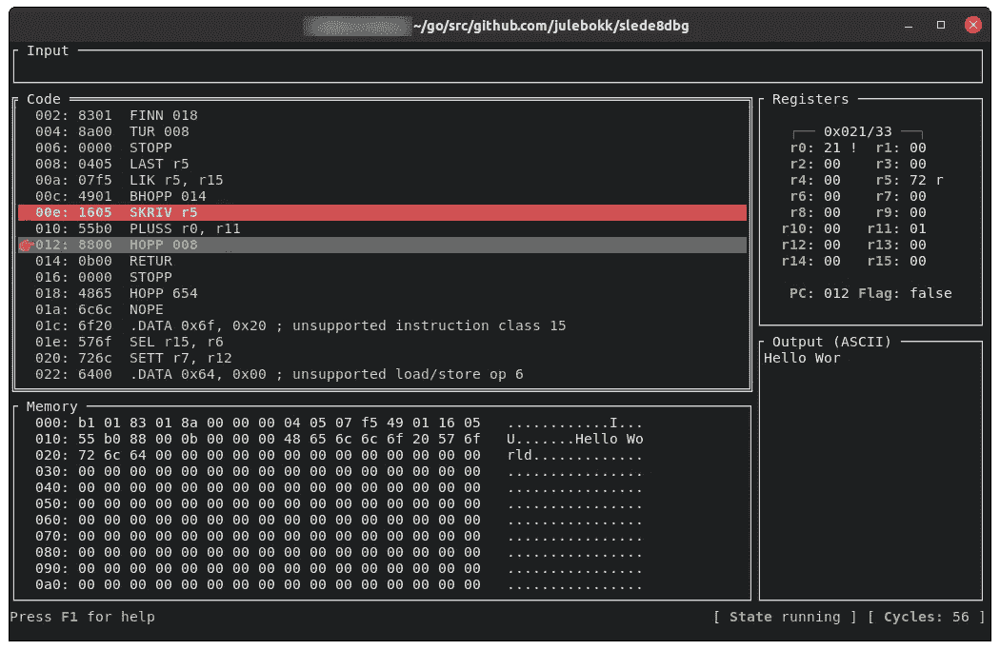

slede8 调试图片——作者 [Julebokk](https://github.com/julebokk/slede8dbg)

经过一些测试和最纯粹的运气以及一个好朋友的帮助，我发现 outSlede8 需要 32 个字节作为输入。第一个图像也暗示了它需要什么样的输入。S("Frimerke\x00 ")告诉我们它是十六进制的 Frimerke，其余的都是零。正确的输入是:

```
4672696d65726b65000000000000000000000000000000000000000000000000
```

我使用了 murdyr 的 [slede-runner.py](https://github.com/myrdyr/ctf-writeups/blob/master/npst20/runner.py) create 来完成这个任务，并且还添加了一个对图像进行异或运算的方法。在蓝色层，你可以看到有一个 QR 码，但我们错过了它的大部分，这将有望在异或后完成。

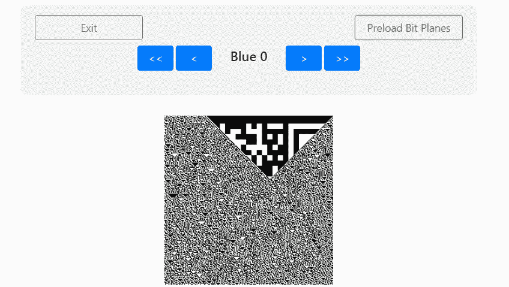

蓝色图层-作者

这是我运行 slede 和 xor 映像的最终代码:

我们要做的最后一件事是渲染输出的图像。为此我使用了 CyberChef:

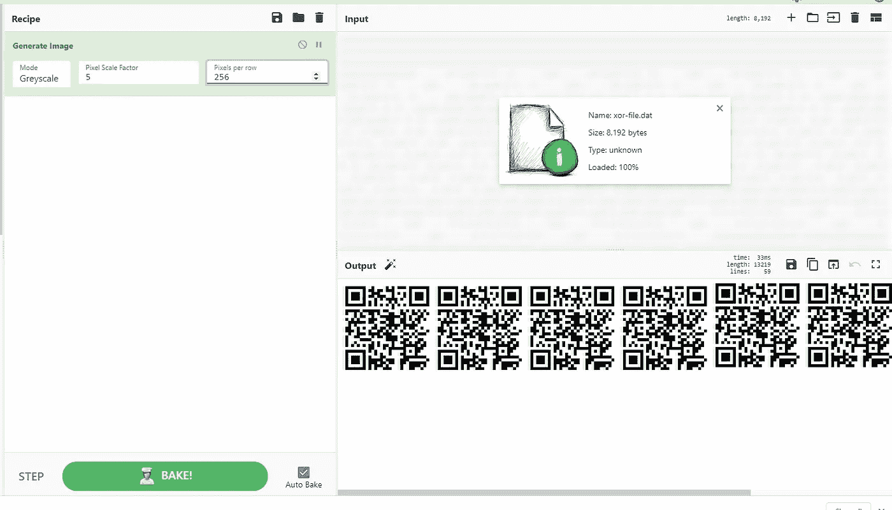

二维码渲染—按作者

经过一些尝试和错误之后，我们终于可以看到一套带有二维码的国旗了，但在我看来，我们对这一套并不感兴趣:

**PST{R3m3mb3r_m3？_ W3 _ h4d _ SO _ MUCH _ FUN*t 0g 3 th 3r！* :D}**

# 第 9 天—网络打包

今天我们收到一封新邮件，有一些网络流量。他们说我们需要保守我们发现的秘密，以防它来自 NPST 总部内部。

当我打开它时，我看到数据看起来很奇怪。这只是数字的反弹，为了更好地查看它，我将数据导出到 JSON，以便在其他程序中打开它并更好地分析它。

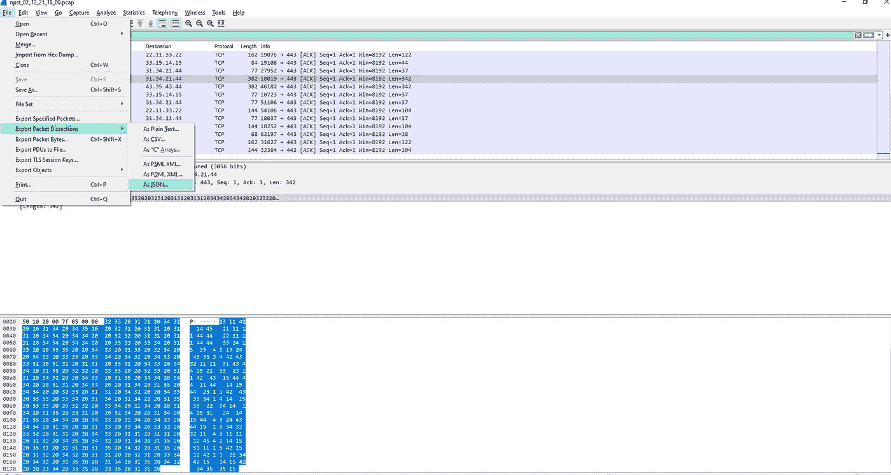

将数据导出为 JSON —按作者

然后我写了一个 python 程序来运行所有的数据并给我一个快速概览。

结果是这样的:

```
python .\decrypt-network.pyData: 23 11 42 14 45 51 11 15 42 44 43 33 24 31 31 24 11 11 42 43 35 34 42 43 32 11 11 31 43 44 15 22 33
IP: 22.11.33.22Data: 51 15 31 14 24 22 43 33 24 31 31 13 34 32 32 11 23 51 11 32 15 14 14 15 22 43 35 34 42 43 32 11 11 31 43 44 15 22 33
IP: 31.34.21.44Data: 23 51 34 42 32 11 33 22 15 35 11 13 13 15 42 44 42 34 42 14 45 51 24 21 11 11 42 24 11 11 42 43 35 34 42 43 32 11 11 31 43 44 15 22 33
IP: 31.34.21.44Data: 24 11 11 42 23 11 42 25 15 22 51 11 15 42 44 51 15 31 14 24 22 43 33 24 31 31 13 34 32 32 11 43 11 11 12 31 24 42 22 11 42 11 33 44 15 42 44 32 11 33 22 15 35 11 13 13 15 42 35 32 15 22 
IP: 51.11.43.13Data: 23 11 42 14 45 21 11 11 44 44 22 11 11 44 44 33 34 15 35 43 13 24 43 35 34 42 43 32 11 11 31 43 44 15 22 33 23 11 42 43 15 44 44 11 44 14 15 44 23 11 42 43 33 34 14 14 15 33 22 34 14 14 
15 31 24 14 15 44 43 24 43 44 15 13 34 32 32 11 43 11 11 12 45 42 14 15 51 11 15 42 15 12 42 11 21 34 42 15 14 15 42 34 35 35 15
IP: 33.15.14.15Data: 14 15 44 15 42 32 34 44 44 11 44 44
IP: 43.44.45.15Data: 33 15 42 14 15 44 25 34 24 13 13 15 31 15 33 22 15 24 22 25 15 33 44 24 31 25 45 31 22 31 15 14 15 42 14 45 14 15 22 44 24 31 25 45 31 43 35 34 42 43 32 11 11 31 43 44 15 22 33
IP: 22.11.33.22Data: 22 31 15 14 15 42 32 15 22 32 11 43 43 15 14 15 44 44 15 12 31 24 42 14 15 33 12 15 43 44 15 25 45 31 15 33 35 31 15 33 22 15
IP: 43.44.45.15Data: 23 15 24 35 11 11 14 15 22
IP: 33.15.14.15Data: 23 15 24 35 11 11 14 15 22 34 22 43 11 11
IP: 43.44.45.15
SPECIAL CASE FOUND for IP: 51.11.43.13
found error at packet: 71
SPECIAL CASE FOUND for IP: 51.11.43.13
found error at packet: 389Data: 35 43 44 13 42 34 31 31 35 11 42 11 33 44 15 43 21 11 35 34 43 44 42 34 21 25 15 22 43 33 11 13 13 15 42 32 15 14 14 15 22 21 42 11 13 42 34 31 31 35 11 42 11 33 44 15 43 43 34 45 42 13 15 24 
35 13 42 34 31 31 35 11 42 11 33 44 15 43 43 31 45 44 44 11 35 34 43 44 42 34 21 13 42 34 31 31 35 11 42 11 33 44 15 43 43 31 45 44 44
IP: 43.44.45.15
```

我不知道这是什么类型的密码，所以我通过[https://www.dcode.fr/cipher-identifier](https://www.dcode.fr/cipher-identifier)运行它

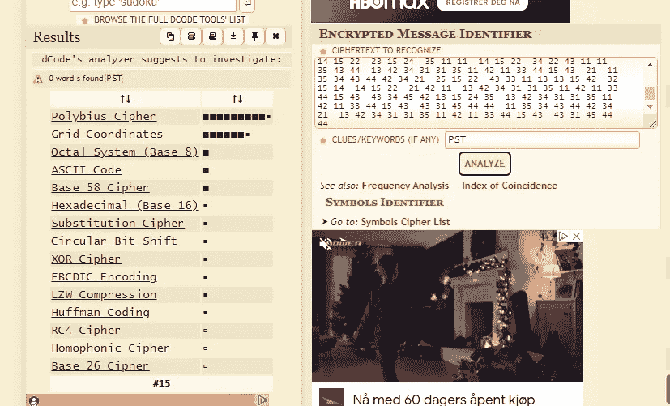

密码标识符的屏幕打印—按作者

最有可能的密码是波利比乌斯，所以我提取数据并在 https://cryptii.com/pipes/polybius-square 的[运行](https://cryptii.com/pipes/polybius-square)

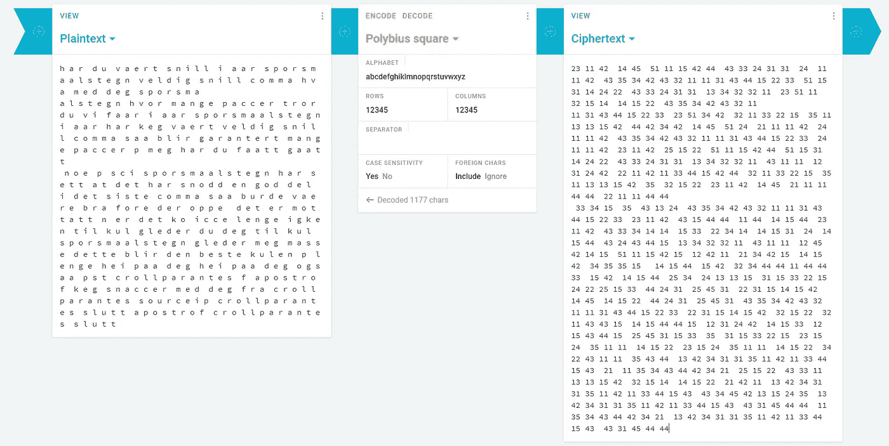

波利比乌斯解密—作者

有这样一条信息:

```
har du vaert snill i aar sporsmaalstegn veldig snill comma hva med deg sporsmaalstegn hvor mange paccer tror du vi faar i aar sporsmaalstegn i aar har keg vaert veldig snill comma saa blir garantert mange paccer p meg har du faatt gaatt noe p sci sporsmaalstegn har sett at det har snodd en god del i det siste comma saa burde vaere bra for eder oppe det er mottatt nerdet koiccelengeigken til kul gleder du deg til kul sporsmaalstegn gleder meg masse dette blir den beste kulen p lenge hei paa deg hei paa deg og saa pst crollparantes f apostrof keg snaccer med deg fra crollparantes sourceip crollparantesslutt apostrof crollparantesslutt
```

最后一件事特别有趣。如果你把字母转换成符号，你会得到:

```
pst{f’jegsnakkermeddegfra{sourceip}’}
```

嗯，如果我输入了最后一条信息的 ip 地址呢？

```
pst{jegsnakkermeddegfra43.44.45.15}
```

那也不起作用…但是等等…如果 ip 也是用 polybius 加密的呢？如果我把它解码，我就会得到 stua。

```
pst{jegsnakkermeddegfrastua}
```

是今天合适的旗帜。

# **第 10 天——数字仓库第二部分**

这实际上非常简单，我们收到一封新邮件，告诉我们他们对数字仓库进行了一些更新。他们已经将用户添加到数据库中。负责这件事的人是艾琳。

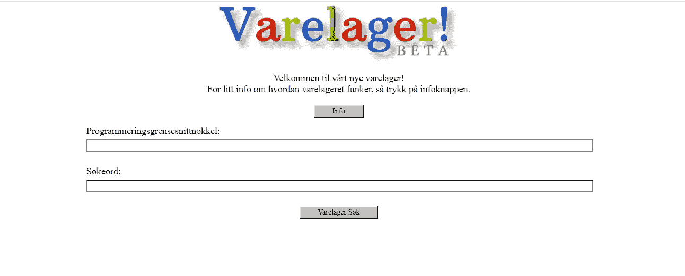

数字商店——由 [PST](https://varelager.p26e.dev/) 提供

因此，我从在 sqlmap 攻击中使用新密钥 v2_vr7n0p1tf7 开始:

这给了我整个用户表的输出:

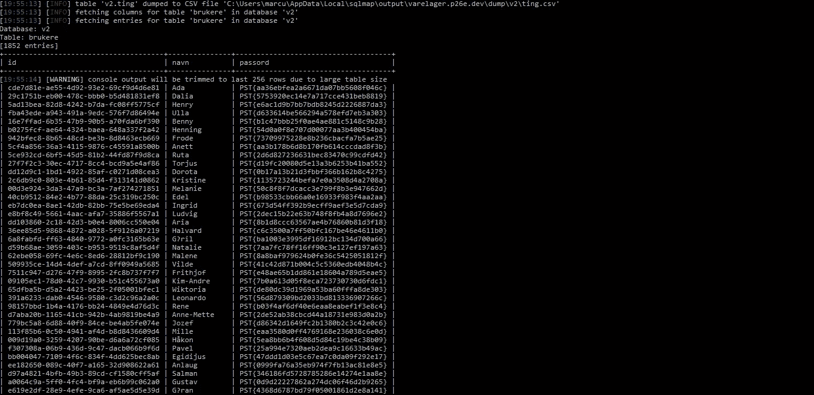

用户表转储—按作者

由于担心这和其他的一样复杂，我创建了一个快速的 python 脚本来分析所有用户:

但是什么都没有…然后我又回去把课文再读了一遍…我突然想到，难道就这么简单吗？是的，他们要找的实际上是更新数据库 Eline 的用户的密码。

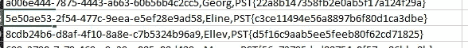

Eline 用户—按作者

我作为用户搜索 Eline 后只有一个。今天的旗帜是:**PST { c3ce 11494 e56a 8897 b 6 f 80 D1 ca 3 DBE }**

# 第 10 天——1 号蛋

到天那里还哪里有蛋找。如果你查看数字商店的源代码，你会发现一个带有 egg 的图像:

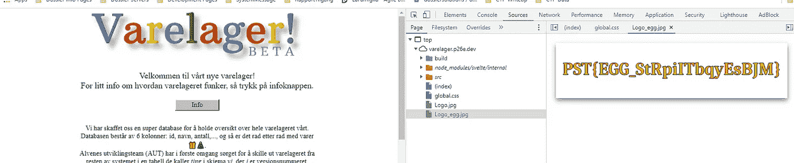

鸡蛋图片—作者来自 [Varelager](https://varelager.p26e.dev/)

如果你发送**PST { EGG _ StRpiITbqyEsBJM }**你会得到一个额外的分数。

# 第 11 天—文件系统中有些奇怪的东西

这次我们得到了一个 zip 文件，上面有一个文件系统。圣诞老人的一个终端表现得很奇怪，他们想让我们看看:

```
Beklager for å forstyrre deg på en lørdag, men det haster.En av terminalene på julenissens kontor har utvist rar oppførsel de siste dagene. AlveCERT har sikret data fra hjemmeområdet, finner du noe muffens?Mvh Mellomleder
```

如果我们查看提取后得到的文件，可以看出这是一个 JFFs2 文件系统。

```
┌──(kali㉿kali)-[/media/ctf/08 — NPST 2022/11 — Muffens i filsystemet]
└─$ file sikring_alveCERT 9 ⨯
sikring_alveCERT: Linux jffs2 filesystem data big endian
```

为了查看我们需要把它安装到系统中的内容，最简单的方法就是从 ubuntu 获取一个镜像文件。同样值得一提的是，像这样的文件系统通常是 32 MB 左右。这个更大，大约 256，所以我们还需要确保我们使用的代码支持它。

我最终使用了以下代码来安装它:

为了安装它，我还需要把它变成一个小枚举:

```
ubuntu@ubuntu1804:~/ctf/filsystem$ jffs2dump -r -e small_alveCERT -b sikring_alveCERT
```

然后用脚本挂载它:

```
ubuntu@ubuntu1804:~/ctf/filsystem$ sudo ./mountjffs2.sh small_alveCERT /media/jff/
524288+0 records in
524288+0 records out
268435456 bytes (268 MB, 256 MiB) copied, 5.7773 s, 46.5 MB/s
Successfully mounted small_alveCERT on /media/jff/
```

完成后，我终于可以打开文件夹查看文件了:


截图—作者

唯一的问题是，我没有正确的权限查看它们，所以我必须将它们复制出来，并将其更改为 777，这样我就可以读取这些文件:


截图—作者

一个假文件除了一段文字告诉我们不在这里之外什么也没有:**这不是它。**那现在怎么办？这里还有一个隐藏文件，一个. sys 文件，声称它是一个压缩的 ROMFS 3。谁还包含一个 guardians.jpg

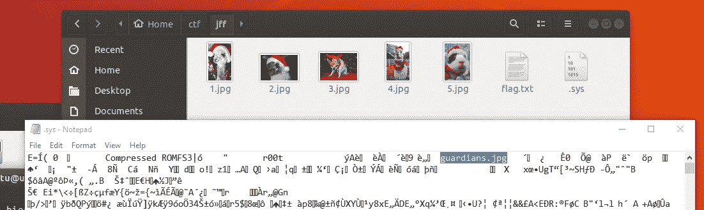

截图—作者

打开它最简单的方法是用 7zip，打开。sys 文件并提取图像，然后查看属性。你会发现旗帜四处飘扬:

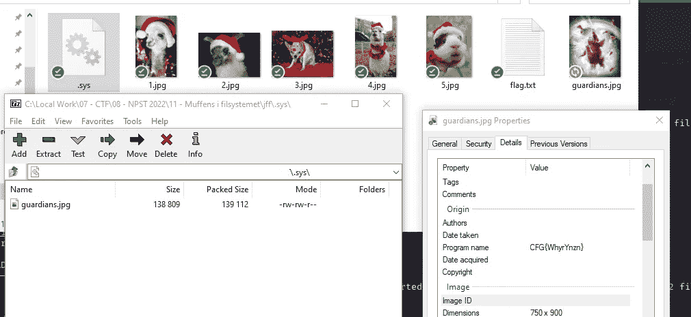

guradrians.jpg 插图—作者

现在我们差不多有了: **CFG{WhyrYnzn}** 。但这没有任何意义。另一方面，快速使用 [rot13](https://gchq.github.io/CyberChef/#recipe=ROT13(true,true,false,13)&input=Q0ZHe1doeXJZbnpufQ) 给出了今天的标志: **PST{JuleLama}**

# 第 12 天——粥里的猫头鹰

今天的任务是解密他们截获的信息:

```
God søndag! Det er fanget opp tO krypterte meldinger som ble sendt under lunsjgrøTen i dag. Det vekker mistanke, siden alle alvebetjenter elsker grøt og aldri vil gå gliPp av en lunsjgrøt. Se de krypterte meldingene nederst i mailen. En dyktig alvebetjent har allerede funnet noen biter av klarteksten til melding 1:“- — — k r o e l l — — — — — — — — — — — — — — — — — — — — — — — k r o e l l — — — — — — — -”og noen biter av klarteksten til melding 2:“- — — — — — — — — — — — — — — — p e n g w y n — — a — — o l — n — — — — — — — — — — — — — -”Kan du se om du klarer å finne resten av klarteksten til begge meldingene? Legger også ved en tabell over ascii-verdier, kanskje du får bruk for den.Melding 1:00010101 00010100 00010011 00000000 00011101 00000011 00001010 00000010 00011100 00000011 00010101 00011001 00010111 00000001 00010001 00001001 00011111 00010010 00000100 00000000 00001001 00000111 00011010 00000000 00000001 00001110 00000000 00010101 00001011 00011111 00010000 00011000 00000000 00000000 00000000 00000000 00000000 00000000 00000000 00000000 00000000 00000000 00000000 00000000 00000000 00000000Melding 2:00010110 00001100 00000110 00000111 00001000 00000101 00001101 00001011 00000011 00011000 00011110 00001110 00010110 00001001 00010111 00001101 00011100 00010101 00001111 00010101 00010010 00010111 00011010 00001010 00011110 00000100 00000110 00000111 00001010 00000000 00010000 00000100 00011000 00011001 00000110 00001011 00000010 00001001 00000010 00001000 00011111 00001010 00011100 00010011 00000000 00011101
```

他们给我们一些信息以及加密的部分。如果分析文本，我们可以看到一些字母突出:OTP。这暗示所使用的加密是一次一密的。我们可以看到消息的长度是一样的。

这种加密的工作方式是取一个和消息一样长的密钥，并用它对每一位进行异或运算。所以我们必须首先找到消息 1 中的密钥，然后在消息 2 中使用它。为了找到完整的消息和密钥，最后**猜测**其余的可以是什么。为了方便起见，我创建了 Python 代码，它会根据我给出的输入自动完成这项工作。

最后我得到了以下结果:

```
python .\decryptOTP.py
First round:
Key found: 
- - - k o l o n p - - - - - - - l p a r e n t - - e - - e l - j k r o e l l - - - - - - - -Message 1 - decrypted:
- - - k r o e l l - - - - - - - s b e r l i n - - k - - n s - r k r o e l l - - - - - - - -Message 2 - decrypted:
- - - l g i b e s - - - - - - - p e n g w y n - - a - - o l - n s k i n n e - - - - - - - -Secound round:
Key found:
e g g k o l o n p s t k r o e l l p a r e n t e s e r t e l u j k r o e l l p a r e n t e sMessage 1 - decrypted:
p s t k r o e l l p a r e n t e s b e r l i n e r k r a n s e r k r o e l l p a r e n t e sMessage 2 - decrypted:
s k a l g i b e s k j e d f r a p e n g w y n o m a t s o l e n s k i n n e r i m o r g e n
```

放入一个更可读的状态，我们得到今天的旗帜以及一个新蛋#3。

```
Key found:
egg: pst{erteluj}Message 1 — decrypted:
pst{berlinerkranser}Message 2 — decrypted:
skal gi beskjed fra pen gwyn om at solen skinner i morgen
```

# 第 13 天——休息一段时间

和上周一一样，今天没有新的挑战。而不是一个独特的挑战，他们确实再次胜利地宣布了本周的小精灵雇员。

这一周的结果可以在下图中看到，这是一份来自比赛发生地操作系统 [**Dass**](http://dass.p26e.dev) 内部公告消息系统的副本。

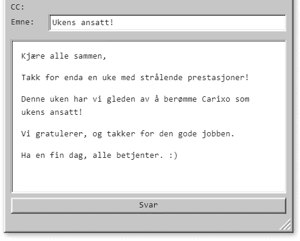

本周员工—由 [NPST](https://dass.p26e.dev/) 评选

# 第 14 天——自由的驯鹿

圣诞老人这次和驯鹿有些麻烦。他们走散了，需要帮助才能找到他们:

```
Fire av Julenissens favorittreinsdyr ble sluppet løs fra basen på Svalbard i går. Heldigvis er det sporing på reinsdyrene, så en av alvene i NPST har funnet en datamaskin og lastet ned sporingsdataen. Han klarer dessverre ikke å finne ut hvordan man får tak i GPS-filene.Kan du hjelpe han?Nb: Hvis du skulle finne noe mistenkelig i dataen, så rapporter tilbake med hva du fant, omkranset av PST{ og }.Mvh Mellomleder[📎 sporing.zip](https://wiarnvnpsjysgqbwigrn.supabase.co/storage/v1/object/public/files/6C4Zka7Rtq8SCWLmMPcF4/sporing.zip)
```

当我们下载文件时，我们发现三个文件:

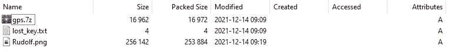

来自 zip 的文件—按作者

gps.7z 受密码保护。但是如果我们打开鲁道夫看红色 3 层。我们能看看密码吗:

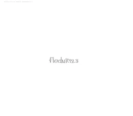

图层红色 3-作者

如果我们用这个打开 GPS 文件夹，我们会找到一个. kml 文件。这是驯鹿留下的痕迹。所以我们用一个 [kml 文件](https://www.doogal.co.uk/KmlViewer.php)打开它。


失踪驯鹿的足迹——作者

如果我们更仔细地观察赛道，我们会发现赛道上有一些奇怪的起伏。

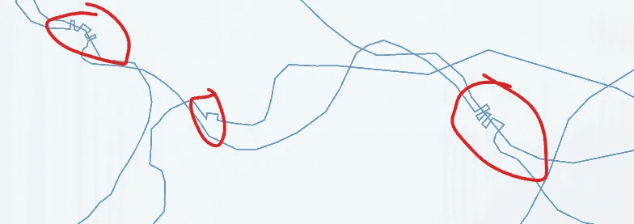

莫尔斯电码沿轨道-由作者

如果我们把这些都拿来，把长的一次变成“-”，把小的一次变成。”我们得到以下结果:

```
.-. ..- -. ..-. — — .-. . … — .-. ..- -.
RUNFORESTRUN
```

所以今天的旗帜是: **PST{RUNFORESTRUN}**

# 第 14 天——3 号蛋

你还记得鲁道夫密码的图片吗？那张照片里有更多的秘密。如果你把它上传到 https://stegonline.georgeom.net/的 T4，然后去浏览位面，你能在 R2 找到第四个彩蛋吗:

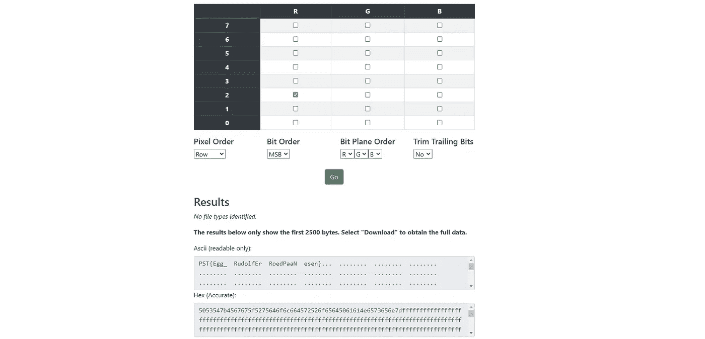

截图来自 [stegonline](https://stegonline.georgeom.net/extract) —作者

ascii 码中的 Egg:**PST { Egg _ RudolfErRoedPaaNesen }**

# 第 15 天—摄像机记录噪音

今天我们得到了一个奇怪的图像显示我们除了噪音:

```
Etter gårsdagens reinsdyrflukt bestemmer alvebetjent M. Nist seg for å sjekke kameraloggen. Dessverre ser det ut som om det bare eR blått og grØnt støy Der… Klarer du å finne ut noe mer fra opptaket?Mvh Mellomleder📎 [opptak.gif](https://wiarnvnpsjysgqbwigrn.supabase.co/storage/v1/object/public/files/EI4xvCx6Z_UmkHwsW4-1I/opptak.gif)
```

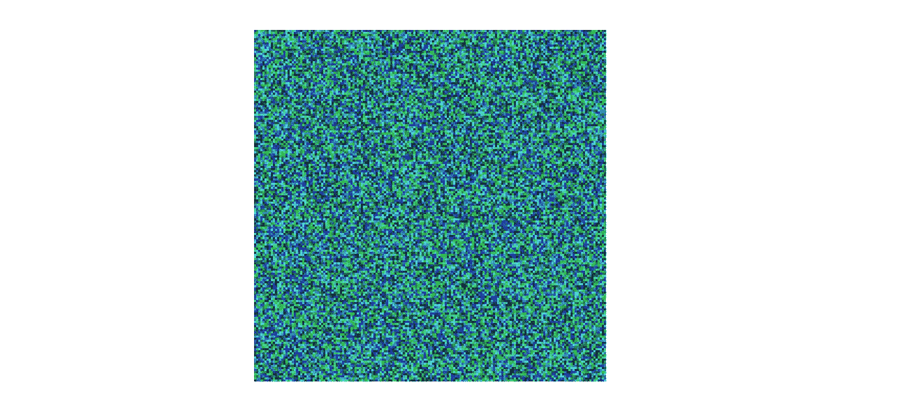

图像噪声-by [PST](https://wiarnvnpsjysgqbwigrn.supabase.co/storage/v1/object/public/files/EI4xvCx6Z_UmkHwsW4-1I/opptak.gif)

如果我们看看这篇课文，它给了我们一个很大的提示。一些字母在标题中。他们读出红色。所以标记必须在读取层中。我打开一个玩玩，看看。在左上角你可以看到一个小数字。gif 中的每一帧都有不同的数字。


右上角的数字—按作者

然后，我编写一个 python 脚本来提取所有红色的帧。然后复制所有的号码。

数字显示:

```
80 83 84 123 72 101 114 86 97 114 68 101 116 73 107 107 101 77 121 101 197 83 101 71 105 116 116 46 46 46 125
```

原来这是普通的十进制数。快速浏览 C [yberchef](https://gchq.github.io/CyberChef/#recipe=From_Decimal('Space',false)&input=ODAgODMgODQgMTIzIDcyIDEwMSAxMTQgODYgOTcgMTE0IDY4IDEwMSAxMTYgNzMgMTA3IDEwNyAxMDEgNzcgMTIxIDEwMSAxOTcgODMgMTAxIDcxIDEwNSAxMTYgMTE2IDQ2IDQ2IDQ2IDEyNQ) 给了我今天的标志:**PST { hervardetikkemyesegitt…}**

# 第 16 天——破碎的圣诞歌

精灵最喜欢的歌不知何故被破坏了，他们问我们是否可以看看。

```
Alvene på verkstedet klager over dårlig kvalitet på noen av julesangene som spilles over høyttalerne. Særlig denne sangen, “Rudolph, the Red-Nosed Reindeer”, har mottatt mange klager. Kan du se om du finner ut hva som er galt?[📎 rudolf.wav](https://wiarnvnpsjysgqbwigrn.supabase.co/storage/v1/object/public/files/1NH3uxbrEcgaH42wVDhne/rudolf.wav)Det spilles et bredt spekter av julesanger på verkstedet, men denne sangen er egentlig en favoritt blant alvene. Da er det jo ekstra synd at lydkvaliteten er dårlig.Mellomleder
```

如果你马上在 [Audacity](https://www.audacityteam.org/) 中打开它，你可以看到在音轨中间有一件奇怪的事情正在发生。

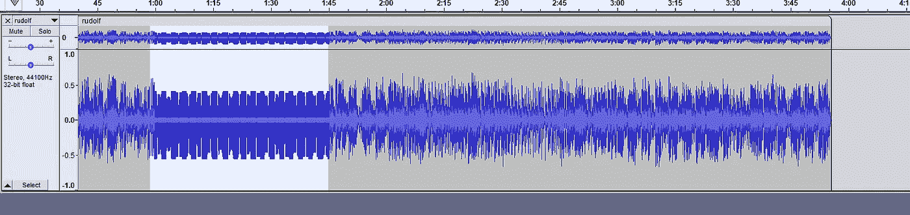

Audacity print —作者

通常在这类事情的光谱中隐藏着一些东西。如果我们打开光谱，我们可以看到今天的国旗就在眼前:

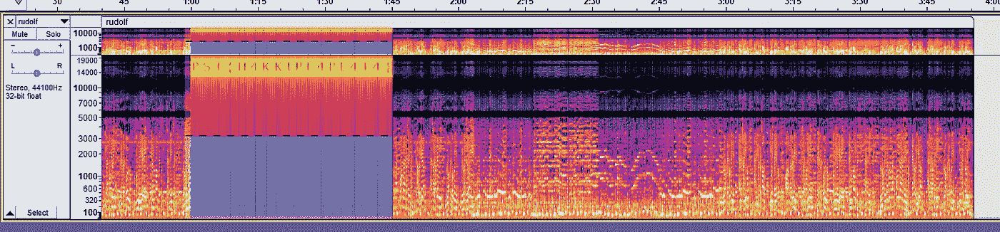

audacity 中的频谱——作者

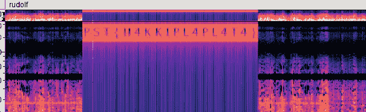

光谱特写—作者

然后，该标志被 **PST{H4KKIPL4PL4T4}** 翻译成记录中的暂存。

# 第 17 天——明智的道路选择

圣诞节快到了，他们正在为圣诞老人准备路线。但是他们在路线上藏了一些特别的东西，他们想知道我们是否能把它弄出来。

```
Hei,nå Er det jo baRe en uke igjen til jul så vi må begynne å få på plass den nye pakkefordelingSruta. avdelingen for optimalisering og ruteplanlegging har jobbet hardt med å finne en trasé, og ga meg i går en Cd Hvor den foreløpige ruten er lagrEt. de fortalte meg at de hadde en baktanke med trasén, men ville ikke fortelle meg høyt hva dette var (i frykt for avlytting), så dette skulle komme frem fra fiLen. jeG sliteR med å tolke hvA de har tenkt. kunne du hjulPet meg?mvH mellomleder[📎trasé.txt](https://wiarnvnpsjysgqbwigrn.supabase.co/storage/v1/object/public/files/gW-LbDTWaq37kqhumlwo4/trase.txt)
```

文本文件包含一组新的数字:

```
[-11.725769, -61.778000] 
[20.145221,-75.215909]
[52.300000,76.95000]
[23.101397,88.393575]
[-34.417148,19.248128]}
[-15.4825, 128.122778]  
[78.216667,15.633333]
[5.041066,7.919476]
[45.424722,-75.695000]
[21.150000,79.083333]
{[17.083333,-96.750000]
```

首先让我们看看课文中的秘密。有些字母再次出现在大小标题中。如果我们把所有的大字母去掉，我们得到如下:**赫歇尔图。**那么什么是赫歇尔图呢？

一天之后，仍然很少有人解决了这个问题，所以他们给了我们一个新的线索:

```
Oppdatering angående gårsdagens Mail. En alvebetjent har funnet alle koordinatene på kartet og hentet ut de tilhørende byene. Kan dette være til hjelp?[-11.725769, -61.778000] = Rolim de moura
[20.145221,-75.215909] = Guantanamo
[52.300000,76.95000] = Pavlodar
[23.101397,88.393575] = Ektapur
[-34.417148,19.248128]} = Hermanus
[-15.4825, 128.122778] = Wyndham
[78.216667,15.633333] = Longerbyen
[5.041066,7.919476] = Uyo
[45.424722,-75.695000] = Ottawa
[21.150000,79.083333] = Nagpu
{[17.083333,-96.750000] = OaxacaMellomleder
```

这仍然没有任何意义。因为该标志应该以 PST 开头。经过一番摆弄和一些好的建议，我把所有的第一个字母“RGPEHWLUONO”放入 CyberChef。过了一会儿，我发现 ROT4 是唯一一个产生所需字母 PST 的。我被告知这是一个变位词。

```
RGPEHWLUONO = VKTILAPYSRS
```

所以，下一步是找出变位词应该是什么。我知道第一个字母 PST。

```
VKTILAPYSRS = PST + VKILAYSR
```

我现在知道我在这里要找什么，所以我用[这个字谜](https://www.ssynth.co.uk/~gay/cgi-bin/nph-an?line=VKILAYSR&words=2&dict=antworth&doai=on)解算器测试了不同的单词，一个单词没有那么多，两个单词就更少了。所以，最后我发现**天空对手**才是答案。当时的旗帜是 **PST{SKYRIVAL}。**

# 第 18 天——绿手指

这一次，他们想让我们查看 git 存储库中的一些奇怪代码。

```
Hei,Alvdelingen for nettverksoperasjoner har utført en hemmelig nettverksoperasjon mot SPST. De har snublet over et “git repository”, men de synes det er noe merksnodig med det. Alv en eller annen grunn så mener Alvdelingen for tekniske undersøkelser at det kan ha noe med “grønne firkanter” å gjøre, hva nå enn det betyr.Kan du sjekke det ut?[📎groenne-firkanter.zip](https://wiarnvnpsjysgqbwigrn.supabase.co/storage/v1/object/public/files/Y6QmtWjne4xiYGEAfXwTi/groenne-firkanter.zip)Om du trenger hjelp så kunne du kanskje spurt alvdelingen for åpne kilder — de tar sikkert en titt på Github profilen til personen som “comitter” i repoet, kanskje det ligger et hint der.MvhMellomleder
```

我们从下载文件开始，查看他们谈论的提交。环顾四周，我找到了用户的电子邮件:

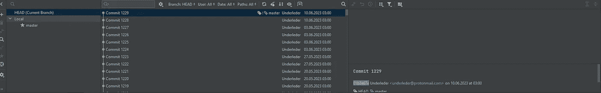

截屏 git repo —作者

更奇怪的是，所有的犯罪似乎都发生在未来，从 2021 年跳到 2023 年。

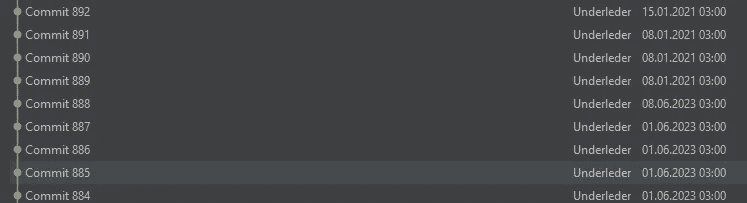

截屏 git repo —作者

当我在 github 上查找用户名[undered er](https://github.com/underleder?tab=overview&from=2021-11-01&to=2021-11-30)时，我现在明白为什么提交是这样的了，它们将在 git repo 概述页面上形成一个单词。

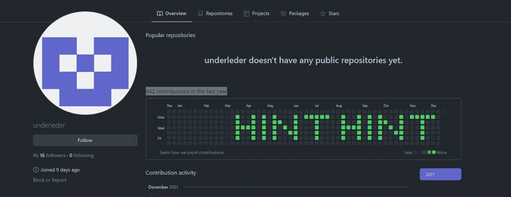

github 上的提示信息—作者

首先我们需要做的是创建一个比 git 中的日志文件更可读的文件，为此我们使用 git log beautiful:

```
git log --pretty=format:%cs,%h,%an,%ae,%s > commits.csv
```

这将给我们一个 csv 文件，格式如下。

```
2023-06-10,01b2e67,Underleder,underleder@protonmail.com,Commit 1229
2023-06-10,abf6af8,Underleder,underleder@protonmail.com,Commit 1228
2023-06-03,f10eda4,Underleder,underleder@protonmail.com,Commit 1227
2023-06-03,e6ae8e2,Underleder,underleder@protonmail.com,Commit 1226
2023-06-03,7af2d1a,Underleder,underleder@protonmail.com,Commit 1225
2023-06-03,a043e1d,Underleder,underleder@protonmail.com,Commit 1224
2023-05-27,d31575e,Underleder,underleder@protonmail.com,Commit 1223
2023-05-27,a767d07,Underleder,underleder@protonmail.com,Commit 1222
2023-05-20,381497c,Underleder,underleder@protonmail.com,Commit 1221
2023-05-20,b592c11,Underleder,underleder@protonmail.com,Commit 1220
2023-05-20,086669e,Underleder,underleder@protonmail.com,Commit 1219
2023-05-20,9a3e774,Underleder,underleder@protonmail.com,Commit 1218
```

完成后，我们可以轻松地将日期导入我们的热图项目:

作为输出，我们得到了今天的标志: **PST{GET_CLEAN_GO_GREEN！}**

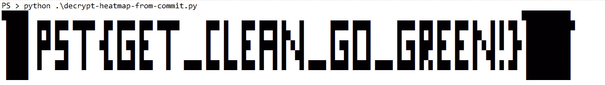

python 文件的输出-按作者

# 第 19 天——烟囱切碎机

今年圣诞老人正在尝试新技术。因此，他现在正在试验一种烟囱切碎机，但是仍然有一些小的缺陷。我们想看一看它。

```
Hei …!Nissen forsøker å være mer produktiv i år, og unngå å gå ned i feil pipe. For å sørge for spe-serialisert levering har alvene ordnet en helt ny leveransemetode for denne pakkeleveringen.Nå handler det bare om å finne riktig pipe! Og hva var det han ønsket seg igjen…?[📎Chimney_Chopper.ps1](https://wiarnvnpsjysgqbwigrn.supabase.in/storage/v1/object/public/files/Q2hpbW5leUNob3BwZXJPcHBnYXZl/Chimney_Chopper.ps1)[📎Chimney_Client.ps1](https://wiarnvnpsjysgqbwigrn.supabase.in/storage/v1/object/public/files/Q2hpbW5leUNsaWVudE9wcGdhdmU/Chimney_Client.ps1)
```

这是一个有趣的练习。我们收到两个通过本地 windows 服务相互通信的文件。它们来回传递数据，当找到正确的密钥/pid 时，我们会获得标志。

我实现的是将所有代码移动到一个文件中，然后在 PID 上运行蛮力，因为它是一个将为我们提供解决方案的数字。我们能考虑从 1 到 99 9999 的每一种组合吗？对我来说，开始时唯一的问题是断点不起作用。所以即使我破解了，我也没认出来，所以这一个因为 power shell 知识，需要一段时间才能完成。

但是当它确实起作用时，它确实给我提供了一个解决方案。

```
Adresse brukt: 19560
Payload fra pipe er: MTk1NjA=
Encrypted_Flag: 76492d1116743f0423413b16050a5345MgB8AGUAbwBRAEwAWQB1ADIARQB5AEEAZgB2AHIAWAB4ADQAdgA5AHIAQwBZAEEAPQA9AHwANQAxAGUAZQAxAGUAMABhADUAOAAwADMAZgBlADkAZQA3ADMANQA4AGIAZAAzADAAYQA5ADYANQA4ADMAZABhAGEAOABmADgANQAxADAANAAwADMAMwA5ADk
AYQA4AGIAMABkAGQAMgA0ADIANgAyAGEAZgBkADUAZgBjADAAZQBhADAAMAAxADkAZQA0ADMAMwBkADIAMQA5ADIAMgA0ADcAMgA2AGUANABlAGQAYQBkAGYAYQA3ADQANAA5ADgA
Key: 53 54 50 53 68 67 48 57 67 70 67 68 48 69 68 66
Ss: System.Security.SecureString
Way: 136023096
Korrekt adresse funnet! Deploy julegaver
**PST{Nissen_i_pipa}**
```

# 第 20 天——休息一段时间

和上周一一样，今天没有新的挑战。而不是一个独特的挑战，他们确实再次胜利地宣布了本周的小精灵雇员。

这一周的结果可以在下面的图片中看到，这是比赛发生地操作系统 [**Dass**](http://dass.p26e.dev) 内部公告消息系统的副本。

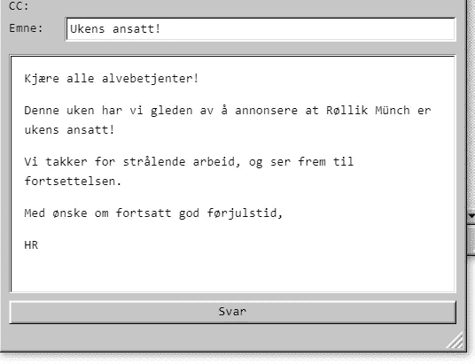

本周冠军——作者 [NPST](https://dass.p26e.dev/)

# 第 21 天—可能泄漏

今天的任务是解密小精灵在邮件检查中发现的一封奇怪的信。

```
NPST’s sikkerhetssystemer er satt til øverste beredskap nå som jula nærmer seg, og den ene alvebetjenten oppdaget en melding som noen prøver å skjule. Kan du ta en nærmere titt på denne?Mvh Mellomleder[brev.txt](https://wiarnvnpsjysgqbwigrn.supabase.co/storage/v1/object/public/files/7IWU8LtY04ZQTUSW6R-Id/brev.txt)
```

一开始看起来里面什么都没有。奇怪，只有一条没有任何内容的普通信息。但是当我用箭头导航的时候，我必须按两次才能看到下一个字母。

更奇怪的是，当我把它放入 cyber chef 进行分析时，我得到了信息周围的这些点。

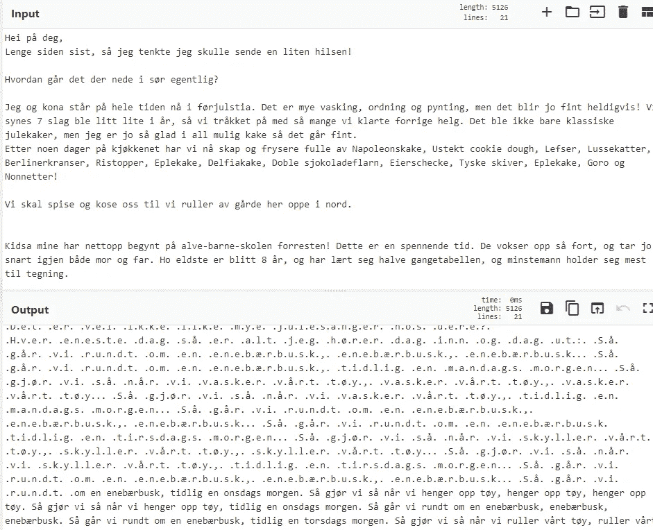

来自[赛博咖啡馆](https://gchq.github.io/CyberChef/#input=SOKAjGXigI1p4oCMIOKAjHDigI3DpeKAjCDigI1k4oCMZeKAjGfigI0s4oCNCuKAjEzigIxl4oCNbuKAjGfigI1l4oCMIOKAjXPigI1p4oCMZOKAjGXigI1u4oCNIOKAjXPigIxp4oCMc%2BKAjXTigIws4oCMIOKAjHPigIzDpeKAjCDigIxq4oCNZeKAjWfigIwg4oCNdOKAjGXigIxu4oCMa%2BKAjHTigI1l4oCNIOKAjGrigIxl4oCMZ%2BKAjCDigI1z4oCMa%2BKAjXXigI1s4oCNbOKAjGXigIwg4oCNc%2BKAjGXigIxu4oCMZOKAjWXigIwg4oCMZeKAjG7igIwg4oCMbOKAjGnigI104oCNZeKAjW7igIwg4oCMaOKAjGnigIxs4oCMc%2BKAjWXigI1u4oCMIeKAjQrigI0K4oCMSOKAjHbigIxv4oCNcuKAjWTigIxh4oCMbuKAjCDigIxn4oCNw6XigIxy4oCNIOKAjWTigIxl4oCNdOKAjSDigI1k4oCMZeKAjHLigI0g4oCNbuKAjGXigIxk4oCNZeKAjCDigI1p4oCMIOKAjXPigI3DuOKAjHLigI0g4oCNZeKAjWfigIxl4oCMbuKAjHTigI1s4oCMaeKAjGfigIw/4oCMCuKAjArigIxK4oCNZeKAjWfigIwg4oCNb%2BKAjGfigI0g4oCNa%2BKAjG/igI1u4oCNYeKAjCDigI1z4oCNdOKAjMOl4oCMcuKAjCDigI1w4oCNw6XigIwg4oCMaOKAjGXigIxs4oCNZeKAjCDigI104oCNaeKAjWTigIxl4oCMbuKAjSDigIxu4oCMw6XigIwg4oCNaeKAjCDigIxm4oCMw7jigIxy4oCNauKAjHXigIxs4oCMc%2BKAjHTigI1p4oCMYeKAjS7igIwg4oCMROKAjWXigIx04oCMIOKAjGXigI1y4oCMIOKAjG3igIx54oCNZeKAjSDigIx24oCMYeKAjXPigIxr4oCNaeKAjG7igIxn4oCNLOKAjCDigIxv4oCMcuKAjGTigIxu4oCMaeKAjW7igI1n4oCMIOKAjW/igIxn4oCMIOKAjHDigIx54oCNbuKAjXTigIxp4oCMbuKAjGfigIws4oCNIOKAjG3igI1l4oCNbuKAjSDigIxk4oCMZeKAjXTigIwg4oCMYuKAjGzigI1p4oCMcuKAjCDigIxq4oCMb%2BKAjCDigIxm4oCNaeKAjW7igIx04oCNIOKAjWjigI1l4oCMbOKAjGTigI1p4oCNZ%2BKAjHbigIxp4oCNc%2BKAjCHigI0g4oCMVuKAjWnigI0g4oCNc%2BKAjHnigI1u4oCMZeKAjHPigIwg4oCNN%2BKAjSDigI1z4oCMbOKAjWHigIxn4oCMIOKAjGLigI1s4oCNZeKAjCDigI1s4oCNaeKAjXTigI104oCMIOKAjWzigI1p4oCNdOKAjGXigIwg4oCMaeKAjCDigIzDpeKAjXLigI0s4oCNIOKAjHPigIzDpeKAjCDigIx24oCMaeKAjCDigI104oCMcuKAjMOl4oCMa%2BKAjGvigIxl4oCMdOKAjSDigI1w4oCMw6XigIwg4oCNbeKAjGXigIxk4oCMIOKAjXPigI3DpeKAjCDigIxt4oCNYeKAjG7igI1n4oCMZeKAjSDigI124oCMaeKAjSDigI1r4oCMbOKAjGHigIxy4oCNdOKAjWXigI0g4oCMZuKAjW/igIxy4oCMcuKAjGnigIxn4oCNZeKAjCDigIxo4oCMZeKAjGzigIxn4oCMLuKAjSDigI1E4oCNZeKAjHTigI0g4oCMYuKAjWzigIxl4oCNIOKAjWnigI1r4oCMa%2BKAjWXigIwg4oCMYuKAjGHigIxy4oCNZeKAjCDigIxr4oCMbOKAjGHigIxz4oCMc%2BKAjWnigI1z4oCMa%2BKAjWXigI0g4oCNauKAjXXigIxs4oCNZeKAjWvigI1h4oCMa%2BKAjWXigI1y4oCMLOKAjCDigI1t4oCNZeKAjG7igIwg4oCNauKAjGXigI1n4oCMIOKAjWXigI1y4oCNIOKAjGrigIxv4oCNIOKAjHPigIzDpeKAjSDigI1n4oCNbOKAjGHigIxk4oCNIOKAjWnigIwg4oCNYeKAjWzigIxs4oCNIOKAjG3igIx14oCNbOKAjGnigI1n4oCNIOKAjGvigI1h4oCMa%2BKAjWXigI0g4oCMc%2BKAjcOl4oCNIOKAjWTigIxl4oCNdOKAjCDigIxn4oCMw6XigIxy4oCNIOKAjGbigIxp4oCMbuKAjHTigIwu4oCMCuKAjUXigI104oCMdOKAjWXigI1y4oCNIOKAjW7igIxv4oCNZeKAjW7igI0g4oCMZOKAjWHigI1n4oCMZeKAjHLigI0g4oCNcOKAjMOl4oCMIOKAjWvigIxq4oCNw7jigIxr4oCNa%2BKAjWXigI1u4oCMZeKAjHTigI0g4oCMaOKAjGHigIxy4oCNIOKAjHbigIxp4oCMIOKAjG7igIzDpeKAjCDigI1z4oCNa%2BKAjGHigI1w4oCMIOKAjG/igIxn4oCMIOKAjWbigI1y4oCNeeKAjHPigI1l4oCNcuKAjGXigIwg4oCNZuKAjXXigIxs4oCNbOKAjWXigI0g4oCNYeKAjHbigI0g4oCNTuKAjWHigIxw4oCMb%2BKAjWzigIxl4oCMb%2BKAjG7igI1z4oCMa%2BKAjGHigIxr4oCMZeKAjCzigIwg4oCNVeKAjXPigIx04oCNZeKAjWvigI104oCMIOKAjGPigI1v4oCNb%2BKAjGvigI1p4oCMZeKAjCDigI1k4oCMb%2BKAjXXigI1n4oCNaOKAjCzigIwg4oCNTOKAjWXigIxm4oCNc%2BKAjWXigI1y4oCMLOKAjCDigI1M4oCNdeKAjHPigI1z4oCNZeKAjGvigIxh4oCNdOKAjHTigI1l4oCMcuKAjSzigI0g4oCMQuKAjWXigI1y4oCNbOKAjGnigIxu4oCMZeKAjXLigIxr4oCMcuKAjGHigIxu4oCMc%2BKAjGXigI1y4oCNLOKAjCDigI1S4oCNaeKAjHPigI104oCNb%2BKAjXDigIxw4oCMZeKAjHLigIws4oCNIOKAjUXigI1w4oCMbOKAjWXigIxr4oCMYeKAjWvigIxl4oCNLOKAjCDigIxE4oCNZeKAjGzigIxm4oCMaeKAjGHigIxr4oCMYeKAjWvigI1l4oCNLOKAjCDigIxE4oCNb%2BKAjWLigIxs4oCNZeKAjSDigI1z4oCMauKAjW/igIxr4oCMb%2BKAjGzigI1h4oCNZOKAjGXigI1m4oCNbOKAjWHigI1y4oCMbuKAjSzigI0g4oCNReKAjGnigIxl4oCMcuKAjHPigIxj4oCNaOKAjWXigI1j4oCMa%2BKAjGXigIws4oCMIOKAjFTigI154oCNc%2BKAjGvigIxl4oCNIOKAjHPigI1r4oCMaeKAjHbigI1l4oCMcuKAjCzigIwg4oCMReKAjHDigIxs4oCNZeKAjWvigIxh4oCNa%2BKAjWXigI0s4oCNIOKAjEfigI1v4oCNcuKAjG/igIwg4oCNb%2BKAjWfigI0g4oCMTuKAjG/igI1u4oCMbuKAjGXigIx04oCMdOKAjGXigIxy4oCNIeKAjSDigIwK4oCNCuKAjVbigIxp4oCNIOKAjHPigI1r4oCNYeKAjGzigIwg4oCMc%2BKAjHDigI1p4oCMc%2BKAjWXigI0g4oCNb%2BKAjGfigI0g4oCMa%2BKAjG/igIxz4oCNZeKAjSDigIxv4oCMc%2BKAjXPigIwg4oCNdOKAjGnigIxs4oCNIOKAjHbigIxp4oCMIOKAjHLigIx14oCMbOKAjWzigI1l4oCNcuKAjCDigIxh4oCNduKAjCDigIxn4oCNw6XigI1y4oCMZOKAjGXigI0g4oCMaOKAjWXigIxy4oCNIOKAjW/igIxw4oCNcOKAjGXigIwg4oCNaeKAjCDigI1u4oCNb%2BKAjHLigI1k4oCNLuKAjQrigIwK4oCMCuKAjUvigI1p4oCNZOKAjHPigIxh4oCNIOKAjW3igIxp4oCNbuKAjWXigIwg4oCMaOKAjWHigIxy4oCMIOKAjG7igI1l4oCNdOKAjXTigI1v4oCMcOKAjHDigI0g4oCMYuKAjWXigI1n4oCNeeKAjG7igIx04oCNIOKAjHDigIzDpeKAjSDigI1h4oCMbOKAjHbigI1l4oCMLeKAjWLigIxh4oCNcuKAjW7igIxl4oCNLeKAjXPigI1r4oCMb%2BKAjGzigI1l4oCNbuKAjCDigIxm4oCNb%2BKAjHLigI1y4oCMZeKAjHPigI104oCMZeKAjG7igIwh4oCMIOKAjETigIxl4oCNdOKAjXTigI1l4oCMIOKAjWXigIxy4oCNIOKAjGXigI1u4oCNIOKAjHPigI1w4oCNZeKAjW7igIxu4oCMZeKAjW7igI1k4oCMZeKAjCDigI104oCMaeKAjGTigIwu4oCNIOKAjUTigIxl4oCMIOKAjXbigIxv4oCNa%2BKAjHPigI1l4oCNcuKAjSDigIxv4oCMcOKAjXDigIwg4oCMc%2BKAjcOl4oCNIOKAjWbigIxv4oCNcuKAjXTigIws4oCMIOKAjW/igI1n4oCMIOKAjHTigI1h4oCMcuKAjSDigIxq4oCNb%2BKAjSDigIxz4oCNbuKAjGHigIxy4oCNdOKAjCDigI1p4oCNZ%2BKAjWrigIxl4oCMbuKAjSDigI1i4oCMw6XigIxk4oCNZeKAjCDigIxt4oCMb%2BKAjHLigIwg4oCMb%2BKAjWfigI0g4oCNZuKAjGHigIxy4oCMLuKAjCDigI1I4oCNb%2BKAjCDigIxl4oCMbOKAjGTigI1z4oCNdOKAjWXigIwg4oCNZeKAjHLigIwg4oCNYuKAjGzigI1p4oCMdOKAjHTigI0g4oCMOOKAjCDigIzDpeKAjHLigIws4oCMIOKAjW/igI1n4oCNIOKAjGjigIxh4oCNcuKAjCDigIxs4oCNw6bigI1y4oCNdOKAjCDigI1z4oCMZeKAjWfigIwg4oCNaOKAjWHigI1s4oCMduKAjWXigIwg4oCMZ%2BKAjGHigI1u4oCNZ%2BKAjGXigIx04oCMYeKAjGLigI1l4oCMbOKAjGzigI1l4oCMbuKAjSzigI0g4oCNb%2BKAjGfigIwg4oCMbeKAjGnigIxu4oCNc%2BKAjHTigI1l4oCMbeKAjGHigIxu4oCMbuKAjCDigI1o4oCMb%2BKAjWzigIxk4oCMZeKAjXLigIwg4oCMc%2BKAjWXigIxn4oCMIOKAjG3igIxl4oCNc%2BKAjXTigIwg4oCMdOKAjWnigIxs4oCNIOKAjHTigI1l4oCNZ%2BKAjW7igIxp4oCMbuKAjWfigIwu4oCMIOKAjArigI0K4oCMROKAjGXigIx04oCMIOKAjGXigIxy4oCNIOKAjW3igIx54oCMZeKAjSDigIxq4oCNdeKAjGzigI1l4oCNc%2BKAjWHigIxu4oCMZ%2BKAjWXigIxy4oCMIOKAjGbigI1v4oCMcuKAjCDigIx04oCMaeKAjGTigIxl4oCNbuKAjSzigIwg4oCMb%2BKAjWfigIwg4oCMauKAjGXigI1n4oCNIOKAjGLigIxl4oCNZ%2BKAjHnigI1u4oCMbuKAjWXigI1y4oCNIOKAjMOl4oCNIOKAjGbigIzDpeKAjCDigIxs4oCNaeKAjHTigIx04oCMIOKAjGbigIxu4oCMYeKAjXTigI104oCMIOKAjW3igI3DpeKAjCDigI1q4oCMZeKAjWfigI0g4oCNc%2BKAjGnigI0u4oCMCuKAjUTigIxl4oCNdOKAjSDigIxl4oCNcuKAjSDigIx24oCMZeKAjGzigI0g4oCNaeKAjGvigI1r4oCMZeKAjCDigI1s4oCMaeKAjWvigI1l4oCMIOKAjG3igI154oCNZeKAjSDigIxq4oCNdeKAjWzigIxl4oCNc%2BKAjGHigIxu4oCMZ%2BKAjGXigI1y4oCNIOKAjGjigIxv4oCNc%2BKAjCDigI1k4oCMZeKAjXLigI1l4oCNP%2BKAjArigI1I4oCMduKAjGXigIxy4oCNIOKAjWXigIxu4oCMZeKAjXPigIx04oCNZeKAjCDigI1k4oCNYeKAjWfigIwg4oCMc%2BKAjcOl4oCMIOKAjGXigIxy4oCNIOKAjGHigIxs4oCMdOKAjCDigIxq4oCMZeKAjWfigI0g4oCMaOKAjMO44oCNcuKAjWXigIxy4oCMIOKAjWTigI1h4oCMZ%2BKAjSDigI1p4oCNbuKAjW7igIwg4oCNb%2BKAjWfigI0g4oCMZOKAjGHigI1n4oCMIOKAjHXigIx04oCNOuKAjCDigIxT4oCMw6XigIwg4oCMZ%2BKAjcOl4oCNcuKAjCDigIx24oCMaeKAjCDigI1y4oCNdeKAjW7igIxk4oCNdOKAjCDigIxv4oCNbeKAjCDigI1l4oCMbuKAjCDigI1l4oCMbuKAjGXigIxi4oCMw6bigIxy4oCNYuKAjXXigIxz4oCMa%2BKAjCzigIwg4oCNZeKAjW7igI1l4oCMYuKAjcOm4oCNcuKAjWLigIx14oCMc%2BKAjGvigIws4oCNIOKAjWXigIxu4oCMZeKAjWLigIzDpuKAjHLigIxi4oCNdeKAjXPigIxr4oCMLuKAjSDigIxT4oCNw6XigIwg4oCNZ%2BKAjcOl4oCMcuKAjSDigI124oCMaeKAjCDigIxy4oCNdeKAjW7igIxk4oCMdOKAjSDigIxv4oCNbeKAjCDigI1l4oCNbuKAjCDigIxl4oCNbuKAjWXigI1i4oCMw6bigI1y4oCNYuKAjHXigIxz4oCNa%2BKAjSzigI0g4oCMdOKAjWnigI1k4oCMbOKAjGnigI1n4oCMIOKAjWXigIxu4oCMIOKAjW3igIxh4oCMbuKAjGTigIxh4oCNZ%2BKAjHPigIwg4oCMbeKAjG/igI1y4oCMZ%2BKAjWXigIxu4oCMLuKAjSDigIxT4oCMw6XigI0g4oCMZ%2BKAjWrigIzDuOKAjHLigI0g4oCNduKAjGnigIwg4oCNc%2BKAjMOl4oCNIOKAjG7igI3DpeKAjXLigIwg4oCMduKAjWnigI0g4oCNduKAjGHigIxz4oCNa%2BKAjGXigIxy4oCMIOKAjHbigIzDpeKAjHLigI104oCNIOKAjHTigI3DuOKAjHnigIws4oCMIOKAjHbigI1h4oCNc%2BKAjGvigI1l4oCNcuKAjSDigI124oCMw6XigI1y4oCNdOKAjCDigI104oCNw7jigIx54oCMLOKAjCDigI124oCNYeKAjHPigIxr4oCNZeKAjHLigIwg4oCMduKAjcOl4oCNcuKAjHTigIwg4oCNdOKAjMO44oCNeeKAjC7igI0g4oCNU%2BKAjcOl4oCMIOKAjGfigI1q4oCMw7jigIxy4oCMIOKAjXbigIxp4oCMIOKAjHPigIzDpeKAjCDigIxu4oCNw6XigI1y4oCMIOKAjHbigI1p4oCMIOKAjHbigIxh4oCNc%2BKAjWvigIxl4oCMcuKAjSDigIx24oCNw6XigIxy4oCNdOKAjSDigI104oCMw7jigIx54oCNLOKAjCDigIx04oCNaeKAjWTigIxs4oCMaeKAjWfigIwg4oCNZeKAjG7igIwg4oCNbeKAjGHigIxu4oCMZOKAjGHigIxn4oCMc%2BKAjSDigI1t4oCMb%2BKAjXLigI1n4oCNZeKAjW7igIwu4oCNIOKAjVPigI3DpeKAjCDigIxn4oCMw6XigIxy4oCMIOKAjXbigI1p4oCNIOKAjHLigIx14oCMbuKAjGTigIx04oCNIOKAjW/igIxt4oCMIOKAjWXigIxu4oCMIOKAjGXigI1u4oCNZeKAjGLigIzDpuKAjHLigIxi4oCNdeKAjHPigI1r4oCNLOKAjSDigIxl4oCNbuKAjGXigIxi4oCMw6bigI1y4oCNYuKAjHXigIxz4oCNa%2BKAjCzigI0g4oCMZeKAjW7igI1l4oCNYuKAjMOm4oCMcuKAjWLigIx14oCMc%2BKAjWvigI0u4oCNIOKAjFPigI3DpeKAjCDigIxn4oCMw6XigIxy4oCMIOKAjHbigI1p4oCMIOKAjXLigIx14oCMbuKAjGTigIx04oCMIOKAjW/igIxt4oCNIOKAjGXigIxu4oCMIOKAjWXigIxu4oCNZeKAjWLigIzDpuKAjXLigIxi4oCNdeKAjHPigIxr4oCNIOKAjXTigIxp4oCNZOKAjGzigIxp4oCMZ%2BKAjCDigI1l4oCMbuKAjSDigIx04oCMaeKAjXLigIxz4oCNZOKAjGHigIxn4oCMc%2BKAjCDigIxt4oCNb%2BKAjHLigI1n4oCMZeKAjG7igI0u4oCNIOKAjFPigI3DpeKAjCDigI1n4oCMauKAjcO44oCMcuKAjCDigIx24oCNaeKAjSDigI1z4oCNw6XigIwg4oCNbuKAjcOl4oCMcuKAjSDigIx24oCNaeKAjCDigIxz4oCNa%2BKAjHnigIxs4oCNbOKAjWXigIxy4oCMIOKAjXbigIzDpeKAjXLigIx04oCNIOKAjXTigIzDuOKAjHnigIws4oCMIOKAjXPigIxr4oCNeeKAjWzigIxs4oCMZeKAjXLigIwg4oCMduKAjMOl4oCNcuKAjXTigIwg4oCNdOKAjMO44oCMeeKAjSzigIwg4oCNc%2BKAjWvigIx54oCNbOKAjWzigI1l4oCMcuKAjCDigI124oCNw6XigIxy4oCMdOKAjSDigI104oCNw7jigIx54oCNLuKAjCDigIxT4oCMw6XigIwg4oCNZ%2BKAjGrigIzDuOKAjXLigI0g4oCMduKAjGnigI0g4oCMc%2BKAjcOl4oCMIOKAjW7igI3DpeKAjXLigIwg4oCNduKAjGnigIwg4oCMc%2BKAjWvigI154oCNbOKAjGzigI1l4oCNcuKAjSDigIx24oCNw6XigI1y4oCMdOKAjCDigI104oCMw7jigI154oCMLOKAjSDigI104oCMaeKAjGTigI1s4oCMaeKAjWfigIwg4oCNZeKAjW7igIwg4oCNdOKAjWnigI1y4oCMc%2BKAjGTigI1h4oCMZ%2BKAjXPigIwg4oCNbeKAjG/igIxy4oCMZ%2BKAjWXigI1u4oCMLuKAjSDigIxT4oCMw6XigIwg4oCMZ%2BKAjcOl4oCNcuKAjCDigIx24oCNaeKAjCDigI1y4oCMdeKAjW7igIxk4oCMdOKAjSDigI1v4oCMbeKAjCDigIxl4oCNbuKAjSDigIxl4oCMbuKAjWXigIxi4oCNw6bigIxy4oCNYuKAjXXigI1z4oCMa%2BKAjSzigIwg4oCMZeKAjG7igI1l4oCNYuKAjcOm4oCMcuKAjWLigIx14oCMc%2BKAjGvigI0s4oCNIOKAjGXigIxu4oCNZeKAjGLigI3DpuKAjHLigI1i4oCNdeKAjXPigIxr4oCMLuKAjSDigIxT4oCMw6XigI0g4oCNZ%2BKAjcOl4oCMcuKAjCDigI124oCNaeKAjCDigI1y4oCNdeKAjW7igI1k4oCNdOKAjCDigI1vbSBlbiBlbmViw6ZyYnVzaywgdGlkbGlnIGVuIG9uc2RhZ3MgbW9yZ2VuLiBTw6UgZ2rDuHIgdmkgc8OlIG7DpXIgdmkgaGVuZ2VyIG9wcCB0w7h5LCBoZW5nZXIgb3BwIHTDuHksIGhlbmdlciBvcHAgdMO4eS4gU8OlIGdqw7hyIHZpIHPDpSBuw6VyIHZpIGhlbmdlciBvcHAgdMO4eSwgdGlkbGlnIGVuIG9uc2RhZ3MgbW9yZ2VuLiBTw6UgZ8OlciB2aSBydW5kdCBvbSBlbiBlbmViw6ZyYnVzaywgZW5lYsOmcmJ1c2ssIGVuZWLDpnJidXNrLiBTw6UgZ8OlciB2aSBydW5kdCBvbSBlbiBlbmViw6ZyYnVzaywgdGlkbGlnIGVuIHRvcnNkYWdzIG1vcmdlbi4gU8OlIGdqw7hyIHZpIHPDpSBuw6VyIHZpIHJ1bGxlciB2w6VydCB0w7h5LCBydWxsZXIgdsOlcnQgdMO4eSwgcnVsbGVyIHbDpXJ0IHTDuHkuIFPDpSBnasO4ciB2aSBzw6UgbsOlciB2aSBydWxsZXIgdsOlcnQgdMO4eSwgdGlkbGlnIGVuIHRvcnNkYWdzIG1vcmdlbi4gU8OlIGfDpXIgdmkgcnVuZHQgb20gZW4gZW5lYsOmcmJ1c2ssIGVuZWLDpnJidXNrLCBlbmViw6ZyYnVzay4gU8OlIGfDpXIgdmkgcnVuZHQgb20gZW4gZW5lYsOmcmJ1c2ssIHRpZGxpZyBlbiBmcmVkYWdzIG1vcmdlbi4gU8OlIGdqw7hyIHZpIHPDpSBuw6VyIHZpIHN0cnlrZXIgdsOlcnQgdMO4eSwgc3RyeWtlciB2w6VydCB0w7h5LCBzdHJ5a2VyIHbDpXJ0IHTDuHkuIFPDpSBnasO4ciB2aSBzw6UgbsOlciB2aSBzdHJ5a2VyIHbDpXJ0IHTDuHksIHRpZGxpZyBlbiBmcmVkYWdzIG1vcmdlbi4gU8OlIGfDpXIgdmkgcnVuZHQgb20gZW4gZW5lYsOmcmJ1c2ssIGVuZWLDpnJidXNrLCBlbmViw6ZyYnVzay4gU8OlIGfDpXIgdmkgcnVuZHQgb20gZW4gZW5lYsOmcmJ1c2ssIHRpZGxpZyBlbiBsw7hyZGFncyBtb3JnZW4uIFPDpSBnasO4ciB2aSBzw6UgbsOlciB2aSB2YXNrZXIgdsOlcnQgZ3VsdiwgdmFza2VyIHbDpXJ0IGd1bHYsIHZhc2tlciB2w6VydCBndWx2LiBTw6UgZ2rDuHIgdmkgc8OlIG7DpXIgdmkgdmFza2VyIHbDpXJ0IGd1bHYsIHRpZGxpZyBlbiBsw7hyZGFncyBtb3JnZW4uIFPDpSBnw6VyIHZpIHJ1bmR0IG9tIGVuIGVuZWLDpnJidXNrLCBlbmViw6ZyYnVzaywgZW5lYsOmcmJ1c2suIFPDpSBnw6VyIHZpIHJ1bmR0IG9tIGVuIGVuZWLDpnJidXNrLCB0aWRsaWcgZW4gc8O4bmRhZ3MgbW9yZ2VuLiBTw6UgZ2rDuHIgdmkgc8OlIG7DpXIgdGlsIGtpcmtlbiB2aSBnw6VyLCBraXJrZW4gdmkgZ8Olciwga2lya2VuIHZpIGfDpXIuIFPDpSBnasO4ciB2aSBzw6UgbsOlciB0aWwga2lya2VuIHZpIGfDpXIsIHRpZGxpZyBlbiBzw7huZGFncyBtb3JnZW4uIFPDpSBnasO4ciB2aSBzw6UgbsOlciB2aSBoamVtYXR0IGfDpXIsIGhqZW1hdHQgZ8OlciwgaGplbWF0dCBnw6VyLiBTw6UgZ2rDuHIgdmkgc8OlIG7DpXIgdmkgaGplbWF0dCBnw6VyLCB0aWRsaWcgZW4gc8O4bmRhZ3MgbW9yZ2VuLgpEZXQgYmxpciBsaXR0IG15ZSwgbWVuIGRldCBlciBqbyBzamFybSEKCk1lbm1lbiwgbsOlIG3DpSBqZWcgdGlsYmFrZSBww6Ugam9iYiBzbmFydCEhIERldCBnw6VyIGkgZnVsbCBmYXJ0IGhlciBuw6Ugb20gZGFnZW4gc2lkZW4gbmlzc2VuIMO4bnNrZXIgw6UgZsOlIGFsbGUgcGFra2VuZSBrbGFyZSBuw6UuIERldCBibGlyIG15ZSBvdmVydGlkLCBvZyBqZWcgZsO4bGVyIGplZyBsZWdnZXIgaW5uIGVuIHNvbGlkIGlubnNhdHMsIHPDpSBmw6VyIGjDpXBlIGhhbiBzZXR0ZXIgcHJpcyBww6UgZGV0IQoKLU0)的截屏——作者

最后，我把它输入到 Word 中，然后点击显示特殊字符按钮。你知道吗，它就在那里。

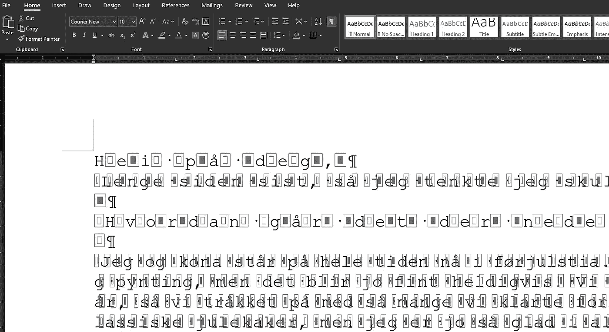

word 中的隐藏字符—按作者

一开始并不容易看出来，但是有一些特殊的字符是 0 或 1。完全标记的方块代表 1，而“空”曾经是零。所以，我写了一个快速程序来提取这些数字。

这给了我下面的二进制密钥，我可以将它翻译成 ascii 并获得今天的标志:

```
py .\decrypt-mulig-lekkasje.py
Final ascii string:
Jeg har planen klar!
De har nettopp delt ut oversikt over hvor nissen må stoppe og mate reinsdyrene underveis på ruta.Her er det muligheter for å ødelegge!
Jeg holder dere oppdatert-M
PST{ReadingBetweenTheLetters}
```

# 第 22 天—可疑路线

为了给员工提供积极的生活方式，NPST 每周安排 2 小时进行锻炼。如果员工愿意，他们还会额外提供心跳手表。

```
Som du sikkert er klar over har de ansatte hos oss mulighet til å trene to timer i arbeidstiden i løpet av uken. Dette er et tilbud mange benytter seg av, spesielt etter at vi startet med utlån av GPS klokker til alle ansatte. De mest ivrige tar tar også med seg klokkene hjem i helgene. Ofte er dette ansatte med stor glede av sosiale medier, som liker å dele opplevelser med andre. Vi har spesielt lagt merke til et økt bruk av Instagram i arbeidstid.Da en oppmerksom alvebetjent tok imot en klokke i går, fant hun en rute hun syns var veldig mistenkelig og rapporterte den inn. Det mistenktes at personen som lånte denne klokka kan ha hatt kontakt med en pingvin vi holder ekstra øye med. Legger ved både rute som ble funnet på klokka og nylige bevegelser gjort av pingvinen. Kan du ta en tit å se om det har skjedd noe mistenkelig?Mellomleder[📎aktivitet_pingvin.kml](https://wiarnvnpsjysgqbwigrn.supabase.co/storage/v1/object/public/files/vaLu597dx8vNPuwLpmzpO/aktivitet_pingvin.kml) [📎klokke_7_18_12_21.kml](https://wiarnvnpsjysgqbwigrn.supabase.co/storage/v1/object/public/files/XoBg4FMzK_hBYjX36tBuu/klokke_7_18_12_21.kml)
```

这些手表带有全球定位系统，其中一个被退回的手表保持着一个奇怪的轨迹，他们提取了该员工最近路线的全球定位系统坐标，并请求我们是否能找出那里是否有不寻常的东西。

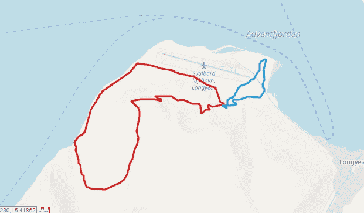

地图的屏幕打印—按作者

轨迹显示他们确实在种子库附近相遇。这条信息告诉我们，他们在工作中确实经常使用 Instagram。所以，我试着在 Instagram 上搜索种子库的图片。

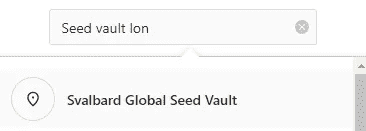

位置搜索指令程序—按作者

在那里，我发现了一张由奇利威利上传的照片，这个名字早些时候收到了一张明信片。所以为什么不打开看看呢。

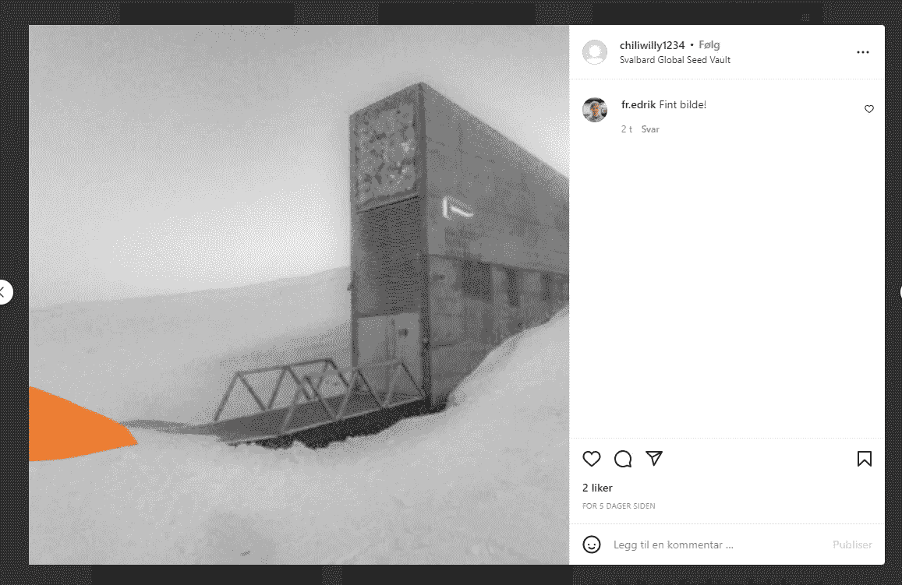

instagram 上的图片——由[辣椒威利](https://www.instagram.com/chiliwilly1234/)拍摄

他的个人资料上有今天的旗帜:PST { utpaaturaldrisur123


[辣椒威利](https://www.instagram.com/chiliwilly1234/')的丝网版画——作者

# 第 23 天——破坏

哦，不，有人改变了圣诞老人雪橇的全球定位系统。有一段时间人们一直怀疑一个粗野的精灵，但是现在这已经被证实了。他们要求我们看看能不能找到小精灵。

```
Alvene i sledegarasjen rapporterer om at noen har tuklet med julegaveruta som er lagt inn i slede-GPSen. Det er kritisk fordi det ikke er mulig å overstyre sledens GPS-kurs under flyturen. Det har visst blitt lagt til et stopp på Antarktis, rett utenfor SPST sitt hovedkvarter, og jeg (Julenissen) er redd for at SPST planlegger å rappe alle gavene fra sleden på selveste julaften.I slede-GPS-loggen er det lagt igjen en kort beskjed: “Ikke god jul, hilsen M”.Det er derfor høy prioritet å finne ut hvem “M” er, før “M” klarer å utrette mer ugagn. Mellomleder har skrytt av din innsats denne førjulstiden, så jeg vil derfor betro denne viktige oppgaven til nettopp deg. Jeg personlig har ikke tid, for jeg skal først på gløggsmaking og så skal jeg se Grevinnen og Hovmesteren. Du blir gitt tilgang til kontoret mitt i kveld for å lete gjennom papirer og se om du klarer å finne ut hvem rakkeren er. Navnet rapporteres tilbake til meg (du må selv pakke navnet inn i formatet pst{}).Dette oppdraget er gradert “Temmelig Hemmelig”, så ikke fortell om dine funn til noen andre enn meg personlig.[📎 Julenissens_kontor.png](https://wiarnvnpsjysgqbwigrn.supabase.co/storage/v1/object/public/files/u9On67xdLejo7yJlRlvgJ/Julenissens_kontor.png)Hoho, Julenissen
```

为了这个任务，我们进入了[圣诞老人的办公室](https://wiarnvnpsjysgqbwigrn.supabase.co/storage/v1/object/public/files/u9On67xdLejo7yJlRlvgJ/Julenissens_kontor.png)，他们邀请我们看看能不能找到有用的东西。


圣诞老人办公室——由 [NPST](http://dass.p26e.dev) 提供

我从下载我们得到的图像开始，并通过 Binwalker 运行它。这产生了几个文件供我们查看。另外，有些文件将用于第二天的挑战。但是对于这个挑战，note_to_elf.txt 是一个好的起点吗？

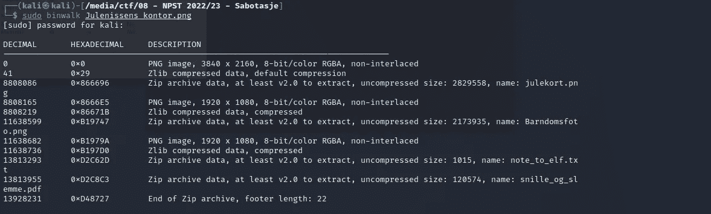

binwalk Jule nissen kontor——作者

这通知我们 elf 需要代表 NPST 的员工，他们必须很好，并且他们很可能从 m 开始。除了所有文件，我们还拥有 m 上人员的好与坏列表。

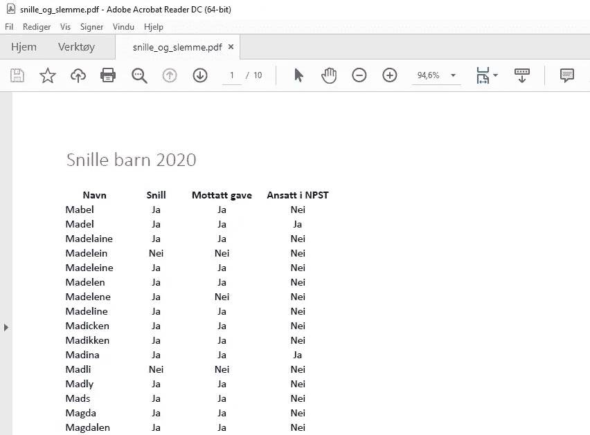

好的和不好的列表屏幕打印—按作者

这种方式太长了，无法用手观察，所以我开发了一个脚本。

在运行脚本对在 NPST 工作的优秀员工进行分类之后，我们可以看到有一个名字非常突出: **Maximilian** 。

```
> py .\cracker_sabotasje.py
[‘Madel’, ‘Ja’, ‘Ja’, ‘Ja’]
[‘Madina’, ‘Ja’, ‘Ja’, ‘Ja’]
[‘Maggi’, ‘Ja’, ‘Ja’, ‘Ja’]
[‘Magnor’, ‘Ja’, ‘Ja’, ‘Ja’]
[‘Malfred’, ‘Ja’, ‘Ja’, ‘Ja’]
[‘Manuela’, ‘Ja’, ‘Ja’, ‘Ja’]
[‘Marenius’, ‘Ja’, ‘Ja’, ‘Ja’]
[‘Margun’, ‘Ja’, ‘Ja’, ‘Ja’]
[‘Marinius’, ‘Ja’, ‘Ja’, ‘Ja’]
[‘Mario’, ‘Ja’, ‘Ja’, ‘Ja’]
[‘Marte’, ‘Ja’, ‘Ja’, ‘Ja’]
[‘Marylyn’, ‘Ja’, ‘Ja’, ‘Ja’]
[‘Maud’, ‘Ja’, ‘Ja’, ‘Ja’]
[‘Maximilian’, ‘Ja’, ‘Nei’, ‘Ja’]
[‘Merete’, ‘Ja’, ‘Ja’, ‘Ja’]
[‘Milliam’, ‘Ja’, ‘Ja’, ‘Ja’]
[‘Mohammad’, ‘Ja’, ‘Ja’, ‘Ja’]
[‘Moritz’, ‘Ja’, ‘Ja’, ‘Ja’]
[‘Målfrid’, ‘Ja’, ‘Ja’, ‘Ja’]
```

他是今年唯一没有收到礼物的人。我将它作为一面旗帜**PST {马克西米利安}** 转发，是的，这就是今天的旗帜。

# 第 24 天——拯救圣诞节

圣诞节到了，我们需要为雪橇安装全球定位系统。为此，我们需要一个密钥来覆盖旧密码。如果我们正确回答新菜单中的以下问题，将会生成此密钥。

```
· What is Santa’s favorite reindeers?· What road did Santa grow up on?· What was the school he went to?· What does this strange Santa symbolize?
```

前两个我们可以通过查看早期的挑战来找到，最后两个我们需要在网上搜索。对于第一个问题，我们可以看看第 14 天，在那里我们跟踪了所有雨神，它告诉我们名字:**彗星；丘比特；腾跃者；鲁道夫；**

圣诞老人在哪里长大的？这可以从昨天的照片中发现，在那里你可以看到背景中的希尔玛·瑞斯滕斯·维。


Barndomsfoto.png——由 [NPST](http://dass.p26e.dev)

他在哪里上学？到目前为止，所有的事情都发生在斯瓦尔巴特群岛，所以可以肯定的是，他上学的地方也在这里，所以应该是:朗伊尔城斯科勒

最后，这个圣诞老人象征着什么？


跳跃的圣诞老人——由 [NPST](http://dass.p26e.dev)

那就是[信号量](https://en.wikipedia.org/wiki/Semaphore_(programming)):


信号量—由 [Wiki](https://upload.wikimedia.org/wikipedia/commons/0/0a/Semaphore_Signals_A-Z.jpg)

如果我们把它翻译成字母，我们得到:**godjuul**

将所有答案放入盒子中并生成一个新的密钥，您将收到今天的标志:**PST { 0c9d 1489531396 CB 2 f 4 BC 4591 a7 ce 92 f }**


密码生成器——由 [NPST](http://dass.p26e.dev) 提供

恭喜你！这是最后一个谜语；我们成功拯救了圣诞节！

# 摘要

一如既往，NPST 的 CTF 一年比一年好。和去年一样，我向任何需要一点不同寻常的圣诞日历的人推荐这个 CTF。他们花了很大力气，让每一步都充满乐趣。

今年我没有找到所有的蛋，也没有时间完成所有的任务，但希望明年我会在假期过得更好。

这个游戏不仅仅是为挪威人准备的，任何知道如何使用谷歌翻译的人都可以加入并享受其中的乐趣。如果你喜欢这个！看看我的一些其他 CTF 报道，你可能会喜欢同一家公司 PST 今年的复活节版:

[](/phst-ctf-2021-write-up-e6adf61eb38a) [## PHST CTF 2021 —报道

### 与挪威警察安全局一起捕捉旗帜—复活节版

infosecwriteups.com](/phst-ctf-2021-write-up-e6adf61eb38a) 

或来自挪威卫生部的 CTF 卫生部:

[](/helsectf-2021-write-up-35d95b7515f7) [## HelseCTF 2021 —书面报告

### 与挪威医疗保健行业的信息安全部门一起捕捉旗帜—复活节版。

infosecwriteups.com](/helsectf-2021-write-up-35d95b7515f7) 

当然，您也有一些教程值得一试:

[](/basic-burp-suite-usage-c23cf65152f2) [## 基本的打嗝套件用法

### 学习如何拦截和操纵入侵者和中继器的数据。

infosecwriteups.com](/basic-burp-suite-usage-c23cf65152f2) 

或者是去年的那个:

[](/npst-ctf-2020-write-up-79e47c1a7658) [## NPST CTF 2020 —报道

### 由 PST(挪威警方)为 2020 年 CTF 圣诞挑战赛撰写文章。这篇文章会陪你度过每一天…

infosecwriteups.com](/npst-ctf-2020-write-up-79e47c1a7658) 

我迫不及待地想看到他们明年 CTF 日历的安排，如果你喜欢阅读的话？如果你想看到更多，请确保给这篇文章 **50 个掌声**。