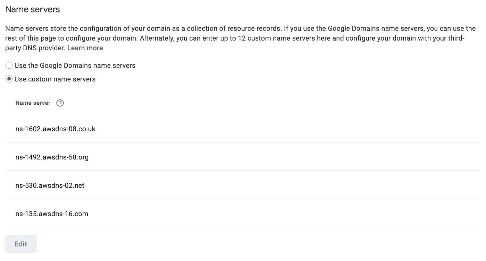
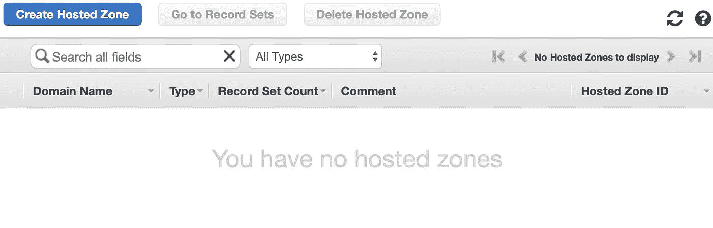
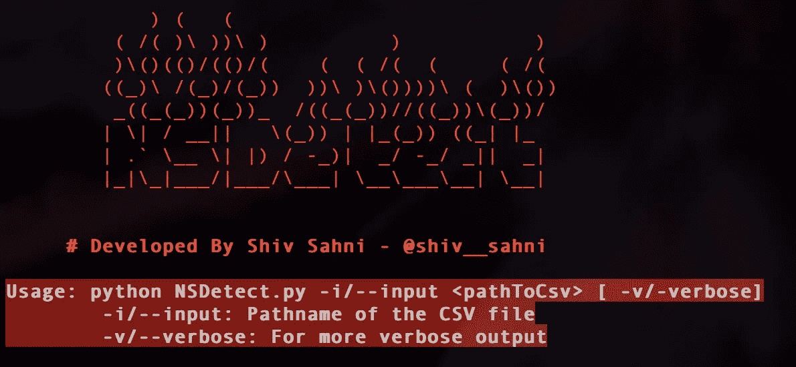
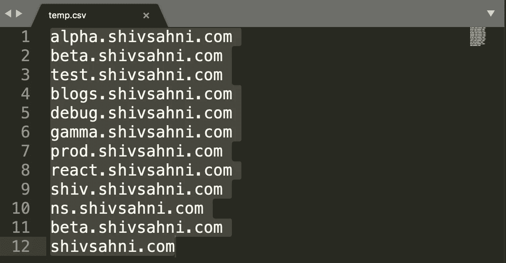
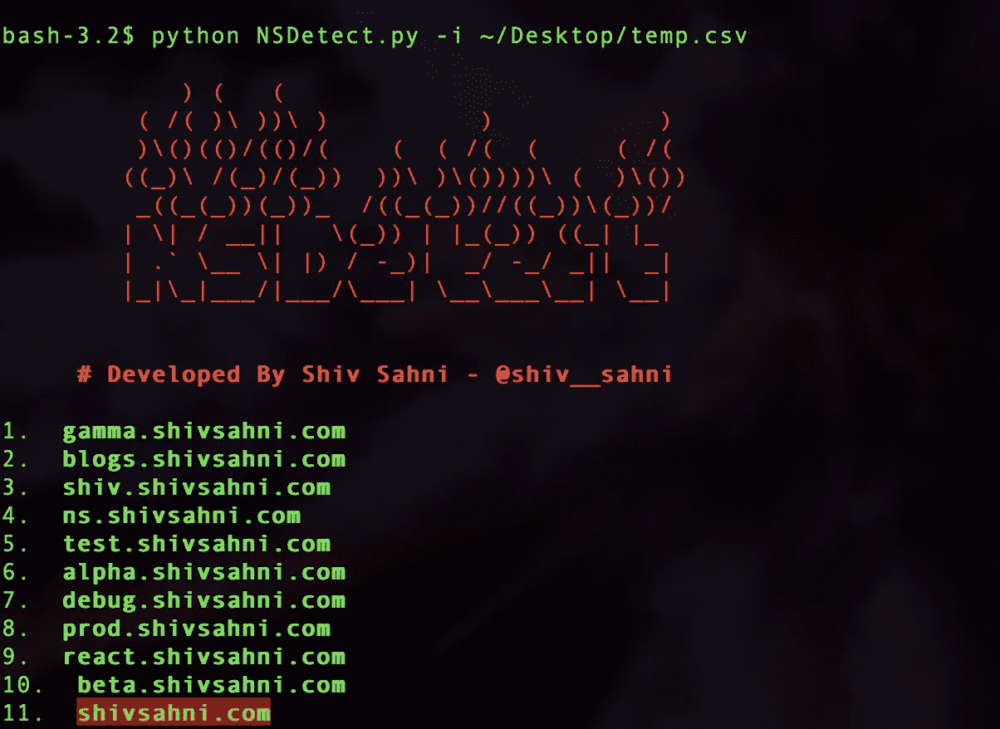
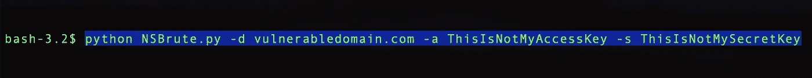
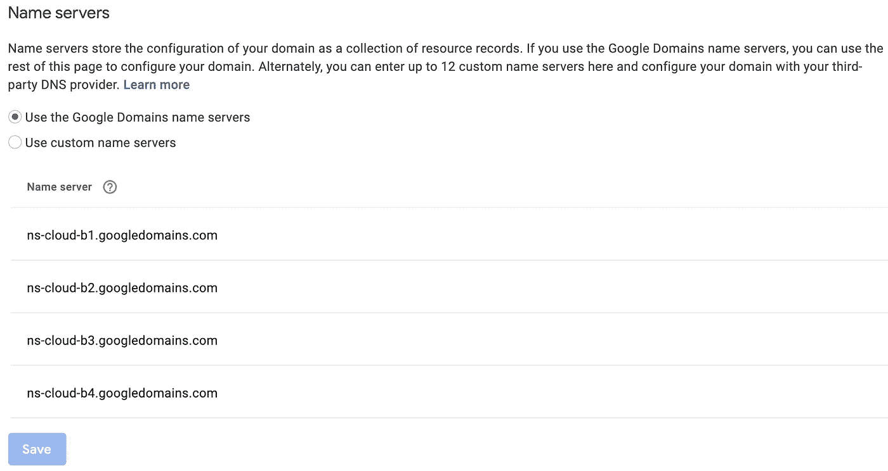

# NSDetect:发现潜在 AWS 领域接管的工具

> 原文：<https://infosecwriteups.com/nsdetect-a-tool-to-discover-potential-aws-domain-takeovers-fd0ff1a8b68a?source=collection_archive---------0----------------------->

## 可能帮你赚/省几十万美元的实用工具！🤑


## 介绍

AWS 确实是一个领先的云平台，被网飞、Airbnb、Lyft、Deliveroo 等科技巨头广泛用于各种类型的云服务。在这个故事中，我将谈论自动检测 **AWS NS 接管**，这是一个与 AWS Route 53 服务中的错误配置相关的安全问题。该工具可以被基础设施安全工程师、开发人员工程师、渗透测试人员和漏洞赏金猎人使用(**🤑**)用于自动检测 NS 接管。

如果你不知道 AWS NS 接管，我强烈建议你先看看下面的故事，以便更好地理解这个问题。这个故事还谈到了使用 [**NSBrute**](https://github.com/shivsahni/NSBrute) 的利用技术，渗透测试人员和 Bug 赏金猎人可以利用这些技术来生成有效的概念证明。

[](https://medium.com/@shivsahni2/aws-ns-takeover-356d2a293bca) [## AWS NS 接管

### 从 101 到检测和开发

medium.com](https://medium.com/@shivsahni2/aws-ns-takeover-356d2a293bca) 

为了让已经知道这个问题的人重温一下这个概念，AWS NS 接管是一个安全问题，它是由于在使用 AWS Route53 进行 DNS 服务时的错误配置而发生的。当我们将 AWS 名称服务器关联为某个域的[权威名称服务器](https://en.wikipedia.org/wiki/Name_server#Authoritative_name_server)而该名称服务器没有关联域的区域文件时，就会出现。

如果管理员在删除域时从 AWS Route 53 中删除了托管区域，但忘记删除域注册商的悬空指针，就会出现这种情况。

例如，对于我的域名***shivsahni.com***，我提供了 AWS 域名服务器作为权威域名服务器，如下所示:



而在我的 AWS 控制台中，我已经删除了区域文件，因此相关联的名称服务器没有区域文件，这使得该域可能容易被 AWS NS 接管。



# AWS NSDetect

最近我开发了 [**AWS NSDetect**](https://github.com/shivsahni/NSDetect) ，这是一个 Python 实用程序，用于识别容易被 AWS NS 接管的域。该实用程序的范围仅限于识别错误配置。您可以将它与 [NSBrute](https://github.com/shivsahni/NSBrute) 结合使用，以获取对域的访问权限。

## 使用

如下所示，该脚本将一个包含域列表的文件作为输入，针对此漏洞扫描每个域，最后报告易受攻击的域列表。



输入文件可以是以下形式:



```
💡**Pro Tip**💡You can refer [**this**](https://0xpatrik.com/subdomain-enumeration-2019/) amazing blog on Subdomain Enumeration by Patrik Hudák(@0xpatrik) to prepare a rich list of domains to scan. Don't forget ***Enumeration Is The Key***!
```

一旦我们对目标进行了充分的侦察，并准备好了域/子域列表，我们就可以将该列表作为工具的输入来扫描列表中的每个域(跳过重复的域)。如下所示，脚本实时显示结果，以红色突出显示的域是易受攻击的域。



一旦有了易受攻击域的列表，就可以使用 [**NSBrute**](https://github.com/shivsahni/NSBrute) 接管易受攻击的域，如下所示:



# 补救

该漏洞有一个简单的修复方法。我们只需要在域名注册机构删除与我们的域名相对应的悬空域名服务器条目。



```
Note: While you are doing the POC for NSDetect locally, please keep in mind that [DNS Propagation Issues](https://www.siteground.com/kb/what_is_dns_propagation_and_why_it_takes_so_long/) might lead to unexpected results. You may need to provide sufficient time for DNS changes to propagate. In case you still observe the problem, feel free to raise an issue, we can **together** fix it!
```

> 将感谢您的建议，错误报告，拉请求和其他合作！**让我们从黑客手中拯救世界！**

请继续关注微软 Azure 即将推出的一些很酷的东西。欢迎在[媒体](https://medium.com/u/504c7870fdb6?source=post_page-----fd0ff1a8b68a--------------------------------)和[推特](https://twitter.com/shiv__sahni)上关注我