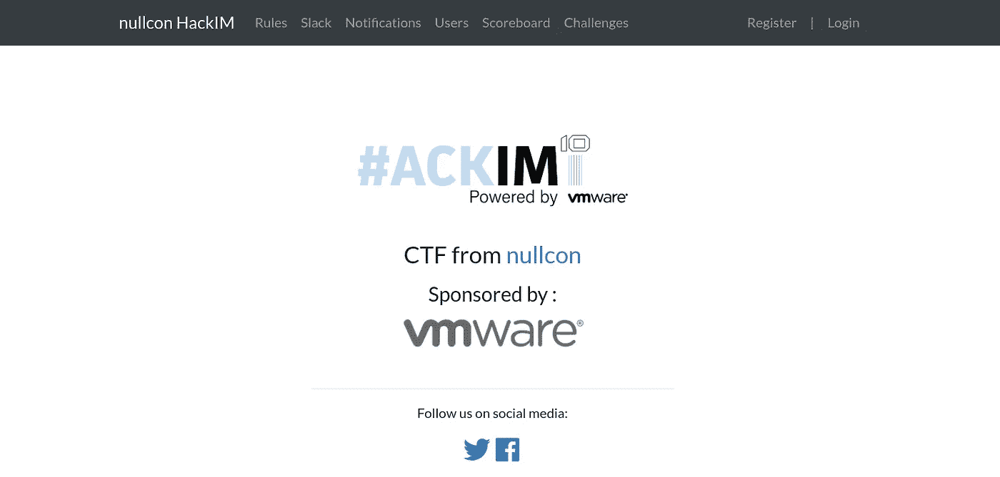

# Nullcon CTF 哈基姆-加密 2 乐趣写起来

> 原文：<https://infosecwriteups.com/nullcon-ctf-hackim-crypto-2fun-writeup-4ade2eb3821?source=collection_archive---------0----------------------->



Nullcon CTF 2019

**CTF-捕捉旗帜**是挑战自我的好方法。我积极参与这些活动已经有一年多了。这一次，我说服了我的朋友[米德胡尔·瓦尔马](https://medium.com/u/9f03520537f8?source=post_page-----4ade2eb3821--------------------------------)和我一起参加 [**纳尔康·CTF**](https://ctf.nullcon.net)。他和我是一个很好的团队，我们以前一起参加过 CTFs。

就在 CTF 开始后，我们看了一下网络和 pwn 的挑战，明白没有简单的事情。如果你是一个新手，那么你可能不知道在 CTF 中常规经验非常重要。你从阅读的文章和之前解决的挑战中获得灵感。

因此，我们最初专注于加密挑战，因为那里没有技巧。你有完整的逻辑，因为它是加密的，它必须是数学上可解的。

这一组中比较容易的是 ***2FUN*** 挑战，它涉及到破解一个双重密码以解密其密文被给出的标志。

加密函数是在 python 脚本中提供的(当然，没有密钥):

2fun.py

也给出了通过用相同的密钥加密字符串“16 位纯文本”获得的密文(该字符串实际上是 16 字节长，可能是问题设置者的一个打印错误)

```
"16 bit plaintext": b’0467a52afa8f15cfb8f0ea40365a6692' 
flag (unknown) : b’04b34e5af4a1f5260f6043b8b9abb4f8'
```

我们的目标是解密后来的密文以获得标志。***fun****方法是一种采用 24 位密钥对给定的明文进行加密的密码。孤立地破解这个密码很容易。因为我们有一个已知的明文、密文对，所以我们可以对所有可能的 2 个⁴密钥(1 千万到 1 亿个时钟周期)进行暴力破解。然而，挑战并不直接应用这个密码。实际的密码是***too fun****，它用不同的密钥在纯文本上连续两次应用 fun。(因此得名 2FUN)。**

> **这实际上使得密钥大小为 48 位，使得简单的暴力破解不可行。**

## **我们现在怎么破解密码？**

**我们还能把 ***fun*** 当做黑箱来解决吗，或者我们需要利用它的内部结构？**

**事实证明，我们不需要打开那个黑盒。我们只需要利用 ***toofun*** 两次使用相同密码的事实。 ***toofun*** 对明文应用 ***fun*** 得到中间*密文(ct1)* ，然后在此之上应用 fun 得到*最终密文*。**

**我们有一个(明文，最终密文)对。如果我们知道这种情况下的中间密文(ct1)，我们就完成了(因为我们可以通过暴力破解)。**

## **我们能找到 ct1 吗？**

**从 toofun 的定义来看:**

```
**ct1 = fun(key1, '16 bit plaintext')
b’04b34e5af4a1f5260f6043b8b9abb4f8' = fun(key2, ct1)**
```

**我们可以将此改写为:**

```
**ct1 = fun(key1, '16 bit plaintext')
ct1 = funinv(key2, b’04b34e5af4a1f5260f6043b8b9abb4f8')**
```

**其中***funninv***是 ***的【逆/解密】*** 功能 ***乐趣*** 。现在我们需要找到满足这些方程的 ***ct1，key1，key2*** 。**

## **我们该怎么做？**

****诀窍很简单**:我们首先对 ***key1*** 进行蛮力运算，得到 ***fun(key1、‘16 坑明文’)****，*的所有可能输出，我们将所有这些存储在一个哈希表/字典中。**

**然后我们对***【key 2】***进行蛮力运算，直到找到一个值 ***funinv(key2，b ' 04b 34 e 5a F4 a 1 f 5260 f 6043 b 8 B9 abb 4 f 8 ')= = fun(key 1，' 16 pit plaintext')*** *，*使用哈希表进行快速查找。**

**由于每个***key 1***&***key 2***的大小只有 24 位，所以暴力破解是可行的。一旦发现这样的匹配/碰撞，我们就知道 ***key1*** ， ***key2*** 就大功告成了。**

**要完成这项工作，我们需要实现 ***funinv*** ，这并不难。只要反过来读《乐趣的密码》就行了。**

*****fun inv***-**的逆*乐趣*** 功能**

**最后是如上所述的两遍蛮力:**

**2 遍蛮力**

**如果我没记错的话，在我的笔记本电脑上运行需要 1-2 个小时。你可以很容易地优化它，让它运行得更快，但我太懒了。**

**最终，当冲突发生时，它会吐出***key 1***+***key 2***，您可以用它来解密标志密文。(可以使用 2 次调用 ***funinv*** 来反转 ***toofun*** )。**

**这样做给了我们*旗:****hackim 19 { 1337 _ 1n _ m1 DDL 38 f }****这很适合我们的解决方案:在中间相遇！***

*****故事的寓意**:用不同的密钥组成一个密码两次肯定会增加密钥空间的大小，但对密码的安全性没有任何影响。***

*****思考的食粮**:涂两次以上会怎么样？***

***感谢 [Midhul Varma](https://medium.com/u/9f03520537f8?source=post_page-----4ade2eb3821--------------------------------) 帮助我写报告，感谢 Nullcon 团队创造了一个平衡和令人敬畏的挑战。***