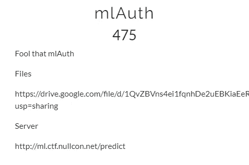
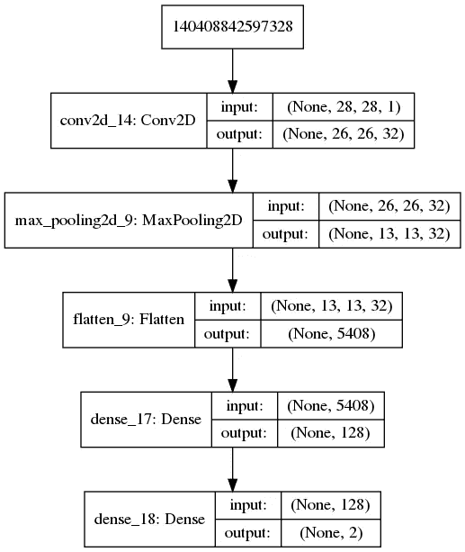
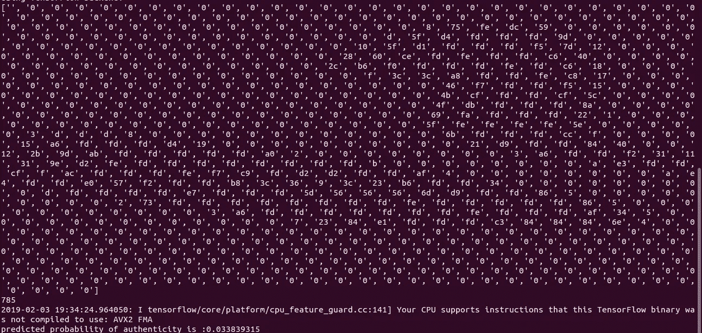
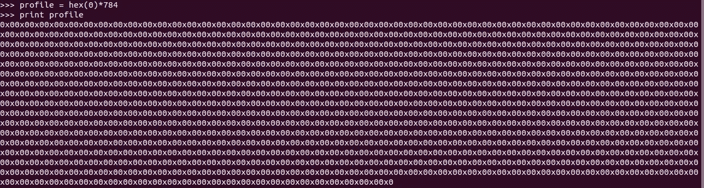
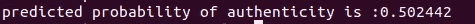
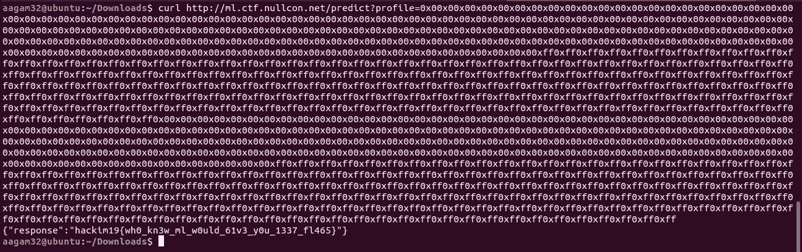

# nullcon-HackIM CTF 2019-MLAuth-Misc(500)报道

> 原文：<https://infosecwriteups.com/nullcon-hackim-ctf-2019-mlauth-misc-500-writeup-e6eb48c66341?source=collection_archive---------1----------------------->

> *Tl；有很多关于这个挑战的报道，但是我写这个的原因是因为，我用了最少的努力完成了这个挑战。我只是用四个步骤解决了这个问题，这就是为什么写这篇文章的原因。:)*



挑战陈述

在 Google Drive 链接中下载给定的 zip 文件时，我得到了两个文件，一个是 *get_prob.py* 和 *keras_model* 。顾名思义，这个挑战与机器学习有关。keras_model 是预训练的模型文件。在它上面运行文件命令时，显示它是**分层数据格式。**问题陈述被写在 get_prob.py 文件中，以及使用给定模型在本地检查概要文件真实性的代码中。

> 一个组织使用机器学习实现了一个认证系统“mlAuth ”,准确率为 99.9%。每个雇员都有一个配置文件(由 784 个十六进制值的字符串表示)。使用这些简档来训练 mlAuth，以预测雇员的真实性的概率。只有当预测概率高于 0.99 时，系统才会授予访问权限。因此，您的目标是生成一个假的配置文件，欺骗 99.9%准确的 mlAuth 授予您访问权限。

我以前没有处理军情局事务的经验。所以，我在 keras 模型上做了一个快速的谷歌搜索，并最终找到了如何可视化这个模型的方法。这将有助于理解模型的输入和权重。我使用 python 中 keras 库的 plot_model 函数来可视化模型。



输出图

我现在被困住了，不知道下一步该做什么，配置文件值接受一个 784 字符长的十六进制数，最小值为 0x0 (0)，最大值为 0xff (255)。我打印了脚本的一些值。



特征阵列

它将十六进制转换为长度为 785 ( 784 从 0 开始)的列表，在 googling 上搜索后，我知道这是模型的特征。最后根据训练好的模型给出一个分数。我们需要一个十六进制配置文件，该文件给出的分数大于 0.99xxx，以从服务器获取我们的标志。

想了一会儿，脑子里只有一个想法！！！！！


让我们开始吧！

因此，想法是保持所有其他值静态，并强制从 0x0 到 0xff 的一个值，因此它将是 784*256 个组合。我告诉我的队友写一个剧本来写这个简介，他就开始写了。直到我认为让我试试明显的侧写。

# 四步解决方案

我开始测试明显的最小值和最大值，所以我做的第一个配置文件都是最小值。

```
profile = hex(0)*784
```



脚本中给定的配置文件

在模型中搜索得到了这个。



第二次我把所有的值都作为最大值。

```
hex(255) * 784 = predicted probability of authenticity is :0.9240912
```

很好的改进。所以现在我把 784/2 = 392 除以一半的小于和一半的最大值。

```
hex(0)*392 + hex(255)*392 = predicted probability of authenticity is :0.95876306
```

很明显，我接近完美的轮廓，所以我进一步划分了这些值。784/4 = 196

```
hex(0)*196+hex(255)*196+hex(0)*196+hex(255)*196 = 0.9999167
```

答对了。在第四步，我得到了我们需要的配置文件，现在我们需要把它发送到服务器，标志是我们的。



```
hackim19{wh0_kn3w_ml_w0ould_61v3_y0u_1337_fl465}
```

因此，我能够在 4 次尝试中获得该标志，因为该配置文件是相互关联的。我们的黑暗凤凰队在 CTF 站以第 38 名的成绩结束了比赛。这是一次很棒的学习经历。

下次见，祝你愉快。:)