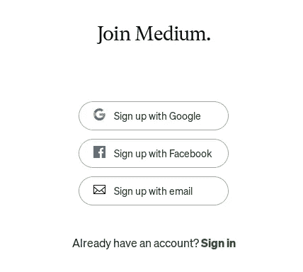
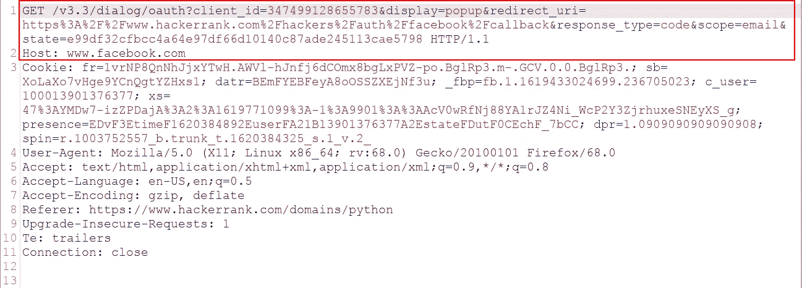
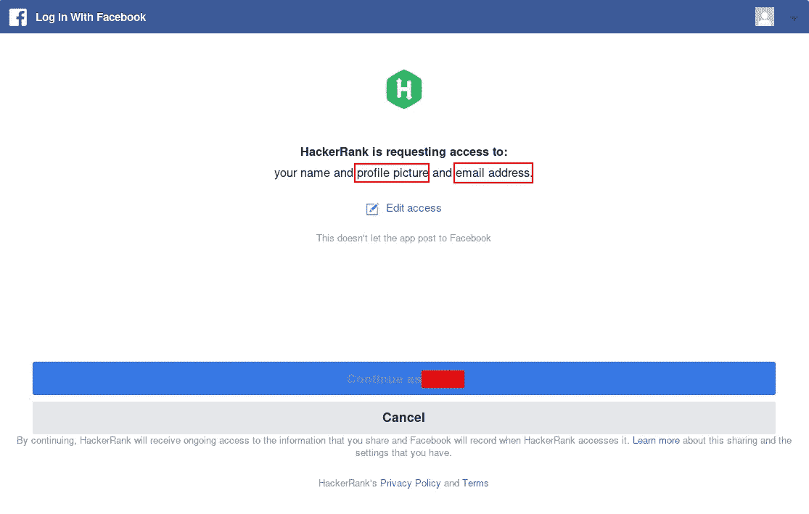
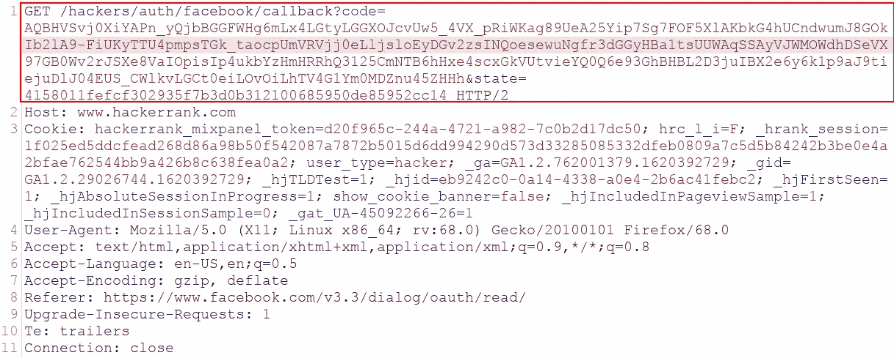
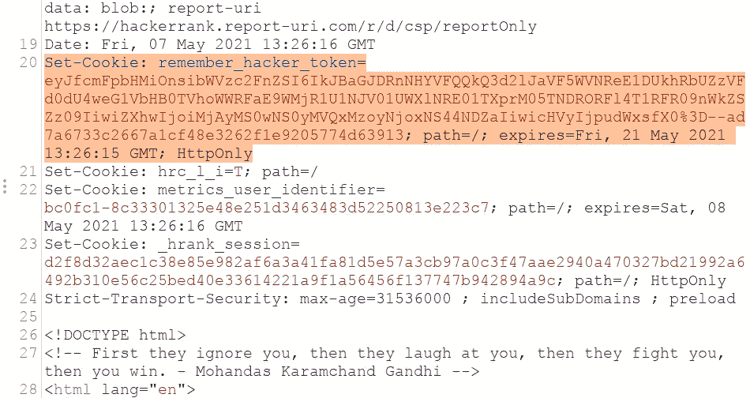
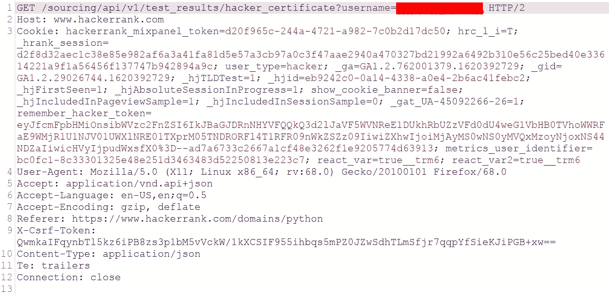
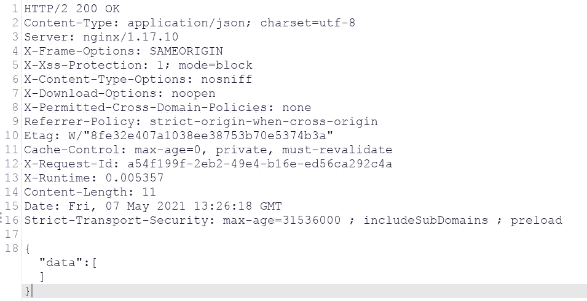

# OAuth 2.0 黑客简化版—第 1 部分—理解基础知识

> 原文：<https://infosecwriteups.com/oauth-2-0-hacking-simplified-part-1-understanding-basics-ad323cb4a05c?source=collection_archive---------0----------------------->

OAuth2

# 什么是 OAuth 2.0？

OAuth 是一个开放标准的 ***授权*** 协议或框架，它描述了不相关的服务器和服务如何安全地允许对它们的资产进行认证访问，而无需实际共享初始的、相关的单一登录凭证。

Auth0 为 API 授权场景生成访问令牌，采用 *JSON web token (JWT)* 格式。用 OAuth 术语来说，访问令牌所代表的权限被称为*范围*。当应用程序使用 Auth0 进行身份验证时，它会指定所需的范围。如果这些范围被用户授权，那么访问令牌将代表这些*授权范围*。

它的工作方式是将用户身份验证委托给托管用户帐户的服务，并授权第三方应用程序访问用户帐户。

# 用在哪里？

OAuth 2 为 web 和桌面应用程序以及移动设备提供授权流。最简单的情况是，当你登录到一个网站，它提供使用另一个网站的登录(登录脸书或谷歌)登录。

例如:Medium-的注册页面

中型注册页面

# OAuth 实体

在进入核心概念之前，我们需要理解用于 OAuth 流中不同实体的不同定义。我们通过一个例子来了解一下。一名**脸书**用户想要使用脸书登录到**中型**平台。与此流程相关的实体有-

**资源所有者**:`resource owner`是授权访问其受保护资源的用户/实体。在我们的示例中，它可以是与脸书帐户相关联的用户数据。

**客户端应用** : `client application`是向`resource owner`请求授权的应用。在我们的示例中，这将是中型应用程序。

**授权服务器:** `authorization server`是对`resource owner`成功认证并获得授权后，向`client application`发布`access tokens`的服务器。在我们的例子中，脸书将是授权服务器。

**资源服务器**:`resource server`是在应用程序代表`resource owner`获得一个`access token`后处理认证请求的服务器。在我们的例子中，这将是脸书。

***注:***往往授权服务器和资源服务器是同一个实体，可以称为 OAuth 提供者。

**client _ id**:`client_id`是一个强制参数，包含客户端应用程序的公共唯一标识符。该值是在客户端应用程序向 OAuth 服务注册时生成的。

**response_type** :决定客户端应用程序期望哪种类型的响应，从而决定它想要启动哪个流。对于授权码授予类型，该值应为`code`

**范围**:`scope`是`client application`向`resource owner`请求的访问级别

**redirect _ uri**:`redirect_uri`是授权完成后用户被重定向到的 URL。这也被称为“*回调 URI* 或“*回调端点*”。这应该与用户之前向服务注册的重定向 URL 相匹配。

**状态**:`state`参数存储一个唯一的随机值，该值与客户端应用程序上的当前会话相关联。根据 RFC，它是可选的，但是这个参数作为客户端应用程序的一种形式的 CSRF 令牌，确保对其`/callback`端点的请求来自发起 OAuth 流的同一个人。

**grant _ type**:`grant_type`参数表示授权类型，以及将要返回哪个令牌。

**代码**:该`code`是从`authorization server`接收的授权代码，该代码将在该请求的查询字符串参数“code”中。客户端应用程序结合`client_id`和`client_secret`使用该代码来获取`access_token`

**access _ token**:`access_token`是客户端应用程序用来代表`resource owner`发出 API 请求的令牌

**refresh _ token**:`refresh_token`允许应用程序在不提示用户的情况下获取新的`access_token`

# OAuth 流(授权类型)

OAuth 授权类型决定了 OAuth 过程中涉及的步骤的确切顺序。流还会影响客户端应用程序与 OAuth 提供者的通信方式。

客户端应用程序在发送给 OAuth 服务的初始请求中指定了想要使用的授权类型。有多个流程可用于实现，但是使用哪个流程呢？这完全取决于客户端应用程序的类型。(更多信息请点击这里:【https://auth0.com/docs/api-auth/which-oauth-flow-to-use】T4)

OAuth 的水流类型

*   授权码授权(又名服务器端流程)
*   隐式授权(也称为客户端流)
*   资源证书授予
*   客户端凭据授予

我们将讨论前两个，因为它们是当前 OAuth 实现中最常用的。

# OAuth 是如何工作的？

让我们深入研究不同的授权类型，以了解 OAuth 是如何工作的。

## 授权码授权类型

让我们通过一个真实的例子 *Hackerrank* 来理解授权代码授权类型的 OAuth 流程。

1.  **授权请求**

客户端应用程序向 OAuth 服务的端点发送请求，请求访问特定用户数据的权限。

**2。用户登录和同意**

当授权服务器接收到初始请求时，它会将用户重定向到一个登录页面，在这个页面上，系统会提示用户登录到 OAuth 提供者的帐户。然后，他们将看到一个客户端应用程序想要访问的数据列表(如电子邮件、个人资料图片)。这基于授权请求中定义的范围。用户可以选择是否同意这种访问。

**3。授权码授予**

如果用户同意所请求的访问，他们的浏览器将被重定向到授权请求的`redirect_uri`参数中指定的`/callback`端点。(记住步骤 1)

产生的`GET`请求将包含授权码作为查询参数。*该代码只能使用一次，以获取访问令牌*。

密码

**4。访问令牌请求**

一旦客户端应用程序收到授权码，它就需要用它来交换访问令牌。为此，它向 OAuth 服务的端点发送一个服务器到服务器`POST`请求。

从此以后，所有通信都在安全的反向信道中进行，因此通常不会被攻击者观察或控制。

**5。访问令牌授权**

OAuth 服务将验证访问令牌请求。如果一切如预期的那样，服务器通过授予客户端应用程序一个具有所请求范围的访问令牌来做出响应。

**6。API 调用**

现在客户机应用程序有了访问代码，它终于可以从资源服务器获取用户数据了。这里我们询问用户获得的证书的详细信息。

## 7.资源拨款

资源服务器应该验证令牌是有效的，并且它属于当前的客户端应用程序。如果是，它将通过发送请求的资源(即用户获得的证书)进行响应。

我们没有完成任何任务，所以我们没有得到任何回报。但是现在您已经登录，可以浏览该站点了。

## 隐式授权类型

隐式授权类型要简单得多。客户端应用程序在用户同意后立即接收访问令牌，而不是首先获得授权码，然后将其交换为访问令牌。

1.  **授权请求**

隐式流的启动方式与授权代码流非常相似。唯一的主要区别是`response_type`参数必须设置为`token`。

2 **。用户登录和同意**

这个过程与授权代码流完全相同。

3.**访问令牌授予**

OAuth 服务会将用户的浏览器重定向到授权请求中指定的`redirect_uri`。但是现在它不会像前面看到的那样发送带有代码的查询参数，而是在 URL 本身中发送访问令牌和其他数据。

4. **API 调用**

一旦客户端应用程序成功地从 URL 中提取了访问令牌，就可以使用它来访问与用户相关联的个人数据。

5.**资源授予**

资源服务器验证令牌是否有效。它将发送所请求的资源，即用户数据。

我们将在下一篇博客中讨论漏洞和缓解措施。希望你学到了新的东西，喜欢我的博客。保持安全，保持好奇。

感谢阅读！

~Nishith K

与我联系:

*   **推特**

 [## JavaScript 不可用。

### 编辑描述

twitter.com](https://twitter.com/busk3r) 

*   **领英**

 [## Nishith K 安全分析师- Net Square Solutions Pvt. Ltd

### 查看世界上最大的职业社区 LinkedIn 上 Nishith K 的个人资料。Nishith 有 3 个工作列在他们的…

in.linkedin.com](https://in.linkedin.com/in/nishithkhadadiya) 

# 参考

*   [https://portswigger.net/web-security/oauth](https://portswigger.net/web-security/oauth)
*   【https://auth0.com/docs/protocols/protocol-oauth2】
*   [https://www . digital ocean . com/community/tutorials/an-introduction-to-oauth-2](https://www.digitalocean.com/community/tutorials/an-introduction-to-oauth-2)
*   【https://dev.to/hem/oauth-2-0-flows-explained-in-gifs-2o7a 号
*   [https://www . csoonline . com/article/3216404/what-is-oauth-how-the-open-authorization-framework-works . html](https://www.csoonline.com/article/3216404/what-is-oauth-how-the-open-authorization-framework-works.html)