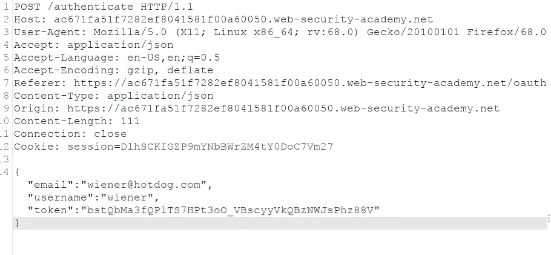
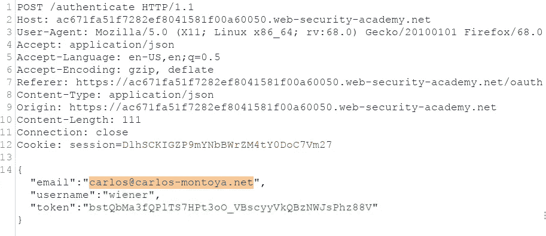
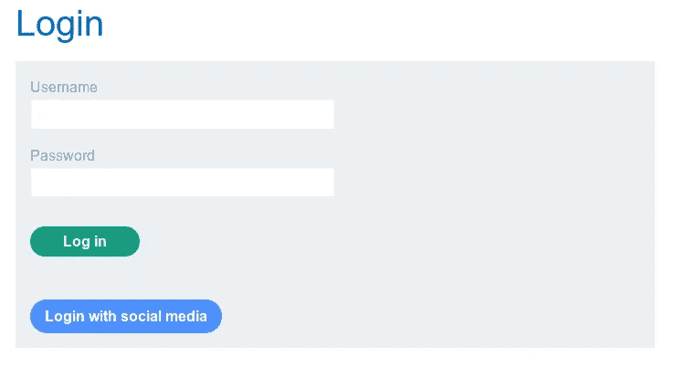
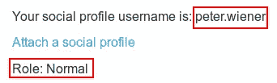
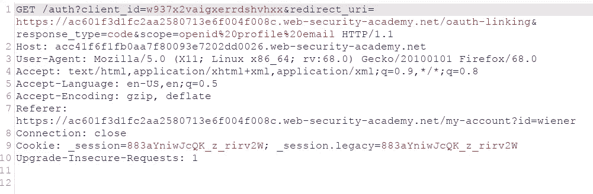
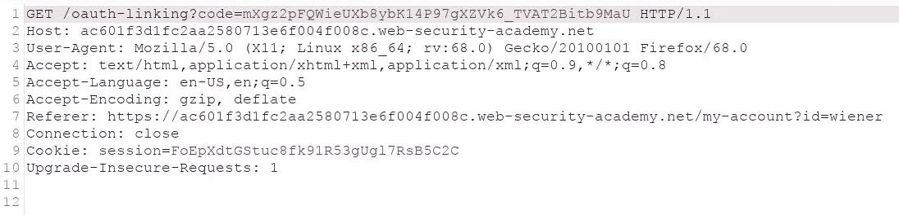
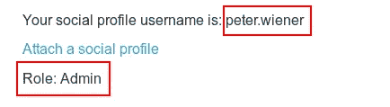
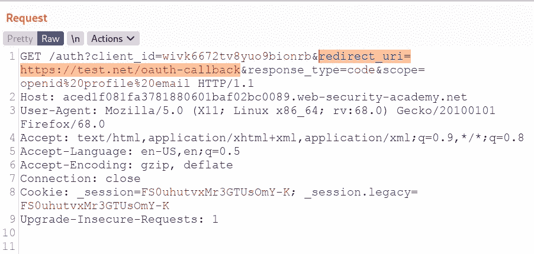
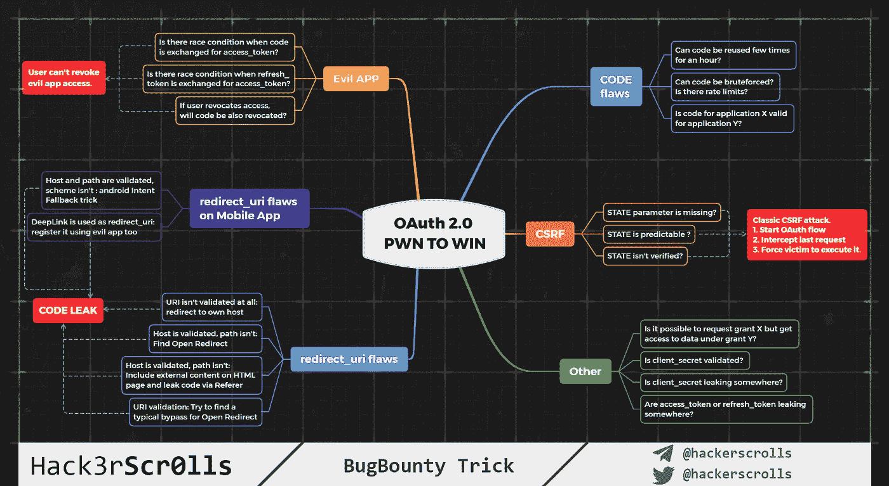

# OAuth 2.0 黑客攻击简化版—第 2 部分—漏洞和缓解

> 原文：<https://infosecwriteups.com/oauth-2-0-hacking-simplified-part-2-vulnerabilities-and-mitigation-d01dd6d5fa2c?source=collection_archive---------0----------------------->


OAuth2

大家好，

我带着 OAuth 2.0 黑客简化系列的另一部分回来了。我们已经在[的上一篇文章](/oauth-2-0-hacking-simplified-part-1-understanding-basics-ad323cb4a05c)中讲述了基础知识。我强烈推荐你看完[第一部分](/oauth-2-0-hacking-simplified-part-1-understanding-basics-ad323cb4a05c)。在这篇博客中，我们将深入探讨如何**利用**和**减轻**常见的 OAuth 漏洞。

# OAuth2 漏洞

OAuth 漏洞的出现是因为 OAuth 规范在设计上相对模糊和灵活。在 OAuth 中，绝大多数实现都是完全可选的。此外，OAuth 没有太多内置的安全特性。大多数安全配置和额外的安全实现必须由开发人员来完成。

***注*** *:所有演示均来自*[*Portswigger Academy*](https://portswigger.net/web-security/oauth)*。*

OAuth 的客户端应用程序实现以及 OAuth 服务本身的配置都可能出现漏洞。在这两种情况下最常见的漏洞是-

## 漏洞:

*   隐式授权类型的不正确实现
*   有缺陷的 CSRF 保护
*   泄露授权码和访问令牌
*   有缺陷的范围验证
*   未经验证的用户注册
*   主机头注入
*   可重用的 OAuth 访问令牌

让我们详细谈谈每一个-

1.  **隐式授权类型的不当实现**

一旦 OAuth 提供者向客户端应用程序发送了 access_token，应用程序就必须维护一个会话。为了实现这一点，客户端应用程序通常会在一个`POST`请求中向服务器提交这些数据，然后为用户分配一个会话 cookie，类似于传统的基于密码的登录，有效地让用户登录。然而，服务器没有任何秘密或密码来与客户端应用程序提交的数据进行比较，这意味着它是隐式受信任的。

在这种情况下，攻击者只需更改发送到服务器的参数，就可以在访问令牌有效时冒充任何用户。请参见下面的快照以了解-

带令牌的正常有效 *POST* 请求，



受害用户的邮件

攻击者更改邮件以访问受害者的帐户，



攻击者用户的邮件

**2。有缺陷的 CSRF 保护**

如果您检查了上面的定义，您就已经知道`state`参数是作为客户端应用程序的一种 CSRF 令牌的形式。如果授权请求没有发送一个`state`参数，从攻击者的角度来看这是非常有趣的。这意味着他们可以在欺骗用户的浏览器完成 OAuth 流之前，自己启动 OAuth 流。

我们举个例子。作为用户，我们可以使用社交媒体 OAuth 登录网站。



登录页面

现在让我们正常登录，



观察我们作为普通用户登录。让我们通过点击“附加社交档案”来检查 OAuth 请求



缺少状态参数

请求中缺少`state`参数，这意味着我们可以使用分配给我们的代码将我们的社交媒体句柄附加到受害者的帐户。让我们先通过转发请求来获取代码-



oauth 代码

复制 url 并创建一个 iframe 来将有效负载传递给受害者，确保在复制有效代码后丢弃请求。

```
<iframe src=[https://ac601f3d1fc2aa2580713e6f004f008c.web-security-academy.net/oauth-linking?code=mXgz2pFQWieUXb8ybK14P97gXZVk6_TVAT2Bitb9MaU](https://ac601f3d1fc2aa2580713e6f004f008c.web-security-academy.net/oauth-linking?code=mXgz2pFQWieUXb8ybK14P97gXZVk6_TVAT2Bitb9MaU)></iframe>
```

假设您将该脚本发送到管理员权限帐户，并且他们执行了该脚本，作为攻击者，您可以登录到他们的帐户，从而获得所有管理员功能的访问权限。我们可以实现账户接管！！

让我们通过使用社交媒体帐户登录来验证这一点，您可以看到角色现在更改为 Admin



管理员权限

## 3.在 redirect_uri 参数处打开重定向

当 OAuth 提供者没有正确检查 *redirect_uri* 时，攻击者就有可能窃取与其他用户账户相关的授权码。代码或访问令牌可被重定向到攻击者控制的网站，并可用于进一步完成该流程。

我们举个例子。启动 OAuth 流，并将 redirect_uri 值更改为攻击者控制网站。



已更改 redirect_uri

观察反应


反应

代码已被重定向到攻击者控制网站(此处为 test.com)。现在，攻击者可以使用代码完成 OAuth 流，并接管受害者的帐户。

在一般情况下，客户端应用程序在向 OAuth 服务注册时会提供一个真正回调 URIs 的白名单，以减轻这种攻击。但是仍然有不同的方法可以绕过这种验证。

*   攻击者可以尝试在 redirect_uri 参数中使用@ ( `https://expected-host@evil-host`)和#( `https://evil-host#expected-host`)字符。
*   攻击者可能会利用 OAuth 服务的不同组件对 URI 的解析之间的差异。例如，你可以尝试诸如- `https://default-host.com &@foo.evil-user.net#@bar.evil-user.net/`的技巧
*   攻击者可以通过提交重复的`redirect_uri`参数来尝试参数污染漏洞，如下所示- `[https://oauth-authorization-server.com/?client_id=123&redirect_uri=client-app.com/callback&redirect_uri=evil-user.net](https://oauth-authorization-server.com/?client_id=123&redirect_uri=client-app.com/callback&redirect_uri=evil-user.net)`
*   攻击者可以尝试本地主机 URIs，因为他们经常在开发过程中使用。这可以让你通过注册一个域名来绕过验证，比如`localhost.evil-user.net`

## 4.有缺陷的范围验证

每次当用户登录到授权服务器时，他们都会看到客户端应用程序想要访问的数据列表(如电子邮件、个人资料图片)。

使用 [*授权码授权*](/oauth-2-0-hacking-simplified-part-1-understanding-basics-ad323cb4a05c) 类型，通过安全的服务器到服务器通信请求和发送用户数据。对于攻击者来说，直接操纵是不可能。然而，攻击者可以向 OAuth 服务注册他们自己的客户端应用程序。

对于 [*隐式授权*](/oauth-2-0-hacking-simplified-part-1-understanding-basics-ad323cb4a05c) 类型，访问令牌通过浏览器发送。攻击者可以窃取令牌并直接使用它们，方法是向 OAuth 端点发送一个普通的基于浏览器的请求，在这个过程中手动添加一个新的范围参数。

## 5.未经验证的用户注册

一些提供 OAuth 服务的网站允许用户注册帐户，而无需验证他们的所有详细信息，在某些情况下包括他们的电子邮件地址。

攻击者可以通过使用与目标用户相同的详细信息(如已知的电子邮件地址)向 OAuth 提供者注册帐户，并通过 OAuth 提供者的欺诈帐户以受害者的身份登录，来利用这一点。

## 6.主机头注入

如果服务器未验证主机，则有可能通过主机报头注入将令牌重定向到恶意主机。

```
GET /api/twitter/login?csrf=token HTTP/1.1 
Host: attacker.com/victim.org
Referer: [https://www.victim.org/](https://www.victim.org/)
Cookie:cookie
```

由于我们更改了主机头，它会将 Oauth 授权链接重定向到攻击者的主机，并泄漏所颁发的令牌。

## 7.可重用的 OAuth 访问令牌

类似于传统的会话管理功能，一旦用户从应用程序注销，令牌应该从后端过期。如果不是这种情况，可以认为这是不良的安全做法，可以利用。

## 8.客户机密泄露

获取 client_secret 可能允许恶意应用程序模拟您的应用程序，以及它被授予的任何授权。这可能包括重放访问和刷新令牌，以便在未经用户许可的情况下访问用户的帐户。

攻击者可以利用泄露的 client_secret 来访问您的应用程序已被授权访问的用户数据。在 2 脚或 3 脚 OAuth 认证流中使用的共享秘密可能允许攻击者启动 SSO 流，并解开加密的 OAuth 令牌。

# 高级开发

*   这里有一个很棒的 twitter 帖子和思维导图，是由 [@hackerscrolls](https://twitter.com/hackerscrolls) 制作的，用来测试 OAuth 2.0

[https://Twitter . com/hacker scrolls/status/1269266750467649538](https://twitter.com/hackerscrolls/status/1269266750467649538)



*   零日登录苹果—

[https://bhavukjain . com/blog/2020/05/30/zero day-sign-in-with-apple/](https://bhavukjain.com/blog/2020/05/30/zeroday-signin-with-apple/)

# 减轻

OAuth 的一个关键问题是普遍缺乏内置的安全特性。安全性几乎完全依赖于开发人员使用配置选项的正确组合，并在上面实现他们自己的附加安全措施，例如健壮的输入验证。

需要注意的是，客户端应用程序和 OAuth 服务本身都可能出现漏洞。

## 对于 OAuth 服务提供商

*   验证:只允许完全和精确的匹配，而不使用模式匹配。这可以防止攻击者访问白名单域中的其他页面。
*   Enforce `state`参数:不可访问的随机值可以帮助保护用户免受类似 CSRF 的攻击
*   `access_token`和`client_id`验证:验证访问令牌是发给发出请求的同一个`client_id`的。
*   `scope`验证:检查被请求的作用域，确保它与令牌最初被授予的作用域相匹配。

## 对于 OAuth 客户端应用程序

*   `state`参数:即使不强制也要使用。
*   `client_secret`备选方案:在开发移动或本地桌面 OAuth 客户端应用程序的情况下，使用`PKCE` ( `RFC7638`)机制来提供额外的保护，防止访问代码拦截或泄漏。
*   小心授权代码:当加载外部图像、脚本或 CSS 内容时，它们可能会通过`Referer`头泄露。同样重要的是不要将它们包含在动态生成的 JavaScript 文件中，因为它们可能通过`<script>`标签从外部域执行。
*   不仅向`/authorization`端点发送一个`redirect_uri`参数，还向`/token`端点发送一个参数。

希望你学到了新的东西，喜欢我的博客。保持安全，保持好奇。

感谢阅读！

~Nishith K

与我联系:

*   **推特**

[](https://twitter.com/busk3r) [## JavaScript 不可用。

### 编辑描述

twitter.com](https://twitter.com/busk3r) 

*   **领英**

 [## Nishith K 安全分析师- Net Square Solutions Pvt. Ltd

### 查看世界上最大的职业社区 LinkedIn 上 Nishith K 的个人资料。Nishith 有 3 个工作列在他们的…

in.linkedin.com](https://in.linkedin.com/in/nishithkhadadiya) 

# 参考

*   [https://portswigger.net/web-security/oauth](https://portswigger.net/web-security/oauth)
*   [https://apkash8.medium.com/oauth-and-security-7fddce2e1dc5](https://apkash8.medium.com/oauth-and-security-7fddce2e1dc5)
*   [https://Twitter . com/hacker scrolls/status/1269266750467649538？s=20](https://twitter.com/hackerscrolls/status/1269266750467649538?s=20)
*   [https://github . com/gr 455/CTF-writeups/blob/master/hack activity 20/notes _ surfer . MD](https://github.com/gr455/ctf-writeups/blob/master/hacktivity20/notes_surfer.md)
*   [https://www . arnes winnen . net/2017/06/authentic ation-bypass-on-ubers-SSO-via-subdomain-take over/](https://www.arneswinnen.net/2017/06/authentication-bypass-on-ubers-sso-via-subdomain-takeover/)
*   [https://hackerone.com/reports/215381](https://hackerone.com/reports/215381)
*   [https://dhavalkapil.com/blogs/Attacking-the-OAuth-Protocol/](https://dhavalkapil.com/blogs/Attacking-the-OAuth-Protocol/)