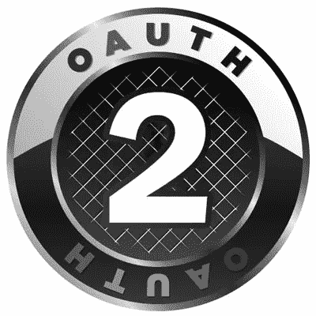
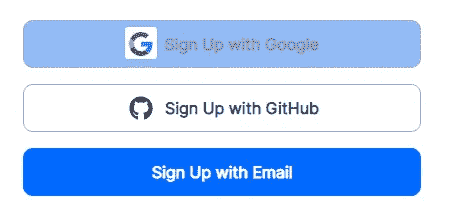
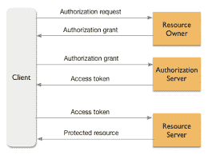
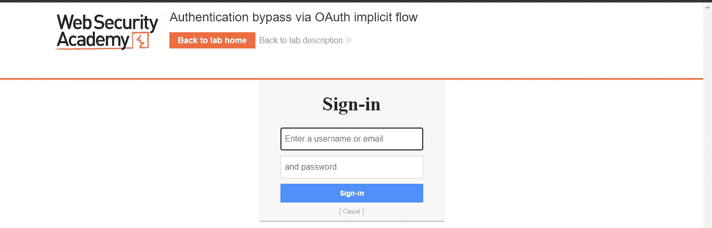
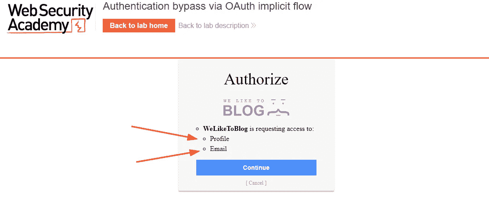
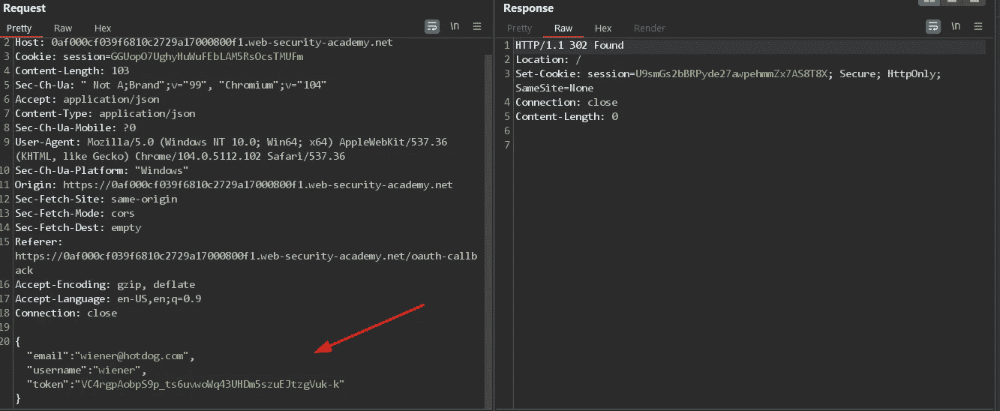
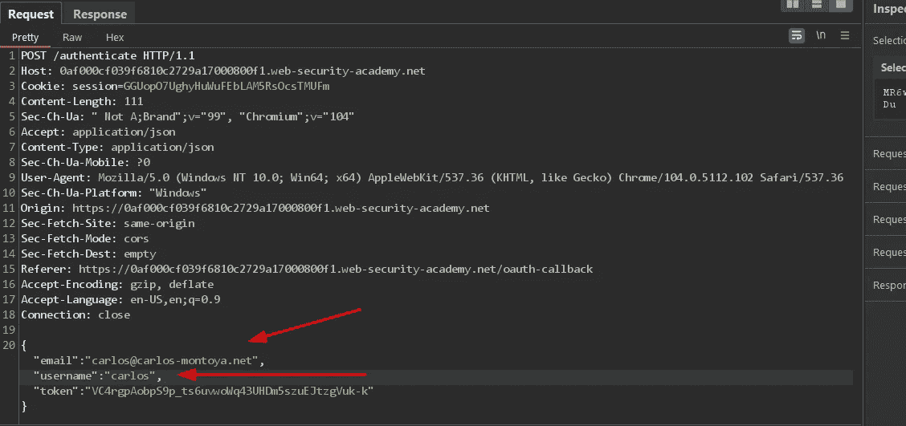
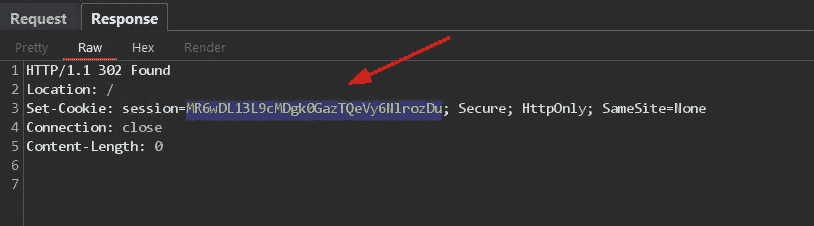
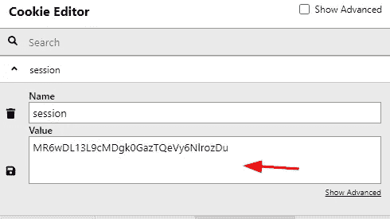
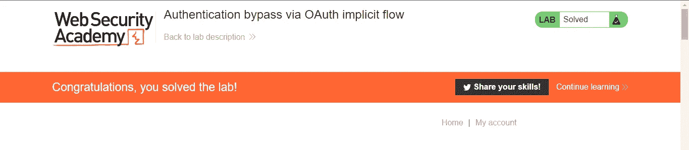

# Hashar Mujahid 解释 OAuth 2.0(介绍和开发第一部分)

> 原文：<https://infosecwriteups.com/oauth-2-0-introduction-and-exploitation-part-i-explained-by-hashar-mujahid-262f9c59de6c?source=collection_archive---------1----------------------->

在这篇博客中，我将解释 OAuth 2.0 是如何工作的，以及如果不正确地实现它会引发什么样的漏洞。

OAuth 2.0

**简介**:

嗨，我的名字是哈沙尔·穆贾希德。我是一名网络安全学习者，今天我将解释 OAuth 2.0 的工作原理以及如何被利用。

**什么是 OAUTH 2.0？**

OAuth 2.0(开放授权)是一种协议，允许网站或应用程序代表用户访问其他 web 应用程序托管的资源。OAuth 的旧实现是 1.0。OAuth 提供对用户资源的应用程序的受限访问以进行操作。

**OAuth 2.0 实现:**

每当你访问一个网络应用程序时，你会在注册页面上看到一个按钮，用来注册谷歌、脸书和 GitHub。这使应用程序能够访问一些资源，如你的用户名、电子邮件和必要的信息，以自动完成注册过程。

OAuth 2.0

它是如何工作的？

我们都听说过 API 键。OAuth 也使用类似的访问令牌。这些访问令牌验证用户的身份，并与资源服务器交互以获取所需的数据。简单来说，

> **应用程序使用访问令牌代表用户发出 API 请求。**

还有另一个名为**刷新令牌**的令牌。其目的是从资源服务器检索新的访问令牌。它通常与旧的访问令牌一起发送，并检索新的令牌。

【OAUTH 2.0 期间的信息流？

谷歌认证

这个过程并不像看起来那么复杂。要理解这个过程，我们必须首先理解整个过程中的角色或参与者。

第一步:

第一个请求是由**客户端应用程序**(您希望使用 OAuth 功能登录的网站)向**资源所有者**(授权*应用程序*访问其帐户的*用户*)请求访问服务资源的授权请求。如果用户允许该授权请求，则向客户端应用程序授予授权许可。

第二步:

然后，客户端应用程序向**授权服务器**发送请求(授权服务器在向应用程序发布访问令牌之前验证用户的身份)，并提供其自身身份的证明和用户发布的授权许可。然后，授权服务器验证用户给出的应用身份和授权许可，并发布访问令牌。

第三步:

现在，客户机应用程序有了一个访问令牌，通过它可以与资源服务器的 API(资源服务器是保存安全用户帐户的地方)进行交互，请求用户的有限数据并完成注册过程。

很简单，不是吗？；-)

我们现在有了一个简单的了解，现在我们可以看到如何利用 OAUTH 2.0 以及这些漏洞是如何出现的。

**oauth 2.0 认证漏洞是如何产生的？**

OAuth 身份验证缺陷的出现部分是因为 OAuth 规范故意含糊不清且不够灵活。虽然有些组件对于每种授权类型的基本操作是必不可少的，但实现的大部分内容完全是可选的。

这包括保护用户数据安全所需的几个配置选项。简而言之，不当行为有很大的介入空间。

OAuth 的另一个重要问题是完全没有内置的安全机制。

安全性几乎完全依赖于开发人员利用适当的配置参数，并在其上添加他们自己的额外安全机制，如强输入验证。正如您已经猜到的，需要记住的东西很多，如果您不熟悉 OAuth，很容易弄错。

**剥削:**

有许多方法可以利用 OAUTH 2.0 标准，但是今天我们只看到一种。我将在本系列的后续部分解释更多的方法。

[实验:通过 OAuth 隐式流程绕过认证](https://portswigger.net/web-security/oauth/lab-oauth-authentication-bypass-via-oauth-implicit-flow)

目标:

这个实验室使用一个 [OAuth](https://portswigger.net/web-security/oauth) 服务来允许用户使用他们的社交媒体帐户登录。客户端应用程序有缺陷的验证使得攻击者有可能在不知道其他用户密码的情况下登录他们的帐户。

要解决实验室，登录卡洛斯的账户。他的电子邮件地址是`carlos@carlos-montoya.net`。

您可以使用以下凭证使用自己的社交媒体帐户登录:`wiener:peter`。

解决方案:

让我们进入实验室，我们可以看到我们有登录选项。当我们点击登录时，我们可以看到我们被重定向到使用您的社交媒体帐户登录。

让我们登录

我们可以看到客户端应用程序想要访问这两条信息来完成登录。

我们可以看到如何传递访问令牌来批准我的登录。

我们只需要将电子邮件地址和用户名更改为 Carlos 的电子邮件和用户名，然后发送请求

应用程序不检查访问令牌是否属于 carlos，除非它不是有效的令牌，并为 Carlos 生成一个会话。

现在复制这个会话，并将当前会话的值改为这个。

重新加载页面。

我们的实验室解决了。

我将在接下来的几天里发布更多的实验和挑战，如果你想得到通知，请考虑跟随我，❤.

直到下一次！快乐的 Learning❤

来自 Infosec 的报道:Infosec 上每天都会出现很多难以跟上的内容。 [***加入我们的每周简讯***](https://weekly.infosecwriteups.com/) *以 5 篇文章、4 个线程、3 个视频、2 个 Github Repos 和工具以及 1 个工作提醒的形式免费获取所有最新的 Infosec 趋势！*