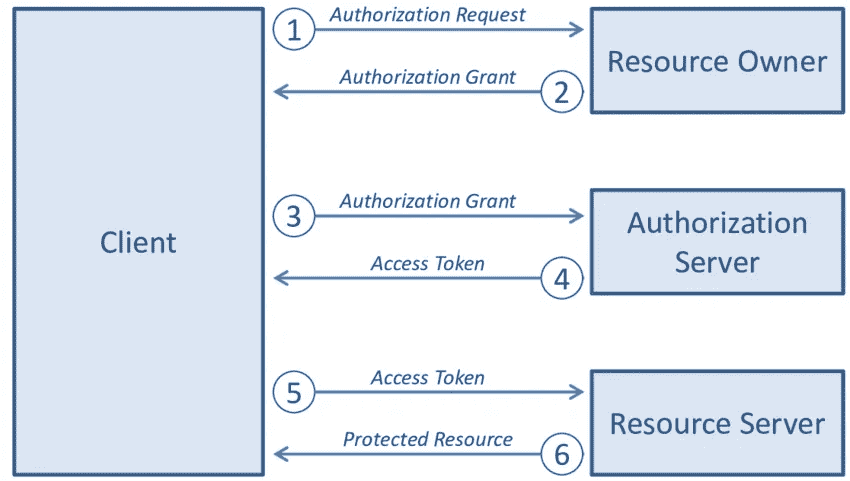
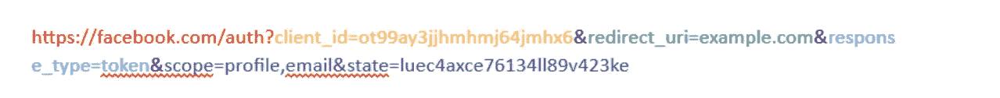
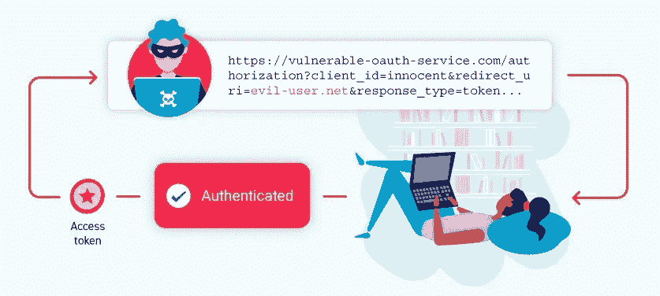
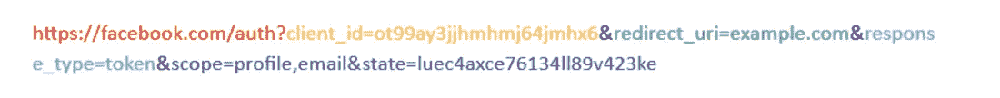
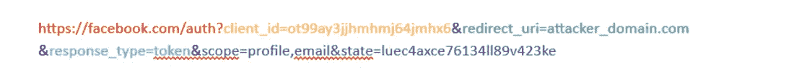

# OAuth 及其实现中的缺陷

> 原文：<https://infosecwriteups.com/oauth-and-the-flaws-in-its-implementation-74de16f115c0?source=collection_archive---------0----------------------->

[自由股票](https://unsplash.com/@freestocks?utm_source=unsplash&utm_medium=referral&utm_content=creditCopyText)在 [Unsplash](https://unsplash.com/@freestocks?utm_source=unsplash&utm_medium=referral&utm_content=creditCopyText) 上的照片

OAuth 是什么？

开放授权(也称为 OAuth)是一个开源框架，允许您在网站上创建帐户，而不必为每个网站创建不同的用户帐户。他们依赖可信的第三方网站，如脸书或谷歌，为他们执行身份验证过程。

它是:

1.  它用于登录网站，无需先建立帐户。
2.  通过这种方法执行资源共享。
3.  SSO 也在商业和企业网络中用于各种目的(单点登录)

想想是不是很耐人寻味？但是，有哪些方法可以在不创建帐户的情况下访问某些内容呢？让我们看看它对你有多有效。

【OAuth 是如何工作的？

[来源](https://goteleport.com/blog/how-oauth-authentication-works/)

为了简化工作流程，让我们首先隔离所涉及的实体。

它们是:

1.  用户(即您)
2.  您想要访问的应用程序
3.  授权服务器

例如，你去 example.com。要访问它的服务，该网站告诉你登录。但你不想创建一个单独的帐户，并处理创建一个新的用户帐户和记住密码的麻烦。但是有一个使用脸书登录的选项。因为你有一个脸书的账户，你选择了脸书，避免了创建新账户和记住不同服务的密码的痛苦。

您刚才所做的是使用 OAuth 完成的。它简化了我们的工作流程，我们应该感谢开发人员创建了这样一个框架。但是就像市场上出现的任何框架一样，基于它的配置方式，它可能会导致帐户接管。让我们来了解如何。

在上面的例子中，您是用户，example.com 是您想要访问的应用程序，因为您决定通过脸书登录，所以授权和资源服务器将属于脸书。

当您单击“使用脸书登录”按钮时，需要执行一系列步骤才能允许您访问 example.com

我们先来了解一下工作流程:

1.  你用脸书按钮点击登录。
2.  您将被带到脸书授权服务器，可能会要求您登录。
3.  一旦登录，它会要求你授权脸书提供您的详细资料(如个人资料图片，用户名等。)对 example.com 来说，范围是预先定义好的，facebook 会向你展示第三方网站需要的信息。
4.  一旦你点击“是”,它会将你重定向到 example.com，并向 example.com 发送一个独特的令牌，example.com 可以使用该令牌从脸书资源服务器获取您的详细信息。

让我们一个一个地看。

第一步:

当通过脸书登录时，您可能会发现您被重定向到一个 URL，看起来像这样:

让我们看一下参数:

1.  example.com 必须在 facebook.com 注册，才能使用脸书按钮登录他们的网站。然后，脸书将向 example.com 提供一个唯一的 id。这里是 ot 99 ay 3 jj hmj 64 jmhx 6。脸书跟踪所有活动，例如网站获取的访问令牌，以及客户端或第三方可以从脸书获得的信息等。
2.  redirect_uri:一旦脸书确认确实是你，并且你允许 example.com 分享你的个人资料和电子邮件，它就会重定向到这个 URL。脸书将使用访问令牌重定向到该 URL，该令牌提供第三方网站授权，以从您授权的脸书获取相应的信息。
3.  response_type:可以是代码类型，也可以是令牌类型。在令牌类型中，example.com 将直接从脸书的授权服务器获得一个令牌，通过这个令牌它可以从资源服务器访问你的账户信息。在代码类型中，example.com 将向 example.com 返回一个代码，然后脸书将使用该代码再次向脸书发出请求。脸书将检查代码，然后返回一个令牌。
4.  范围:这正是 example.com 希望从脸书得到的。我们可以看到，它要求我们的个人资料信息以及我们的电子邮件地址。它可以请求各种信息，比如性别、出生日期等等。
5.  状态:这执行 CSRF 令牌的功能。应该是随机选择的。

这一步的最终结果是您将被带到脸书，在那里您将首先登录，然后授予许可

第二步:

一旦您被重定向到登录页面，您可以输入您的脸书用户名和密码，一旦脸书验证用户名和密码，它会将您重定向到一个页面，显示该网站从脸书请求的信息，以及您是否同意允许该网站从脸书获取这些信息。在此之后，example.com 会生成一个附加到您的帐户的令牌，然后将其返回给 example.com/oauth,，可能会使用或保存该令牌以供将来使用。例如，让令牌为 token=w1kcu82_23ce

第三步:

exampe.com 将使用生成的令牌向脸书资源服务器发出请求，并获取您的个人资料和电子邮件以及您允许的其他信息。

**OAuth 错误配置导致的漏洞**

如果没有正确配置，不正确的 OAuth 实现可能导致完全的帐户接管。这不仅会危及用户的账户，还会因该事件给公司声誉带来损害。

[来源](https://portswigger.net/web-security/oauth)

让我们快速检查几个错误。

**重定向 URI**

看网址:

【https://facebook.com/auth?client_id=ot99ay3jjhmhmj64jmhx6】T4&redirect _ uri = example . com&response _ type = token&scope = profile，email&state = luec 4 axce 76134 ll 89v 423 ke

如果重定向 URL 定义不正确，例如，如果白名单太宽或配置不正确，重定向的性能会很差。假设 example.com 正在使用 OAuth 实现，用户通过令牌被定向到 example.com/oauth/token.php，但他们没有配置绝对 URL，而是简单地将 example.com 列入白名单，因此如果攻击者控制了几个页面，如个人资料或其他页面，他可以利用这一点将用户重定向到这些页面并捕获令牌，如下例所示。此外，当与开放重定向结合使用时，它变得非常有趣，攻击者可能会因此获得很大的优势。

[https://facebook.com/auth?client_id=ot99ay3jjhmhmj64jmhx6&redirect _ uri = attack _ domain . com&response _ type = token&scope = profile，email&state = luec 4 axce 76134 ll 89v 423 ke](https://facebook.com/auth?client_id=ot99ay3jjhmhmj64jmhx6&redirect_uri=attacker_domain.com&response_type=token&scope=profile,email&state=luec4axce76134ll89v423ke)

在用户完成身份验证后，上述 URL 会将用户重定向到 attack_domain.com。

**状态参数缺失或配置不当**

state 参数用作 CSRF 令牌，以防止 CSRF 被执行。当用户被转发到授权服务器时，以及当授权服务器将用户转回到网站时，需要确保用户与之前相同，并且请求是用相同的凭证做出的。因此，需要一个 CSRF 令牌，它可以由网站发行，然后在用户返回网站时由网站验证。所以当用户被重定向到授权服务器时，一个随机状态参数将被附加到请求中，当用户完成授权并被重定向回网站时，网站将检查令牌是否相同，如果不相同，将放弃请求。

**攻击场景:**

攻击者可以通过发送社交媒体请求来启动登录，然后自己执行登录。一旦网站生成授权令牌，攻击者就复制它，然后丢弃请求，确保令牌保持有效且不会过期。在大多数情况下，他以 CSRF 表单的形式向用户提供链接。点击链接后，攻击者的社交媒体帐户将链接到用户的帐户，攻击者将能够通过使用自己的社交媒体帐户登录来接管用户的帐户。

几个因素造成了它的脆弱性，包括缺少状态参数，状态参数的低熵，以及在一致的基础上产生相同的状态参数。

**结论:**

OAuth 极大地减少了我们必须做的工作量，但是也增加了开发人员需要做的工作量。这可能会导致大量的问题，从而导致事件过程中的重大转变，这可能会给公司带来令人不快的情况。

因此，开发人员注意上面列出的常见攻击场景是非常重要的。

## 来自 Infosec 的报道:Infosec 每天都有很多内容，很难跟上。[加入我们的每周时事通讯](https://weekly.infosecwriteups.com/)以 5 篇文章、4 个线程、3 个视频、2 个 GitHub Repos 和工具以及 1 个工作提醒的形式免费获取所有最新的 Infosec 趋势！