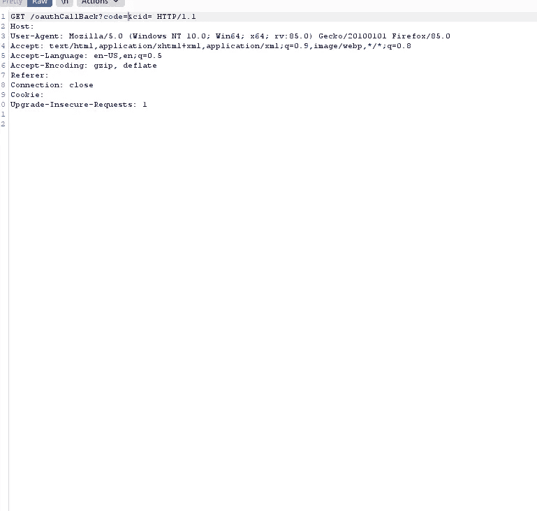
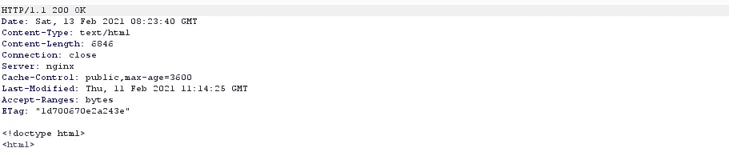
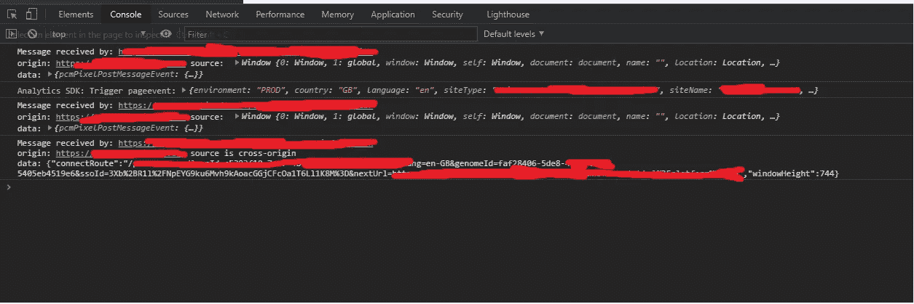
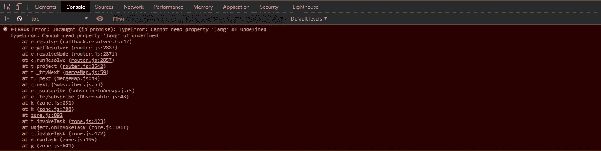
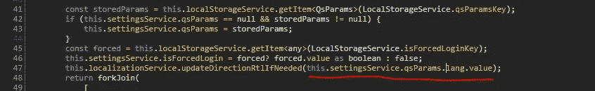
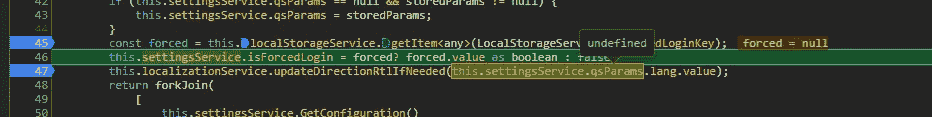
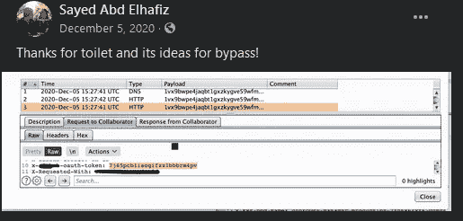
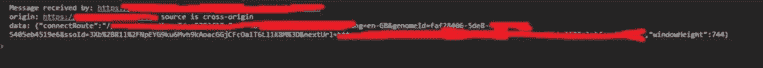
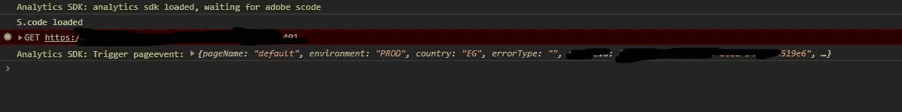

# OAuth 配置错误会导致帐户被完全接管

> 原文：<https://infosecwriteups.com/oauth-misconfiguration-leads-to-full-account-takeover-22b032cb6732?source=collection_archive---------0----------------------->

大家好，我的名字是亚瑟(在 CTF 也叫尼禄里)，我想与你们分享这个发现:)

因为这是 Bugcrowd 上的一个私人程序，所以我称它为`example.com`

我们开始吧

当我测试这个目标时，我想测试 OAuth 的缺陷，因为它有许多开发人员没有意识到的错误配置，
所以我发现这个目标允许用户使用经典的、基于密码的机制登录，或者通过使用 OAuth 将他们的帐户链接到社交媒体档案。

让我们来测试一下。

# OAuth 配置错误

首先，我打开打嗝，开始记录请求，然后开始点击按钮

链接我的个人资料后，我开始查看请求历史记录，发现了回拨请求



OAuth 回调

正如您所看到的，没有 csrf 令牌，在这种情况下，如果应用程序无法使用 csrf 令牌，攻击者可能会通过将受害者用户的帐户绑定到他们自己的社交媒体帐户来劫持受害者用户在客户端应用程序上的帐户。

让我们测试一下

在拦截请求并丢弃它之后，我创建了一个简单的 csrf POC 页面，该页面重定向到我们刚刚拦截的链接

回应是:



csrf POC 响应

所以是的，我们做到了:)，

所以，让我们打开我们的帐户，看看发生了什么…没什么，我像什么？！

我只是在想我该怎么花这笔奖金

查看我的个人资料页面，社交账户不在那里，

试了一次又一次，还是一样

所以我开始做一些分析来了解发生了什么

# 排除故障

我在调试过程中做的第一件事是使用简单的扩展记录所有窗口之间的通信，
你可以安装这个 [Chrome 扩展](https://github.com/opnsec/postMessage-logger)，我的控制台充满了数据，经过一些过滤后，我发现了这个漏洞



首先，当我点击链接按钮时，有一个发送了点击事件的[posmsg](https://developer.mozilla.org/en-US/docs/Web/API/Window/postMessage)

在按下 accept 之后，SDK 正在加载，漏洞开始出现。

因此，在采取链接操作之前，似乎需要先加载一些东西

我首先想到的是为什么链接不起作用

因此，当我打开上面的链接时，我注意到控制台中有一个错误



链接账户回拨链接出错

所以让我们追踪一下，这个由[STK](https://www.youtube.com/channel/UCQN2DsjnYH60SFBIA6IkNwg)制作的[视频](https://www.youtube.com/watch?v=FTeE3OrTNoA)会给你很大帮助

打开回拨解析器，我发现问题出在这一行



回调解析器

所以让我们放一些断点来看看为什么



回调解析器

如你所见，问题是`settingsService.qsParams`是`undefined`

所以我们不能继续，进程停止

因此，唯一可以写入的方法是，上面发送的 postMessage 包含填充该参数的数据。

再次查看上面，我注意到当 SDK 对点击事件进行分类时，我们得到了一个名为`language`的参数


我们得到的错误是因为`lang`不存在

所以我想这就是解决问题的方法。

但是我们如何做

我想到的第一件事是模拟邮件并发送一个类似的邮件，

幸运的是，该页面容易受到`clickjacking`的攻击，但这超出了范围，所以还没有修复

因此，让我们尝试创建`iframe`并发送一些数据，我阅读了这篇[文章](https://javascript.info/cross-window-communication)，这对于理解如何做非常有用，但问题是我不知道如何发送这个自定义事件。

此时，我放弃并创建了一个劣质的点击劫持页面，用户首先需要点击链接按钮，然后我将他重定向到 Oauth 链接。

幸运的是，triager 花了很长时间对它进行分类，并告诉我为什么有人会点击这个按钮，而且他的浏览器也遇到了问题，使他无法重现这个问题，并关闭了它，因为它是有效的错误，我很生气，但..我有时间重新考虑如何绕过这东西，

# 旁路，旁道

在这里，我读了我的朋友[赛义德](https://twitter.com/dPhoeniixx)(谁是伟大的黑客顺便说一句，跟随他的好文章)的帖子



所以我做了同样的事情，我想绕过它 XD

在跟踪回调之后，我开始询问发送的数据是来自静态页面，还是在我点击按钮时弹出的。

正如所料，数据来自弹出页面



connectRoute 是弹出端点

我注意到 popup 端点没有任何动态令牌或 csrf 令牌，所以我用我需要的参数制作了一个简单的 url

[https://examble.com/init?appId=staticID&郎= en-GB&genome id = static id&ssoId = any id&next URL = https % 3A % 2F % 2f example . com % 2F](https://examble.com/init?appId=staticID&lang=en-GB&genomeId=StaticID&ssoId=anyID&nextUrl=https%3A%2F%2Fexample.com%2F)

当我打开它时，SDk 已经初始化:)



加载的 SDK 和触发器页面事件

所以我创建了一个简单的 html 页面，它加载精心制作的 url，然后打开 Oauth 回调链接

```
<html>
<head>
 <title></title>
</head><body>
  <iframe src="[https://examble.com/init?appId=staticID&lang=en-GB&genomeId=StaticID&ssoId=anyID&nextUrl=https%3A%2F%2Fexample.com%2F](https://examble.com/init?appId=staticID&lang=en-GB&genomeId=StaticID&ssoId=anyID&nextUrl=https%3A%2F%2Fexample.com%2F)" onload="setTimeout(myFunction, 9000)" style="opacity: 0.0;"></iframe><script>
function myFunction() {
  document.write('<iframe name="cksl7" src="[https://example/oauthCallBack?code={code}&cid={id](https://example/oauthCallBack?code={code}&cid={id)}" style="opacity: 0.0;""></iframe>');
}
</script></body>
</html>
```

嘣，它成功了

另外，2FA 在 OAuth 登录中不可用，所以我们获得了帐户:)

# 结论

*   如果你没有尽力，就不要报告错误。
*   不要随意，试着去理解正在发生的事情，不要只是阅读大量的报道，照报道所说的去做。
*   在幕后有大量的时间、搜索和调试，所以总是试图找到问题的最大影响。

感谢大家的阅读，希望你觉得有用。

# 参考

*   [https://javascript.info/cross-window-communication](https://javascript.info/cross-window-communication)
*   https://vinothkumar.me/20000-facebook-dom-xss/
*   [https://OPN sec . com/2020/05/DOM-XSS-in-Gmail-with-a little-help-from-chrome/](https://opnsec.com/2020/05/dom-xss-in-gmail-with-a-little-help-from-chrome/)
*   [https://portswigger.net/web-security/oauth](https://portswigger.net/web-security/oauth)