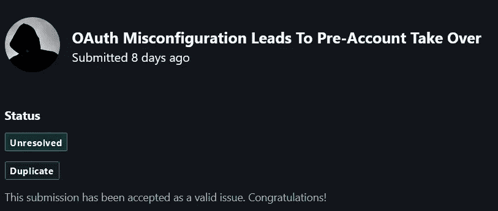

# OAuth 错误配置导致预帐户接管

> 原文：<https://infosecwriteups.com/oauth-misconfiguration-leads-to-pre-account-takeover-8f94c1ef50be?source=collection_archive---------2----------------------->

你好，

今天我要分享我在 Bugcrowd 私人程序上的一个有趣发现。因为这是一个私人项目，所以我将使用 target.com 作为网站名称。

在测试 target.com 时，我注意到用户可以使用谷歌创建并登录 target.com 账户。现在有两种方式注册到 target.com.By 电子邮件注册谷歌 oauth 登录现在在这里 target.com 有一个薄弱的认证验证，它不检查以前的帐户是否创建了相同的电子邮件时，我们使用谷歌登录到我们的帐户。所以基本上，这意味着有人可以使用未注册的受害者帐户进行注册。之后，受害者将使用 OAuth 登录。在这种情况下，验证过程被绕过，攻击者可以在此之后使用密码登录。

# **复制步骤**:

1.  去 https://target.com/signup/[用未注册的受害者账号注册。](https://badoo.com/en/signup/)
2.  之后，受害者将使用 OAuth 方法注册。
3.  这里发生的是，现在受害者可以轻松地使用受害者的帐户登录，绕过验证方法。

# 运筹学

1:使用电子邮件注册为 victim@gmail.com 的[注册](mailto:victim@gmail.com)

2:使用相同的电子邮件通过谷歌登录注册

3:用户将登录

4:此漏洞非常严重，因为如果受害者创建一个帐户，就会被利用并获得完全的帐户访问权限。

# 固定

当已经有另一个帐户使用相同的电子邮件创建时，不要让用户使用 oauth 进入，或者让用户进入，但让他知道其他人已经创建了一个帐户，如果不是他，请他更改密码。

# 影响

这里我们只需要一件东西，那就是电子邮件地址。只要知道我们可以接管受害者的帐户，那么这里的影响是相当高的。想象一下，如果你问的话，你甚至可以得到电子邮件地址，所以这不是一个困难的任务。但是由于 oauth 不验证真实用户，攻击者可以很容易地接管帐户。

我在 Bugcrowd 中报告了这个漏洞。很遗憾重复了。

# 参照

 [## [案例分析] OAuth 配置错误导致帐户被接管

### 大多数安全漏洞都是在集成部分出现的，原因是第三方软件的不正确实现

0xgaurang.medium.com](https://0xgaurang.medium.com/case-study-oauth-misconfiguration-leads-to-account-takeover-d3621fe8308b)  [## Vercel 在 HackerOne 上披露:Gitlab Oauth 错误配置导致...

### 总结:# # # #你好我发现你没有用令牌 Gitlab # # # #指定重定向哪个链接，让攻击者…

hackerone.com](https://hackerone.com/reports/541701) 

[https://portswigger . net/daily-swig/oauth-standard-exploited-for-account-take over](https://portswigger.net/daily-swig/oauth-standard-exploited-for-account-takeover)

***来自 Infosec 的报道:****Infosec 上每天都会出现很多让人难以跟上的事情。加入我们的* ***每周简讯*** *以 5 篇文章、4 个线程、3 个视频、2 个 Github Repos 和工具以及 1 个* ***工作提醒的形式免费获取所有最新的信息安全趋势！****[*https://weekly.infosecwriteups.com/*](https://weekly.infosecwriteups.com/)*