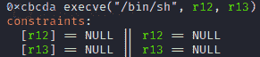
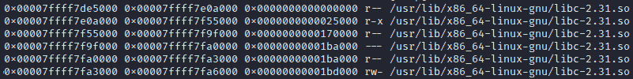
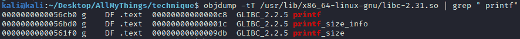
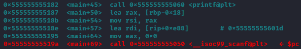
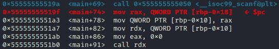
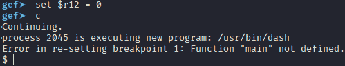

# 一个小工具既简单又强大！工具和例子。

> 原文：<https://infosecwriteups.com/one-gadget-is-easy-and-powerful-tool-and-example-b7b1af9e57f5?source=collection_archive---------2----------------------->


这个帖子来自我的个人网站:[https://pwnbykenny.com](https://pwnbykenny.com/)。以下是帖子的链接:[一个简单而强大的小工具！工具和例子。— Pwn By Kenny](https://pwnbykenny.com/en/2020/12/31/one-gadget-easy-powerful-tool-example/) 。你可以在那里找到比这里发布的更多的帖子。

# 1.内容

*   [你一定要选一个小玩意来开发](https://pwnbykenny.com/en/2020/12/31/one-gadget-easy-powerful-tool-example/#one-gadget-exploitation)
*   [著名的 one_gadget 工具](https://pwnbykenny.com/en/2020/12/31/one-gadget-easy-powerful-tool-example/#one-gadget-tool)
*   [一个具体的 CTF 示例向您展示如何逐步使用该工具](https://pwnbykenny.com/en/2020/12/31/one-gadget-easy-powerful-tool-example/#ctf-example)
*   [环境设置和介绍](https://pwnbykenny.com/en/2020/12/31/one-gadget-easy-powerful-tool-example/#environment-introduction)
*   [攻克 CTF 难题](https://pwnbykenny.com/en/2020/12/31/one-gadget-easy-powerful-tool-example/#conquer-ctf)
*   [总结](https://pwnbykenny.com/en/2020/12/31/one-gadget-easy-powerful-tool-example/#summary)

# 2.你肯定想选择一个小工具来开发

一个小工具是一行 C 代码:execve("/bin/sh "，0，0)；。显然，这段代码产生了一个外壳。如果您能够在内存中找到并运行它，您将获得一个 shell！看到了吗？轻松又强大！

幸运的是，它存在于 libc 中。而且大部分程序都用 libc！libc 是一个 C 库文件。one_gadget 工具会在这样的文件中找到所有出现的代码。

# 3.著名的 one_gadget 工具

(Linux OS)通过运行:gem install one_gadget 下载该工具。然后你就可以很容易地在一个终端中运行它:one _ gadget/usr/lib/x86 _ 64-Linux-GNU/libc-2.31 . so .参数是你的 libc 文件的路径。它可能会在您的机器上发生变化。这将产生以下输出:



execve("/bin/sh "，r12，r13)是一个小工具。在运行之前，您需要确保这两行约束都为真/满足。只有在满足约束的情况下，这个小工具才会变成 execve("/bin/sh "，0，0)。0xcbcda 是小工具在 libc 文件中的偏移量。为了知道小工具在内存中的地址，还需要知道内存中 libc 文件的基址:小工具的内存地址= libc 文件的内存基址+小工具在 libc 文件内的偏移量。

# 4.一个具体的 CTF 示例逐步向您展示如何使用该工具

# 4.1 环境设置和介绍

首先，下载这个[文件](https://drive.google.com/file/d/1sunenD-xl6pZrrd38TFAi3cfgbwu1sS3/view?usp=sharing)。它来源于这个[平台](https://buuoj.cn/challenges)>Pwn>【BJDCTF 2nd】one _ gadget。然后我们运行它，它产生以下输出:

```
here is the gift for u:0x7f784418acb0
Give me your one gadget:
```

如果对可执行文件进行反汇编，会发现礼物其实是 libc 函数 printf 的地址。它可能在每次不同的执行中改变。您还会发现，可执行文件要求您输入一个小工具的地址。可执行文件将在给定的地址执行一个小工具。现在让我们看看如何执行一个小工具。

# 4.2 征服 CTF 问题

以下是步骤:

*   给 gdb 安装某种支持命令“vmmap”的插件。我使用全球环境基金。
*   运行“广发问题”。现在 gdb 读入可执行文件。然后，用命令“r”运行 gdb 下的程序。接下来，按“ctrl + c”将控制权交还给 gdb。现在，我们可以使用命令“vmmap”来检查内存。在输出中，您会注意到类似下图的内容，它显示了 libc 文件的路径。这是这个程序中使用的 libc。现在我们想在 libc 文件中找到一些小工具。



*   退出 gdb 进程。现在运行“one _ gadget/usr/lib/x86 _ 64-Linux-GNU/libc-2.31 . so”。你需要改变你的道路。您将在输出中看到类似于第 3 节中的图片。所以现在我们有了一个小工具在 libc 文件中的偏移量:0xcbcda。
*   嗯，你还需要找到 libc 函数 printf 的偏移量。运行这个命令:objdump-TT/usr/lib/x86 _ 64-Linux-GNU/libc-2.31 . so | grep " printf "。您需要用自己的路径替换 libc 文件的路径。下图是输出。第一列是偏移量。所以 printf 的偏移量是:0x56cb0。



*   再次启动 gdb:gdb 问题。在 main: b main 设置一个断点。运行程序:r。现在你会看到程序在 main 函数处停止。用命令一次运行一行代码:n .如果你看到这样的输出:这里是给 u 的礼物:0x7ffff7e3bcb0，用我在第 3 节给你的公式计算一个小工具的地址:小工具地址= libc 基址+小工具偏移量= printf 地址— printf 偏移量+小工具偏移量= 0x 7 ffff 7 E3 BCB 0–0x 56 CB 0+0x cbcda = 0x 7 ffff 7 EB 0 CDA = 140737352764634。
*   继续用 n 运行程序，现在看下图。执行 printf 函数后，您将看到输出:给我一个小工具:。但是现在不是输入一个小工具地址的正确时间。您需要等待，直到红色 scanf 功能被执行。这时，您需要输入一个小工具地址。



*   运行 scanf 功能后，现在是输入您的小工具地址的时候了。请以十进制格式输入地址，而不是十六进制格式！我的情况是 140737352764634。从现在开始请小心，因为一些魔法即将发生。在 scanf 函数之后，下面是将要执行的机器码。从$pc 指针开始，你看到这三行代码在做什么？它们将存储器[rbp-0x18]中的值移动到 rdx。运行这三行代码后，您会发现 rdx 存储了一个小工具地址！然后“调用 rdx”去执行这个小工具！



*   运行代码，直到“调用 rdx”。但是不要运行“调用 rdx”！为什么？回想一下，在我们能够成功执行这个小工具之前，需要满足一些约束。约束条件是:r12 == NULL && r13 == NULL。现在我来观察一下它们是什么(如下图所示)。显然，r12 不为空。我们需要使用命令 set $r12 = 0 将其设置为 null。现在，如果您运行这个命令:p $r12，您会发现 r12 变成了 null。


*   现在我们可以运行“调用 rdx”了。这一次，我们继续执行命令:c . shell 将立即生成！



# 5.摘要

这篇文章用一个具体的 CTF 问题一步一步地向你展示如何找到并执行一个小工具，并最终生成一个外壳。如果你喜欢这个帖子，请帮我分享到你的社交媒体上。非常感谢！