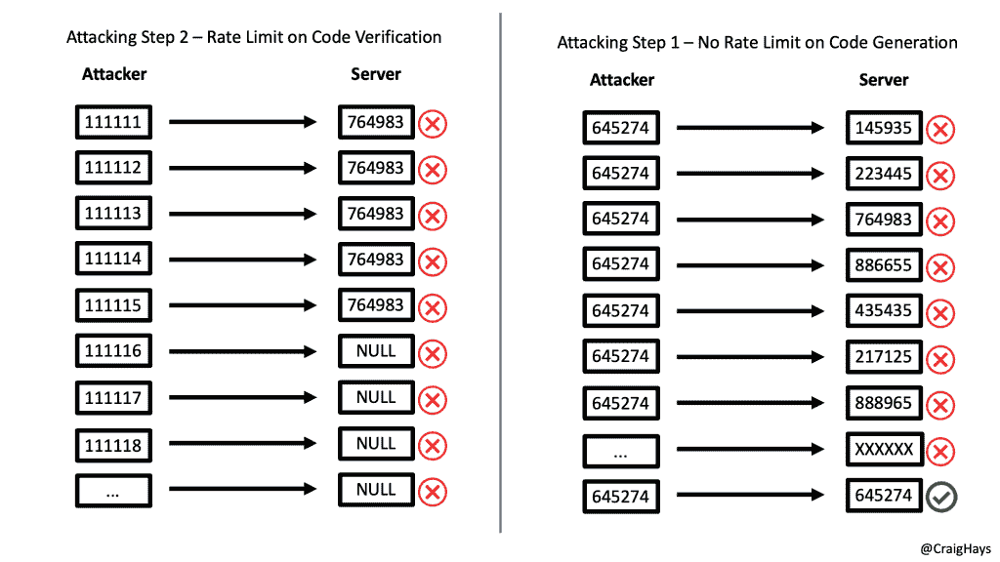

# 使用反向暴力攻击的一次性代码旁路

> 原文：<https://infosecwriteups.com/one-time-code-bypass-with-an-inverted-brute-force-attack-7c5a270196d1?source=collection_archive---------2----------------------->

“我们已经向您的电子邮件地址发送了一个六位数的代码。请在下面输入以登录。


阿尔文·列宁的照片在 [Unsplash](https://unsplash.com/s/photos/glass-ball?utm_source=unsplash&utm_medium=referral&utm_content=creditCopyText)

在测试 web 应用程序时，我们总是会看到它们。为了验证您的身份，该应用程序会向您注册的电子邮件地址或电话号码发送一个 6 位数字代码。目的是证明执行该动作的人也拥有该动作所附的电话或邮箱。没有权限，没有授权。给进程增加一点额外的安全性是第二个有用的因素。

如果你试着猜密码，它会在 5 次左右的尝试后失效。猜对的几率是 5/100 万，或者 1/20 万(0.0005%)。前 5 个之后的任何猜测都是无效的。这可以防止您强行使用从 000000 到 999999 的所有 1，000，000 个组合。

听起来很安全，对吧？嗯，有可能。但有时开发人员会在他们的假设中犯错误。这是我最喜欢测试的一个错误，以及如何利用它。

# 一次性代码或 pin(OTC 或 OTP)的标准使用

在正常使用中，用户执行一个操作，生成一个一次性代码，发送到他们的电子邮件地址或电话号码。他们拿起手机，读取密码，第一次就输入正确。任务完成。

当攻击者试图对受害者的帐户做同样的事情时，代码会被发送到所有者的设备。攻击者看不到代码，他们唯一的选择是试图猜测它。他们输入 5 个不同的代码，服务器使生成的 OTC 无效。无论从现在开始发生什么，即使他们尝试了剩下的 999，995 种可能的组合，也没有一种有效。如果他们生成另一个不同的代码，他们仍然只有 5 次尝试。

对尝试次数的限制已经奏效。

上面的问题是，它只限制了对单个代码的猜测次数。它可以防止你对一个代码进行 1，000，000 次猜测并强行进入。

我最喜欢的攻击之一是强行生成代码，而不是代码本身。它是这样工作的。

# 我们只需要一个匹配

对于 OTC 验证，我们不需要攻击者猜测服务器生成的代码，我们只需要攻击者和服务器都同意匹配相同的 6 位数。

OTC 验证在服务器端是一个两步过程。

1.  生成 OTC 并将其发送给账户所有人
2.  从用户处接收 OTC，并将其与生成的值进行比较

标准的强力攻击是在服务器端对一个代码尝试所有 1，000，000 个六位数代码。通过将生成的代码设置为在 5 次尝试后过期，开发人员对步骤 2 应用了速率限制。

相反，攻击者可以通过使用相同的静态代码并迫使服务器生成多达 200，000 次的新代码来颠倒这种逻辑。这利用了步骤 1 中速率限制的缺乏。

为简单起见，下面是一个只有一个代码 645274 的示例:



对一次性代码验证和生成的暴力攻击进行比较

据统计，对 6 位数字代码进行 5 次尝试匹配的几率是 200，000 分之一。因此，通过在任何地方循环多达 200，000 次迭代，我们可能会看到攻击者和服务器同意匹配，绕过第二个因素的验证。

这种攻击的循环如下:

```
While (NotAMatch){ 
  GenerateNewCode() 
  SendCode1() 
  SendCode2() 
  SendCode3() 
  SendCode4() 
  SendCode5() 
}
```

# 计算机、随机性和选择要使用的 OTC

因为计算机在生成随机数方面很糟糕，所以这种几率可能远远高于 20 万分之一。在测试这种类型的 bug 时，我首先确定在生成的一次性代码过期之前我们尝试了多少次。然后，我生成相同数量的不同一次性代码，通常在 5 到 10 之间。然后我将所有这些代码用于我的静态列表。

通过这样做，我知道我正在使用计算机已经生成的代码。电脑不擅长产生随机数。实际上，math.random()实际上只是一个很长的、预先确定的列表中的一个值，可能会对它执行一些进一步的计算。如果我知道一个代码已经生成过一次，我就知道它可以再次生成。

# 影响

像这样的错误的影响取决于一次性代码保护的是什么。如果是登录帐户，您可能会发现一个 MFA 旁路。如果它是为了验证你的电子邮件地址或电话号码，它可能只是一个次要控制的旁路。如果那个“验证过的”电子邮件地址或电话号码后来被用来将一个账户与另一个账户联系起来，那就完全是另外一种情况了，而且可能会更加严重。

如果你发现了这样一个 bug，在把你的报告提交给 bug 奖励计划之前，要创造性地探索潜在的影响。您对影响的描述可能是低评级漏洞和关键报告之间的唯一区别。

与我私人电子邮件列表中的其他人一起关注我的最新文章、视频、想法等。

*原载于 2021 年 6 月 18 日*[*【https://craighays.com】*](https://craighays.com/one-time-code-bypass-with-an-inverted-brute-force-attack/)*。*