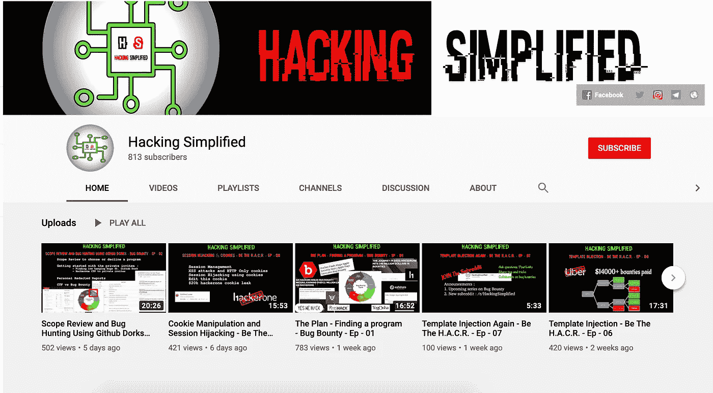
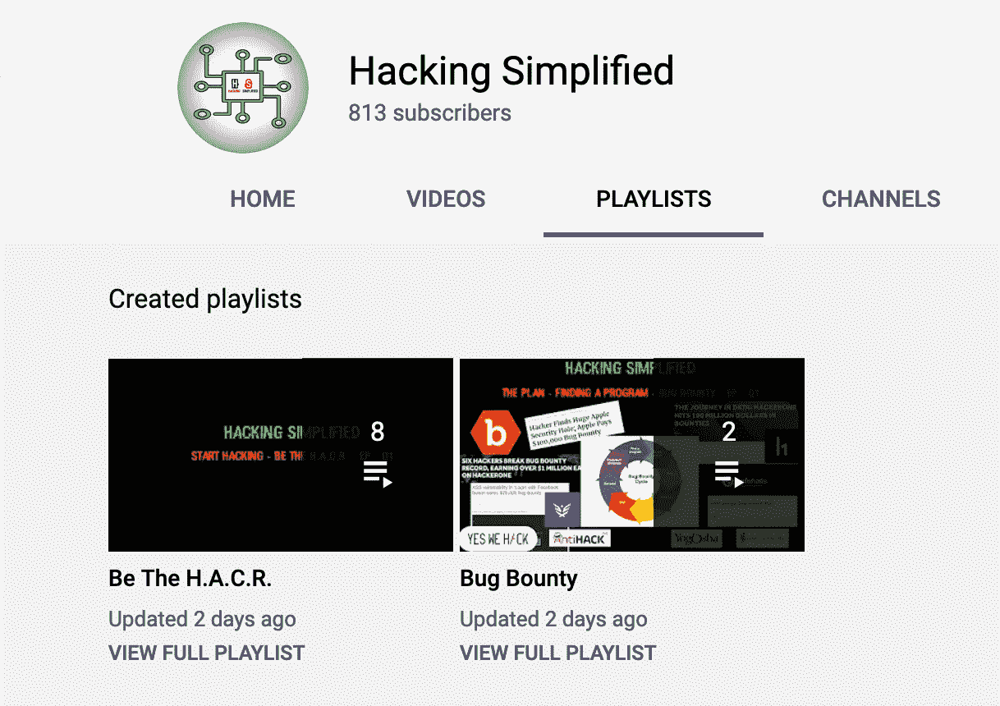
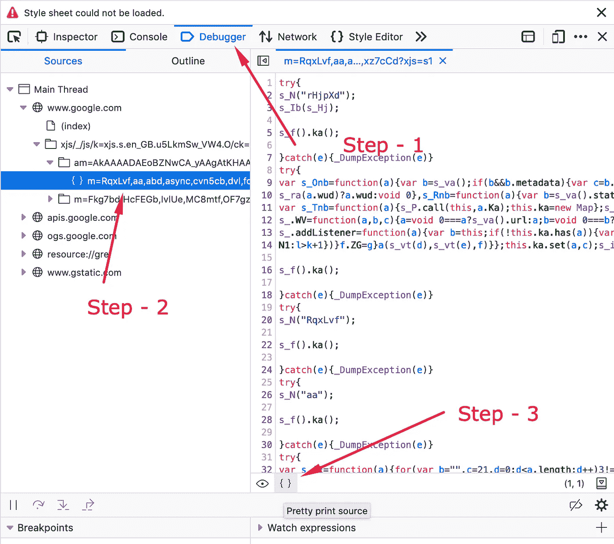
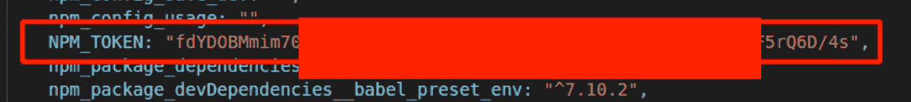
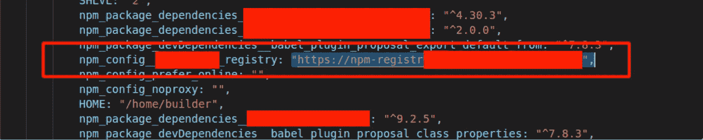
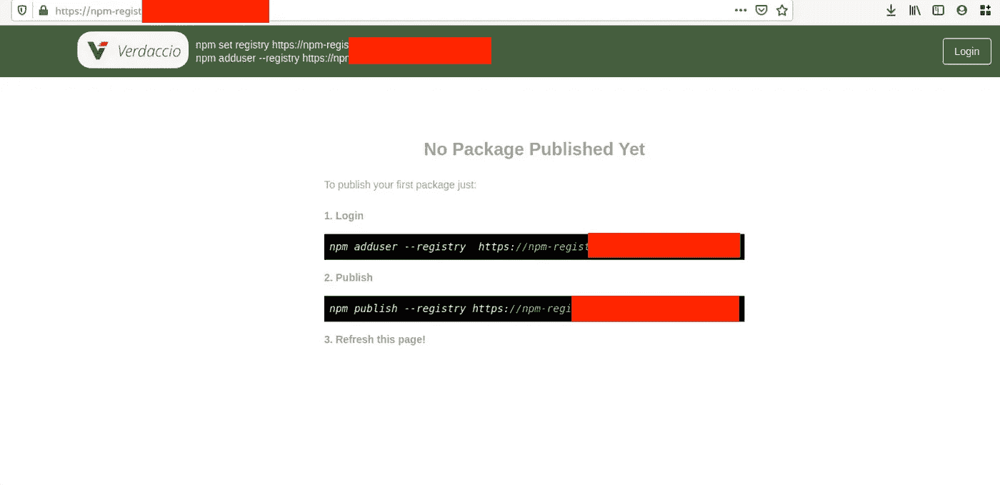
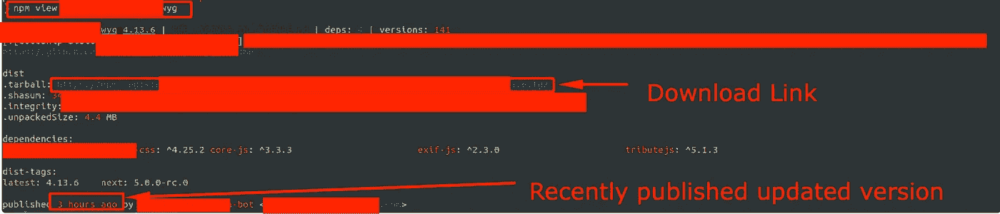
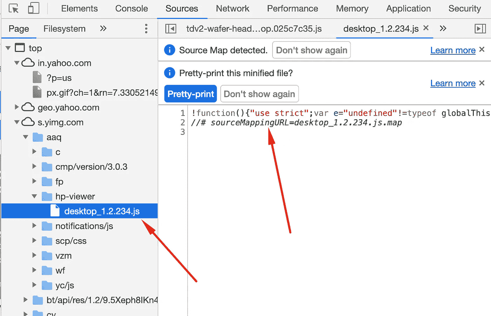
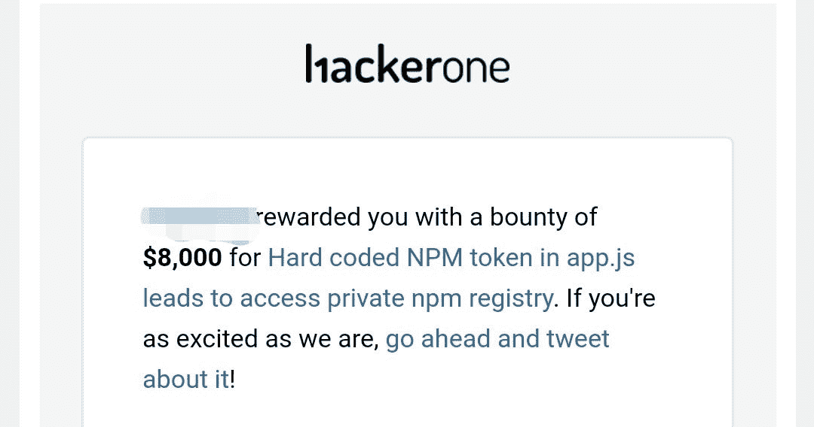
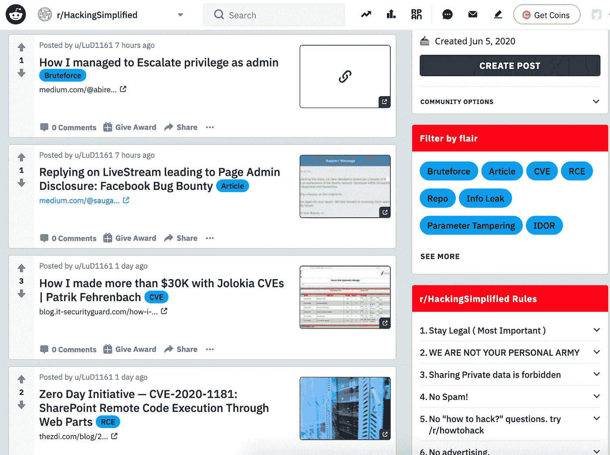

# 一枚泄露所有秘密的代币:一枚 8000 美元 NPM 代币的故事

> 原文：<https://infosecwriteups.com/one-token-to-leak-them-all-the-story-of-a-8000-npm-token-79b13af182a3?source=collection_archive---------0----------------------->

不久前，我开了一个 youtube 频道，[](https://www.youtube.com/channel/UCARsgS1stRbRgh99E63Q3ng)**。**

****

**黑客攻击简化的 Youtube 频道**

**所以*在制作了一个月关于网络安全攻击基础的视频*后，我在频道上开始了另一个系列，即**bug bounty 系列**。在这里，我要谈谈昆虫赏金的 7 个阶段以及如何去做。从那时起，我开始制作关于 bug bounty 的视频，所以我想提高我的 bug bounty 技能和自动化工具。**

****

**两个播放列表**

**我上一次浏览 hackerone 做一些 bug bounty 是在 2019 年 1 月的一段时间。但是在过去的一个月里，我读了很多报告，这些报告再次点燃了我的兴趣。我开始查看 hackerone 程序目录和我的私人邀请，寻找一个满足我在上一个视频中提到的所有条件的程序:“[使用 Github Dorks-Bug Bounty-Ep-02](https://youtu.be/2cTG3vzP50M)进行范围审查和 Bug 搜索”，它们是:**

1.  **已解决的报告数量**
2.  **资产**
3.  **支出**
4.  **响应效率**
5.  **分流时间和奖励时间(个人选择)**

****

**这个程序碰巧把所有的星星都对齐了:)**

1.  **已解决的报告数量—超过 550**
2.  **资产—所有子域**
3.  **支出—临界为 1000-4000 美元，最低为 50-200 美元**
4.  **响应效率— 90%**
5.  **分流时间——2 天，赏金时间——10 天**

**因为最近我制作了一个关于模板注射的视频，所以这是我关注的主要领域。我输入了`{{7*7}}`和其他有效载荷，这与几乎每个输入字段上使用的模板引擎有关。但是这没有用。**

**然后我尝试使用 autorize 查找 IDORs 和不正确的访问控制检查，也没有太多运气。**

**我开始查看其他端点的 JS 文件，一些秘密被泄露了。首先下载所有的 JS 文件，然后开始寻找秘密和 url 端点。**

**要下载所有 JS 文件:**

1.  **如果你有 BURP Suite pro，你可以直接将所有脚本提取到一个文件中:但是这将所有文件提取到一个包含 js url 的文件中，这在大多数情况下可能是好的，但是我也希望它们在各自的文件中。**
2.  **因此，我首先提取所有 JS urls，然后编写一个小的 bash 脚本来获取所有这些文件及其各自的名称:**

```
cat urls.txt | xargs -I{} wget "{}"# Assuming urls are clean i.e. they don't have any extra parameters in the end
# if the url is like this : [https://storage.googleapis.com/workbox-cdn/releases/5.1.2/workbox-cacheable-response.prod.js?v=123122](https://storage.googleapis.com/workbox-cdn/releases/5.1.2/workbox-cacheable-response.prod.js?v=123122)
# Then you need to cut the part after '?' like the followingcat urls.txt | cut -d"?" -f1 | xargs -I{} wget "{}"
```

**Tomnomnom 的`gf`工具在这里派上了用场。使用`gf urls`获取 url 端点，我发现私有 IP 泄露:`http://172.x.x.x`。我试着在泄漏的地方附近寻找，发现那里有一个`NPM_TOKEN`值。立即开始寻找利用它的方法。我没怎么用过`npm`，只知道是`node package manager`。在开发`VueJS`应用程序时，我曾用过一次。**

**经过一段时间的研究，我了解到以下情况。 [CI，即持续集成系统，如 Jenkins pipelines 或 Travis CI 等使用这些令牌以自动化方式构建和部署 webapp。此令牌帮助他们获得对 npm 私有存储库的访问权限。](https://docs.npmjs.com/about-authentication-tokens)**

**2.[不同类型的令牌，如只读和发布、只读、CIDR 白名单，即只能从指定的 IP 地址范围使用的令牌](https://docs.npmjs.com/creating-and-viewing-authentication-tokens)**

**3.[如何使用 npm 令牌](http://blog.shippable.com/using-npm-private-modules-in-your-ci-workflow):因此您的 npm 令牌在`.npmrc`文件中应该是以下格式—**

```
registry=https://registry_link_here
//registry_link_here/:_authToken=auth_token_here
```

**还有几个…**

**我尝试在我的`.npmrc`文件中使用这个令牌访问 npm 注册表，如下所示:**

```
registry=[https://registry.npmjs.org](http://registry.npmjs.org/)
//[registry.npmjs.org](http://registry.npmjs.org/)/:_authToken=auth_token_here
```

**但是徒劳无功。我无法得到`npm whoami`的回复，如果令牌有效的话，我应该得到回复。一些文章还建议您也可以在`.npmrc`中以加密形式保存`NPM_TOKEN`值。所以，我断定这一定是一个加密的令牌。这是周三——黑客攻击这个目标的第一天。**

**第二天下班后，晚上 8 点左右，我又开始看这个节目。今年一月早些时候，我在[阅读关于 CSWH，即跨站点 Websocket 劫持](https://www.christian-schneider.net/CrossSiteWebSocketHijacking.html)(然而，这可能在现在的某个时候无法利用，见[这个](https://blog.reconless.com/samesite-by-default/))这个程序使用 websockets。所以，我开始调查。**

**CSWH 的条件是 websockets 应该只使用 cookies 进行通信，就像任何其他 CSRF 攻击一样。**

**我在 [BURP suite labs](https://portswigger.net/web-security/websockets/cross-site-websocket-hijacking/lab) 上练习，刷新我 6 个月前学过的东西。这个网站也有类似的情况，只需要 cookie 就可以启动和运行 websocket 通信。**

****

**CSRF 但在 weboscket 请求**

**所以我试着泄露 websocket 消息，但是没有成功。经过更仔细的检查，我发现它也使用了一个`nonce`,这个 nonce 是由服务器在一个不同的请求中给客户机的。因此，基本上这是一个 CSRF 令牌，通常用于挫败 CSRF 的攻击。然而，在寻找 CSWH 时，我发现了他们的 CSRF 用法中的一些其他错误。在同一天报告了这些。在另一篇文章中会有更多的介绍。**

**星期五——第三天——在花了大约两个小时没有发现任何东西之后，我想再次回头看看`NPM_TOKEN`。我找到了 JS 文件，并在浏览器中对其进行了*un-ugified*:**

****

**Firefox 漂亮的打印**

****

**基于 Chromium 的浏览器漂亮的打印**

**你也可以在网上做:[https://unminify.com/](https://unminify.com/)**

**大约有 17k 行，但是因为我有一些查看这些的经验，所以我知道这些大部分是由 webpack 生成的代码。所以我浏览了一下代码，找到了一些有趣的东西，大部分都在我找到`NPM_TOKEN`值的地方附近。**

****

**NPM 令牌**

**在那里我发现了一个私人注册链接，然后我意识到，为什么我没有想到这一点😅。**

****

**私人回购链接**

****

**私人注册处的首页**

**我很快将`.npmrc`文件中的注册表值替换为:**

```
registry=https://private_registry_link_here
//private_registry_link_here/:_authToken=auth_token_here
```

**现在我对`npm whoami`的命令得到了回复:`srv-npm-registry-ci`**

**然后，我尝试获取私有 npm 注册表中所有软件包的列表，但这是不可能的，也就是说，你不能只列出私有注册表中的所有软件包。至少我找不到一条路，让我知道这是否可能。因此，我尝试使用以下命令检索公司的私有代码:**

```
npm view private_repo
npm get private_repo
```

****

**npm 视图命令的输出**

**现在，你可能会问，我是怎么知道私人回购协议的名字的。repos 被编译成一个 js 文件，如果源映射可用，那么任何浏览器都可以在 inspect 元素的 sources 选项卡中轻松地将它们解耦，如下所示:**

****

**如果源映射可用，那么分解成单独的组件是可能的**

**因此，从那里我得到了一些未统一的私有 js 文件的源代码，在这些文件中包含了一些其他的内容，这使我可以访问这些内容，等等，我可以下载他们几乎所有的源代码。**

**我没有检查密钥是否有发布权限，因为这需要我在他们的私有注册表上发布一个包，我认为这是不明智的。此外，它不应该有发布权限，因为它是 CI 关键字，但你永远不会知道，人们通常不会遵循最小特权的做法。**

**这份报告在 17 个小时内得到了审理，并在 7 天内获得了奖励。公司处理得非常专业。我已经问过他们这些是如何在 js 文件中泄露的，还在等待他们的回复。**

****

**最高奖金是 4000 美元，但他们为此颁发了奖金**

# **关键要点:**

1.  **在 JS 文件中寻找秘密——尝试围绕它构建自动化**
2.  **学会使用你的浏览器开发工具:它们会在很多方面提供帮助**
3.  **保持对工具的更新——即使你没有做 bug 奖励，也可能对你的其他工作有所帮助。**
4.  **坚持是关键:)**

***附言***

**这里有一个视频记录，它讲述了这个记录以及一些打嗝自动化来找到这些秘密标记:【https://youtu.be/9LBl-uFiYUE
T3**

**我开始寻找其他的东西，模板注入，最后发现了 6 个其他的 bug，其中 3 个是重复的。总而言之，这是一次关于 websockets 的极好的学习经历，我也将很快发表一篇相关的文章。**

***希望这值得你花时间，来看看我的 youtube 频道:简单来说，我每个周末都会发布* ***视频*** *。***

**YouTube 频道:[黑客攻击简单化](https://www.youtube.com/channel/UCARsgS1stRbRgh99E63Q3ng)**

**加入社区，分享、讨论、学习和成长。我每天在这里发布 3-4 篇关于 bug bounty 和一般网络安全的文章。**

****

**hacking 简化子编辑**

**在这里加入子编辑:[黑客简化](https://www.reddit.com/r/HackingSimplified/)**

**电报在此:[黑客简化](https://t.me/HackingSimplified42)**

**推特: [@AseemShrey](http://twitter.com/AseemShrey)**

**感谢阅读:)**

# **更新:**

**我从 [@darthvader_htb](https://twitter.com/darthvader_htb) 那里得到了一个关于下载 js 文件的好建议。你可以使用 tomnomnom 的另一个工具来做这件事:
[https://github.com/tomnomnom/fff](https://github.com/tomnomnom/fff)**

```
cat urls.txt | fff
```

**我不建议安装过多的工具而不使用内置工具。但是，用法可能会有所不同。**