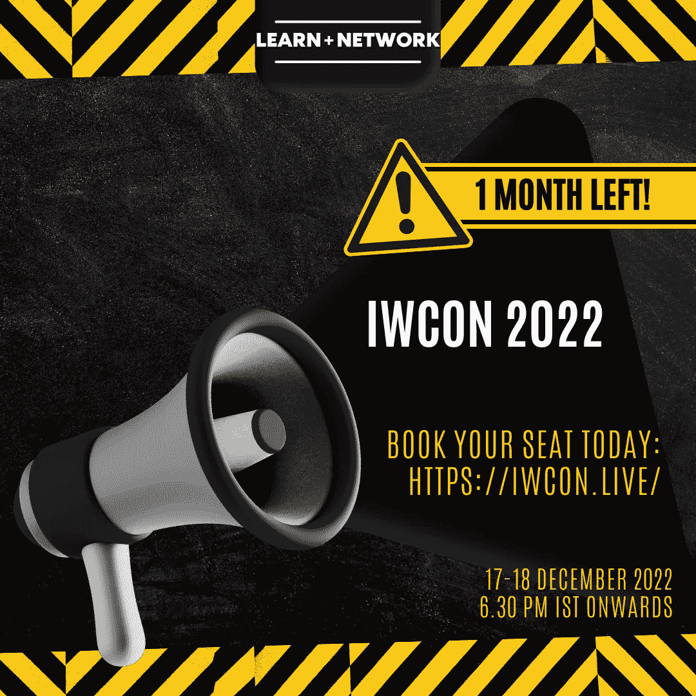
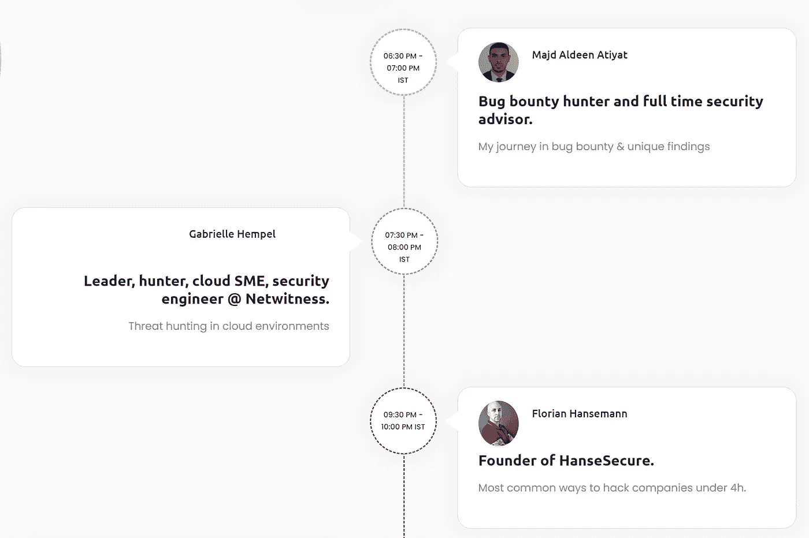
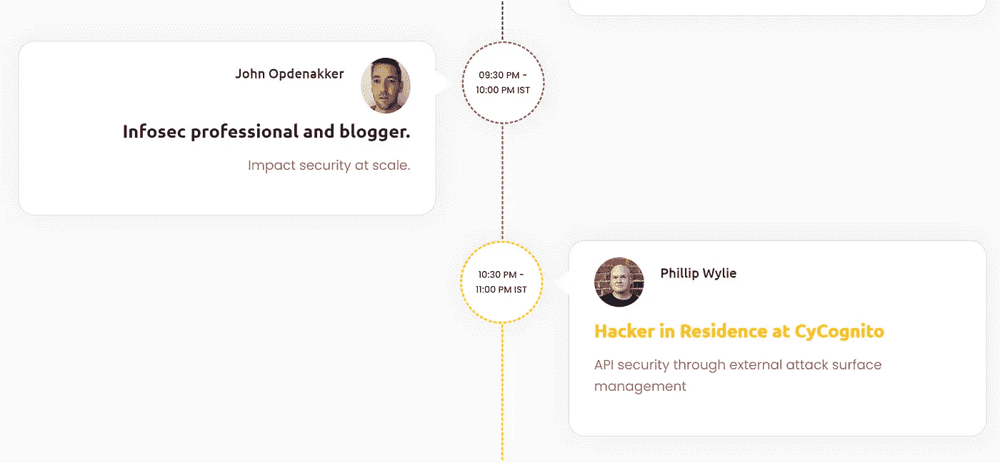

# 距离 Infosec 虚拟网络安全会议只有 1 个月了

> 原文：<https://infosecwriteups.com/only-1-month-left-for-infosec-writeups-virtual-cybersecurity-conference-525cc5973be1?source=collection_archive---------1----------------------->

## 预订 IWCON2022 的门票了吗？

还剩不到 30 天。在这里给自己留一个位置[。](https://razorpay.com/payment-button/pl_K8cxPtmUyBH2PC/view/)

你好

离 [**IWCON 2022**](https://iwcon.live/) 还有不到 24 小时 Infosec 书面报道的虚拟网络安全会议和网络活动。

你预订座位了吗？

点击 查看我们众星云集的演讲者名单 [**。**](https://iwcon.live/)

# 第一天先睹为快

让我们看看 2022 年 12 月 17 日的超值会议。

1.  [**Majd Aldeen ATI yat**](https://twitter.com/Th3G3nt3lman)**(**Bug 赏金猎人兼全职安全顾问)在 Bug 赏金&的旅途中的独特发现。
2.  [**Gabrielle Hempel**](https://twitter.com/gabsmashh)**(**安全工程师@ Netwitness)关于云环境下的威胁追踪。
3.  [**Florian hanse Mann**](https://twitter.com/CyberWarship)**(**hanse secure 创始人)关于 4 小时以下黑公司最常见的方法。
4.  [**John Opdenakker**](https://twitter.com/j_opdenakker)**(**Infosec 专业人士兼博主)论规模化影响安全。
5.  [**Phillip Wylie**](https://twitter.com/PhillipWylie)**(CyCognito 的常驻黑客)通过外部攻击面管理实现 API 安全。**

# 不要错过我们超酷的网络空间

每次 30 分钟的会议之后都有现场问答和交流。

想知道 infosec 中最酷的人之间的虚拟网络是如何工作的吗？点击 查看现场演示 [**。**](https://www.youtube.com/watch?v=fqJ7T1fW3zU)

你可以期待像这样的 25 人容量的房间，在那里你可以-

*   四处逛逛，和人们聊聊天
*   将您的个人资料图片添加到带有您姓名首字母的小圆圈中
*   添加一行简历、你的 Twitter 个人资料链接等。

这将会是一个很酷的认识新朋友的方式，扩大你的关系网，找到强大的关系，以及潜在的工作或实习机会。

激动吗？

[***现在就预订机票吧！***](https://razorpay.com/payment-button/pl_K8cxPtmUyBH2PC/view/)

IST 时间 12 月 17 日下午 6:30，IWCON 2022 上见。

最佳，
编辑团队
Infosec 报道