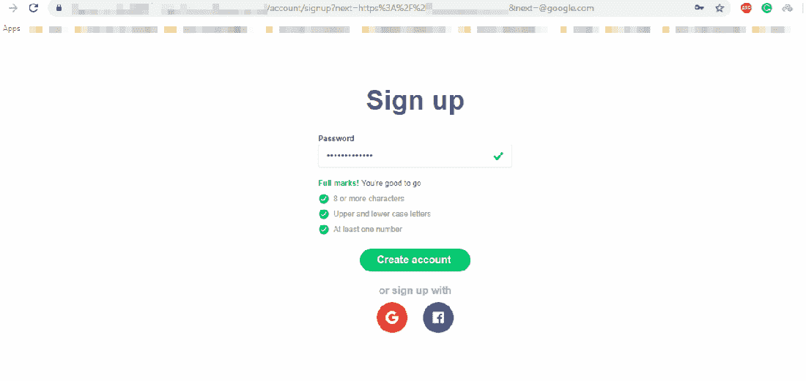

# [Open redirect]开发人员很懒(或者可能很忙)

> 原文：<https://infosecwriteups.com/open-redirect-developers-are-lazy-or-maybe-busy-6c51718b10e4?source=collection_archive---------1----------------------->

这次我要写一个我在一个私人程序中发现的开放式重定向错误。bug 本身是一个唾手可得的果实，但报告它的过程足够有趣。

首先，让我们谈谈 bug 本身。🙂

让我们称这个域为 example.com。我先注册了一个账户，然后四处逛逛。然后我找到了一个网址:

```
[https://www.example.com/account/login?next=https%3A%2F%2Fwww.example.com](https://www.example.com/account/signup?next=https%3A%2F%2Fwww.example.com&next=@google.com)
```

"测试打开重定向的时间到了。"我告诉自己。

首先，我尝试了最简单的有效载荷:[https://www.example.com/account/login?next = https % 3A % 2F % 2f Google . com](https://www.example.com/account/signup?next=https%3A%2F%2Fgoogle.com)。没用。然后我尝试了 next=https://example.com@google.com，//google.com，javascript:alert(1)(将一个开放的重定向转向 XSS)等。但是这些都不起作用。然后 HPP (HTTP 参数污染)出现在我的脑海里:

```
[https://www.example.com/account/login?next=https%3A%2F%2Fwww.example.com&next=https%3A%2F%2Fgoogle.com](https://www.example.com/account/login?next=https%3A%2F%2Fwww.example.com&next=https:%3A%2F%2Fgoogle.com)
```

我没有期待什么，相反，我只是试了一下，看看会发生什么。然后我的地址栏变成了

```
[https://example.com%2Cwww.google.com](https://example.com%2Cwww.example.com)
```

我的浏览器向我抛出错误信息。

那一刻，我知道我可以利用它。第二个**下一个**参数的值没有像第一个那样被过滤。%2C 只是一个逗号，所以 example.com 处理这个请求的机制基本上是用逗号连接两个**和下一个**，而不过滤第二个。

我这样做又怎么样呢？

```
[https://www.example.com/account/login?next=https%3A%2F%2Fwww.example.com&next=**@**google.com](https://www.example.com/account/login?next=https%3A%2F%2Fwww.example.com&next=@google.com)
```

注意，现在第二个参数中有一个“@”。所以最后 example.com 会把我重定向到 https://example.com,@google.com，实际上是去 google.com。所以现在我要报告一个成功的开放重定向。(我曾试图深入挖掘，并利用它来更严重的错误，错误我失败了😦)



第二天被告知是重复的，bug 被修复。😦。但是我想到了一个主意:你为什么不检查一下他们是否已经完全修好了？也许他们在修理过程中犯了一些其他的错误！

所以我去检查一下。我在上面的登录 URL 上尝试了很多有效载荷，但是我不能再利用它了。我开始说服自己，他们已经很好地解决了这个问题，我不再需要打开重定向错误。

等等，“没有更多的开放重定向错误”？我可以检查其他端点的开放重定向错误！

因此，我没有登录页面(这是固定的)，而是尝试了注册页面，如下所示:

```
[https://www.example.com/account/signup?next=https%3A%2F%2Fwww.example.com&next=@google.com](https://www.example.com/account/signup?next=https%3A%2F%2Fwww.example.com&next=@google.com)
```

我成功了！


所以结论是，他们的开发人员在修复登录页面时忘记了注册页面。

然后我拿到了赏金。开发人员很懒，或者可能只是很忙。

赏金奖励:150 美元

*备注:在我之前发现登录页面 bug 的 bug 赏金猎人，他也忘了在注册页面检查同样的 bug。罗尔。猎人也懒！