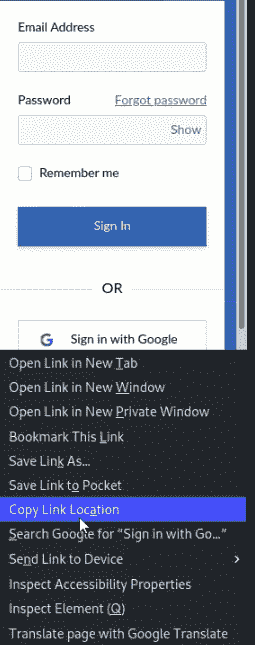
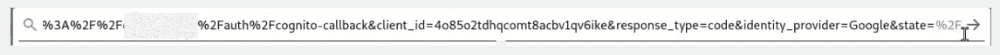
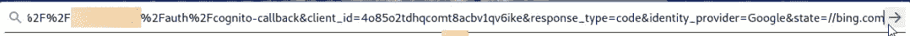
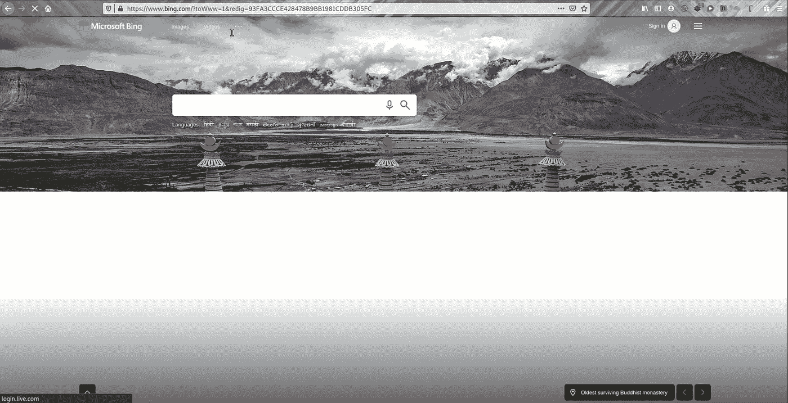

# 通过 google 登录在目标中打开重定向

> 原文：<https://infosecwriteups.com/open-redirect-in-target-via-google-sign-in-d42b3cb633d?source=collection_archive---------1----------------------->

两分钟的阅读📖

所以，我们先来关注一下什么是**开放重定向漏洞**。

# ***这是什么漏洞？*** *🤔*

**当应用程序或软件**允许远程用户/攻击者**通过操纵原始网站中的 **URL 参数**将应用程序**重定向到任意恶意网站**，从而允许网络钓鱼攻击时，就会出现开放重定向漏洞**。web 应用程序未正确验证 URL 参数**，这有时会非常危险。**

# ***我得到的 BUG……***🐞

现在，我将分享我是如何在目标中获得一个**开放重定向漏洞**(假设是 abc.com，但不透露目标)。

首先，我的帐户已经在目标站点上创建了。于是，我转到网站的登录页面，通过谷歌按钮复制了登录的链接，然后粘贴到另一个选项卡中。

原网址一瞥:

之后，我尝试在 **Google & state** 的参数中注入恶意网址链接，至于 ex:bing.com

被操作的 URL 链接如下所示:

好哇！！😊该网站已成功重定向到 URL 中精心制作的恶意网页。💵💵

📝**注:****get based Google 重定向漏洞**是一个 **P4 类型的 bug** ，但是在中通过 **google sign** 发生的开放重定向被认为是一个 **P2 bug。**

这是一个很容易发现的错误，不要忘记检查有开放重定向的 xss/sql 注入。我也会分享我在 xss 上的发现。

直到那时再见…

# 黑客快乐！！😎