# 开放重定向会带来丰厚的回报

> 原文：<https://infosecwriteups.com/open-redirection-leads-to-a-bounty-d94029e11d17?source=collection_archive---------0----------------------->

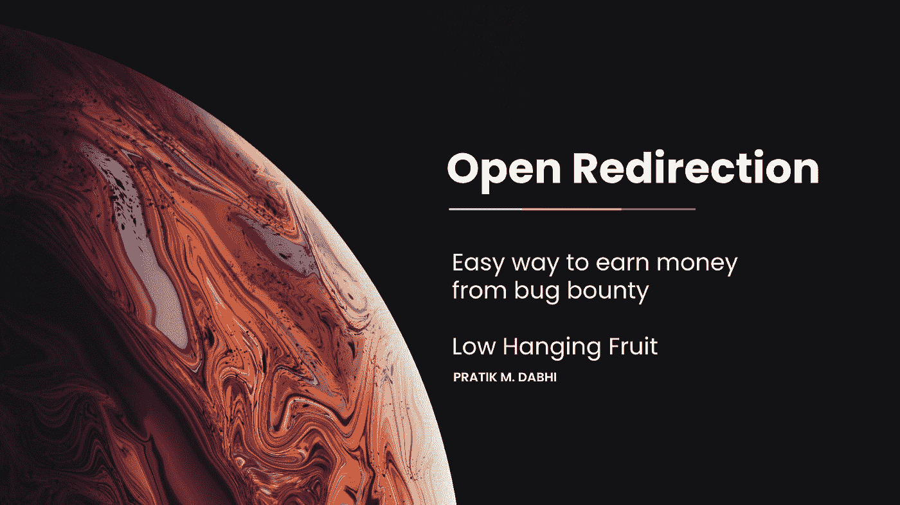

嘿，伙计们，这边来。在这篇文章中，我将分享我的一些开放重定向搜索，我使用什么资源来找到开放重定向，以及我如何使它的严重性更高。所以让我们开始吧。

什么是开放重定向漏洞？

根据[netsparker.com](https://www.netsparker.com/blog/web-security/open-redirection-vulnerability-information-prevention/)的说法，“开放重定向是指网络应用或服务器使用未经验证的用户提交的链接将用户重定向到给定的网站或页面。即使让用户决定他希望被重定向到哪个页面看起来是无害的行为，但这种技术如果被利用，可能会对应用程序的安全性产生严重影响，尤其是在与其他漏洞和技巧结合使用时”。

开放的方向是低垂的果实。如果你寻找它

一些资源

https://twitter.com/jae_hak99/status/1279303602532528128

https://twitter.com/search?q=openredirection[src = typed _ query](https://twitter.com/search?q=openredirection&src=typed_query)

[https://twitter.com/search?q=open%20redirection&src = typed _ query&f = live](https://twitter.com/search?q=open%20redirection&src=typed_query&f=live)

一些呆子

/{有效负载}

？下一个=

？url=

？目标=

？rurl=

？目标=

？目的地=

？redir=

重定向 uri=

？重定向 url=

？重定向=

/重定向/

cgi-bin/redirect.cgi？{}

/out/

/out？

？视图=

/登录？至=

？image_url=

？go=

？回报=

？returnTo=

？返回至=

？checkout_url=

通用参数

目标，重定向，uri，路径，继续，url，窗口，到，出，查看，目录，显示，导航，打开，url，文件，val，验证，域，回调，返回，页面，提要，主机，端口，下一个，数据，引用，站点，html

开放重定向中发生了什么(短篇小说)

基本上什么时候？url=redirects-to-home 但是你插入了你的恶意位置，然后网页重定向到那里。

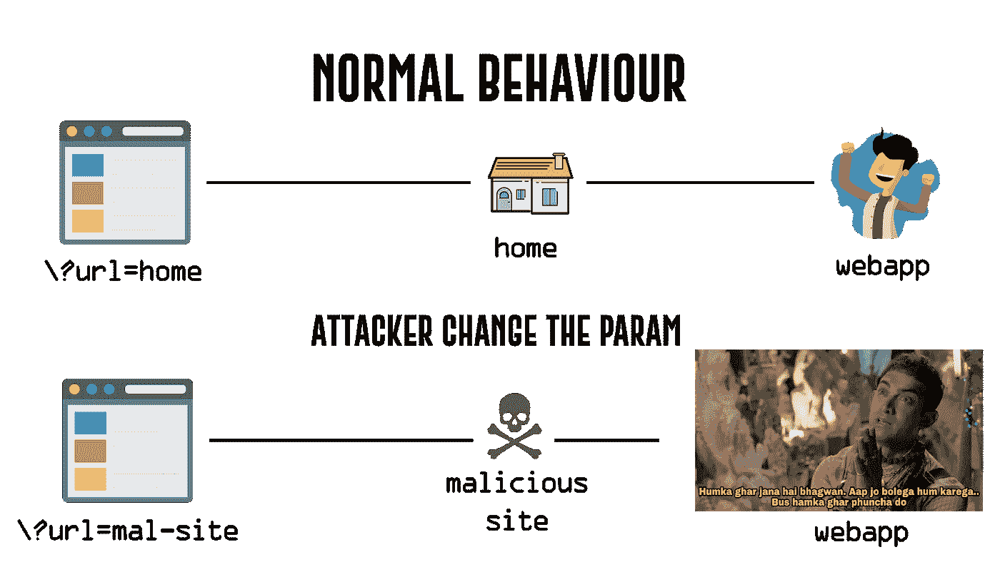

私人昆虫赏金故事

我在 bugcrowd 公共和私人程序上发现了 8 个以上的开放重定向，但其中大多数还没有打补丁，所以我没有权限分享这些 bug 的信息，但有 2 个 bug 已经打了补丁。

第一个案例

Redacted.com 使用//，然后有效载荷，然后网页被重定向到 payload.com

像这样

redacted.com///pratikdabhi.com—-> pratikdabhi.com

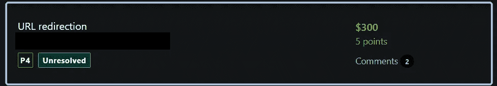

第二种情况

Redacted.com/google/?dest_path=，在这里代替 path={}，我使用 javascript:alert()并将其严重性从 P4 更改为 P3

像这样

redacted.com/google/?dest _ path = JavaScript:alert()--> JavaScript 弹出窗口

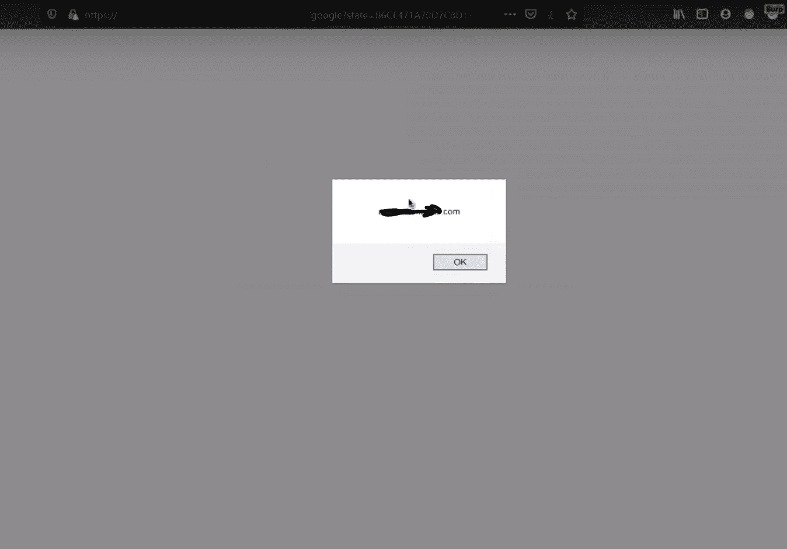

基于 Url 的 xss 有效负载

[https://github.com/R0X4R/D4rkXSS](https://github.com/R0X4R/D4rkXSS)

开放重定向导致 SSRF ( [PortSwigger](https://portswigger.net/web-security/ssrf) )

在前面的 SSRF 示例中，假设用户提交的 URL 经过严格验证，以防止恶意利用 SSRF 行为。但是，允许其 URL 的应用程序包含一个开放重定向漏洞。如果用于产生后端 HTTP 请求的 API 支持重定向，那么您可以构造一个满足过滤器的 URL，并产生一个到所需后端目标的重定向请求。

例如，假设应用程序包含一个开放重定向漏洞，其中以下 URL:

/product/nextProduct？current product id = 6 & path = http://evil-user . net

将重定向返回到:

【http://evil-user.net 号

您可以利用开放重定向漏洞绕过 URL 过滤器，并利用 SSRF 漏洞，如下所示:

帖子/产品/股票 HTTP/1.0

内容类型:application/x-www-form-urlencoded

内容长度:118

http://weliketoshop.net/product/nextProduct?的斯托克皮= [current product id = 6&path = http://192 . 168 . 0 . 68/admin](http://weliketoshop.net/product/nextProduct?currentProductId=6&path=http://192.168.0.68/admin)

这个 SSRF 漏洞之所以有效，是因为应用程序首先验证所提供的 stockAPI URL 是否在允许的域中，事实也确实如此。然后，应用程序请求所提供的 URL，这将触发打开重定向。它遵循重定向并向攻击者选择的内部 URL 发出请求。

*解决实验室，获得动手实践。

→实验室求解

在实验室中，我们有两个易受攻击的参数，分别是 stockApi 和 path，其中 path 具有开放重定向，而 stockapi 具有 ssrf 漏洞。首先，我们必须使用 burpsuite 进行一些参数爬行。

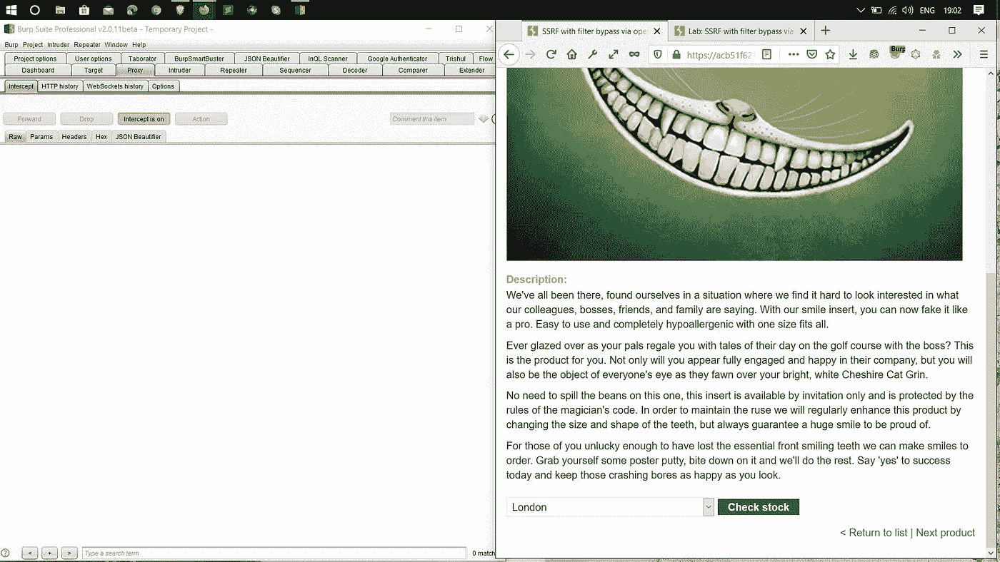

通过点击 check stock，我们得到 stockapi 参数

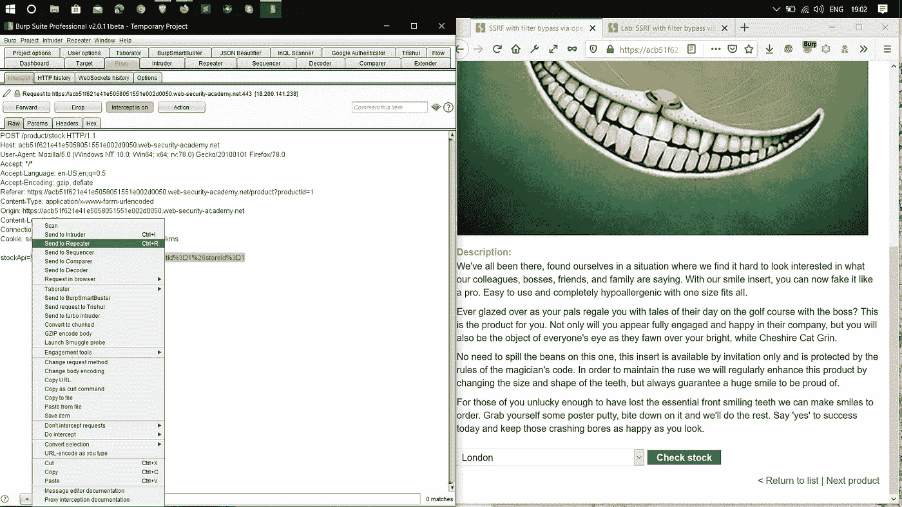

我们得到参数后，只需将请求发送给中继器。

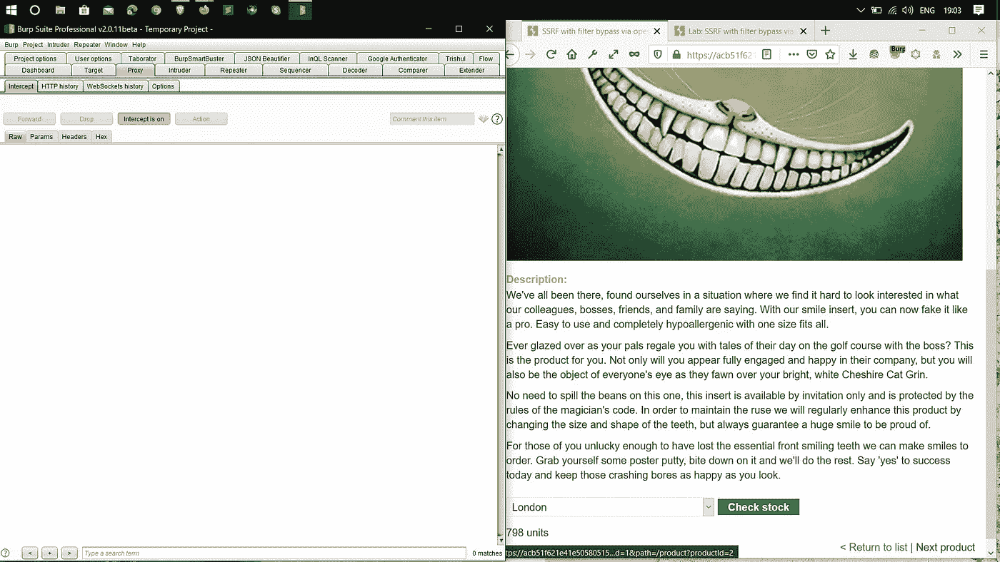

要获取路径参数，我们需要单击下一个产品链接。

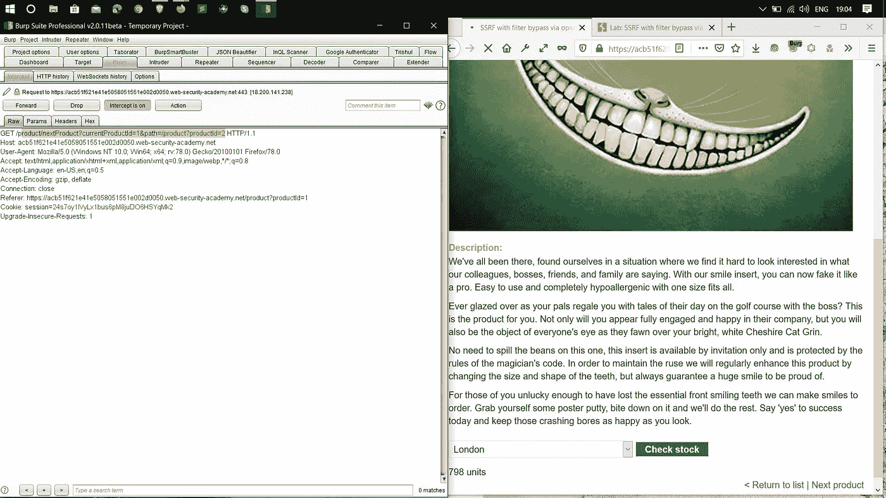

然后我们得到我们的？path= param 将此请求发送到中继器

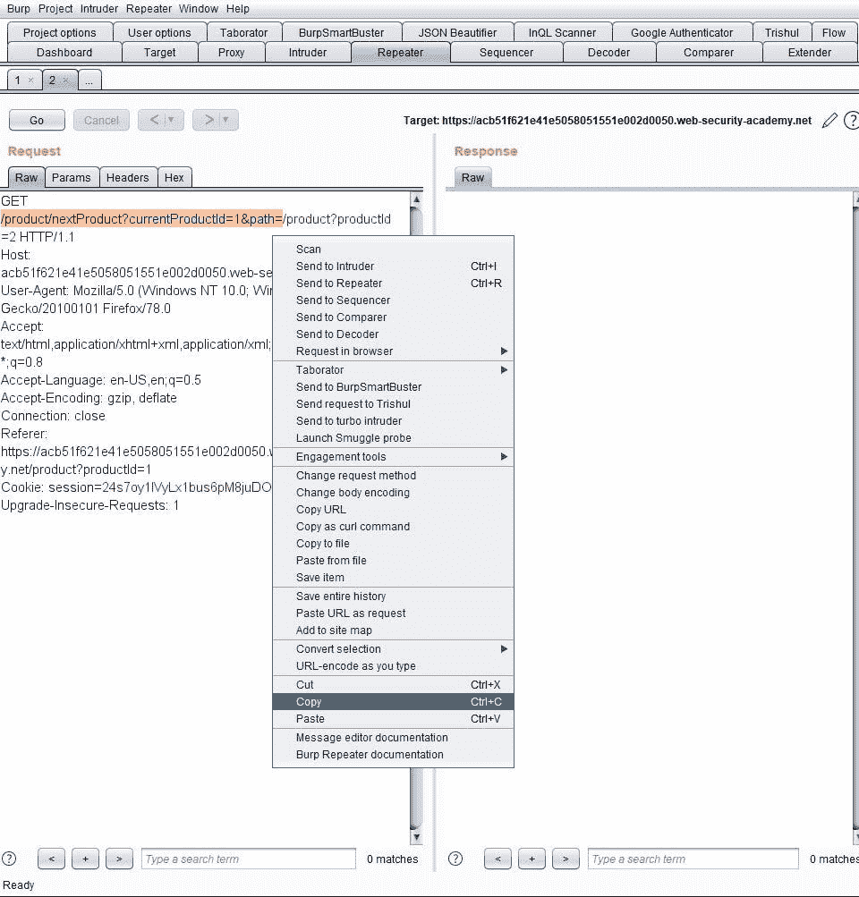

现在复制整个路径/product/nextProduct？当前产品= 1 &路径=

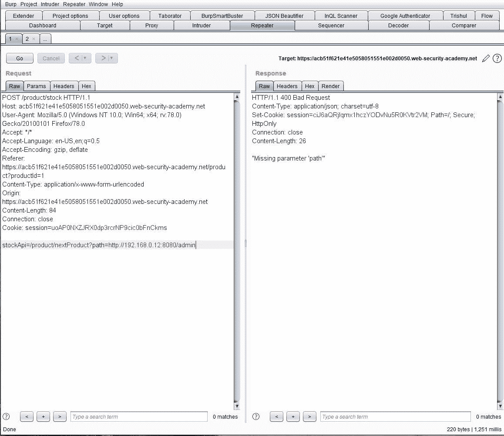

将其粘贴到 stockApi 参数上。像这样的 stockApi=/product/nextProduct？path = {此处粘贴您给定的 ssrf ip}给我它的 stockApi=/product/nextProduct？path =[http://192 . 168 . 0 . 12:8080/admin](http://192.168.0.12:8080/admin)

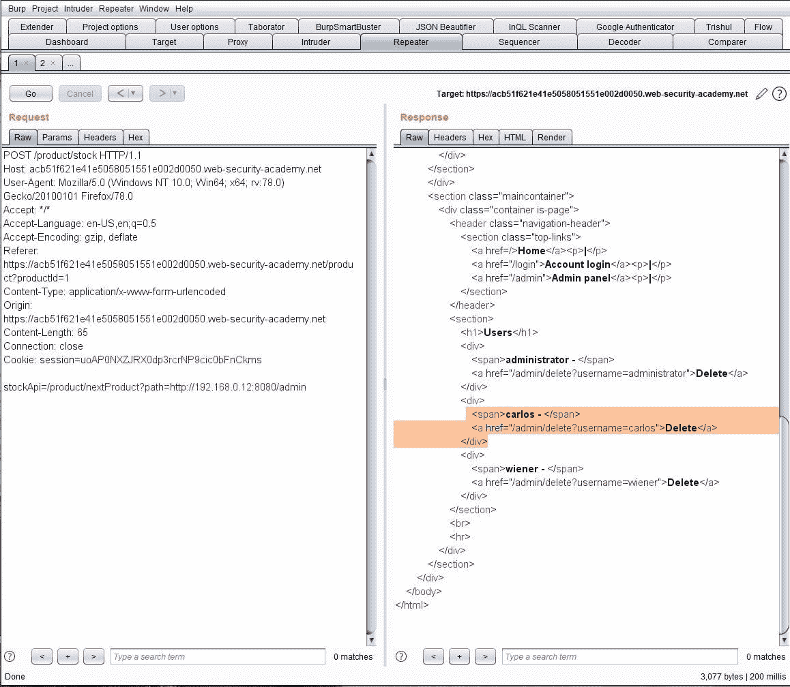

然后单击“go ”,等待一段时间，然后您会看到向下滚动的响应，您会看到用于删除用户 Carlos 的路径。

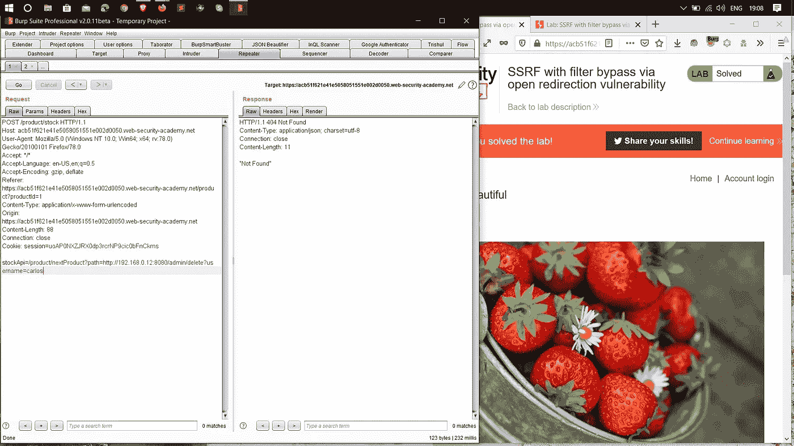

然后把路径粘贴在 stock API(stock API =/product/next product？path =[http://192 . 168 . 0 . 12:8080/admin](http://192.168.0.12:8080/admin)/delete？user=carlos) param 然后点击 go，嘣！实验室解决了。

开放重定向的影响(AC 端口触发器)

用户可能会被重定向到包含恶意软件的不可信页面，从而危及用户机器的安全。这将使用户面临巨大的风险，如果恶意软件进行键盘记录或其他攻击来窃取凭据、个人身份信息(PII)或其他重要数据，用户与 web 服务器的交互也可能受到影响。

用户可能会因为被重定向到不受信任的页面而遭受网络钓鱼攻击。网络钓鱼攻击可能指向攻击者控制的网页，该网页看起来像是受信任的网站。网络钓鱼者可能会窃取用户的凭据，然后使用这些凭据访问合法网站。

感谢大家的阅读:)

快乐黑客；)

喜欢我的作品就支持我吧！给我买杯咖啡，在 T2 的推特上关注我。

 [## impratikdabhi

### 嘿👋我刚刚在这里创建了一个页面。你现在可以给我买杯咖啡了！

www.buymeacoffee.com](https://www.buymeacoffee.com/impratikdabhi) 

网址:-【https://www.pratikdabhi.com/ 

insta gram:-[https://www.instagram.com/i.m.pratikdabhi](https://www.instagram.com/i.m.pratikdabhi/?hl=en)

推特:-[https://twitter.com/impratikdabhi](https://twitter.com/impratikdabhi?lang=en)

YouTube:-[https://www.youtube.com/impratikdabhi](https://www.youtube.com/impratikdabhi)