# OpenAdmin — HackTheBox 编写

> 原文：<https://infosecwriteups.com/openadmin-hackthebox-writeup-ffbc3f9c84c9?source=collection_archive---------2----------------------->

## OpenAdmin 是一个本周即将退休的简单机器。我们通过利用 [OpenNetAdmin RCE](https://www.exploit-db.com/exploits/47691) 获得了最初的立足点，并通过密码重用升级到用户 jimmy。机器上的内部服务 Port forwarding 为我们提供了一个加密的 SSH 密钥，我们通过破解这个密钥以 joanna 用户的身份获得访问权。通过`nano`命令的 sudo pwnage 获得 root 权限。

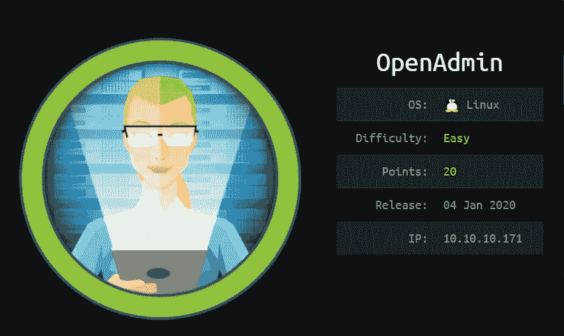

信息卡

# 侦察

像往常一样，让我们从 Nmap 扫描开始。

```
Nmap scan report for 10.10.10.171
Host is up (0.25s latency).PORT   STATE SERVICE VERSION
22/tcp open  ssh     OpenSSH 7.6p1 Ubuntu 4ubuntu0.3 (Ubuntu Linux; protocol 2.0)
| ssh-hostkey: 
|   2048 4b:98:df:85:d1:7e:f0:3d:da:48:cd:bc:92:00:b7:54 (RSA)
|   256 dc:eb:3d:c9:44:d1:18:b1:22:b4:cf:de:bd:6c:7a:54 (ECDSA)
|_  256 dc:ad:ca:3c:11:31:5b:6f:e6:a4:89:34:7c:9b:e5:50 (ED25519)
80/tcp open  http    Apache/2.4.29 (Ubuntu)
|_http-server-header: Apache/2.4.29 (Ubuntu)
|_http-title: Apache2 Ubuntu Default Page: It works
Service Info: OS: Linux; CPE: cpe:/o:linux:linux_kernel
```

SSH 和 HTTP 端口是打开的。让我们从 80 端口开始。

## 人工访问

在访问页面时，我们会看到默认的 Apache 安装页面。

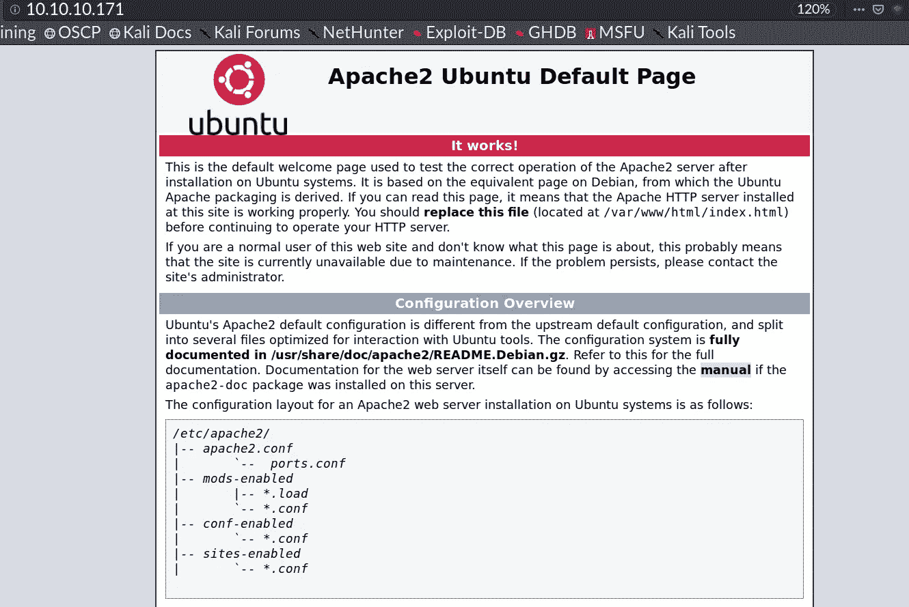

## Gobuster

这是 gobuster 的输出，

```
/music (Status: 301)
/artwork (Status: 301)
/sierra (Status: 301)
/server-status (Status: 403)
```

参观/音乐


有一个登录按钮，点击它可以进入`[http://10.10.10.171/ona](http://10.10.10.171/ona)`

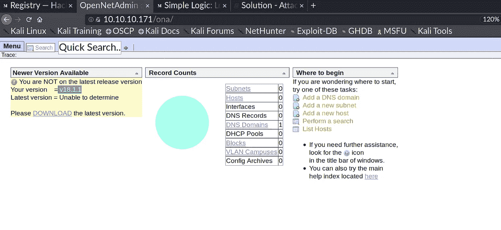

软件版本暴露。快速的谷歌搜索向我们展示了一个远程代码执行漏洞。

我利用了这个。

[](https://github.com/amriunix/ona-rce) [## amriunix/ona-rce

### OpenNetAdmin 18.1.1 -远程代码执行 https://amriunix.com/检查-验证目标是否易受攻击…

github.com](https://github.com/amriunix/ona-rce) 

只需通过拦截请求来更新漏洞利用中的`xajxr`的值。

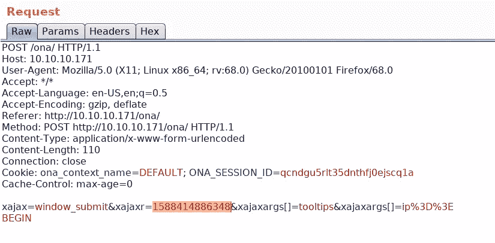

# 作为 www-data 的 Shell

利用上述漏洞，我们可以在机器上执行代码。

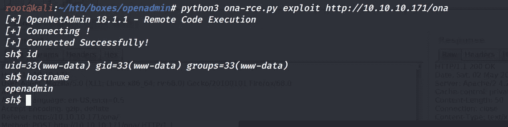

是时候拿个反壳了。

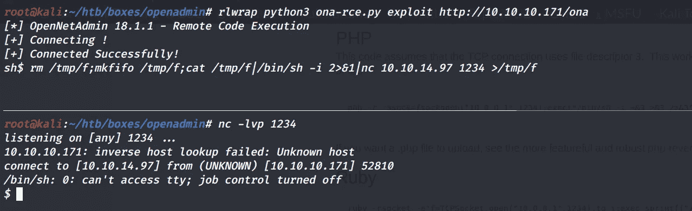

看来我们找到了一些用户名和密码。让我们在 SSH 上尝试一下，看看是否有可能重用密码。

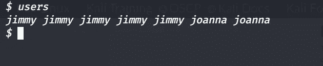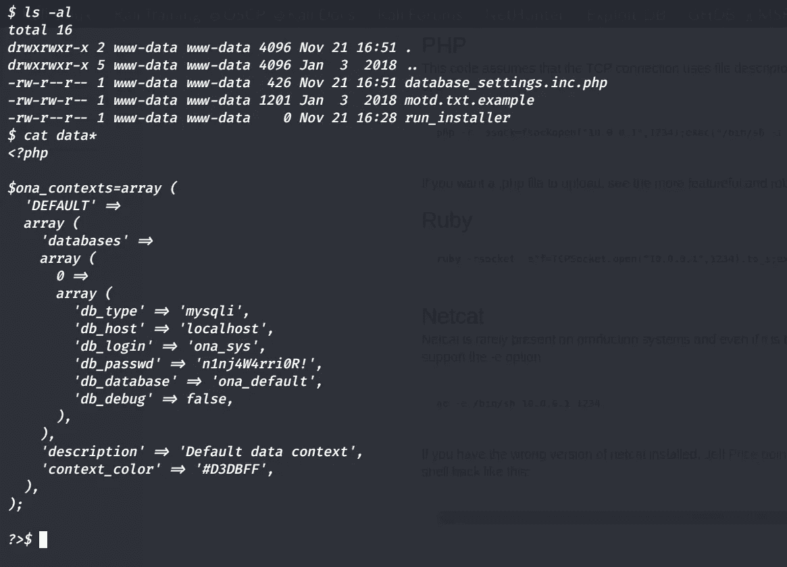

# 扮演吉米

这些凭证适用于 SSH 上的 jimmy 用户。

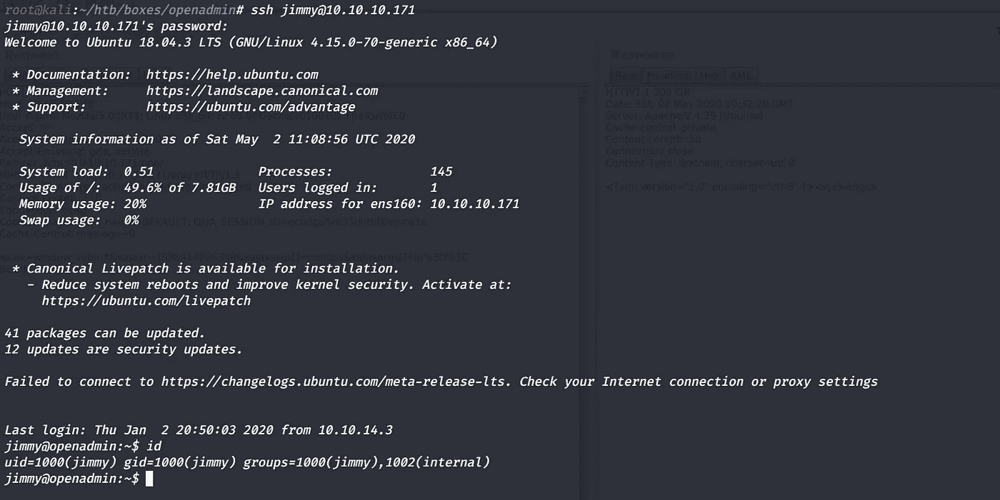

## 内部服务

在运行 linpeas 时，我们可以看到在端口 52846 上有一个本地运行的服务。让我们把它转接到我们的信箱，看看里面有什么。


## 端口转发

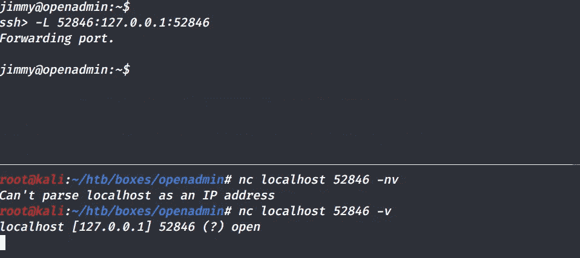

我们看到了一个登录页面，通常的 admin:admin、admin:password 等在这里不起作用。继续列举。

我们从`/var/www/internal/index.php`中发现了这条有趣的线

```
<?php
      $msg = ''; if (isset($_POST['login']) && !empty($_POST['username']) && !empty($_POST['password'])) {
      if ($_POST['username'] == 'jimmy' && hash('sha512',$_POST['password']) == '00e302ccdcf1c60b8ad50ea50cf72b939705f49f40f0dc658801b4680b7d758eebdc2e9f9ba8ba3ef8a8bb9a796d34ba2e856838ee9bdde852b8ec3b3a0523b1') {
                  $_SESSION['username'] = 'jimmy';
                  header("Location: /main.php");
              } else {
                  $msg = 'Wrong username or password.';
              }
            }
```

哈希被破解了

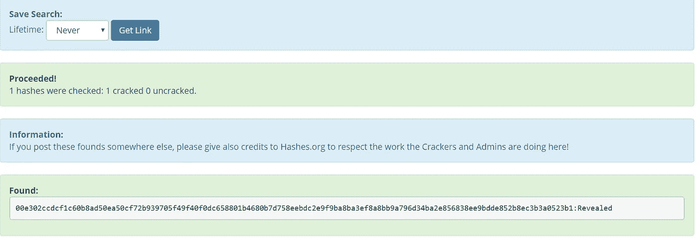

我们现在也可以登录了，

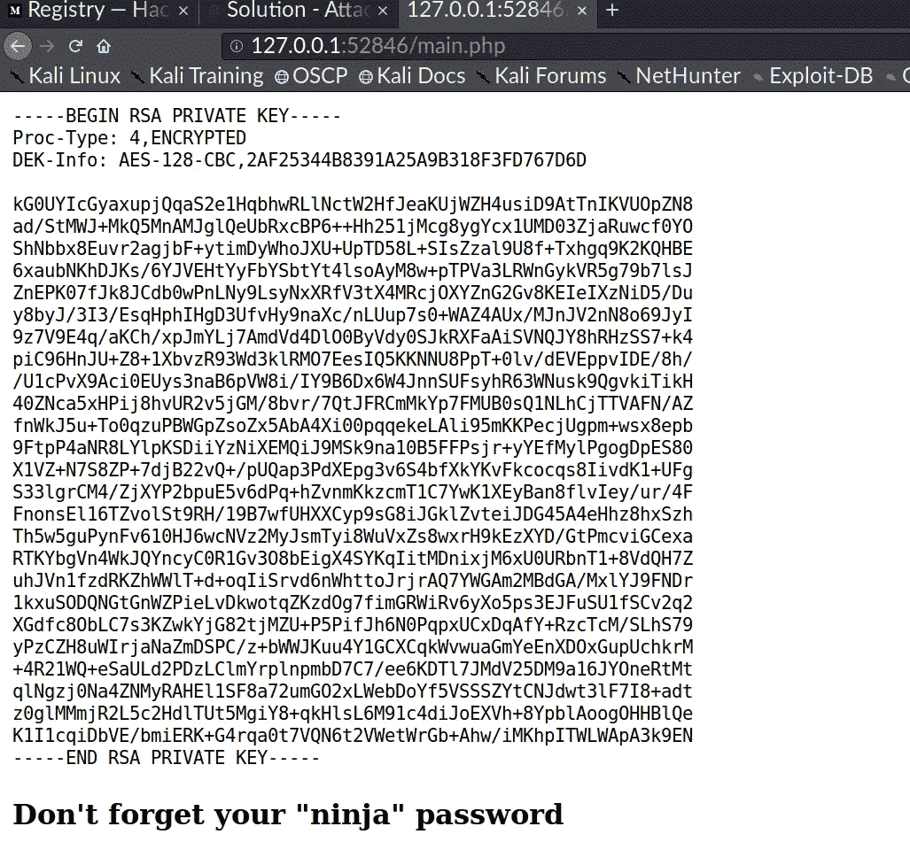

# 乔娜·谢尔

上面的 SSH 密钥是乔安娜的，但它是加密的。约翰和约翰该去工作了。

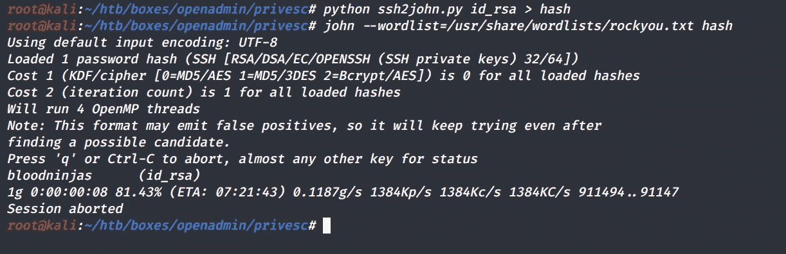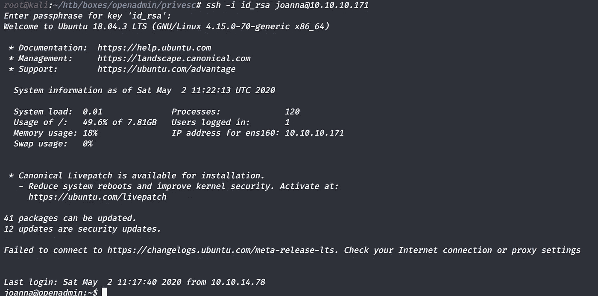

# Root 权限

乔安娜在`nano`上有 sudo 权限

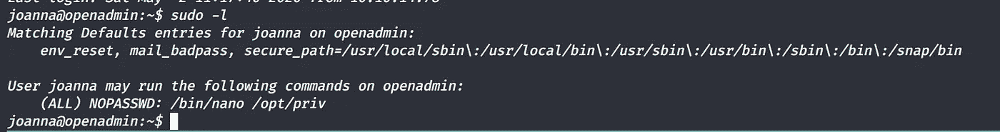

跟随[https://gtfobins.github.io/gtfobins/nano/#sudo](https://gtfobins.github.io/gtfobins/nano/#sudo)，我们得到根壳，

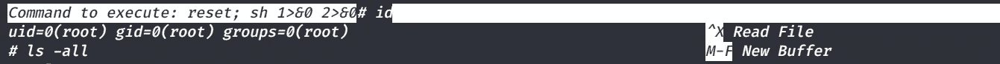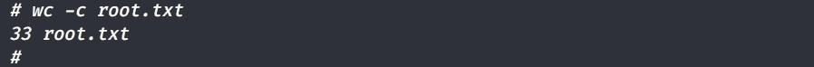

如果你喜欢这篇文章，请留下你的掌声，你可以关注我在[https://twitter.com/cyber01_](https://twitter.com/cyber01_)的更新:)

感谢和问候，

普雷瑟姆