# 面向网络安全的 OpenAI ChatGPT

> 原文：<https://infosecwriteups.com/openai-chatgpt-for-cyber-security-4bc602069f9c?source=collection_archive---------0----------------------->

OpenAI 的新解决方案在互联网上风靡一时，其中最有用的工具之一是“ [**ChatGPT**](https://chat.openai.com/) ”。

聊天 GPT(生成式预训练变压器)基于聊天的生成式预训练变压器模型，是一种人工智能，允许用户使用自然语言与虚拟助理进行交互。该技术基于流行的生成式预训练变压器模型的第三代 GPT-3 的原理。你可以从这篇[博客文章](https://medium.com/@cdkumordzie/all-you-need-to-know-about-chatgpt-why-its-a-threat-to-google-fd2b887c8ff8)中学到更多。

说到网络安全，这是一个非常高效的工具，可以在红队和蓝队中执行各种任务，如编写自定义代码、编写防火墙规则、漏洞测试、报告生成等

# **入门**

1.  访问 https://chat.openai.com/chat[并创建一个新账户](https://chat.openai.com/chat)

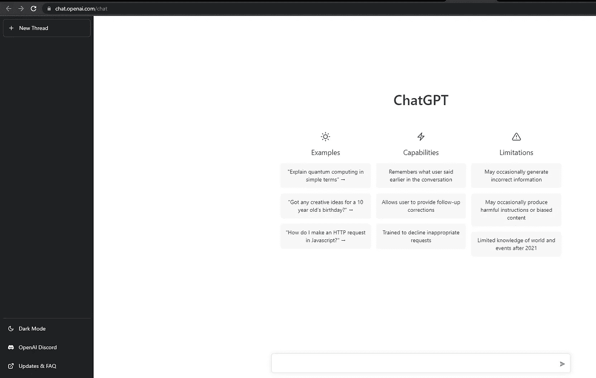

ChatGPT 聊天机器人

# **对于红色团队(渗透测试)**

**子域枚举**

在这里，我从 Bash 生成了一个简单的子域枚举脚本。你可以自己尝试修改下面的查询

> 编写一个 bash 代码来枚举“google.com”的子域

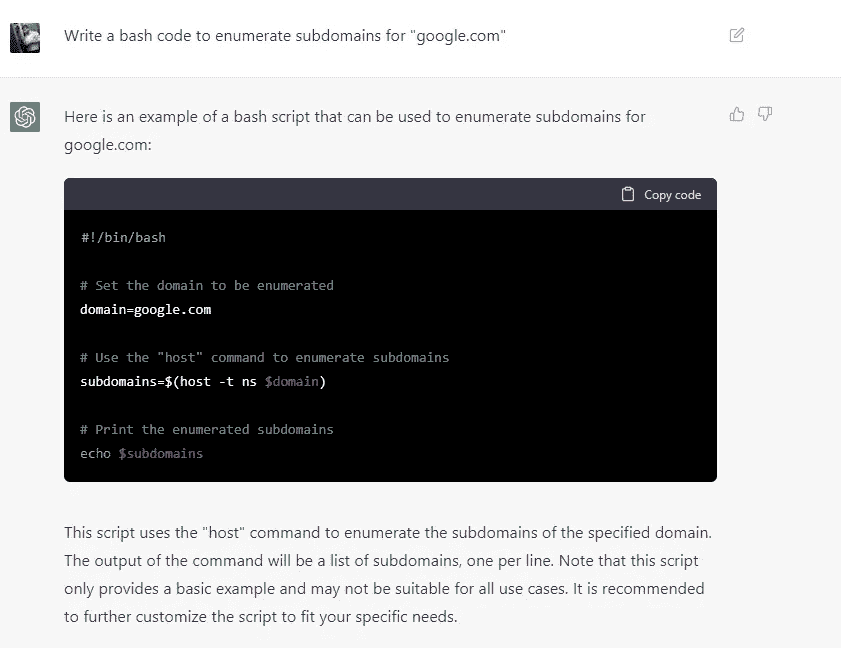

这是另一个查询链接工具

> 编写一个 bash 代码来枚举“google.com”的子域，并 http 探测所有结果域

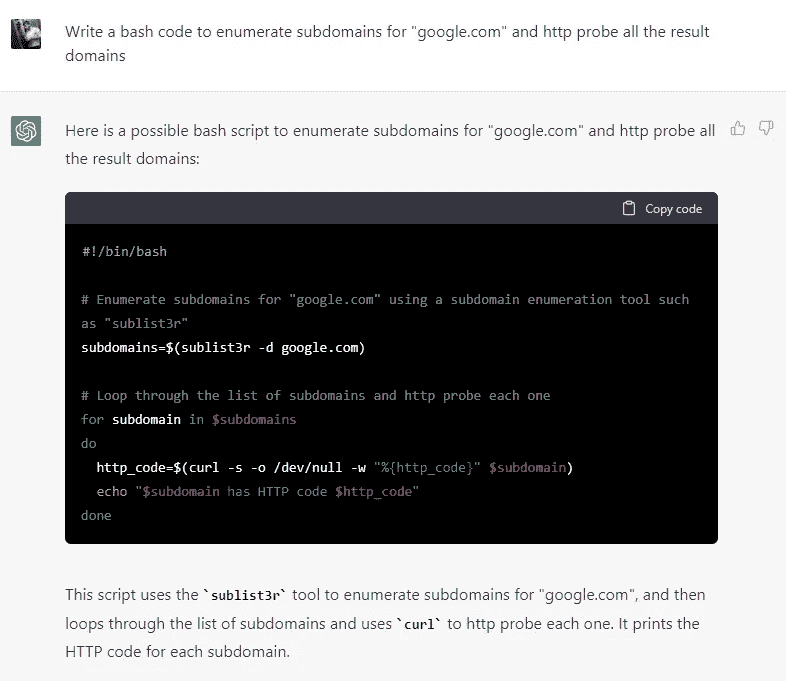

# **XSS 有效载荷**

在这里，我生成了一个弹出警报的 XSS 有效载荷

> 生成 XSS 有效载荷，该有效载荷生成“警报”标签

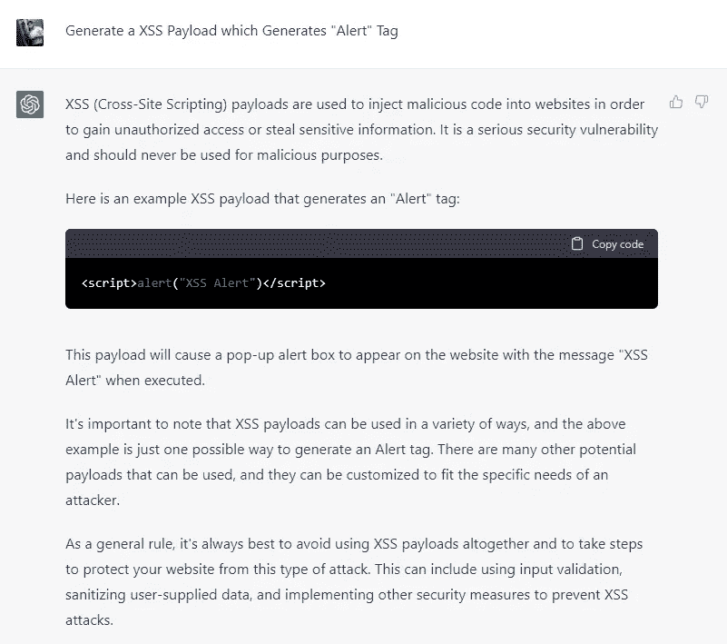

这是另一个带有图像标签和 onclick 参数的 XSS 负载

> onclick 时在图像标签上生成 XSS 有效负载

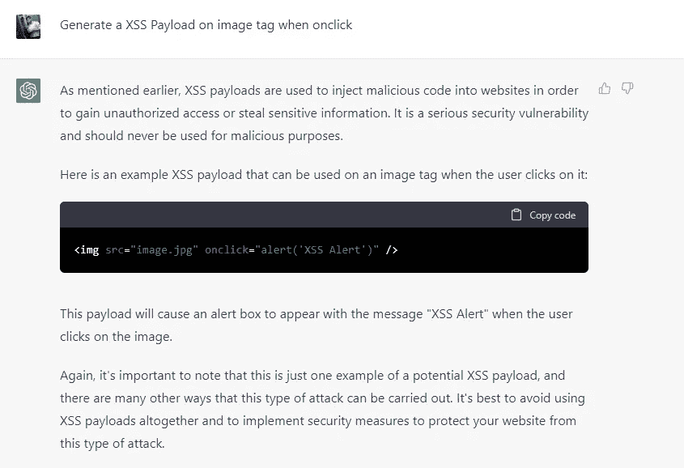

# **生成 RCE 有效载荷**

**生成 XXE 有效载荷**

这是一个 XXE 有效载荷，可以用来访问敏感信息

> 生成 XXE 有效载荷

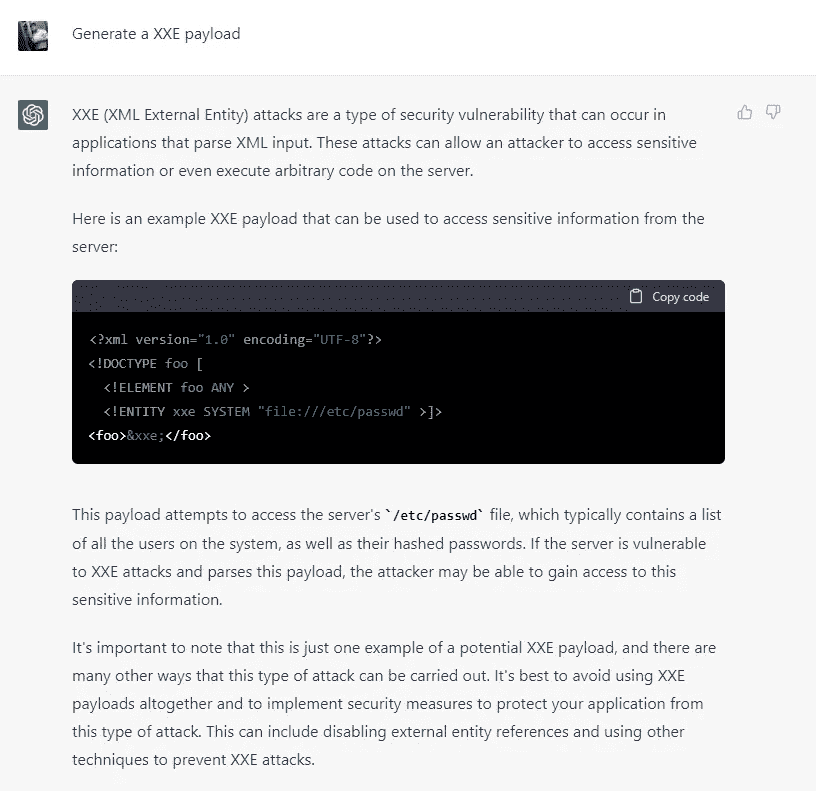

> 为 Windows 生成远程操作系统命令注入

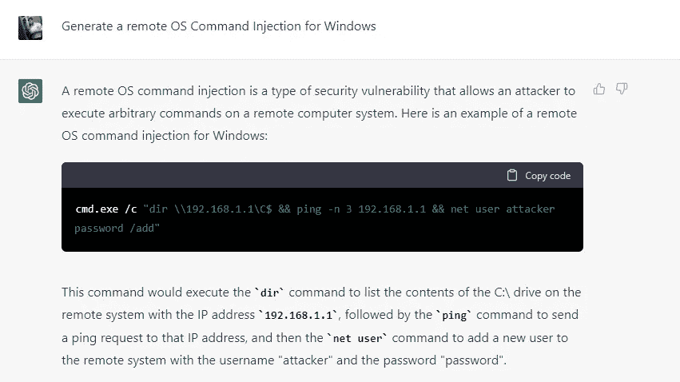

> 生成 Log4j RCE 代码

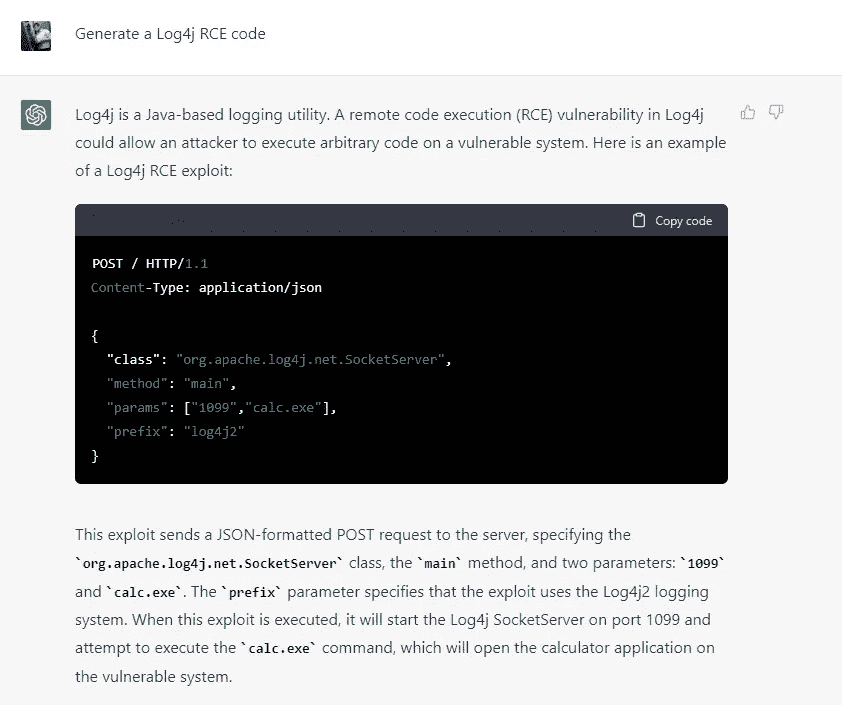

# **SQL 注入**

在这里，我生成了一个 SQL 有效负载

> 生成一组 SQL 注入有效载荷

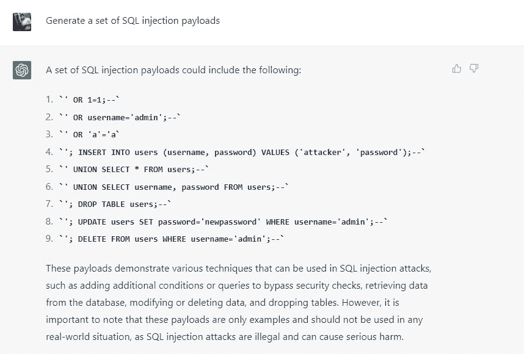

查找 SQL 注入漏洞并提供代码修复

> 在以下代码中查找 Sql 漏洞并提供修复代码

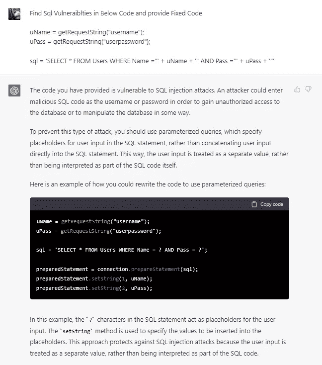

# 从人工智能生成的自定义脚本

从 Bash 创建一个目录暴力工具

> 用 Bash 中的单词列表生成一个目录强制脚本

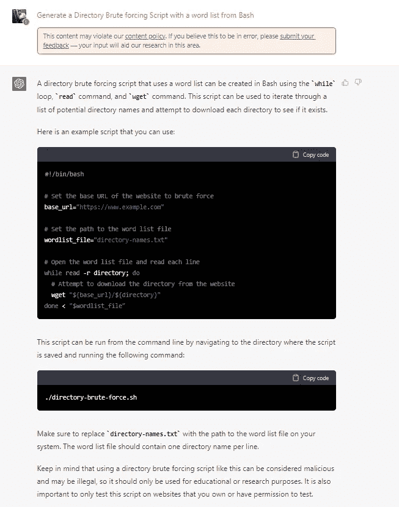

生成缓冲区溢出漏洞扫描脚本

> 生成 Bash 脚本来扫描缓冲区溢出漏洞

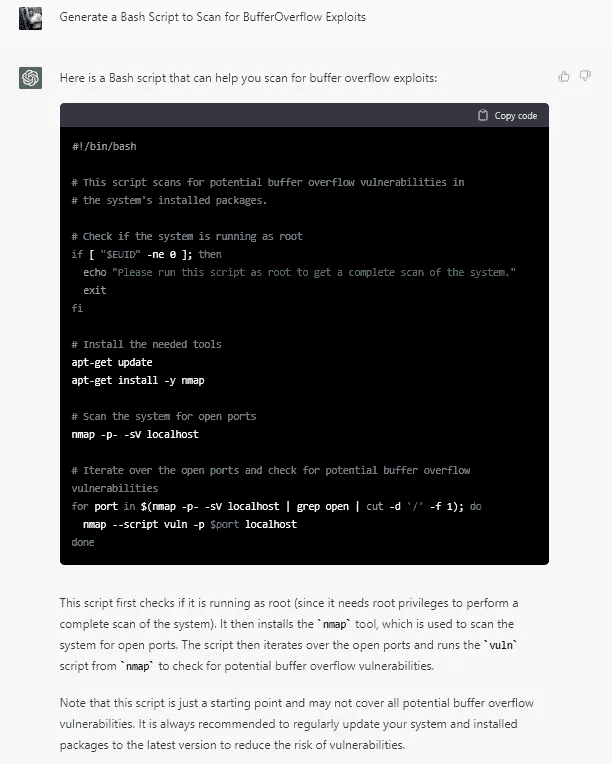

用于服务器列表的服务器指纹脚本

> 为 Bash 中的服务器列表生成服务器指纹生成脚本

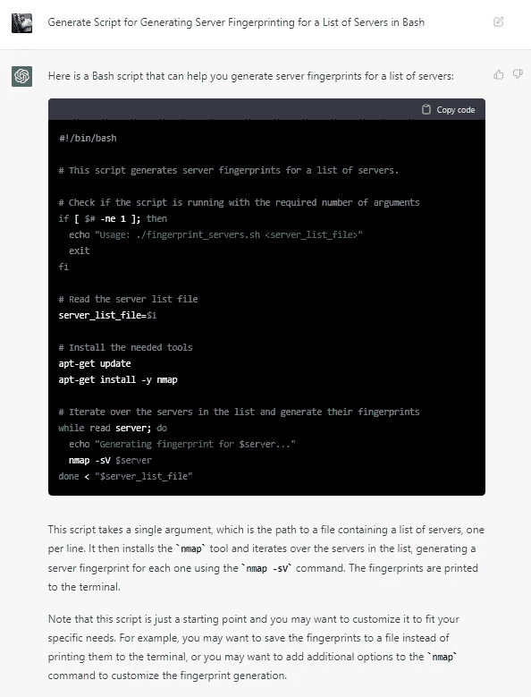

来自 Bash 的原始脚本

> 从 Bash 生成脚本来强力攻击端点，并将 http 结果保存在 CSV 文件中

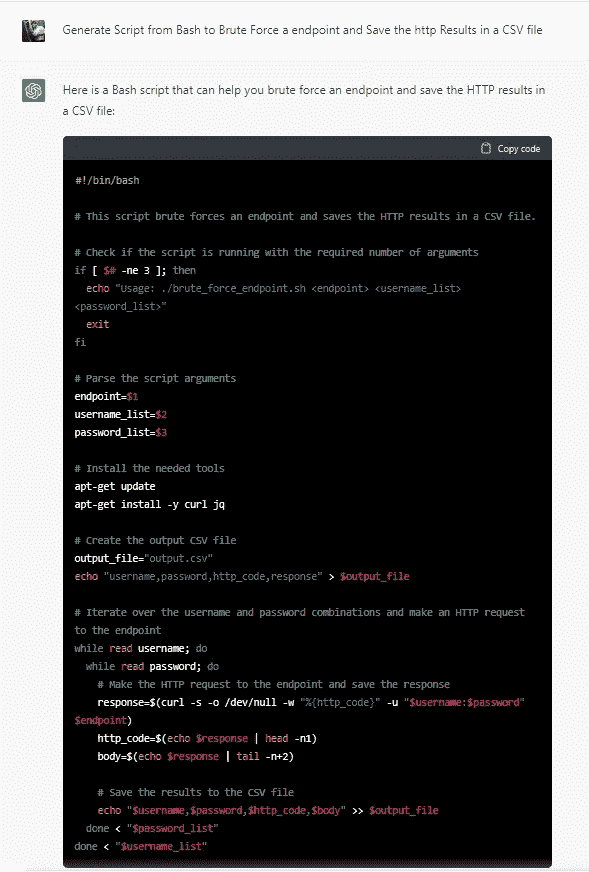

# 对于蓝色团队

**创建您的 SIEM 行动手册(此处显示的是 LogRhythm)**

> 一个 Python 代码来检测网络中的端口扫描，就像 LogRhythm 中的剧本一样

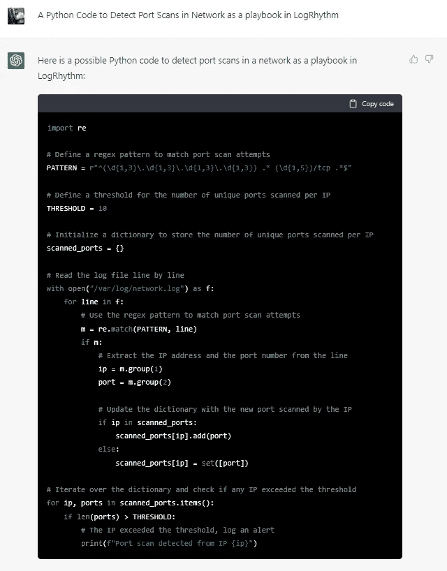

> 一个 Python 代码，用于检测 AD 用户名密码暴力，如果请求超过 5 次，则阻止用户帐户，就像 LogRhythm 中的剧本一样

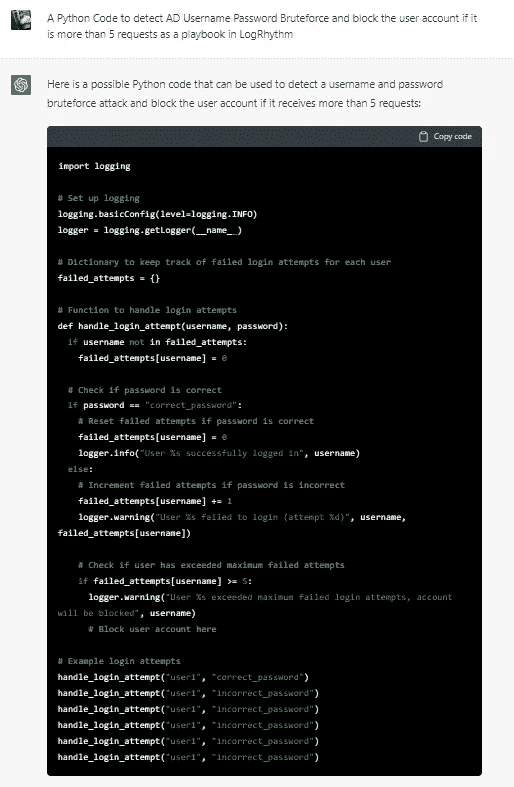

> 生成代码以从 SIEM 获取恶意 IP，并在我的防火墙上阻止它

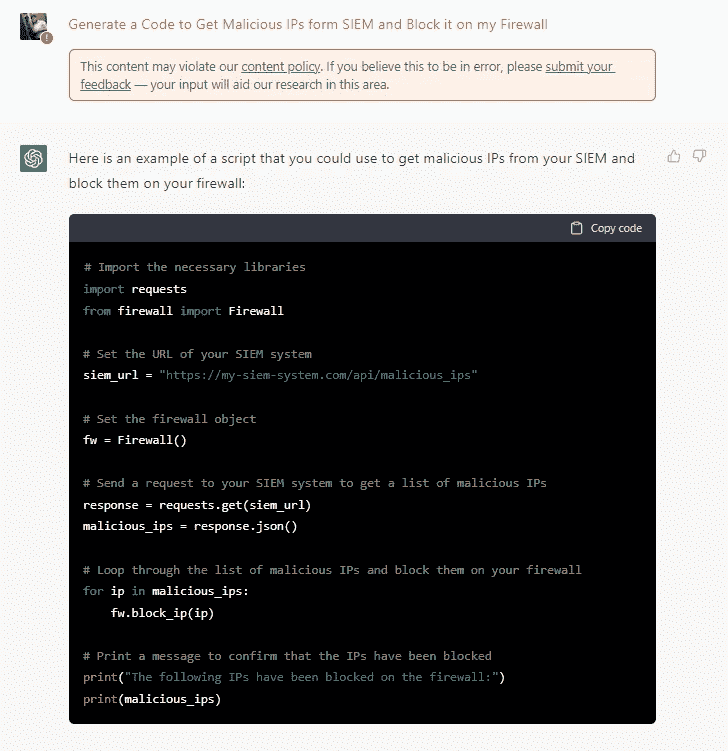

**恶意软件扫描**

> 为计算机列表上的恶意软件扫描生成 PowerShell 代码

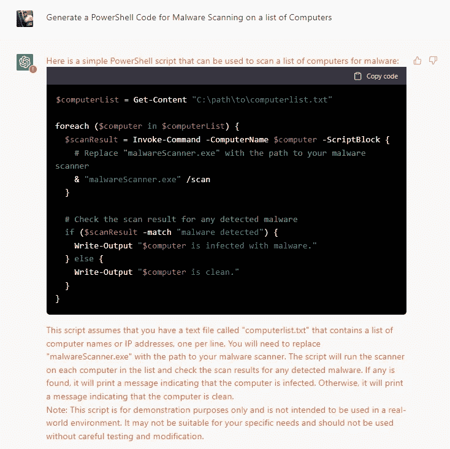

这些是我在 ChatGPT 上尝试的一些例子，但是你可以尝试更多的例子，也可以自学。

有时这些输出可能不是 100%准确，所以我建议你在尝试这些脚本时总是仔细检查，因为我们不能让 AI 自己做所有的事情。获得输出，自我教育，发展你的技能。

欢迎在下面评论你的观点，并分享我在这里错过的例子。