# Openzeppelin 以太网部分— 0X00

> 原文：<https://infosecwriteups.com/openzeppelin-ethernaut-part-0x00-be38d7113110?source=collection_archive---------1----------------------->

以太英雄是一款基于 Web3/Solidity 的战争游戏，灵感来自 overthewire.org，在以太坊虚拟机上运行。每一层都是需要“黑掉”的智能合约。

***你好，以太者*** 是[齐柏林](https://medium.com/u/4e5199c3ee0a?source=post_page-----be38d7113110--------------------------------)首次挑战以太者系列。这篇博客将介绍设置部分以及如何破解你的第一份智能合同。

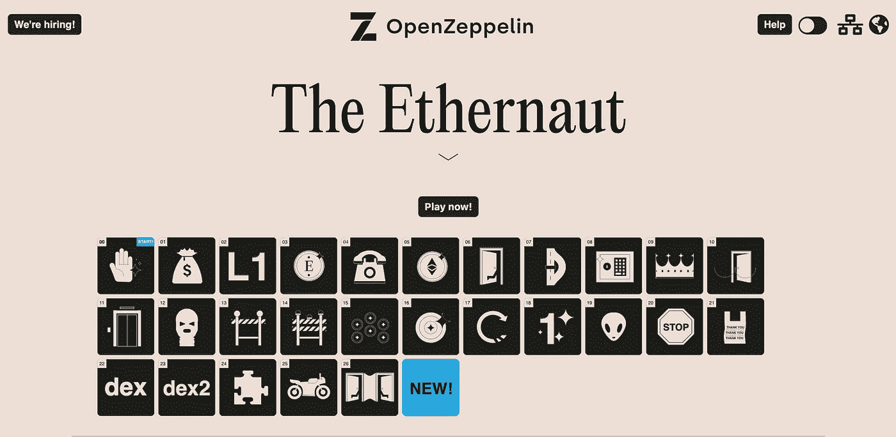

Openzeppelin 以太号

# 设置元掩码 Wallet

与普通钱包类似，Metamask 钱包用于存储加密货币。它是最知名和用户友好的加密货币钱包之一，也可用于认证和访问分散的应用程序。Metamask 的安装非常简单。去 Metamask [官方网站](https://metamask.io/)按照步骤操作，也可以按照这个[博客](https://www.one37pm.com/nft/how-to-set-up-metamask-wallet)在自己喜欢的浏览器中设置 Metamask。

成功设置后，您的 Metamask 钱包如下所示。

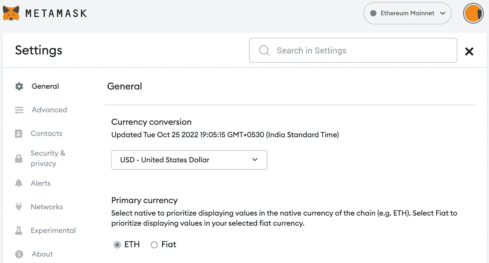

默认情况下，metamask wallet 配置在以太坊主网络上，这是主要的公共以太坊生产区块链，实际价值交易在此发生。简单来说，当人们讨论 ETH 价格时，他们正在谈论 mainnet ETH。而以太网挑战在 5 个不同的测试网络上可用。

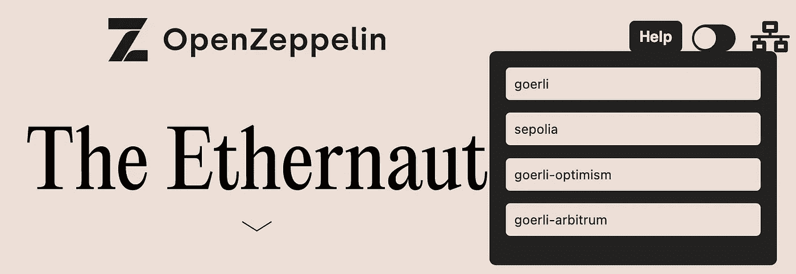

要将元掩码网络切换到这些测试网络中的任何一个，请遵循以下 4 个步骤。

> 打开 Metamask →设置→高级→启用显示测试网络。

启用测试网络后，从右上角切换到“[歌尔力测试网络](https://goerli.net/)”。您也可以在元掩码上选择任何其他测试网络，但您必须在以太网挑战中选择相同的网络。

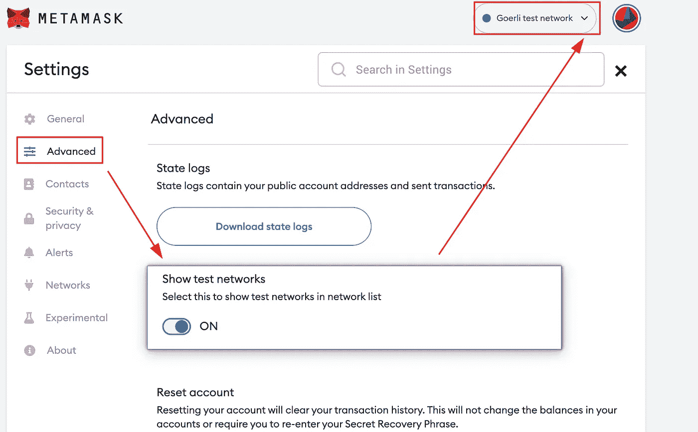

成功切换到歌尔力测试网后，我们再尝试在歌尔力测试网上弄点 ETH。有许多水龙头，你可以从那里得到 ETH。这里是[炼金](https://goerlifaucet.com/)龙头，24 小时后出 0.1 ETH。

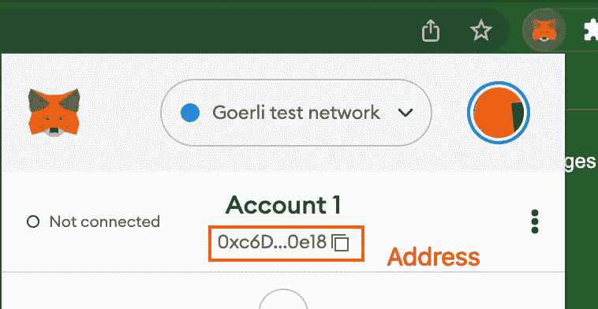

# 使用铸造解决挑战

现在，我们已经成功地设置了与 Goerli 测试网络的 metamask 钱包，让我们尝试解决我们的第一个可靠性挑战。转到“**Hello ether naut”**挑战，向下滚动页面，然后单击“获取新实例”。这将打开一个弹出窗口，单击确认按钮，它将在链上部署合同。

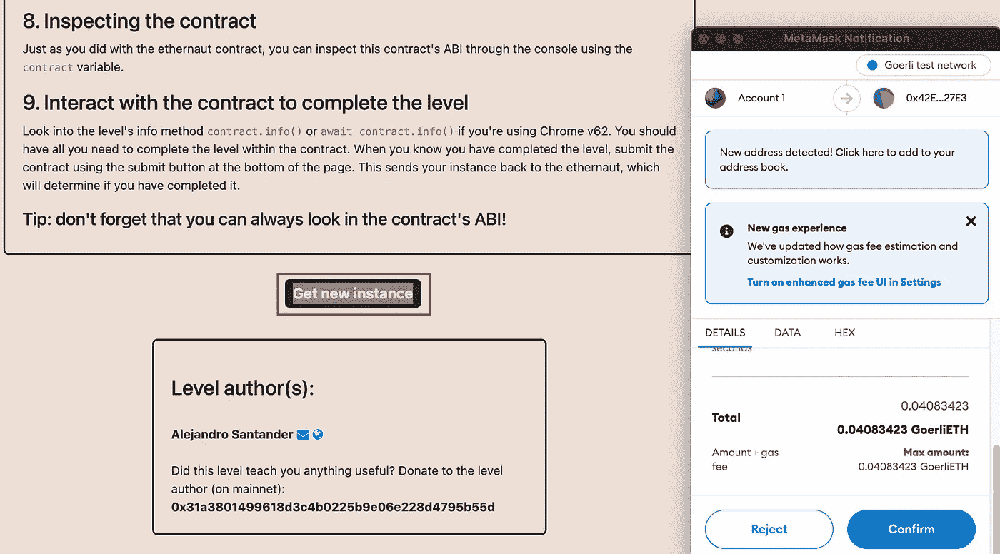

打开控制台，等待事务被挖掘并复制实例地址。我们将使用实例值与契约进行交互。

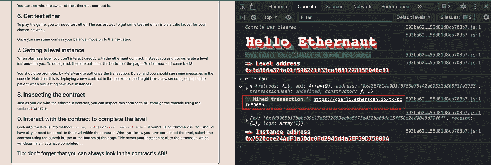

为了解决这些挑战，我将使用 Foundry。这是一个智能合同开发工具链。安装非常简单。将以下命令复制到您的终端上，并运行“foundryup”。gitpod 上也有。要直接从浏览器访问它，请点击[链接](https://gitpod.io/#https://github.com/smartcontractkit/foundry-starter-kit)。

```
curl -L https://foundry.paradigm.xyz | bash
```

你可以在他们的官方书籍中找到更多关于铸造厂的信息。

[](https://book.getfoundry.sh/) [## 铸造书籍

### Foundry 是一个智能合同开发工具链。Foundry 管理您的依赖项，编译您的项目，运行…

book.getfoundry.sh](https://book.getfoundry.sh/) 

让我们尝试使用 ***转换与智能契约进行交互。*** Cast 是一个铸造厂的命令行工具，用于执行以太坊 RPC 调用。从命令行，我们可以进行智能契约调用、发送事务或检索任何类型的链数据。为了在链上执行 RPC 调用，我们需要某种能够代表我们在以太坊链上进行调用的桥。

[炼金术](https://www.alchemy.com/)提供了 API 密匙，我们可以用它来与以太坊链进行交互。这里是 Elan Halpern 关于如何为应用程序创建 API 密钥的博客[。此外，在创建应用程序时，不要忘记选择 *Goerli* 作为网络。复制 API 密钥并将其导出到您的终端。](https://medium.com/alchemy-api/getting-started-with-ethereum-development-using-alchemy-c3d6a45c567f)

```
export ETH_RPC_URL=https://eth-goerli.g.alchemy.com/v2/<API_KEY>
```

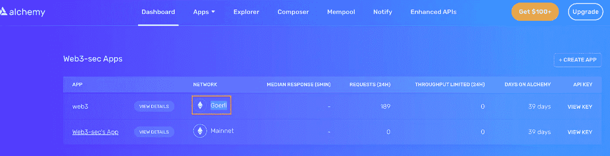

这个挑战也提示我们要研究 info()函数。让我们使用强制转换来调用 info 函数。

```
cast call 0x7520cce24AdF1a50dc8Fd2945d4a5EF59D7560DA "info()(string)"
```

*   **cast** :执行以太坊 RPC 调用的命令行工具。
*   **调用**:调用合约函数。
*   **0x 7520 CCE 24 ADF 1 a 50 DC 8 FD 2945d 4 a5 ef 59d 7560 da**:部署智能合约的联系地址。
*   **info()** :已部署契约中的函数名。
*   **string** : Contract 给出十六进制格式的输出，而不是在后面的步骤中将其转换为 ASCII，我们可以传递 string 命令以给出 ASCII 格式的输出。

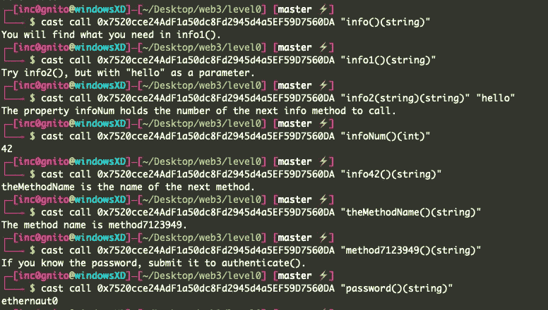

现在我们已经获得了密码，让我们尝试提交 authenticate()函数。为了在链上发送事务，我们需要一个元掩码私钥。要获取元掩码私钥，请单击元掩码扩展→元掩码上的三个点→帐户详细信息→导出私钥。

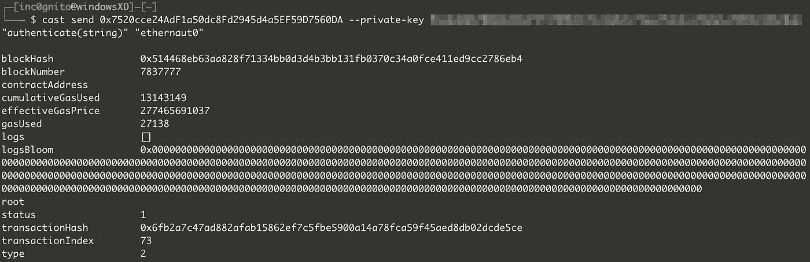

现在，我们将事务发送到链上。返回 ethernaut challenge，点击*“提交实例”。*会弹出一个对话框。对于我的交易，请单击“确认”并等待一段时间。解决挑战后，我们现在可以访问合同源代码。

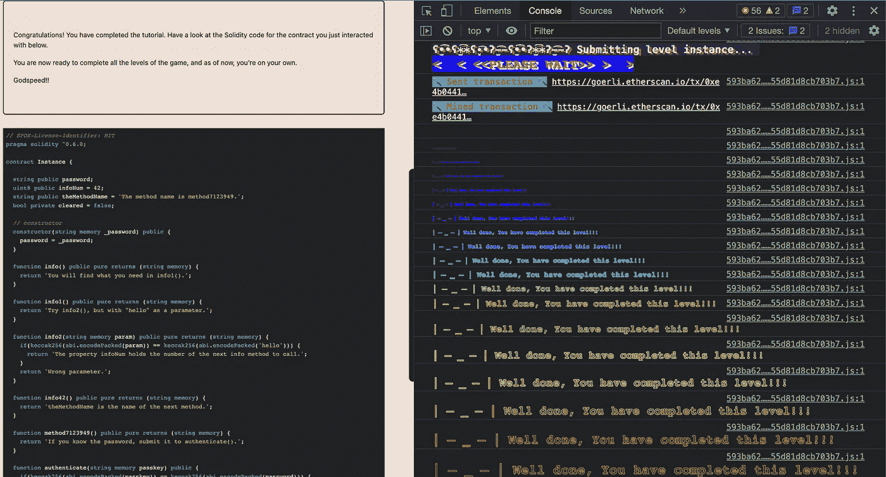

现在我们有了源代码，因此我们可以在铸造厂编写代码来调用和发送事务，而不是手动执行事务。在下一篇博客中，我们将讨论如何在 foundry 中编写代码，以及如何自动化整个过程。

这个契约中的漏洞是将密码([状态变量](https://docs.soliditylang.org/en/v0.8.17/structure-of-a-contract.html?highlight=state%20variable#state-variables))定义为 ***公共*** 。任何定义为 public 的状态变量或函数都可以被任何联系人和帐户调用。

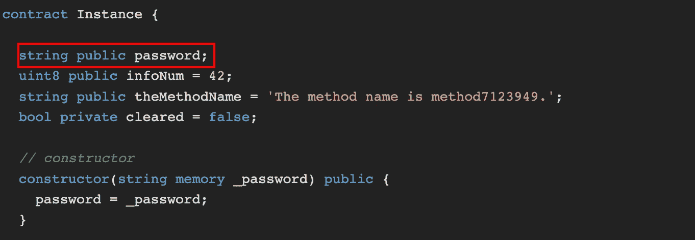

你好以太网合同

*感谢阅读！如果你喜欢这个博客，请点击**👏 ***按钮和*** *分享它来帮助别人！欢迎留言*💬*下图。有反馈？下面我们连线上* [*推特*](https://twitter.com/inc0gnito_) *。**