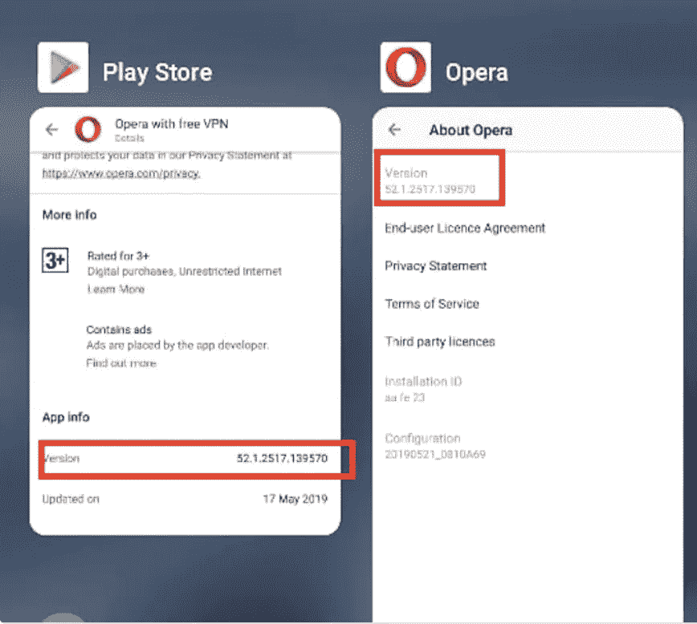
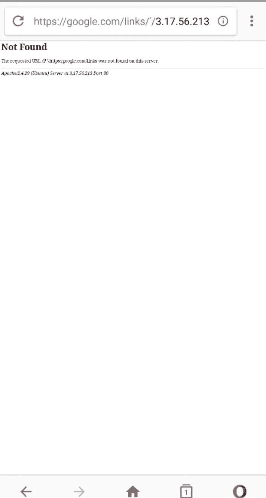
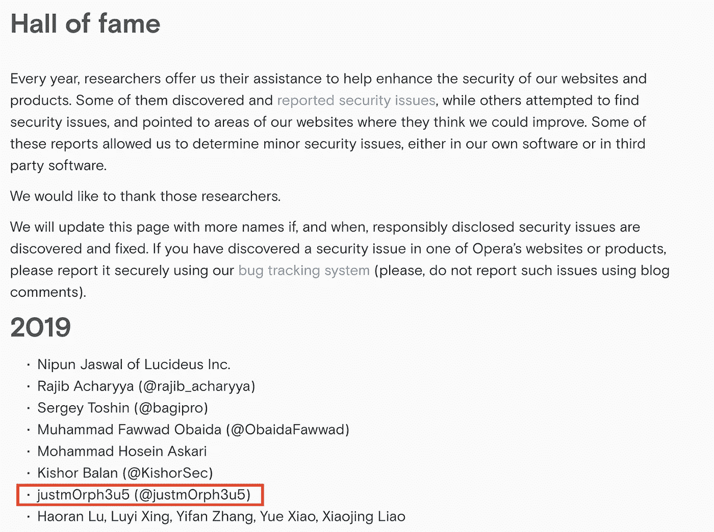

# Opera Android 地址栏恶搞:CVE-2019–12278

> 原文：<https://infosecwriteups.com/opera-android-address-bar-spoofing-cve-2019-12278-9ffcfd6c508c?source=collection_archive---------0----------------------->

学习是一个持续的过程，有数以百万计的文章、博客和研究，人们需要不断学习。类似地，我读到有一个地址栏欺骗的漏洞，据说是很严重的，我知道它，但从来没有费心去了解更多。我最近有机会研究红队活动的网络钓鱼活动。在那里，我有机会学习浏览器欺骗。在搜索的时候，我发现了 Rafay Baloch 的博客和 Blackhat Asia 的内容，T2 为了乐趣和利益绕过了浏览器安全。我能够写一些修改的漏洞，并能够在各种浏览器中发现这个漏洞。这是众多披露之一， ***不那么关键的*** 在各大浏览器中的发现之一。*这只是为了学习和盈利。*

## **眼见为实即使你不该相信自己的眼睛**

# **总结**:

Opera for Android 几乎安装在超过 280 万台设备上。
Opera android 遭受地址栏欺骗漏洞。来自波斯语、阿拉伯语等语言的字符按从右到左的顺序显示，规定的用法是 Unicode 双向算法。Unicode 字符(如 U+08FF、U+FB50 等)是从右向左呈现的，因此它可用于欺骗用户从左向右看到的 URL。**CVE-2019–12278**已被分配给此漏洞。

# 影响:

URL 栏是任何用户看到的第一样东西，对于一个非技术用户来说，这是信任一个网站的唯一方式。如果这个指示器被劫持，用户的整体安全性将受到损害，因为大多数用户通常使用浏览器而不是应用程序。利用 *https 挂锁*伪装成可信网站，诱骗用户输入关键信息。

# **受影响的版本:**

Android: OPERA 浏览器 52.1.2517.139570 最后日期:2019 年 5 月 17 日

版本详细信息

# 预期行为:

浏览器应该以 Punycode 格式显示 URL。

# **复制步骤:**

1)在 Opera 浏览器中访问以下链接
网址:
[http://3.17.56.213/%EF%B9%B0/https://google.com/links](https://hackerone.com/redirect?signature=8a6dc276bfb612e3761425df4605ab03a0ebb979&url=http%3A%2F%2F3.17.56.213%2F%25EF%25B9%25B0%2Fhttps%3A%2F%2Fgoogle.com%2Flinks)
http://اردو/google.com/links

2) Url 从右向左更改。

页面从左至右显示谷歌

3)它通过真实页面显示一个假的 google 页面是在最后。我在托管页面进行测试。

# **解决方案:**

所有这些 URL 必须以类似的方式呈现，即从左到右。查看 [*RFC*](https://www.ietf.org/rfc/rfc3987.txt) *了解更多详情。*

# 注意:

我也曾在其他最常用的浏览器中报告过类似的漏洞。一旦我得到相关公司的许可和修正，我将予以披露。另外，我不是这个漏洞的主要研究者。功劳归于原作者的发现和披露。我要特别感谢#Rafay Baloch 和#Dhiraj Mishra 的博客。

**披露时间:** 报道:21/5/2019
审判:21/5/2019
CVE 指派:23/5/2019
完成修复:29/7/2019
披露:1/8/2019
赏金:进行中

**歌剧名人堂**

# **参考:**

[https://chromium . Google source . com/chromium/src/+/master/docs/Security/URL _ display _ guidelines/URL _ display _ guidelines . MD](https://hackerone.com/redirect?signature=fbdb5bd32409bf5522bddc31211ac7834375a7b9&url=https%3A%2F%2Fchromium.googlesource.com%2Fchromium%2Fsrc%2F%2B%2Fmaster%2Fdocs%2Fsecurity%2Furl_display_guidelines%2Furl_display_guidelines.md)
[https://www . black hat . com/docs/Asia-16/materials/Asia-16-Baloch-Bypassing-Browser-Security-Policies-For-Fun-And-Profit-WP . pdf](https://hackerone.com/redirect?signature=a8782755c39dd11ad6f812fb8ba246e873c699f4&url=https%3A%2F%2Fwww.blackhat.com%2Fdocs%2Fasia-16%2Fmaterials%2Fasia-16-Baloch-Bypassing-Browser-Security-Policies-For-Fun-And-Profit-wp.pdf)
[https://www . rafaybaloch . com/2017/06/Googleid = 495933](https://hackerone.com/redirect?signature=3608af039111dbf59b248995a961c0bff40ad5d4&url=https%3A%2F%2Fwww.rafaybaloch.com%2F2017%2F06%2Fgoogle-chrome-firefox-address-bar.html)
[https://www.ietf.org/rfc/rfc3987.txt](https://www.ietf.org/rfc/rfc3987.txt)
[https://www . black hat . com/docs/Asia-16/materials/Asia-16-Baloch-Bypassing-Browser-Security-Policies-For-Fun-And-profit . pdf](https://www.blackhat.com/docs/asia-16/materials/asia-16-Baloch-Bypassing-Browser-Security-Policies-For-Fun-And-Profit.pdf)
[https://sqwabb . WordPress . com/2015/12/04/rlo-spoofing-is-anothere-internet-Security-reverse/】](https://sqwabb.wordpress.com/2015/12/04/rlo-spoofing-is-another-internet-security-reverse/)

*关注* [*Infosec 报道*](https://medium.com/bugbountywriteup) *获取更多此类精彩报道。*

 [## 信息安全报道

### 收集了世界上最好的黑客的文章，主题从 bug 奖金和 CTF 到 vulnhub…

medium.com](https://medium.com/bugbountywriteup)