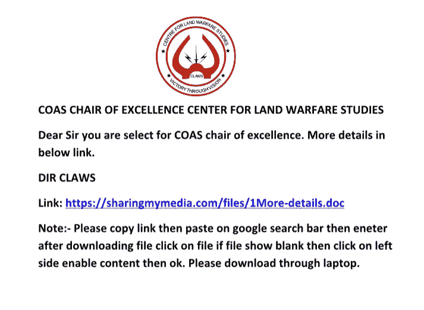
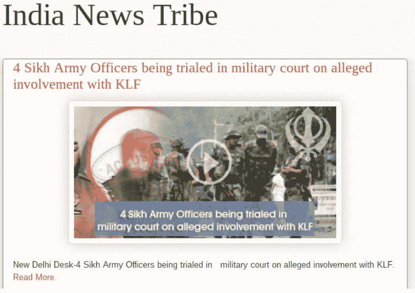
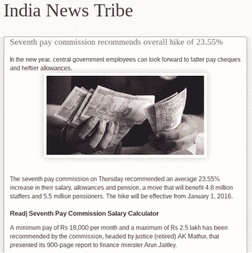
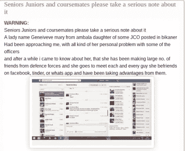
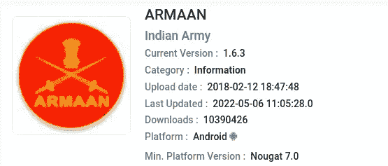
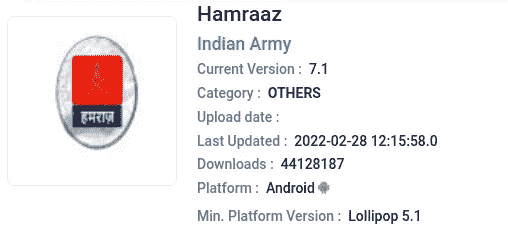
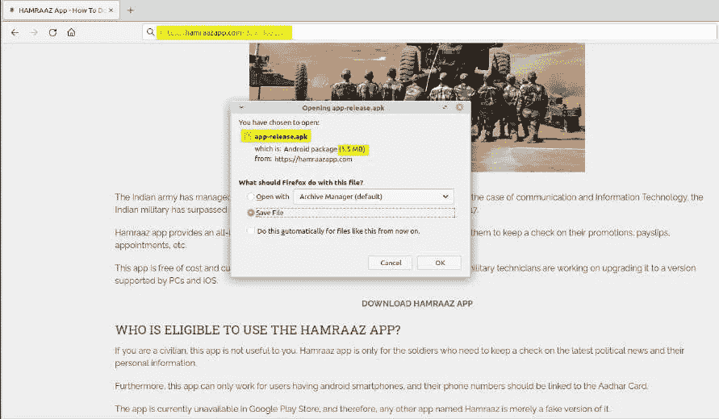

# 网络恐怖组织“透明部落”的运作方法

> 原文：<https://infosecwriteups.com/operational-methodologies-of-cyber-terrorist-organization-transparent-tribe-3389bdc1db3e?source=collection_archive---------0----------------------->

**你好，黑客们，**今天我们要讨论的是在巴基斯坦运作的名为透明部落的网络恐怖组织。
在这个研究博客中，我们将讨论透明部落的历史、战术、技术和程序。

图片来自谷歌

## 我们开始吧，

透明部落是一个成立于 2013 年的网络恐怖组织，该组织有很多名字，如 Mythic Leopard、ProjectM、Copper FieldStone 和 APT36。这个团体的主要目标是印度军官、外交官、研究机构和执法人员。从 2016 年开始，这个团体更加积极地瞄准印度实体。

透明部落使用远程访问特洛伊木马(RAT ),名为 Crimson RAT，由该组织开发和维护。近年来，该小组开始实施新技术，如倾角和社会工程方法。2021 年 5 月，思科 Talos Intelligence group 提交了关于透明部落组织的研究报告，称他们正在将 ObliqueRAT 添加到他们的 Windows 恶意软件库中。

该组织使用社会工程方法将恶意软件注入受害者的系统，他们通过模仿如 claws 这样的域来创建与印度军队和其他组织有关的假域。]在(合法域名)和恶意一爪[。]com。合法网站爪子。]in 是一个独立的智库，涵盖国家安全问题，也关注军事发展。

透明部落还使用许多操作方法来感染印度军队人员，如在各种网站上发布与印度军队有关的文章。这些文章包含恶意软件，当用户点击超链接时，会导致下载该集团维护和开发的著名的“CrimsonRAT”。

下面是透明部落发布在“印度新闻部落”上的一些文章标题和图片，该部落是由透明部落组织创建的。
**1) 4 名锡克教军官因涉嫌与 KLF 教有牵连而在军事法庭受审**

通过校样点成像

第七薪酬委员会建议整体加薪 23.55%。

通过校样点成像

高年级学生和同学们，请认真对待这件事。

通过校样点成像

在 2016 年的“Pathankot 攻击”之后，透明部落组织开始了针对印度军队高级官员和其他组织的网络钓鱼活动。他们基本上发送. mp3 格式的音频或。包含恶意负载的 pdf 文档或视频，它们会将恶意文档发送到受害者的电子邮件地址。

## 以下是透明部落组织使用的一些妥协指标(IOC)。

**1)指挥控制服务器的 IP 地址**
5.189.143。]225
5.189.167[。]65
。]109
93.104.213[。]217
193.37.152[。]28
213.136.87[。]122

**2)恶意域名**
appledia 1218[。]com
bluesync2121[。学生。]mooo[。]com
onlinestoreoonsale[。]com
winupdatess[。]no-ip[。[商务

最近几天有一个针对印度陆军军官的类似间谍活动，间谍活动更加复杂和有组织，威胁行动者集团对印度陆军应用程序“ARMAAN 和 Hamraaz”进行了恶意克隆。这些合法的社交应用程序是由印度政府为陆军人员开发的。这些应用程序提供工资信息，您可以下载工资单，也可以提供各种信息，并且只供印度陆军人员使用。

手机 Seva AppStore 图片

手机 Seva AppStore 图片

这两个恶意克隆的应用程序“ARMAAN”和“Hamrazz”被托管在“armaanapp”(。]在“和”hamraazapp[。]com”，当受害者请求从上述网站下载应用程序时，恶意应用程序将基于“用户代理”被下载到受害者设备。只有恶意应用程序将被下载到 Android 设备，而非恶意应用程序将被下载到 PC 用户。这种技术用于避免检测。

图片由 CloudSEK 提供，域服务于 Hamraaz 应用程序的恶意克隆

这是由 CloudSEK 威胁追踪小组确定的，但他们没有提到该活动背后的威胁行动者小组。根据我们的分析，这次间谍活动是由透明部落组织实施的，因为其技术和操作方法与以前透明部落组织针对印度军队人员实施的攻击非常相似。

所有这些网络恐怖分子的攻击只是冰山一角，还有更多需要发现和调查。

*如果你喜欢这些内容，点击“关注”按钮，每周都会发布内容丰富、令人惊叹的内容，请确保关注*“[*链接-在*](https://www.linkedin.com/in/c-m-uppin-b09967203/) & [*推特*](https://twitter.com/cmuppin97) ”。