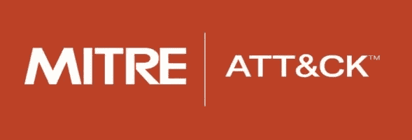
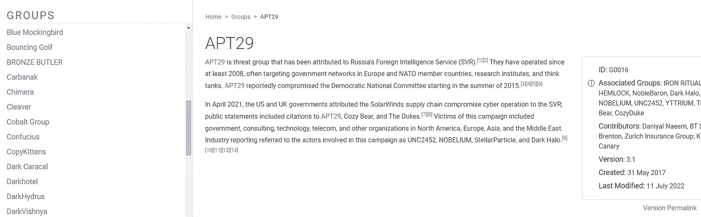
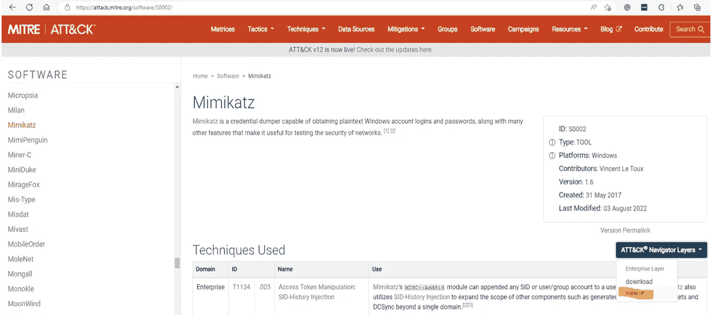
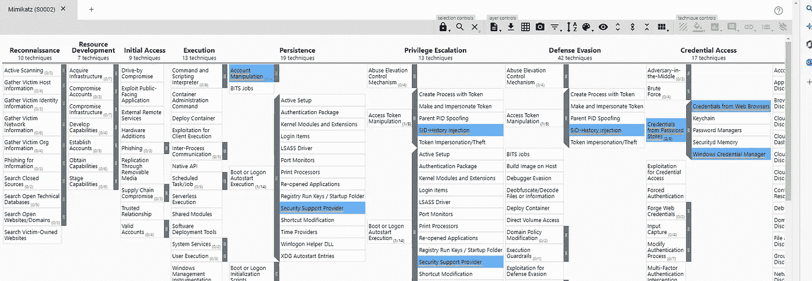
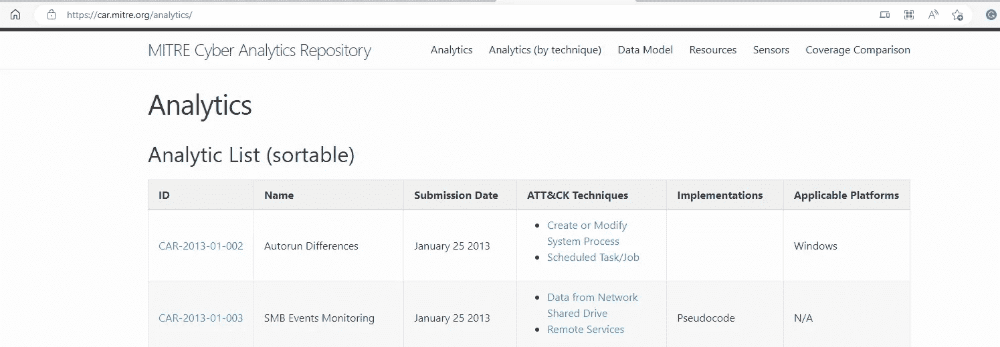
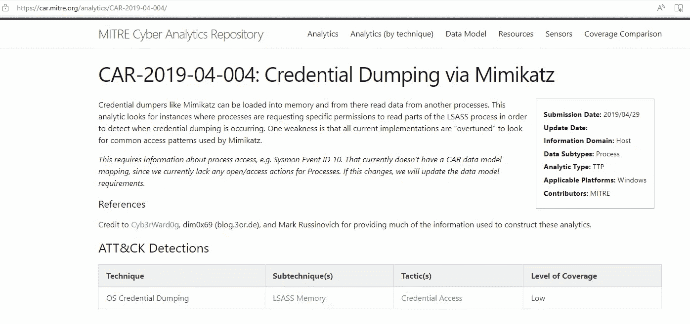
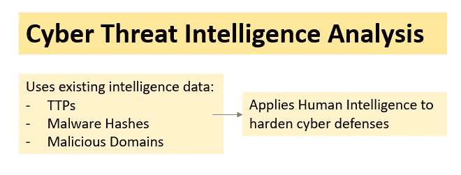
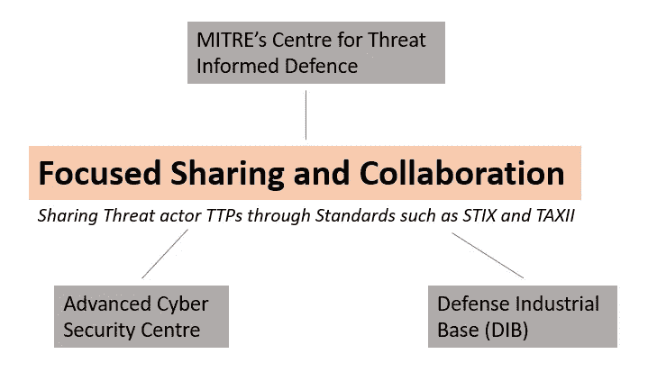

# 运作米特 ATT 和 CK 公司以强化网络防御

> 原文：<https://infosecwriteups.com/operationalizing-mitre-att-ck-to-harden-cyber-defenses-ba9f6852228f?source=collection_archive---------2----------------------->

## 从防守队员的角度看对手

*我最近刚刚完成了* [*“实施 MITRE ATT&【CK】*](https://www.academy.attackiq.com/courses/foundations-of-operationalizing-mitre-attck)*课程，我认为与大家分享一些重要的注意事项和分享我从这个广泛认可和接受的网络安全防御框架中学到的东西会很有用。*

# 米特 ATT 和 CK 简介

一个框架，其中防御者从对手的角度出发，寻找已知的对手行为。这有助于防御者针对可能的高风险攻击调整防御。

*记住，*

*   **战术是对手的技术目标。**
*   **技巧是实现这些目标的方法。**
*   **程序是技术的具体实现。**

*云原生 SIEM，即微软 Sentinel 也使用米特 ATT & CK 框架来识别各种实体，如受害者、犯罪者或杀伤链中的中枢点。*

米特 ATT&CK 框架是攻击者在入侵过程中使用的技术和子技术的集合。ATT&CK 矩阵将这些技术分解为以下策略:

*   **初始进入** —利用各种进入媒介获得立足点的技术。通过初始访问获得的立足点可能允许继续访问，如有效帐户和外部远程服务的使用，或者可能由于更改密码而被限制使用。
*   **执行** —导致对手控制的代码在本地或远程系统上运行的技术。运行恶意代码的技术通常与所有其他策略的技术结合使用，以实现更广泛的目标。
*   **持久性** —对手使用的技术，用于在重启、更改凭证和其他可能切断其访问的中断时保持对系统的访问。
*   **权限提升** —对手用来在系统或网络上获得更高级别权限的技术。这些技术经常与持久性技术重叠。
*   **防御规避** —敌人在整个攻击过程中用来避免被发现的技术。
*   **凭证访问** —窃取凭证(如帐户名和密码)的技术。
*   **发现** —对手用来获取系统和内部网络信息的技术。本机操作系统工具通常用于实现这一妥协后的信息收集目标。
*   **横向移动** —对手用来进入和控制网络上的远程系统的技术。
*   **收集** —对手用来收集信息的技术以及收集信息的来源，这些信息与跟踪对手的目标相关。
*   **命令和控制** —在受害者网络中，对手用来与受其控制的系统进行通信的技术。
*   **渗透** —敌人用来从你的网络中窃取数据的技术。
*   **影响** —对手通过操纵业务和运营流程来破坏可用性或损害完整性的技术。

## 将威胁因素的技术映射到企业 ATT&CK 矩阵

要实施 ATT 和 CK 框架，请选择您想要调查的威胁组，并在企业 ATT 和 CK 矩阵中绘制他们的技术。这可以通过以下用例来实现:

*   威胁情报—[http://attack.mitre.org/groups/](http://attack.mitre.org/groups/)
*   检测和分析—[https://car.mitre.org/analytics/](https://car.mitre.org/analytics/)
*   对手模拟和 Red 团队合作—违规和攻击模拟(BAS)工具

# 威胁情报

## ATT 和 CK 威胁组页面

提供威胁集团/威胁参与者及其战术和技术详情的列表-[http://attack.mitre.org/groups/](http://attack.mitre.org/groups/)

> ***演示——将威胁行动者的手法映射到企业 ATT & CK 矩阵***
> 
> 想象一下，一家公司遭受了凭据泄露，并被误导认为对此负责的威胁参与者是 APT29。
> 
> 在这里，您可以使用米特 ATT 和 CK 找到他们的数据库 APT29，并了解与证书转储技术相关的详细信息，用于该技术的软件等。

## 使用 ATT 和 CK 导航工具

一个用来可视化 ATT&CK 矩阵的工具。它有助于识别攻击者使用的技术，这些技术可能对您的组织很重要-[https://mitre-attack.github.io/attack-navigator/](https://mitre-attack.github.io/attack-navigator/)

> ***继续之前的演示…***
> 
> 找到威胁者使用的软件后，点击 ATT 和 ck 导航层>“查看”以可视化攻击矩阵。
> 
> 进入该页面后，您将看到不同战术的突出显示技术。将鼠标悬停在突出显示的技术上，阅读关于 Mimikatz 凭据失窃的评论。

关于 Mimikatz 软件

米米卡茨战术和技术

## 查找与行业相关的威胁组

*   参观 http://attack.mitre.org/
*   转到“搜索”页面，输入行业名称，如医疗保健
*   选择您想要了解更多信息的威胁因素，并点击“ATT 和 ck 导航器层>视图”以可视化该特定威胁因素的技术。

## 对于将组织英特尔映射到米特 ATT 和 CK 的更成熟的组织

如果您可以访问以前的事故报告，开始将报告中确定的策略映射到米特 ATT 和 CK 矩阵。

识别和研究对手的行为(对手的行动，即“建立足球 5 连接。”)并找出哪些斜接技术适用于该行为。

# 检测和分析

## 使用 SIEM 或 MITRE 网络分析库(CAR)工具收集和分析数据

*   MITRE CAR 是 MITRE 基于 MITRE ATT 和 CK 对手模型开发的分析知识库。
*   参观[https://car.mitre.org/analytics/](https://car.mitre.org/analytics/)以扩大。即“Mimikatz 凭证转储”技术。

*   CTRL+f 搜索与“Mimikatz”相关的凭据转储

# 对手模拟和红队

对手模拟是红队参与的一种类型，它通过混合威胁情报来定义红队使用的行动和行为，从而模拟对组织的已知威胁。

如果没有红队，组织可以使用:

*   米特雷破火山口
*   开源红队工具
*   攻击智商商业基础

# 威胁知情防御的 3 个要素

使用网络威胁情报分析有助于主动预测、预防、检测和应对网络攻击。

**防御威胁**采用英特尔分析期间发现的行为模型(即..e . CRITS)寻找未决、活跃或成功的网络攻击的迹象。BAS 工具使用行为模型来自动测试和报告我们企业中行为模式。

*那都是乡亲们！*

## 来自 Infosec 的报道:Infosec 每天都有很多内容，很难跟上。[加入我们的每周简讯](https://weekly.infosecwriteups.com/)以 5 篇文章、4 个线程、3 个视频、2 个 GitHub Repos 和工具以及 1 个工作提醒的形式免费获取所有最新的 Infosec 趋势！