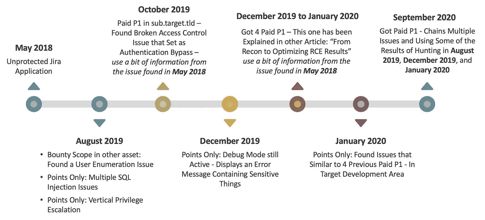
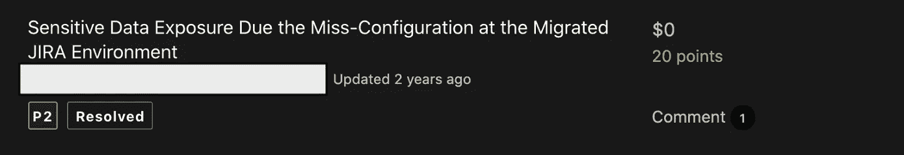
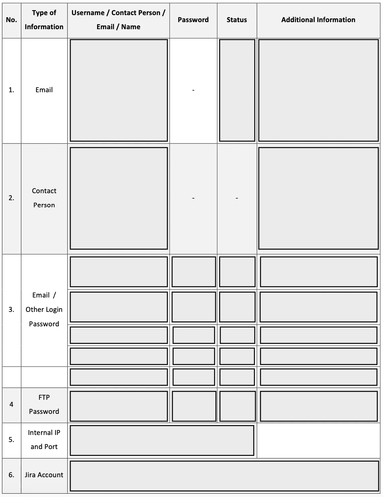
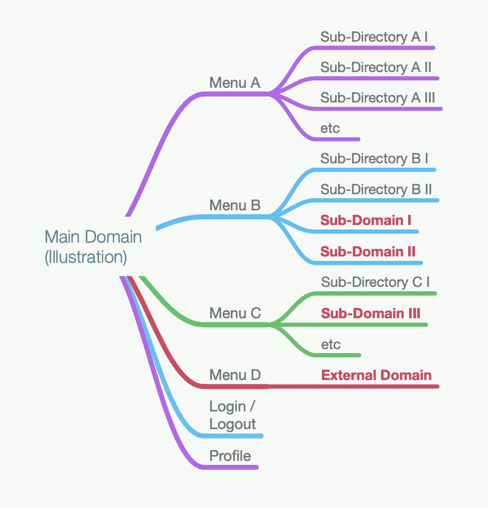
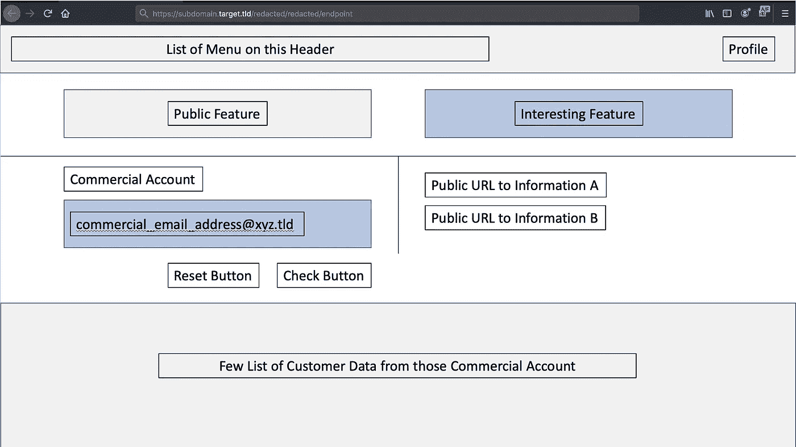
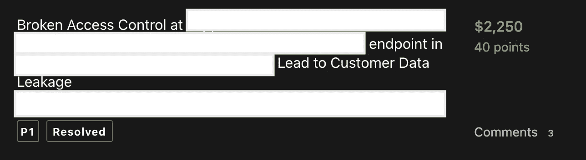
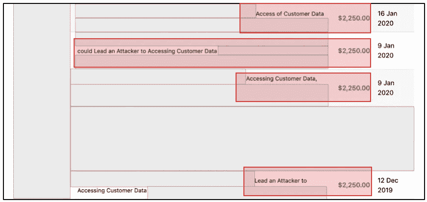
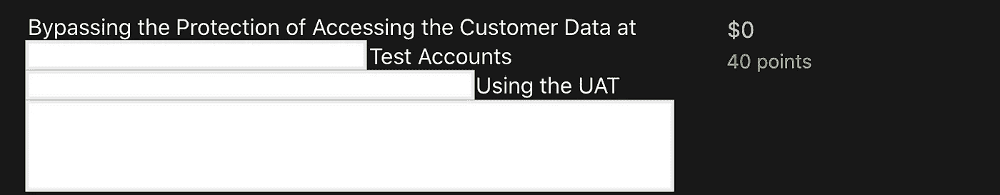
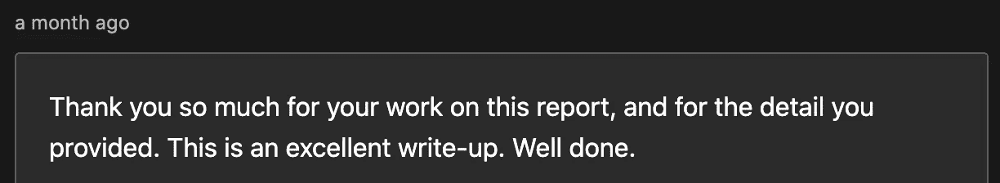
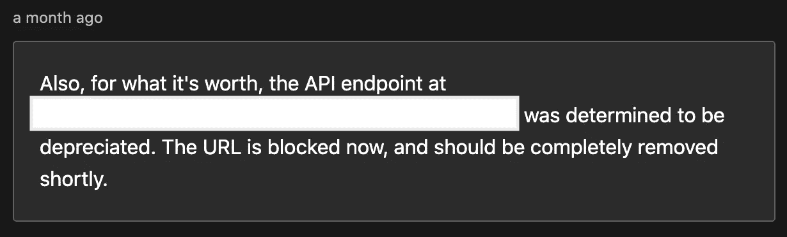

# 优化 VDP 的狩猎结果，用于 Bug Bounty 计划——从敏感信息泄露到访问可用于检索客户数据的隐藏 API

> 原文：<https://infosecwriteups.com/optimizing-hunting-results-in-vdp-for-use-in-bug-bounty-programs-from-sensitive-information-607c55f11ed5?source=collection_archive---------2----------------------->

## 一个故事，当真主意愿我试图优化我的发现，在点只计划，以便能够获得 6 支付 P1 问题，在赏金计划。

بسم الله الرحمن الرحيم

```
Mirroring from: [http://www.firstsight.me/2020/11/optimizing-hunting-results-in-vdp-for-use-in-bug-bounty-programs---from-sensitive-information-disclosure-to-accessing-hidden-apis-which-can-be-used-to-retrieve-customer-data/](http://www.firstsight.me/2020/11/optimizing-hunting-results-in-vdp-for-use-in-bug-bounty-programs-from-sensitive-information-disclosure-to-accessing-hidden-apis-which-can-be-used-to-retrieve-customer-data/)
```

像往常一样，我将尝试用两种不同的方法发布这篇文章，它们是:

*   对于那些只需要这一发现的要点的人(如果读者已经理解了每一个流程，这可以节省大量的时间)，请查看 TL；DR 部分，以及
*   对于那些需要了解这一发现的执行流程或过程的人。总之，它可以告诉读者一些心态，并希望能帮助人们丰富自己的见解。

请注意:这篇报道可能会很长。因为除了试图告诉读者我是从哪里开始从这项活动中获得积极成果的，我还试图将它与我之前发布的一篇文章联系起来。总之，我会努力继续改进这篇文章(因为**我发现收集某个时间**的故事有点困难)。我有可能会漏掉什么。

除了那些困难的事情，享受这个故事。

**注:**对了，这里不多截图了。希望你看的时候不困。但是，再次，享受这个故事。

# I. TL 速度三角形定位法(dead reckoning)

姑且说这张票讨论的主要目标是 **mainredacted.target.tld** (赏金计划)。所以，这里有一些简单的观点:

*   未受保护的吉拉问题于【2018 年 5 月在 **sub1** .target.tld(积分计划)被发现——允许我获得由电子邮件地址(包括凭据)和多个端点组成的各种信息(以讨论和截图的形式)。我保留了所有的狩猎结果。
*   在 **sub2** .target.tld 上**2019 年 8 月**发现简单的用户枚举问题(bounty program，但不是 mainredated . target . TLD)——我保存了枚举的每个邮箱地址。
*   在**2019 年 8 月**在**sub 3**. target . TLD(points-only program)发现多个 SQL 注入问题——允许我枚举所有注册的电子邮件地址(是的，我保存了这些结果)。
*   在**2019 年 8 月**在 **sub4** .target.tld(积分计划)找到了一个简单的 IDOR 允许我访问他们的管理员仪表板，并获得了一个庞大的注册电子邮件地址列表。同样，我也保存了这些结果。
*   使用我从 2018 年 5 月获得的信息在 mainredacted.target.tld 上的**2019 年 10 月**发现了被破坏的访问控制问题(未受保护的吉拉应用)。得到了一个支付 P1(2250 美元)。
*   在 2019 年 12 月的**中，我发现在 targetXYZ.tld(仅限积分计划—该资产属于 target.tld)中仍处于活动状态的调试模式存在敏感信息泄露。我设法登录到他们的管理员仪表板，并下载了一个 csv 文件，其中包含相当多的内部员工的电子邮件地址列表。是的，我也保存了这个结果。**

**注意:**我保留所有的搜索结果是出于某种考虑，即因为 InshaAllah 有一天会有用，也因为没有删除测试结果的规定(在正式的 PenTest 工作中通常是这样做的)。

*   在【2019 年 12 月至 2020 年 1 月，我还发现了 4 个付费 P1 问题(在 main reduced . target . TLD)，这些问题在我的其他文章[“从 Recon 到优化 RCE 结果”](https://medium.com/bugbountywriteup/from-recon-to-optimizing-rce-results-simple-story-with-one-of-the-biggest-ict-company-in-the-ea710bca487a)中已有大部分解释。(这 4 个付费 P1 的总额为 9000 美元)。
*   在【2020 年 1 月我在 main reduced . target . TLD 发现了一个类似于之前 4 个付费 P1 的问题，但是我是在他们的**开发区**发现的(决定为积分计划)。当时无意中截图了正在使用的 API 的 HTTP 请求(而这个 API 在我 2020 年 9 月返回猎杀这个目标时会派上用场)。
*   2020 年 9 月**2020 年**我从弱登录实现、弱凭证(因为我是从 2019 年 12 月到 2020 年 1 月的活动中得到他们的模式)、使用隐藏 API、速率限制问题等几个问题进行了连锁。这让我进入了另一个付费的 P1 问题(2500 美元)。

这是一个大概的“时间框架”:



简单的“时间框架”

这里没有令人兴奋的新技术。我所做的唯一一件事就是收集一条信息和另一条信息，并尝试将其用于范围内(赏金)的目标。

# 二。小小的闪回

**2.1。故事从我 2018 年 5 月提交的报告开始**

当时我在一个(只分)程序里找 bug，因为覆盖面广，很刷新。简而言之，我发现了一个名为“吉拉”(是的，一个吉拉应用程序)的子域，它不需要验证就可以看到足够多的门票。虽然乍一看很有趣，但遗憾的是这些票大部分都是 2016 年底制作的(似乎最新的票都是以公众看不到的模式制作的)。

当然，像这样报告发现不足以增加影响。因此，我尝试查看一些具有特定关键字(如密码、管理员、root、电子邮件、数据库等)的票证内容。)希望我能进一步展示这种影响。

找了一会儿后，我终于发现了一些有趣的东西，比如:

*   登录到其中一个门户的少数凭证(用户名和密码),
*   一些显示终端和少量客户数据的屏幕截图，以及
*   无法访问的端点信息，因为它可能仅用于内部访问或不再有效，因为票是在 2016 年底制作的(我在 2018 年打开了票)。

提交后，几天后，项目负责人认为该问题有效，并指定 P2 负责该发现，并声明该问题在 5 个月后得到解决。



P2 用于不受保护的吉拉应用程序

**简短说明:**

*   我试着登录了我找到的几个账户，但当时我还没有看到进一步使用这个账户有什么好处(我没有花太多时间分析它，因为当时我只是为了刷新而寻找 bug)。所以，也许这就是他们决定严重性是 P2 的原因。

**注:**但当我重新分析这个发现(1 年 5 个月后——2019 年 10 月)Alhamdulillah 时，我终于在这个程序中找到了我的第一个付费 P1。这种情况一直持续到安拉让我在 2019 年 12 月至 2020 年 9 月期间再获得 5 个付费 P1。

*   还记得我的一篇文章吗，InshaAllah，像这样的程序(合法的，范围很广——虽然只有点)可以帮助我们学习很多东西，这样它们就可以在我们的狩猎活动中帮助我们。
*   出于某种考虑，我保留了所有的搜索结果，也就是说，因为总有一天它会有用，也因为没有删除测试结果的规定(在正式的 PenTest 工作中通常是这样做的)。

**2.2。故事 2019 年 10 月重开**

在 2019 年 8 月至 2019 年 9 月的一个场合，我专注于他们 bounty 计划中的一个子域(让我们称之为 sub 2 . target . TLD——我已经就此写了一篇文章，但几个月后我删除了它，因为它真的搞砸了)和他们 points only 计划中的几个子域。在实现了我认为对该目标足够好的结果之后(我对我可以用这个目标做什么没有更多的想法)，我试图在 2019 年 10 月将我的注意力转向他们的其他资产(让我们称之为**main redated . target . TLD**)(如果这个资产连接到他们的 SSO 服务之一，我最终意识到这一点)。

那么，我该怎么开始呢？

我开始做的事情之一是回去看看我在 2018 年 5 月的狩猎结果(与我从吉拉的结果中获得的信息相关)。原因很简单，即因为我当时的目标子域对我来说似乎很熟悉，也因为我相信我以前没有在这个子域上优化过我的测试。

**2.2.1。(再次)查看一下已经获得的凭证和端点**

在决定查看我从他们的吉拉上的(一些)门票中获得的信息之后，我开始学习我已经创建的凭证和端点映射。



简单映像

**不幸的是**，在我得到的 5 个凭据中(不包括 FTP)，只剩下一个有效凭据(而且不是使用他们的官方域名——更像是普通用户的电子邮件)。但是当然，总比没有好，对吧？

试着用这个账号玩了一会儿，终于发现这个账号连接了他们的 SSO 服务。大致情况是这样的:



网站插图

上图只是一个简单的图解，让大家更容易了解情况。我个人真的不记得有多少子域链接到这个资产。当我发现有一个子域超出了范围(赏金计划)时，我就通过了——因为我倾向于关注赏金计划范围内的目标。

在尝试访问每个菜单和每个子域后，我终于遇到了一个子域，其中有一个标签为“内部资源”的菜单(**main redated . target . TLD**)。从这种情况来看，我试图与我拥有的帐户进行比较。

**短笺:**

*   关于“内部资源”菜单的发现很有趣，考虑到我使用的帐户看起来像一个普通用户(因为它不使用官方域)。这就像我们创建自己的帐户，然后这个帐户被赋予访问该菜单的权限。
*   该应用程序允许用户注册并使用其中包含的一些常用功能。

**2.2.2。使用“内部”和外部帐户(特殊权限)访问网站的比较**

当我第一次看到标有“内部资源”的菜单时，我相当惊讶。因为正如我所说，这个帐户不使用来自目标的官方电子邮件地址。所以，我开始假设几件事，即:

*   也许这是一个面向所有注册用户的菜单(但这几乎是不可能的，因为我很清楚他们使用的是“内部”一词)
*   也许这个菜单是由于他们内部开发的错误而意外出现的，或者
*   也许这个应用程序的一个内部用户已经注册了他们的个人电子邮件地址，以便能够获得“特殊”的访问权限。

但不管什么原因，为了确保它不是面向公众的，我试图将其与我的个人帐户进行比较。简而言之，事实证明我的一个假设是正确的，内部用户已经注册了他/她的个人电子邮件地址，以便能够访问这个“内部资源”菜单。

起初，我很高兴发现这一点。不久之后，我试图与程序负责人讨论这个问题，并得到了这个不符合奖金资格的决定(像这样的问题只符合积分资格)。是的，这个菜单中的信息危险性较低，尽管它是供内部使用的(在我一个一个地打开它之后，没有任何文档显示敏感信息，如用户数据等)。这类似于内部使用的一般操作手册文档)。他们承认这一点，但不是因为他们的赏金计划。

2.2.3。(再次)看一下已经获得的截图:检索客户数据的端点。

**我停下来了吗？**没有。请记住，除了凭据和端点信息，我还有第三样东西，那是我保存的他们吉拉中一些门票的截图。从我保存的大约 16 个截图中，有一个截图真正引起了我的注意，它是一个子域—**main redated . target . TLD**(我正在关注它)，其端点包含客户数据。

或多或少，截图看起来像这样:



特征说明

在简单比较了我的账户和我在吉拉上找到的账户之后，我发现我的账户没有显示“商业账户”栏的“有趣功能”。简而言之，可以访问这个内部资源的帐户也可以访问这个有趣的功能。

那么，下一步是什么？从这里，我尝试输入我在截图中找到的电子邮件地址，结果是我能够从该公司的电子邮件地址中检索到客户数据。

需要注意的是，这个有趣特性的执行将通过 API 向端点发出请求。

**还有什么？**如果我遇到这样的情况，那么有几件事可以做，即:

*   当然，尝试注入电子邮件列(SQL 注入、XSS 和其他类似的注入)。但不幸的是，这并不顺利，因为他们有一个 WAF，可以阻止我做的各种注射(这可能是因为我没有很好的能力来绕过这个 WAF)。
*   利率限制问题，以帮助我们获得客户数据。不幸的是，这也不顺利。除了从他们的吉拉机票上获得的数据，我没有太多的数据可以使用。(那时候我还没想好 2019 年 8 月份得到的狩猎结果)。
*   另一件可以做的事情是，尝试使用我们拥有的普通帐户，甚至根本没有帐户来访问这个有趣的功能。是的，这种情况确实很好。我们不需要认证就可以访问它！

**短课:**

*   从这里我们可以学到一件有价值的事情，那就是我们需要很好地了解应用程序，这样我们就可以更好地测试它。2018 年，由于我只打算做一个简单的复习，我没有试图进一步研究这个问题，结果让我错过了很多东西。

但还有一件好事是，2019 年他们增加了奖励范围，所以我也设法获得了更好的奖励。凡事总有好的一课。阿尔汉姆杜利亚。

*   正如你所看到的(从第 2.2.1 节)，我只剩下一个仍然有效的帐户。但是，即使只剩下 1 个账户，也不要绝望。因为这个账号，InshaAllah，在我们的狩猎活动中还是可以优化的(就像这个案例中发生的)。

**2.2.3.1。破坏访问控制问题—无需有效帐户即可访问私有端点(仅供内部使用)。**

在上一节中，我已经解释了一点，我们将尝试使用我们拥有的普通帐户或甚至没有帐户来访问这个有趣的功能。

在执行的时候，我试图在没有帐号的情况下访问这个有趣的功能**。因为当然，当您能够在没有有效帐户或有有效帐户的情况下检索客户数据时，影响将是不同的(虽然我个人不知道 Bugcrowd 和程序所有者是否会同意这一观点。不过，值得一试)。**

作为一个简单的例子，这里有一个 API 请求的例子——当然，我已经审查过了:

```
POST /api/1stRedacted/2ndRedacted/1stendpoint HTTP/1.1
Host: mainredacted.target.tld
X-CSRF-Token: unique_token_of_**valid_session**_here
Cookie: **valid_user_cookies**_hereParameterContainUserEmail=specific_email_address@target.tld
```

要执行这个场景(在没有有效帐户的情况下访问该特性)，我们可以采取的最简单的步骤是删除请求中与会话相关的所有内容(比如 cookies 或报头中的唯一令牌)。不幸的是，这并没有奏效。

在那种情况下，当我们想在不使用有效帐户的情况下访问几个菜单时，我试图回顾应用程序发送的请求。在这种情况下，我终于意识到，即使我没有登录，这个应用程序仍然会发送在头中带有(非登录状态)唯一令牌的请求。

不久之后，我试图检索惟一的令牌和 cookie(在非登录状态下),以便在该端点上重用它。简而言之，我设法在不需要有效帐户的情况下检索客户数据。

```
POST /api/1stRedacted/2ndRedacted/1stendpoint HTTP/1.1
Host: subdomain.target.tld
X-CSRF-Token: unique_token_in_**non-login_state**
Cookie: user_cookies_in_**non-login_state**ParameterContainUserEmail=specific_email_address@target.tld
```

在我报告这一情况后，Bugcrowd ASE 和程序所有者决定该问题的严重性为 P1，并将其放在“绕过身份验证”类别中(供您参考，我选择了无任何严重性的破坏访问控制类别)。



访问控制中断—被确定为绕过身份验证

Alhamdulillah，这是我在这个项目中第一次获得 P1 奖。

在那之后，狩猎在这里停止了大约 2 个月，因为我不知道该做什么。

# **三世。故事从 2019 年 12 月延续到 2020 年 1 月**

我在今年早些时候写的一篇文章中解释了这一点— [“从侦察到优化 RCE 结果”](https://medium.com/bugbountywriteup/from-recon-to-optimizing-rce-results-simple-story-with-one-of-the-biggest-ict-company-in-the-ea710bca487a)。但我想在这一点上补充一些东西，以便读者可以看到我在 2020 年 9 月获得的付费 P1 问题的流程。

**3.1。简单回顾一下**

正如我所解释的，从这些活动中，我发现了相当多关于 P1 严重性的问题(其中 4 个触及了导致付费 P1 的**main reduced . target . TLD**资产)。

对于 3 个付费 P1 问题，流程与前一个完全相同，即我设法用他们的一些内部公司账户**(不再是一个看起来像公共电子邮件地址的普通用户的账户)登录，该账户使用我找到的凭证模式，可以访问前面讨论过的有趣功能。**

****注意:**他们认为这是一个问题，因为我发现的账户**使用公司电子邮件**，而**有权访问可用于检索客户数据的特性(API)** 。**

****

**4 个付费 P1**

****那么，另一个呢？**当我设法登录到他们的另一个仪表板时(这也很重要，但还没有包括在范围内的 bounty 资产中)，我发现了一封模式为 test_x@target.tld(用数字替换 x)的电子邮件。当时我试着用这个邮箱(在**main redacted . target . TLD**上)用我找到的密码模式登录，Alhamdulillah，成功了。同样，这个帐户也可以访问前面讨论的特性(API)——找到的测试帐户总数大约是 20 个。所以，所有 4 支 P1 的故事都结束了。**

****当时他们是怎么缓解的？在我看来，他们正专注于解决问题所在。换句话说，他们更改了密码或停用了账户。我已经建议他们将我发现的任何密码模式列入黑名单。但看起来他们并没有这么做(至少，据我所知，直到 2020 年 9 月)。****

**我怎么知道？很简单，因为他们的一个应用程序(连接到他们的单点登录)在登录失败时会从显示的消息中得到通知。如果账号存在但密码错误，会说密码错误。同时，如果帐户和密码是正确的，但该帐户已被停用，它会说，该帐户已被禁用。**

****3.2。他们更改了受影响帐户的密码，并停用了测试帐户，那么接下来该怎么办？****

**说实话，当时我有点不愿意这场狩猎活动就此结束(尽管在这场狩猎活动的最后，真主意愿我在他们的一个公共资产中找到一个 RCE，并成功接入他们的内部网络)。那么，我该怎么办？**

**记住，2018 年我已经列举了这个目标的子域。从这些结果中，我发现有几个子域包含名称 test、stg、uat 等等。简而言之，在此期间重复了子域枚举活动之后，我试图找到我正在测试的应用程序的测试版本(包含 test、stg、uat 等等的名称)，并试图通过该资产登录。**

**令人惊讶的是，在生产领域被停用的测试帐户，可以在开发领域被重用。**

**报道之后，我又得到了另一个 P1。但不幸的是，即使影响是相同的，他们认为这个子域不包括在 bounty 计划的范围内资产中。然而，至少这比被认为是复制品要好得多。**

****

**发展领域的问题**

****这里有一个有趣的事情**。你知道那是什么吗？**无意中，我在 burp suite**中展示了一个带有 HTTP 请求视图的截图，我的目的是展示它在生产中是不可复制的，但在开发领域是可复制的。**

**请记住这一点，因为在 2020 年 9 月的故事中，我们将回到这一点。**

# ****四世。最后，从这里开始，我的 2020 年 9 月 P1 付费报告的内容开始****

**总的来说，在 2020 年 9 月，我又遇到了一个使用我找到的凭据模式的帐户(我会在另一节告诉你如何)，回来后看到了我之前找到的完全相同的界面(在 2019 年 10 月)。但当我试图输入一个我知道有用户数据的电子邮件地址时，结果是应用程序不再显示其中的用户数据。在我分析了所使用的请求后，发现 API 确实发生了变化。**

**考虑到这种情况，我最终试图做进一步的分析，并回去查看我以前的一些报告。简而言之，我找到了一种方法来“绕过”开发人员为防止用户(即使有特权)检索客户数据(通过以前的 API)而实施的“保护”。**

**要达到这一点，至少需要 4 个脆弱环节，即:**

*   **在他们的一个门户网站(让我们称之为 weaksub.target.tld，它连接到他们的 SSO)上的弱登录实现可以指导我们确定哪个目标的帐户正在使用弱密码。**
*   **target 的一些员工仍在使用弱密码。**
*   **“bypass”(我引用这个词是有特定目的的)保护，已经在 **mainredacted.target.tld** (我重点介绍的)上实现，防止一些内部用户收集客户数据(这个 Bypass 使用无保护的直接 API 访问)。当时，我能够从多个客户那里提取客户个人信息。**
*   **API 端点中的速率限制问题，使得攻击者能够确定哪个内部帐户拥有客户个人信息详细信息。我已经能够在大约 10 分钟内暴力破解超过 10，000 个帐户。**

**我将在这里粘贴我的报告，并编辑与公司名称、端点和任何敏感数据相关的任何内容。当然，我会增加一些章节来加强对这个流程的解释。**

****4.1。第一步—尝试找到一个未受到良好保护的端点****

**正如我们所知，目标子域上有几个站点连接到 SSO。简而言之，通过只使用在 accountcreationsubdomain . target . TLD 上创建的一个帐户，我们将能够登录到其他几个站点(当然，前提是我们对这些其他站点拥有正确的访问权限)。**

**从找到的大多数端点可以看出，大多数端点是受验证码保护的。这意味着我们肯定不能对他们进行自动蛮力。但是经过一番探索，我终于发现 https://weaksub.target.tld/的一个入口——不受验证码的保护。它只对登录尝试进行限制(6 次尝试)。**

**顺便提一下，weaksub.target.tld 资产是他们的积分计划的一部分。正如我在 2.2.1 节中所描述的，这个资产在主域中是找不到的。我通过查看我的子域枚举结果(从截图中——因为我们可以从类似的界面中认出它)找到了这个。**

****4.2。第二步—发现一个未受到良好保护的端点，然后呢？尝试找到有效的帐户！****

**而且从我提交的其中一份报告(故事发生在 2019 年 12 月至 2020 年 1 月期间)中我们知道，我通过 GitHub Recon 收集了很多凭据(密码是否有效/无效)。通过这次侦察活动，我终于发现了一个频繁出现的凭据模式。基于这个活动，我可以假设这些是管理员为每个用户提供的默认凭证(这个假设是正确的)。**

**从这里开始，我使用从 SubW、SubX、SubY、TargetXYZ 以及 GitHub Recon 中提取的帐户集的所有凭据。**

****4.2.1。那么，到底什么是 SubW、SubX、SubY、TargetXYZ 呢？****

**简单来说，这四个子域名是允许我获取上面列出的所有邮件的子域名。**

*   ****SubW—sub 2 . target . TLD(2019 年 8 月)— Bounty Scope** :我发现了一个问题，它允许我通过简单地更改它们的一个端点中的 ID 参数(基于数字)来枚举所有注册的电子邮件地址。是的，我保留了整个名单。这一个也提供了赏金，我从这得到了我应得的 P4。**
*   ****SubX—sub 3 . target . TLD(2019 年 8 月)— Points Only 范围**:我发现多个 SQL 注入问题，允许我枚举所有注册的邮箱地址。这个不提供赏金，但是他们给了我 1000 美元。**
*   ****SubY—sub 4 . target . TLD(2019 年 8 月)— Points Only Scope** :我找到了一个简单的 IDOR，可以让我访问他们的管理员仪表盘。简而言之，我设法列举了所有列出的电子邮件地址。**
*   ****target XYZ . TLD(2019 年 12 月)— Points Only Scope** :我发现在他们正在使用的 Laravel 应用中，调试模式仍然处于活动状态。当我访问其中一个端点(使用 dirsearch 搜索)时，发现该端点显示一条错误消息，其中包含敏感信息，如数据库密码和登录管理员仪表板的密码。简而言之，我登录到管理仪表板，下载了一个 csv 文件，其中包含了他们内部员工的电子邮件地址列表。**

**正如我们所见，上述 3 个目标只是一个积分计划。然而，从这些目标中，我在提取包含在 **mainredacted.target.tld** (列在他们的赏金程序中)中的数据时获得了最优结果。**

****4.2.2。**[**【https://weaksub.target.tld/】**](https://weaksub.target.tld/)**(没有验证码保护的)**中暴力攻击的结果**

**那么，结果如何呢？Alhamdulillah，这次攻击的结果产生良好的输出。我用找到的密码模式找到了几个有效账户。**

****注意**:在 6 次“可用”登录尝试中，我只使用了他们最常用的两种密码模式。所以，我们不会有被封锁的麻烦。毕竟屏蔽只持续了 15 分钟，屏蔽了也没什么大不了的。**

****4.3。第三步—我找到了几个有效的账户，然后呢？尝试在 mainredacted.target.tld 门户**中找到可以访问内部菜单的账户**

**这就是挑战。即使我们已经找到了有效的帐户，我们也必须在这些帐户中找到对 **mainredacted.target.tld** 具有特定访问权限的帐户(这是通过 API 实现的一个有趣的特性，前面已经讨论过)。简而言之，从这几个有效的帐户中，我终于找到了一个对门户有特殊访问权限的帐户。(听起来很熟悉？但是这次不像以前那么容易**，因为他们的开发者改变了应用流程，以防止客户数据提取**。**

**因此，在我们进一步探讨“旁路”技巧之前，让我们试着回到这个**main redated . target . TLD**的情况。**

**4.3.1。回到 2019 年 10 月的故事(第 2.2.2 节。【关于此报告)**

**从我在 **mainredacted.target.tld** 门户中的一份旧报告中，我们了解到，为了能够通过这个有趣的功能提取客户数据，我们必须拥有对**/API/1st redacted/2nd redacted/1st Endpoint**端点的访问权限。基本上，这个端点将负责通过输入正确的电子邮件地址来提供详细的客户数据。**

****注意:**在我的原始报告中，我向他们展示了 HTTP 请求、响应以及界面的截图。但是我不能在这里展示。请记住本节中的端点上下文。**

****4.3.2。如前所述，他们的开发者已经改变了 mainredacted.target.tld 门户访问这个有趣特性的方式****

**如果从上一节我们看到，我们可以通过输入有效的电子邮件地址立即查看客户数据，但此时，**main redacted . target . TLD**门户不再显示客户详细信息。简而言之，功能、功能名称和界面都很相似，但是结果却大不相同。现在该功能只显示日期和中的一些**敏感信息，而不是显示客户数据。****

**在仔细查看了请求之后，我发现这个端点是否真的与我之前提到的那个不同。**

**以前的 API 请求:**

```
POST /api/1stRedacted/2ndRedacted/1stendpoint HTTP/1.1
Host: mainredacted.target.tld
X-CSRF-Token: unique_token_of_valid_session_here
Cookie: valid_user_cookies_hereParameterContainUserEmail=specific_email_address@target.tld
```

**当前 API 请求:**

```
GET /api/vx/3rdRedacted/4thRedacted/5thRedacted/2ndEndpoint?ParametercontainUserEmail= specific_email_address@target.tld  HTTP/1.1
Host: mainredacted.target.tld
X-CSRF-Token: unique_token_of_valid_session_here
Cookie: valid_user_cookies_here
```

**正如我们所看到的，现在他们使用 x 版本来实现非常相似的特性(具有不同的路径和端点)。但是，在这种情况下，该流程完全阻止用户(具有特殊访问权限)再次提取客户数据。**

**是的，我已经放回了/api/1st redacted/2 ndredacted/1 stend point(2019 年 10 月使用的 API)端点，希望获得客户数据，但它失败了。这个端点不再工作了。**

**所以，这将是另一个挑战。**

**4.3.3。还记得我关于这个目标门户的测试版本的报告吗？是的，测试版！(第 3.2 节)。**

**在第 3.2 节的最后，我说:*“我无意中展示了一个在 Burpsuite(在该报告上)中配备了 HTTP 请求视图的截图，我的目的是展示它在生产中不可再现，但在开发领域可再现。”***

****这为什么有趣？**因为原来他们向不同的端点发送请求，收集 2019 年 10 月的流量、2019 年 12 月到 2020 年 1 月的流量等完全相同的数据，但是端点不同。**

**简而言之，从我的报告截图中，我意识到又提出了一个 API 请求，它是:**

```
POST /api/vx/6thRedacted/3rdEndpoint HTTP/1.1
Host: mainredacted.target.tld
X-CSRF-Token: unique_token_of_valid_session_here
Cookie: valid_user_cookies_hereParameterContainUserEmail=specific_email_address@target.tld
```

**从这里开始，我尝试将这个端点(API vx)放到请求中，并使用参数 ParameterContainUserEmail POST 数据将其发送到 POST 请求中。令人惊讶的是，我能够通过这个端点再次提取客户详细信息。简而言之，我们将能够通过使用旧的 API 请求来“绕过”这个特性的保护。(现在你会明白我为什么要引用“绕过”这个词了，因为这其实并不是一个纯粹的绕过，它只是在开发区使用了旧的 API 他们的开发者把它藏在了生产区)。**

****等等**，那么我说我从 SubW、SubX、SubY、TargetXYZ 以及 GitHub Recon 中提取的账户集有什么意义呢？好吧，第四步将是答案。**

****4.4。第四步 API 端点中的速率限制问题，使得攻击者能够确定哪个内部帐户拥有客户个人信息。****

**因此，在这一点上，我们已经知道了仍然可以使用的旧 API(被他们的开发人员隐藏起来，以防止数据提取再次发生)。下面是一个请求示例:**

```
POST /api/vx/6thRedacted/3rdEndpoint HTTP/1.1
Host: mainredacted.target.tld
X-CSRF-Token: unique_token_of_valid_session_here
Cookie: valid_user_cookies_hereParameterContainUserEmail=specific_email_address@target.tld
```

**从这里开始，我们只需要将"**parametercontainuseemail**"值改为其他值。也许问题是，我现在用的是什么价值观？**

**如前所述，我使用了从 SubW、SubX、SubY、TargetXYZ 以及 GitHub Recon 中提取的大量帐户。到目前为止，它已经给出了大约 10，000 个唯一的电子邮件地址。**

**简而言之，通过使用这一万个邮箱地址(只用了 10 分钟左右)，我终于找到了几个有个人客户信息的账户。(在本节中，我向他们展示了这方面的一些证据)。**

****4.5。提交内容****

**在我提交这份载有一些建议的报告后不久，他们迅速作出了反应，并立即对这一问题采取了后续行动。**

********

**项目负责人的回应**

**赏金怎么样？Alhamdulillah，他们也给出了他们定义的 P1 范围内的最大值。**

****

**第六届 P1**

**作为一个小信息，我已经通过审查他们的公司名称获得了他们发布这篇文章的许可。**

# ****五、吸取的教训****

**所以我们在这里，几乎写完了。在这一节中，我想添加一个简单的回顾(实际上我把它塞进了前面的一些章节中)，让读者更容易理解这个简单旅程中的一些教训:**

*   **出于某种考虑，我保留了所有的搜索结果，也就是说，因为总有一天它会有用，也因为没有删除测试结果的规定(在正式的 PenTest 工作中通常是这样做的)。在安拉的允许下，从这个简单的写就可以看出，我们一直在做的狩猎的成果(尽管已经很久了)还是相当有用的。**
*   **从这篇文章中，我们还可以学到一件有价值的事情，那就是我们需要很好地了解应用程序，以便我们可以更好地测试它。2018 年，由于我只打算做一个简单的复习，我没有试图进一步研究这个问题，结果让我错过了很多东西。**

**但还有一件好事是，2019 年他们增加了奖励范围，所以我也设法获得了更好的奖励。凡事总有好的一课。阿尔汉姆杜利亚。**

*   **正如你所看到的(从第 2.2.1 节)，我只剩下一个仍然有效的帐户。但是，即使只剩下 1 个账户，也不要绝望。因为这个账号，InshaAllah，在我们的狩猎活动中还是可以优化的(就像这个案例中发生的)。是的，有总比没有好。有访问权限的测试总是比没有访问权限的测试提供更广阔的视角。**
*   **如果您发现一个应用程序实际上连接到 SSO，并且可以从多个端点登录(而不是集中到一个端点)，那么在 InshaAllah 中，您有机会找到最弱的端点，您可能会使用它(例如)进行暴力攻击(使用已经获得的帐户)。有些人可能低估了这种问题，**但是我更愿意把它放在我的眼睛里**。**
*   **安全问题不仅仅在于一件事。在这篇文章中，我们可以看到，我们可以将其他资产的数据用于属于目标的主要资产(包括在他们的赏金计划中)。**
*   **请享受你的捕虫活动。也许不是每个人都同意这一点，但不要总是想着赏金(特别是如果你刚刚开始在这一个，从来没有一个经验)。尽量考“合法/官方”目标。总之，它可以提高你的知识，方法，以及在提供奖励的目标中寻找漏洞的任何东西。**

**我试着从不提供赏金(但是开启责任揭露计划)的目标那里学习了很多技术(我从来没有面对过)。在这一点上，我能说的一件事是，那些被使用的技术并不总是我们每天面对的技术。换句话说，我们需要一个官方的“土地”(法律目标)来学习它，让我们熟悉它。**

**好了，我的简单报道到此结束。下次见，英沙拉。**

# **不及物动词信用**

*   **[Th3g3nt3lman](https://twitter.com/th3g3nt3lman) 在 Bugcrowd 大学演讲: [Github Recon 和敏感数据曝光](https://www.youtube.com/watch?v=l0YsEk_59fQ)。**
*   **米歇尔·克森的《T4》Aquatone**
*   **[Sudomy 子域枚举工具](https://github.com/Screetsec/Sudomy) by Screetsec。**
*   **[从侦察到优化 RCE 结果](http://www.firstsight.me/2020/02/from-recon-to-optimizing-rce-results-simple-story-with-one-of-the-biggest-ict-company-in-the-world/)。**