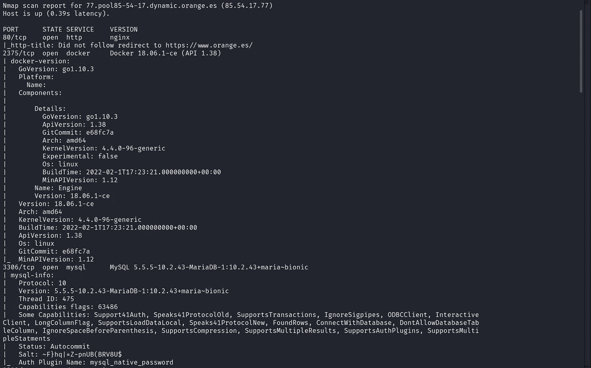
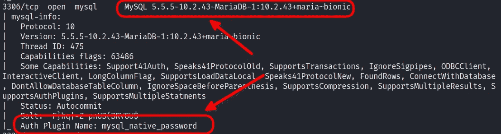
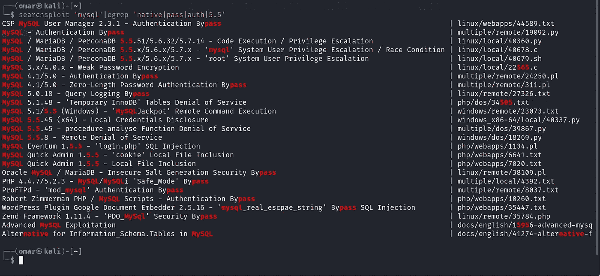
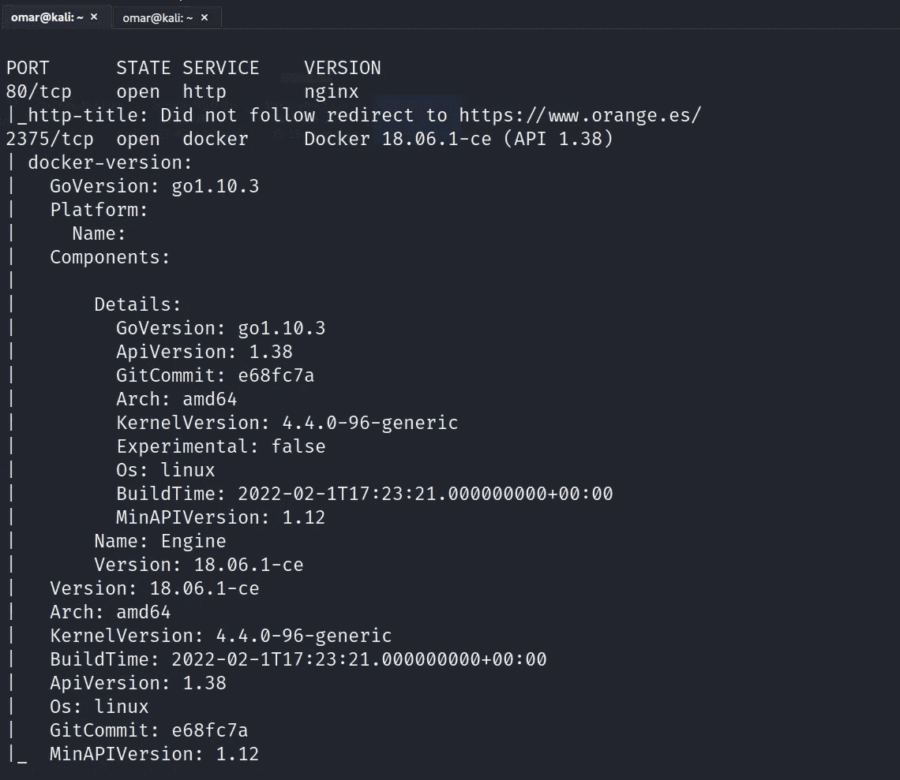
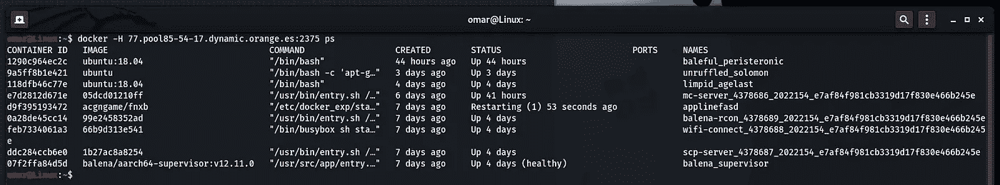
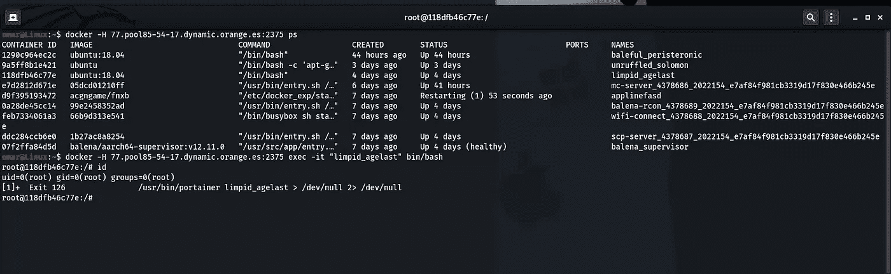

# 橙色任意命令执行

> 原文：<https://infosecwriteups.com/orange-arbitrary-command-execution-75ba7f283d53?source=collection_archive---------0----------------------->

大家好，奥马尔·哈什姆在这里，我将在这篇文章中与大家分享我是如何在不同的公司使用相同的技术获得超过 10 个 RCE 的。

如果你不知道 Orange，简而言之，它是一家跨国电信公司，在全球拥有 2.66 亿客户

现在我们可以开始了

我开始做一些外部网络扫描

# Nmap 扫描:

> ***nmap-A-P0–65535 77 . pool 85–54–17 . dynamic . orange . es***

这是输出结果:

我发现有一些有趣的端口被公开披露，大部分时间被用作内部 API，比如 docker 的 2375 和 MySQL 服务的 3306

我开始测试想要访问数据库的 Mysql 服务，所以我从一些常见的错误配置开始，比如在没有密码的情况下访问数据库(空根密码)

> **┌──(omar㉿kali)-[~】
> └─$*MySQL-h 77 . pool 85–54–17 . dynamic . orange . es-u root-p 3306***

但不幸的是没有奏效

# 蛮喷 **:**

这是一个使用普通用户名和密码来暴力破解网络服务的工具

第一次尝试失败后，我开始使用 brutespray，但在我通过从 SecList 添加(M [ysql 更好的默认通过列表](https://github.com/danielmiessler/SecLists/blob/master/Passwords/Default-Credentials/mysql-betterdefaultpasslist.txt))来编辑自定义单词列表后

> **┌──(omar㉿kali)-[~】
> └─$·布鲁特普雷—文件 nmap-output.xml —服务 mysql —线程 5**

但我也一无所获

在那之后，我开始在谷歌上搜索常见的漏洞，并使用 MySQL 版本的 searchspolit 和 MySQL 的一些插件，如“mysql_native_password ”,以获得任何形式的认证旁路

搜索可能包含插件或 MySQL 版本的漏洞

> **┌──(omar㉿kali)-[~】
> └─$ searchsploit ' MySQL ' | egrep ' native | pass | auth | 5.5 '**

插件“mysql_native_password”没有公开漏洞，但是 mysql 服务有两个有趣的漏洞[第二个漏洞(绕过授权)和第三个漏洞(RCE) ]

所以我两个都试过了，但也一无所获

在那之后，我开始查看 docker 引擎

但在此之前，让我们了解

# 什么是 docker:

Docker 是一个开源软件平台，用于在通用操作系统(OS)上创建、部署和管理虚拟化应用程序容器

简单来说，它通常在开发人员和开发人员之间使用，以解决开发人员面临的问题，如他们的应用程序代码是否可以在一台机器上工作，而不能在其他机器上工作[根据缺失的包和库]，Docker 旨在解决这个问题

让我们看看 nmap 的输出

# 公开的 Docker API:

当您在一个系统上安装 docker 时，它会在您的本地主机上公开一个位于端口 2375 的 API。这个 API 可以用来与 docker 引擎交互，它基本上给了你做任何你想做的事情的权利。在这种情况下，任何外部团体都无法访问你的 docker API，因为它并不对外公开。但是，在某些情况下，可以更改此 API，以便外部资源可以访问它。如果操作不当，这将把 docker API 暴露给世界[公共互联网]

因此，我们现在需要测试这种在没有任何认证的情况下公开 docker API 的错误配置

现在让我们获取运行容器列表

> ps:允许我们列出正在运行的容器

docker -H <host>: <port>ps</port></host>

> └─$码头工人-h 77 . pool 85–54–17 . dynamic . orange . es:2375 PS

它的工作，并发现有 7 个容器在那里运行

现在我们要试着得到一个壳

> exec:允许我们在运行容器中运行命令

docker-H<host>:<port>exec-it<container name=""><command></command></container></port></host>

> ┌──(omar㉿kali)-[~]
> └─$**docker-h*77 . pool 85–54–17 . dynamic . orange . es*:2375 exec-it ' limpid _ age last '/bin/bash**

我们获得了具有 root 权限的容器外壳，这还不是结束，因为我能够用源代码和公司的其他私有数据组成其他容器

希望你们喜欢这篇报道

别忘了在 Twitter 上关注

推特: [@OmarHashem666](https://twitter.com/OmarHashem666)

## **保持联系**

[**Linkedin**](https://www.linkedin.com/in/omar-1-hashem/)**|**[**Youtube**](https://www.youtube.com/channel/UCJ1yNtgZP5LRO7ebZXSnAZQ)**|**[**Twitter**](https://twitter.com/OmarHashem666)

## 来自 Infosec 的报道:Infosec 每天都有很多内容，很难跟上。[加入我们的每周简讯](https://weekly.infosecwriteups.com/)以 5 篇文章、4 个线程、3 个视频、2 个 GitHub Repos 和工具以及 1 个工作提醒的形式免费获取所有最新的 Infosec 趋势！