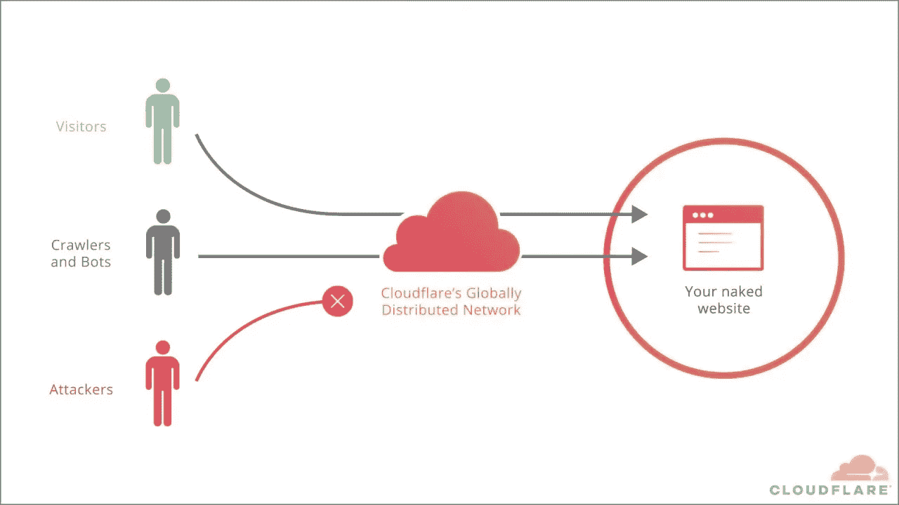
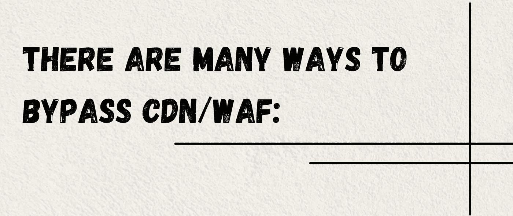
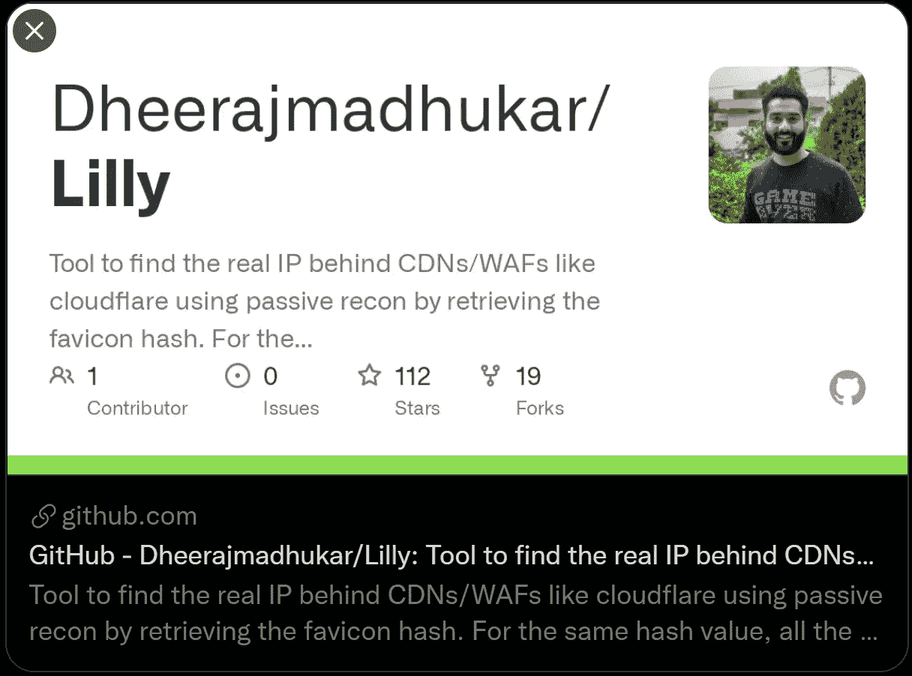
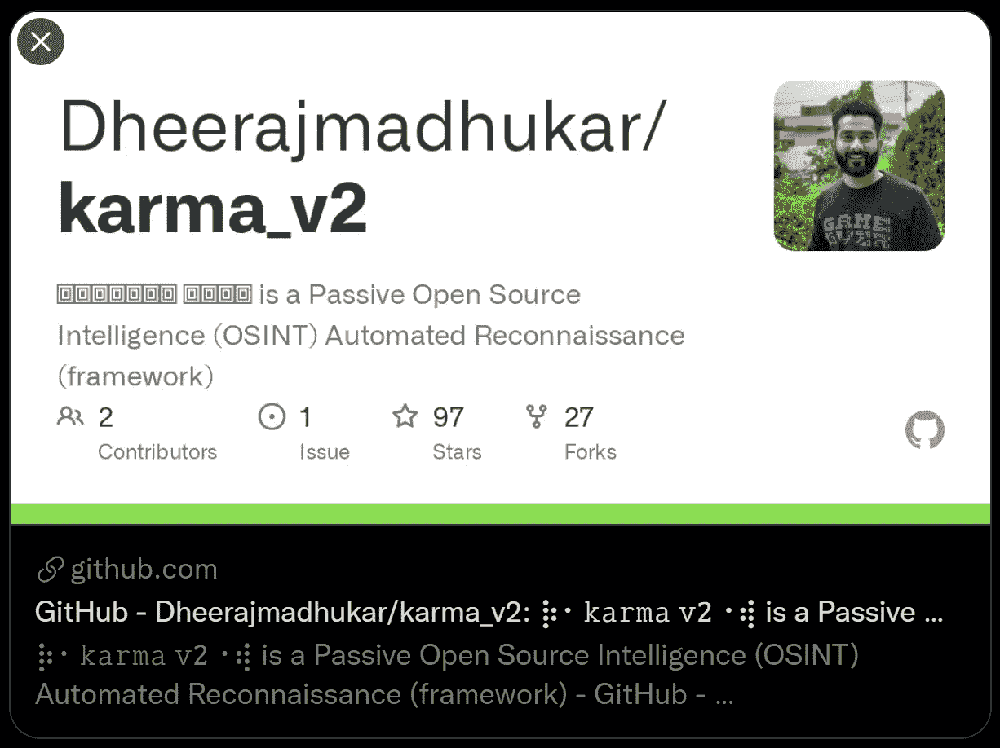
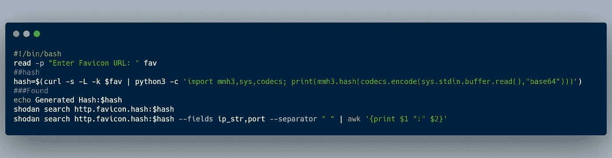
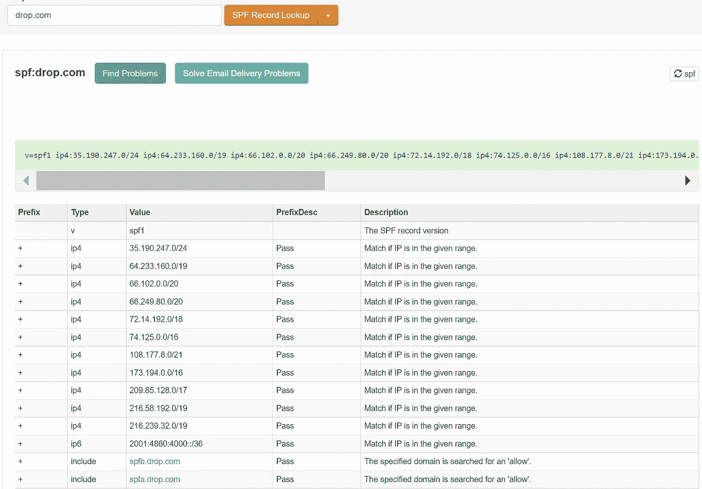

# 发现原始 IP，绕过 D-DOS 和 WAF Cloudflare 保护

> 原文：<https://infosecwriteups.com/origin-ip-found-d-dos-waf-cloudflare-protection-bypassed-41fc280ccf8f?source=collection_archive---------0----------------------->

低垂的虫子

[https://i.ytimg.com/vi/6gaplYfYpKI/maxresdefault.jpg](https://i.ytimg.com/vi/6gaplYfYpKI/maxresdefault.jpg)

# 1.图标哈希:

【https://github.com/Dheerajmadhukar/Lilly】工具:

通过检索 favicon 哈希，使用被动侦察工具查找 Cloudflare 等 cdn/WAFs 背后的真实 IP。对于相同的哈希值，将搜索所有可能的 IP、端口和 SSL/TLS 证书，以验证范围内的目标。

# 2.完成 Shodan 侦察:

**工具:**[https://github.com/Dheerajmadhukar/karma_v2](https://github.com/Dheerajmadhukar/karma_v2)

Infosec 研究人员、渗透测试人员、漏洞猎人可以使用𝚔𝚊𝚛𝚖𝚊 𝚟𝟸来查找深层信息、更多资产、WAF/CDN 绕过的 IPs、内部/外部基础设施、公开暴露的漏洞以及更多关于其目标的信息。

# **3。Bash 自动化图标**

**找到**[**【CDNs】**](https://twitter.com/hashtag/CDNs?src=hashtag_click)**/**[**【WAFs】**](https://twitter.com/hashtag/WAFs?src=hashtag_click)**像**[**【cloud flare】**](https://twitter.com/hashtag/cloudflare?src=hashtag_click)**使用被动侦察通过检索**[**【favicon】**](https://twitter.com/hashtag/favicon?src=hashtag_click)**【hash】。[需要 Shodan Premium API]**

**推文:**[https://Twitter . com/Dheerajmadhukar/status/1378369856907616259](https://twitter.com/Dheerajmadhukar/status/1378369856907616259)

# **4。历史 DNS 数据存储库**

**链接:**https://securitytrails.com/dns-trails

面向安全公司、需要深入调查的研究人员、发现 DNS 记录的可疑变化以及防止未来欺诈或犯罪活动的数据。

# **5。有时 SPF/DMARC/DKIM 记录**

你所有的 MX 记录，域名，黑名单和 SMTP 诊断在一个集成的工具。输入一个**域名**或 **IP 地址**或**主机名。**

**还有更多……**

> 让游戏开始吧。。。

> **漏洞详情**

**描述:**

在最初的资产评估期间，我发现了一个使用 D-DOS 保护的“sub.redacted.tld”子域。我发现 sub.redacted.com 站点暴露了其 IP，这可能允许绕过反 DDoS 机制和 WAF，这很重要。

域名“sub . redated . TLD”目前解析为 x.x.x.1、x.x.x.2、x.x.x.3 和 IPv6 xxxx:xxxx:xdex:x29:xcde:XXX:xx40:x8x 1—归 Cloudflare 所有，我能够使用 Favicon Hash 确定当前的源服务器 IP。

**影响:**
正如许多其他提交材料中所报告的，Cloudflare 绕过可以产生重大影响，因为任何对手现在都能够直接与源服务器通信，从而使他们能够执行未经过滤的攻击(如拒绝服务)，以及数据检索和 WAF 绕过。

> **验证步骤【概念验证】**

**复制步骤:**

1.  只需访问:*https://redated . TLD*
2.  找出绝对网址获取 favicon . ico:
    *https://redacted.tld/img/icons/redacted/favicon.ico*
3.  现在为这个图标生成散列:
4.  $ curl-s-L-k "*https://redacted.tld/img/icons/redacted/favicon.ico*" |*python 3-c '导入 mmh3，sys，编解码器；print(mm H3 . hash(codecs . encode(sys . stdin . buffer . read()，" base64 "))'*

输出:
-645272014

5.我们准备用上面的哈希值在**SHODAN**上搜索，as:
$ SHODAN search http . favicon . hash:-645272014

输出:

* x . x . x . x * 80 hostname . redated . TLD HTTP/1.1 200 OK \ r \ n 服务器:nginx/1 . 18 . 0 \ r \ n 日期:2020 年 11 月 19 日星期四 23:39:07 GMT \ r \ n 内容类型:text/html \ r \ n 内容长度:199766 \ r \最后修改时间:2020 年 11 月 3 日星期二 16:02:21 GMT

注意:根据输出，IP[x . x . x . x]&“hostname . redated . TLD”指向一个名为* sub . redated . TLD *的子域

6.要验证晶片是否被绕过，可以使用 **wafw00f** :

**6a)** 执行:
$ wafw 00 f-a[https://sub . redated . TLD](https://sub.redacted.tld)输出:
[+]站点[https://sub . redated . TLD](https://sub.redacted.tld)在 Cloudflare (Cloudflare Inc.) WAF 后面。

**6b)** 执行:
$ wafw 00 f-a[http://x . x . x](http://x.x.x.x)
输出:
[-]通用检测未检测到晶圆

7.**建议:**
我的建议符合 Cloudflare 自己的指导方针[ref。:[*https://support . cloudflare . com/HC/en-us/articles/2018 97 700-Step-4-Recommended-First-Steps-for-all-Cloudflare-users*](https://support.cloudflare.com/hc/en-us/articles/201897700-Step-4-Recommended-First-Steps-for-all-Cloudflare-users)】源服务器必须专门与 cloud flare 的 IP 地址范围进行通信，否则—如 cloud flare 博客上的这篇帖子中所述[Ref .:[*【https://blog . cloud flare . com/DDOS-prevention-protecting-the-origin/*](https://blog.cloudflare.com/ddos-prevention-protecting-the-origin/)】，拥有反向代理提供的保护基本上就变得没用了。

我希望你得到一些动力去做 bug 奖金，并在下一篇文章中再次见到你。

***推特简介:****@*[Dheerajmadhukar](https://twitter.com/Dheerajmadhukar)

***LinkedIn 简介:****@*[dheerajtechnolegends](https://www.linkedin.com/in/dheerajtechnolegends/)

***GitHub 简介:***[@ Dheerajmadhukar](https://github.com/Dheerajmadhukar/)