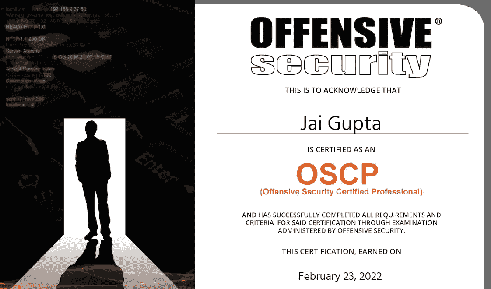
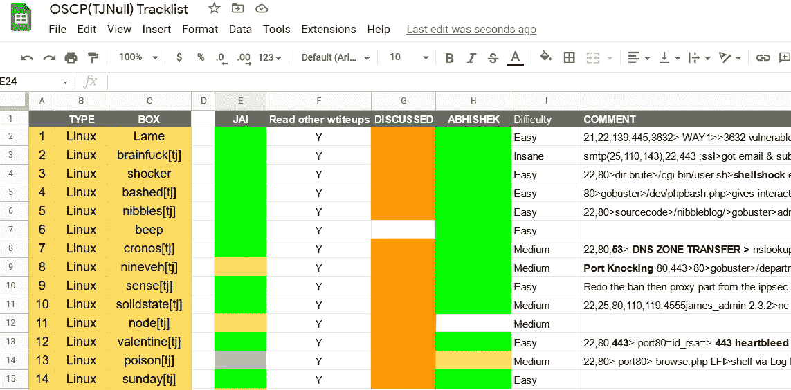

# OSCP——破解新模式

> 原文：<https://infosecwriteups.com/oscp-cracking-the-new-pattern-6c4f1c9e2409?source=collection_archive---------0----------------------->

你好，我想谈谈我是如何通过 OSCP 新格局，其中包括在考试中的活动目录。我把考试安排在 2022 年 2 月 23 日，第一次尝试就顺利通过了。在这篇博客中，我将尽力提供我准备策略的所有细节，以及我利用了哪些资源，所以让我们开始吧…

## 背景

我是一名 20 岁的 IIT 国际管理学院的学士学生。两年前，我通过参加 CTFs 和在线战争游戏开始了我的网络安全之旅，后来，我转向 TryHackMe 和其他平台以了解更多信息。去年 9 月，我终于决定考 OSCP，并开始做相应的准备。

在我们继续之前，让我们讨论一下最近 OSCP 考试的变化。如果你已经熟悉了新的模式，你可以跳过这一部分。

## OSCP 最近的变化(自 2022 年 1 月起)

最近修改了考试模式，2022 年 1 月 11 日以后的所有考试都将遵循新的模式。考试将包括一个 40 分的广告系列，其中包含 3 台机器。除了广告将有 3 个独立的机器，每个 20 分。此外，提交实验报告的加分从 5 分增加到了 10 分，并且实验报告必须包括一个广告系列。如果你不熟悉新的模式，我强烈建议你阅读官方公告。

## 准备

我将回顾一下我在注册 OSCP 之前做了什么，让我在 PWK 材料和实验室中感到舒服。

**Tryhackme** :在开始 OSCP 筹备之前，我曾经解决过 Tryhackme 的房间。我通常用来解决各种类别的房间走查。他们以引人入胜的方式解释这个话题。

**HackTheBox:** 专门针对 OSCP，买了 [HackTheBox](https://www.hackthebox.com/) 订阅，开始解决 [TJNull OSCP 喜欢的盒子](https://docs.google.com/spreadsheets/u/1/d/1dwSMIAPIam0PuRBkCiDI88pU3yzrqqHkDtBngUHNCw8/htmlview#)。我强烈建议在注册 OSCP 之前解决这些问题。最好的解决方法是和你认识的人一起做同样的准备(如果你正在努力寻找某人，那么使用 [Infosec prep](https://discord.gg/2AG6TCm) 和[Offensive Security](https://discord.com/invite/ctBUcPuakZ/login?mode=register)Discord server 找到许多准备 OSCP 和各种其他认证的人)。我将 TJNull 表转换为另一个表，以跟踪我解决的盒子，并与我的朋友 [Abhishek](https://medium.com/u/33b5940c5ceb?source=post_page-----6c4f1c9e2409--------------------------------) 一起跟踪它们。您可以在此处找到表单[的样本。](https://docs.google.com/spreadsheets/d/1cDZpxrTMODHqgenYsBuZLkT-aIeUT31ZuiLDhIfrHRI/edit?usp=sharing)

我用来记录 TJNull 机器的表格。

我们有时一起解决问题，有时单独解决，然后互相讨论我们的方法。为了避免剧透，我们只在各自解决问题后才讨论。我们过去常常在求解后查看其他博客和 [Ippsec](https://www.youtube.com/channel/UCa6eh7gCkpPo5XXUDfygQQA) 视频，以获得更有趣的求解方法。强烈推荐观看 Ippsec 视频，因为他深入研究了所有内容，有时还展示了有趣的手动利用方式。
在解决了 Tjnull Hackthebox 列表中的大约 55-60 台机器后，我对这些机器感到满意，因此我转到了 PWK 实验室。

## **预订 PWK**

经过两个月的 HackTheBox 练习，我决定在 11 月中旬预订 PWK 实验室，该实验室本打算在 12 月 5 日开始，但进攻性安全更新了引入活动目录的考试格式，在此之前我只是听说过这个名字:(

giphy 图像

所以，为了准备 Active Directory，我将我的实验室从 12 月 5 日重新安排到 12 月 19 日，给了我 15 天的准备时间。

## 广告准备

最激动人心的阶段即将开始。我不知道从哪里开始准备，也不知道在考试中会遇到什么。但现在通过考试，我可以告诉一些有价值的资源，帮助我从基础(按照顺序)理解 AD——

*   tryhackme 的一些房间学习基础知识- [攻击目录](https://tryhackme.com/room/attacktivedirectory)和[后开发基础知识](https://tryhackme.com/room/postexploit)。
*   [实用道德黑客的](https://academy.tcm-sec.com/?affcode=770707_iixyvfcq)[活动目录](https://academy.tcm-sec.com/?affcode=770707_iixyvfcq)部分由网络管理员完成全程。事实上，整个课程(大约 25 小时。)总的来说是值得做的。
*   **从 OSCP 的角度来看，PWK 课程附带的 PWK pdf 第 21 章活动目录攻击**极其重要。
*   PWK 实验室中的两个活动目录网络链对考试至关重要(考试中可能会用到类似的机器)

以上资源对考试来说绰绰有余，但要进一步练习，可以试试——

*   来自 TryHackMe 的[花环](https://tryhackme.com/room/wreath)和[返祖](https://tryhackme.com/network/throwback)(你也可以跟着约翰·哈蒙德[的返祖演练第一部分](https://youtu.be/mQT38VR4boQ)和[第二部分](https://youtu.be/ukFC48bzVSM)
*   来自 HackTheBox 的一些活动目录机器。
*   来自[试验场](https://portal.offensive-security.com/sign-up/pg)的哈奇、希斯特、跳马由进攻保障本身提供。

练习使用一些工具，如 [PowerView](https://github.com/PowerShellMafia/PowerSploit/blob/master/Recon/PowerView.ps1) 和 [Bloodhound](https://github.com/BloodHoundAD/BloodHound) 来枚举活动目录。还有，探索 Impacket、Crackmapexec、Evil-winrm、Responder、Rubeus、Mimikatz 等工具。

还有一个很棒的关于攻击活动目录的博客，你应该去看看。我在考试中遇到了机器，这可以通过 PWK 实验室广告机器的知识和手册中广告章节的材料来解决。

## PWK 实验室

我只订阅了 1 个月，花了大约 15 天阅读 PDF 和解决练习(这值得 10 个额外的点)，只剩下 15 天来完成实验。在此期间，我能够解决大约 35–40 台机器。我建议在实验室里解决尽可能多的盒子，因为它们更像真实世界，有些盒子相互依赖，有些需要旋转。

## 碱性氧气转炉

根据新的更改，缓冲区溢出可能会出现，也可能不会出现在考试中。如果它来了，这将是一个低特权向量，将需要特权升级，以实现完整的 20 点。

【TheCyberMentor 缓冲区溢出视频和 TryHackMe [缓冲区溢出准备](https://tryhackme.com/room/bufferoverflowprep)室对于 BOF 准备来说绰绰有余。

## 考试

我将考试安排在 2 月 23 日上午 10:30，从 AD 开始，并在 30 分钟内在其中一个盒子上有一个初始外壳，但随后在 post 枚举期间误解了一些内容，导致浪费了 5-6 个小时试图找出一些不需要继续的内容。决定休息一段时间，然后在接下来的 1.5 小时内对整个广告集进行妥协。如果我没有犯那个错误，我会花大约 2 个小时来解决整个广告链。

然后，转到独立的机器上，我开始一台一台地列举它们，以便发现容易实现的目标，在接下来的两个小时内，我成功地攻破了另一台机器。现在我有 70 分(包括奖金)通过考试，所以我休息了很长时间吃晚饭和午睡。回来后的一段时间里我终于在另一台机器上站稳了脚跟，所以到凌晨 4 点已经 80 分了；我甚至非常接近升级特权，但后来决定再次解决广告，并采取一些缺失的截图。在记录了其他已解决的独立机器后，我在上午 8 点左右结束了考试。睡了一大觉，终于在晚上醒来，提交了报告，并在接下来的 24 小时内收到了一封祝贺邮件。

giphy 图像

在考试中，我建议在每台机器上花一定的时间，然后继续，稍后再回来。如果你被困在某个地方，不知道该做什么，休息一下，冷静下来，重新调整你的想法。现在从更广泛的列举开始，记下任何可能对以后有帮助的有趣信息。可能有一些我们第一次列举时遗漏的东西，现在可以帮助我们前进。

## 结论

我要感谢我的家人和朋友在整个旅程中对我的支持。没有他们的鼓励和支持，这是不可能的。

如果你已经做到这一步，你可能对认证感兴趣，因此我祝你在 OSCP 之旅好运。如果您有任何问题，请在 Linkedin 上联系我。请继续关注更多更新。

在[推特](https://twitter.com/jaiguptanick)、 [Linkedin](https://www.linkedin.com/in/jaiguptanick/) 、 [Youtube](https://www.youtube.com/channel/UCGvgjzkWyrYaTzJsDlTGB9g) 上与我联系

## 其他有用的资源

这些是我在准备过程中发现的一些有用的资源:

*   https://book.hacktricks.xyz/(几乎拥有你所需要的一切)
*   [https://viperone.gitbook.io/pentest-everything/](https://viperone.gitbook.io/pentest-everything/)
*   [https://gtfobins.github.io/](https://gtfobins.github.io/)(在 Linux 权限提升中有用)
*   [sec wiki/windows-kernel-exploits](https://github.com/SecWiki/windows-kernel-exploits)
*   [https://github.com/swisskyrepo/PayloadsAllTheThings](https://github.com/swisskyrepo/PayloadsAllTheThings)
*   [https://addons.mozilla.org/en-US/firefox/addon/hacktools/](https://addons.mozilla.org/en-US/firefox/addon/hacktools/)(非常有用的有备忘单形式的扩展)
*   [https://docs . Google . com/spreadsheets/d/1 cdzpxrtmodhqgenysbuzlkt-aieu t31 zuildhifrehri/edit？usp =分享](https://docs.google.com/spreadsheets/d/1cDZpxrTMODHqgenYsBuZLkT-aIeUT31ZuiLDhIfrHRI/edit?usp=sharing)(链接到我的盒子跟踪列表)
*   [https://academy . tcm-sec . com/p/Practical-Ethical-Hacking-the-complete-Course](https://academy.tcm-sec.com/p/practical-ethical-hacking-the-complete-course?affcode=770707_iixyvfcq)(链接到 TCM 安全实用伦理黑客课程)

最近攻击性安全还发布了一个[视频](https://youtu.be/griDEeIcXQc)详细谈论新的考试模式。

## 来自 Infosec 的报道:Infosec 每天都有很多内容，很难跟上。[加入我们的每周简讯](https://weekly.infosecwriteups.com/)以 5 篇文章、4 条线索、3 个视频、2 个 GitHub Repos 和工具以及 1 个工作提醒的形式免费获取所有最新的 Infosec 趋势！