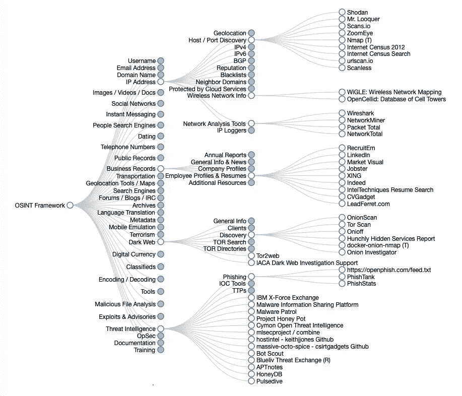

# OSINT 和 15 大开源智能工具

> 原文：<https://infosecwriteups.com/osint-and-top-15-open-source-intelligence-tools-f5132bf9e40f?source=collection_archive---------1----------------------->

OSINT 是开源情报的首字母缩写，是构建强大的网络安全系统的关键概念之一。OSINT 是从已经发布的来源或互联网上可用的公共来源收集信息的做法。由 IT 人员、恶意行为者或受制裁的情报人员执行的 OSINT 操作流程使用公开可用的高级搜索技术来收集信息。OSINT 中的开源不是指开源软件运动，而是指数据的公共性质，可以在互联网上免费获得。整理数据在许多方面都有帮助，例如通过减少攻击面和保护公开可用的信息来建立一个强大的网络安全系统。它还能帮助你获得竞争优势，抢在你的竞争对手之前。简单的例子包括:

*   在任何搜索引擎上提问。
*   研究最新移动技术的公共论坛。
*   观看 YouTube 视频，了解如何制作某种美食。

# OSINT 的重要性

总的来说，OSINT 有助于组织保持对公共信息的关注。它还有助于减少潜在的攻击面，从而防止违规和泄漏。例如，以下任务是在 OSINT 的帮助下完成的。

**发现和定位外围或公共场所之外的资产:** OSINT 帮助 IT 和网络安全团队发现和定位面向公众的资产。通过 OSINT，可以对每个资产中的可用信息进行映射和评估，以获得可以利用的敏感或关键信息。总的来说，OSINT 工具有助于映射和记录公司公开可用和可访问的公共资产数据。

**查找组织外部的相关数据和信息:**OSINT 工具有助于查找组织外部的相关数据，例如组织网络边界之外的域或端口。该功能对于最近合并或收购了另一个组织的组织特别有用，因为它有助于找到刚刚收购的组织之外可用的相关信息。

**对整理好的数据采取必要的措施:**收集到的数据可能是海量的，而且是无序的。OSINT 工具将数据转换成有意义的信息，可用作可操作的情报。OSINT 工具还帮助将数据拼凑在一起，并优先处理敏感数据及其问题。

**请参阅:**

[**如何阻止 DDOS 攻击，保护企业？**](https://securetriad.io/stop-a-ddos-attack/)

图片来源 osintframework.com

# OSINT 技术

*   您在找什么？
*   你的主要研究目标是什么？
*   你的主要目标是谁？
*   你将采用什么工具或机制来进行研究？

虽然有很多可用的 OSINT 方法和机制，但并不是所有的方法和机制都能帮助你实现目标。因此，首先，您需要定义搜索的范围，并提出以下问题:

OSINT 技术可以分为两大类，即主动 OSINT 和被动 OSINT

**主动 OSINT:** 包括端口和系统扫描以及与目标的直接联系。结果更加可靠和可信，同时检测的风险也很高。

**另请阅读:执行 OSINT** [**零信任安全的挑战——你需要知道什么？**](https://securetriad.io/what-is-zero-trust-security/)

**被动 OSINT:** 在这一类中，联系是借助第三方服务建立的。因为它包括第三方，所以搜索结果可能不可靠，并且可能包括许多误报和漏报。因此，在这一类别中，被发现的风险相当低。

OSINT 工具涉及的某些风险有:

**被发现:**这是最常见的风险，因为进行在线调查可能会将您的信息泄露给搜索数据的人。

**无法访问信息:**被发现可能会导致您无法访问信息，因为这可能会导致保护公开信息或隐藏踪迹。

**顶级工具**

你成为受害者:如果你的身份暴露，你可能会成为调查的目标，甚至更糟，成为间谍。

**内容过滤:** OSINT 执行指数搜索，整理海量数据。如果数据没有拼凑在一起或按顺序排列，收集的数据是无用的，不会导致任何有意义的行动。

为了应对执行 OSINT 的挑战，以下工具有助于收集信息和数据:

**BuiltWith:** 顾名思义，BuiltWith 可以让你解码或发现网站是由什么组成的。它使用户能够识别支持网站的不同技术栈和平台。例如，BuiltWith 可以识别网站是使用 Joomla、WordPress 还是 Drupal 作为 CMS 构建的。它还识别并生成 Java 脚本/CSS 库、网站插件、网站框架和服务器信息的列表。BuiltWith 可以作为网站的前期调研或观察工具。

**Maltego:** Maltego 主要用于揭示域和公共可访问信息之间的关系。它还有助于将海量数据绘制成易读、易懂的图表，这有助于将原始数据转化为一些可操作的措施。Maltego 提供了来自超过 35 个数据合作伙伴的 58 个数据集成，允许用户选择四种不同的布局来识别他们发现的数据模式，并将复杂的数据拼凑在一起。

**Mitaka:** Mitaka 可以作为 Chrome 的扩展和 Firefox 浏览器的插件使用，可以帮助在 60 多个搜索引擎中搜索 IP 地址、URL、域、哈希和钱包地址。它还可以帮助网络安全团队识别和检测来自您的 web 浏览器的各种危害迹象，并帮助减轻威胁和风险。此外，由于它们是扩展，只需点击一下就可以快速查询在线数据库。

**Spyse:** Spyse 被认为是完整的互联网资产注册，用于收集服务器、网站和外围连接设备上公开可用的数据。这也是一种侦察工具，可以进行数据分析，以检测非托管资产的任何安全漏洞，还有助于保护暴露的凭据。

Spiderfoot: Spiderfoot 是一个免费的 OSINT 侦察工具，它集成了不同的多个数据源，并自动收集 OSINT。Spiderfoot 收集和分析关于域名、IP 地址、CIDR 范围、电话号码、用户名和其他敏感数据的数据。Spiderfoot 提供了一个直观的基于 web 的 GUI，包含命令行界面和嵌入式 web 服务器，非常适合红队侦察活动。一般来说，蜘蛛脚有助于发现更多关于您的目标的信息，或者识别您的组织可能无意中暴露给公众的内容。

**OSINT 框架:**OSINT 框架不在服务器上运行，而是一个基于 web 的界面，它有助于通过查询免费的搜索引擎、资源和工具来获取有价值的信息和数据，并通过分解感兴趣的不同主题来帮助您嗅出您需要的数据。查询网站进行数据提取是免费的，而有些网站需要注册，并有付费版本，可以帮助你构建一个高级的谷歌搜索并收集深入的数据。

**Creepy:** Creepy 是一个用 python 编写的工具，它通过社交网络平台和托管服务提出的查询来帮助收集任何个人的地理位置数据。Creepy 使用户能够在地图上呈现或绘制收集的数据。它还允许用户下载或过滤数据。CSV 或。KML 格式。

Recon-ng: Recon-ng 是一个用 python 编写的工具，主要专注于基于 web 的基于 web 的开源侦察。它包括许多模块、交互式帮助和便利功能，可指导用户正确使用该工具。Recon-ng 自动执行诸如剪切、粘贴和收获等耗时的活动，还执行诸如数据库交互、执行 web 请求和管理 API 密钥等操作。

**Shodan:** Shodan 是一种网络安全监视器，是一种专用的搜索引擎，用于在物联网(IoT)上查找数据和情报。该工具也被称为黑客的搜索引擎，因为它可以帮助您找到并探索连接到网络的不同设备。它还有助于检测和发现攻击面上的开放端口和漏洞。Shodan 是 IT 专业人员特别感兴趣的，因为它提供了有关 HTTP、SSP、SNMP 和 RTSP 的信息和细节，这些信息和细节是基于操作系统、国家、网络和端口的。除了物联网设备，Shodan 还可以查询数据库，并通过主界面以外的路径找到公共访问的数据。

**the harvester:**the harvester 是获取和访问组织网络边界之外的公共信息的最简单的工具之一。它带回了任何组织的虚拟主机、子域名、电子邮件地址和开放端口的宝贵信息。该工具对于确定 pen 测试的范围非常有帮助，并且有助于作为 pen 测试之前的侦察步骤。theHarvester 使用流行的搜索引擎，如 Google、Duck Duck Go、Bing 和社交媒体网络来收集 OSINT。

**metagoufil:**顾名思义，metagoufil 用于从公共文档中提取元数据，这些文档也包括 pdf 和 Microsoft office 文件。它找到目标文档并将其存储在本地磁盘上，然后映射用来获取文档的路径。这有助于获取目录树信息、共享资源和主机组织的服务器名称。这是黑客收集信息并对目标系统发动暴力攻击的完美工具。该工具还帮助网络安全专业人员确定漏洞，并通过在黑客利用这些漏洞之前弥补漏洞来帮助保护网络。

Censys: 这是一个很棒的工具，可以作为搜索引擎来获取任何连接到互联网的设备或网络系统的信息。它们还可以返回服务器和域名的信息。此外，您还可以找到有关服务器上运行的 80 和 443 端口的地理信息和技术细节、目标网站的 HTTP 映射、SSL 证书信息、TLS 握手信息和 WHOIS 信息。

**TinEye:** TinEye 是一款图像搜索和图像识别工具，主要专注于反向图像搜索，有助于调节发布在网络上并可通过公共域访问的内容。它可以通过图像模式识别检测欺诈和版权事件，并在不断增长的数十亿张在线图像索引中跟踪这些在线图像的位置

**Open vas:**Open vulnerability assessment 是一个安全框架，包括一个漏洞扫描器，供 IT 专业人员检测系统中的威胁和漏洞。它用于认证和非认证测试、扫描性能调整、高级工业级协议和功能强大的内部编程语言，以便从连续的每日馈送中执行漏洞测试。它通过持续监控网络系统和应用程序的威胁和漏洞来加强安全性。

**Searchcode:** Searchcode 是一个独特的专用搜索引擎，它在代码库中搜索自由源代码中的任何智能。它的工作原理与任何其他普通搜索引擎类似，但 searchcode 不是搜索索引的 web 服务器，而是在正在运行的应用程序或处于开发阶段的应用程序的代码库中搜索信息。它是完全免费的，而且它的过滤器使得用户可以很容易地按照语言、存储库或短语对数据进行分类。它是一个很好的 OSINT 工具，因为它从可访问的源代码中收集信息，并检查敏感信息。当应用程序处于开发阶段时，Searchcode 是一个很好的工具，可以在部署阶段之前用作侦察工具。

*最初发布于*[*https://securetriad . io/osint-and-top-15-开源-智能-工具/*](https://securetriad.io/osint-and-top-15-open-source-intelligence-tools/)

*如果您正在寻找网络安全服务，您可以通过*[***https://securetriad.io/contact/***](https://securetriad.io/contact/)联系 SecureTriad

## 来自 Infosec 的报道:Infosec 每天都有很多内容，很难跟上。[加入我们的每周简讯](https://weekly.infosecwriteups.com/)，以 5 篇文章、4 个线程、3 个视频、2 个 Github Repos 和工具以及 1 个工作提醒的形式免费获取所有最新的 Infosec 趋势！