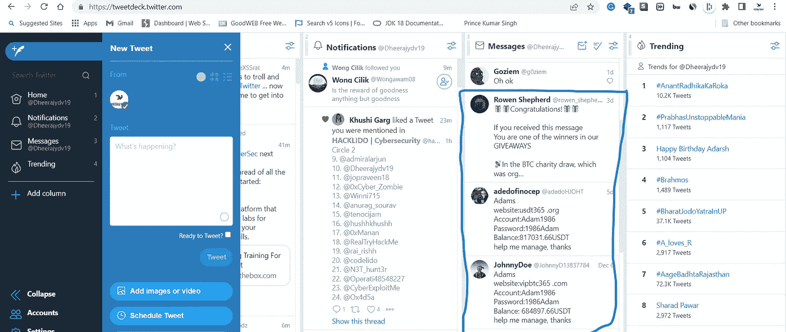
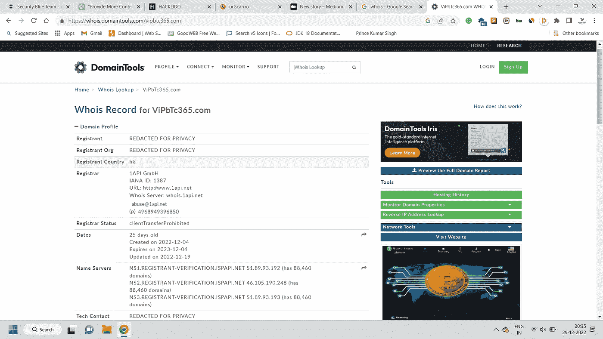
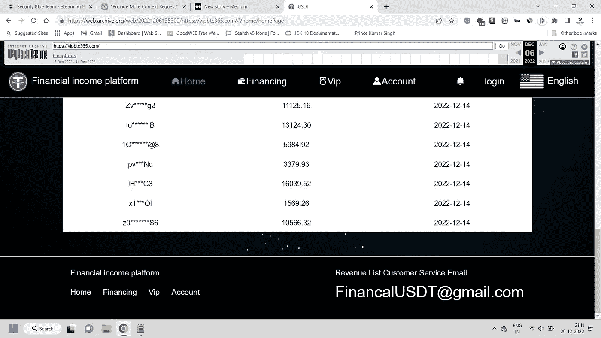
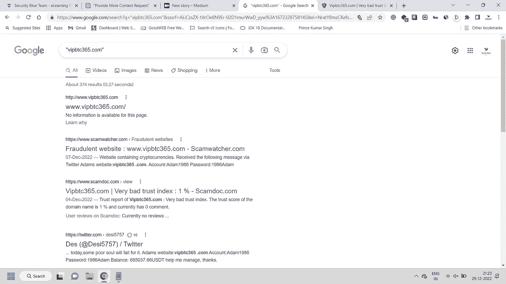

# OSINT 案例研究:验证一个网站的欺诈性或合法性

> 原文：<https://infosecwriteups.com/osint-case-study-validating-a-website-if-its-fraud-or-legit-9c316223e11?source=collection_archive---------1----------------------->

嘿，伙计们，这是我，Dheeraj Yadav，在这篇博客中，我们将学习如何验证一个欺诈网站或合法网站。

让我们通过一个实时案例来解释这一点。

背景故事:昨天，出于一些研究目的，我通过 Twitter deck 打开了我的 Twitter 帐户，我发现有 3 条看不见的消息，我打开了它们，如下图所示。

免责声明:此图片中显示的两个网站都是欺诈网站，所以不要尝试访问它们。

图片中的网站是:

1.  vipbtc365。com
2.  365 美元。（同 organic）有机

正如你在上面的图片中所看到的，骗子们还分享了他们在这些网站上的账户的登录凭证。(*虽然它们是相同的，但要么这个骗局是由一个团体实施的，要么它是一条自动消息*。)

让我们先来讨论一下场景和骗子的目的。

*一旦你用给定的凭证登录这些网站，账户会显示一些良好的余额(大约 0.5btc，不知道为什么可能所有这些骗子都读过相同的黑帽收入书，这是在那提到的)，当你试图撤销时，它会显示账户未激活，为了激活它，你需要一次存入 x 金额的 btc。*

所以，如果你存了钱，恭喜你被骗了，你将永远无法提取这笔钱，因为这是一个骗局。

如果你不存款，恭喜你赢得了智能标记先生。

现在，让我们开始游戏。

在 web osint 中，您应该做的第一件事是执行 whois 记录，所以让我们开始吧。以下是 vipbtc365.com 的 whois 记录

红旗:该网站刚刚成立 25 天。

*在大多数网络钓鱼活动中，总是先检查这一点，您将获得不到一个月的持续时间，如果该网站假冒任何流行的网站，您可以在这里宣布它是假网站，从而结束您的调查。*

这里的第二步是访问和探索网站。(是主动侦察和 osint 必不可少的一部分。)但是等等，在我们探索网飞的时候不要正常浏览。为此，可以使用任何云手机或虚拟 android 模拟器。(风险:千万不要在您的真实设备上访问这些诈骗网站，因为它们可能会下载任何嵌入恶意软件的文件，从而使您的设备面临风险)。

这个网站已经被封锁了，因为我很晚才看到那个消息，那么接下来呢？我们试着用 Wayback 机看看那些网站。

你可以在 https://web.archive.org/web/20220000000000*/ViPbTc365.com[看到这个](https://web.archive.org/web/20220000000000*/ViPbTc365.com)

使用回溯机的网站存档版本

红旗:甚至不能购买甚至一个电子邮件，做一个赠品，wtf？

提示——始终关注网站的页脚。为什么？

最虚假的网站或出于恶意目的的网站从来没有社交媒体档案，因此丢失社交媒体档案应始终被视为危险信号。一些先进的骗子甚至提到实际的网站，所以总是检查除了主页以外的任何其他页面的页脚，因为有时骗子在主页上提到它以避免被发现。

这个谷歌呆子的第三步。

谷歌搜索诈骗网站

使用“特定单词”来查找所有提到我们的诈骗网站的网站，显示的是结果。

红旗:缺乏搜索引擎优化，没有标题，没有描述等

好的网站总是用好的 SEO。当你打开其他所有网站的时候，你可以直接看到很多针对这个的骗局报道，所以现在我们 100%确定这是一个骗局。

免责声明:如果你使用常识，你可以告诉在许多情况下这是一个骗局。为什么有人会放弃这么大一笔钱，而他没有得到任何回报？

除了以上技巧，你还可以在 IOC 数据库中搜索这个网站，比如 threatfox by abuse.ch

它们是许多其他的症状，你可以用来验证一个网站是假的还是合法的。

结论-

有几个危险信号可以表明网站可能是假的或欺诈性的:

1.  糟糕的网站设计:一个虚假的网站可能有设计糟糕的布局、错别字和语法错误。
2.  不熟悉的域名:假冒网站可能使用与合法网站相似的域名，但略有不同。
3.  要求提供个人信息:虚假网站可能会要求提供个人信息，如您的姓名、地址和信用卡信息。除非您确定该网站是合法的，否则请谨慎提供此信息。
4.  弹出窗口:假冒网站可能会使用弹出窗口，试图让您点击链接或输入个人信息。
5.  不切实际的优惠:虚假网站可能会以大幅折扣的价格或不切实际的承诺提供产品或服务。
6.  缺少联系方式:虚假网站可能没有列出实际地址或电话号码，或者联系方式可能无效。

在网上购物时保持谨慎，并在购买或在任何网站上提供个人信息之前做好调查，这始终是一个好主意。

在评论框中说出你使用的技巧。

感谢大家阅读这篇文章，以后请关注我，了解更多类似的内容。

你可以关注我，了解我关于道德黑客和网络安全相关主题的文章，以及一些关于技术的主题，了解我用来节省时间和获得更好结果的技巧和诀窍。

## 来自 Infosec 的报道:Infosec 每天都有很多内容，很难跟上。[加入我们的每周简讯](https://weekly.infosecwriteups.com/)以 5 篇文章、4 条线索、3 个视频、2 个 GitHub Repos 和工具以及 1 个工作提醒的形式免费获取所有最新的 Infosec 趋势！