# 新挑战

> 原文：<https://infosecwriteups.com/osint-challenges-d70f9b77bc86?source=collection_archive---------1----------------------->

## 学会寻找信息的宝库

*在我之前的* [*文章*](https://medium.com/bugbountywriteup/perform-reconnaissance-the-legal-way-osint-80c159b1402a) *中我提到了几个可以用于被动侦察的 OSINT 工具。在这篇文章中，我将尝试一些 HTB 的新挑战。OSINT 也是红队评估侦察阶段的关键技能之一。*

罗马卡夫在 [Unsplash](https://unsplash.com?utm_source=medium&utm_medium=referral) 上拍摄的照片

# 场景 1 -了解 SPF、DKIM 和 DMARC

**secure-startup.com 的客户收到了一些非常可信的网络钓鱼邮件，您能找出原因吗？**

**第一个标志**

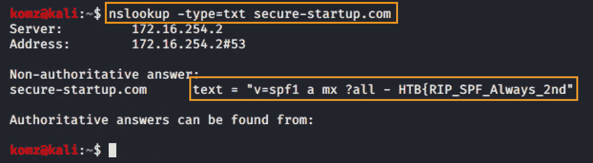

**第二面旗帜**

前半旗有线索。 **SPF** 。

什么是 SPF？

发件人策略框架是一种用于电子邮件认证技术的技术，它已被 DKIM(域密钥识别邮件)取代，随后被 DMARC 取代。

什么是 DMARC？？

[DMARC](https://dmarc.org) -基于域的消息认证和报告一致性是一种基于 SPF 和 DKIM 协议的电子邮件认证策略，用于确定电子邮件的真实性。

`nslookup -type=TXT _dmarc.*example.com*`

# 场景 2 -跟踪用户的活动

我们需要追踪萨拉·梅德森·克鲁兹最后留下信息的地方。她的邮箱 id 是:[**saramedsoncruz@gmail.com**](mailto:saramedsoncruz@gmail.com)

***我关注了这篇* [*文章*](https://sector035.nl/articles/keeping-a-grip-on-google-ids) *，这篇文章解释了如何使用 google hangout 查找用户 id。***

**拥有用户名(与 gmail 关联)可以让你追踪联系人的照片、位置、评论、youtube 播放列表以及任何与该用户名关联的内容。**

**使用 Google Hangout，我通过 inspect element 找到了 Sara 的 ID。**

**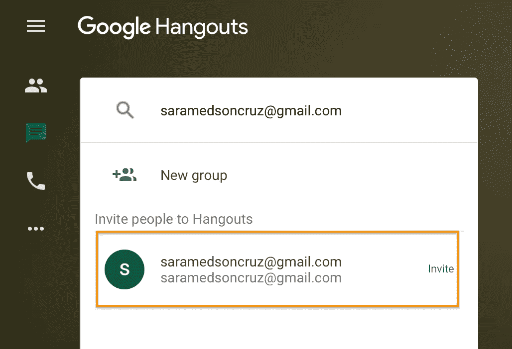****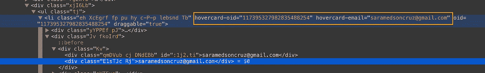**

**接下来，访问这个网址找到她的信息。我在 URL 的末尾添加了用户 id，以便找到 Sara 最后一个位置的评论。:[https://www.google.com/maps/contrib/117395327982835488254](https://www.google.com/maps/contrib/117395327982835488254)**

**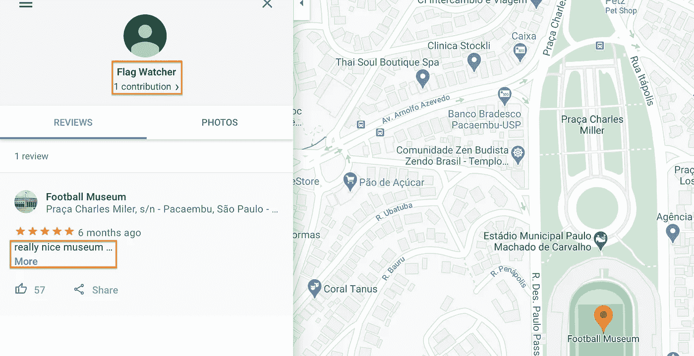****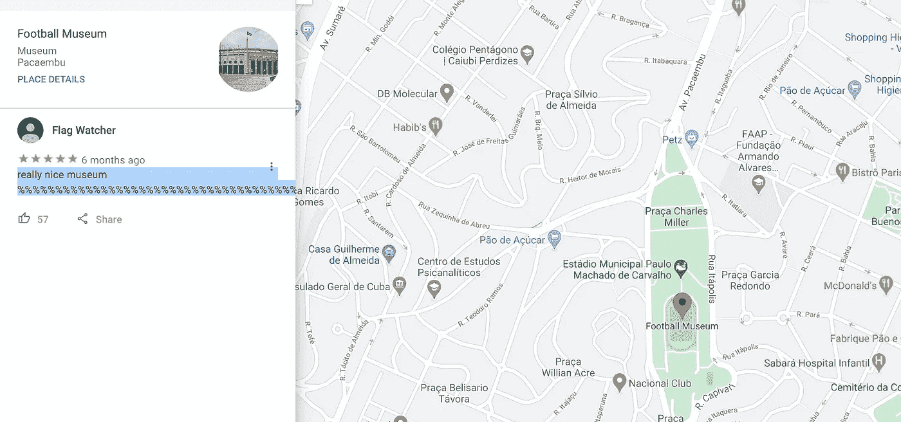**

**真的很好看的博物馆%，，，，，，，，，，，，，，，，，，，，，，，，，，，，，，，，，，，，，，，，，，，，，，，，，，，，，，，，，，，，，，，，，，，，真的很好看**

# **场景 3 -秘密通信**

**弗兰克·维塔利科是个骗子，你能查出钱流向哪里吗**

**在谷歌上找到弗兰克·维塔利克的帖子，注意下面的帖子是他**交叉发布的**。如果你点击下面的链接，这是一个兔子洞。**

**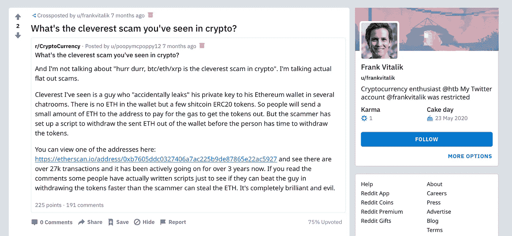**

**然后，我查看了 Frank 的帖子历史，注意到他发布了以下内容。**

**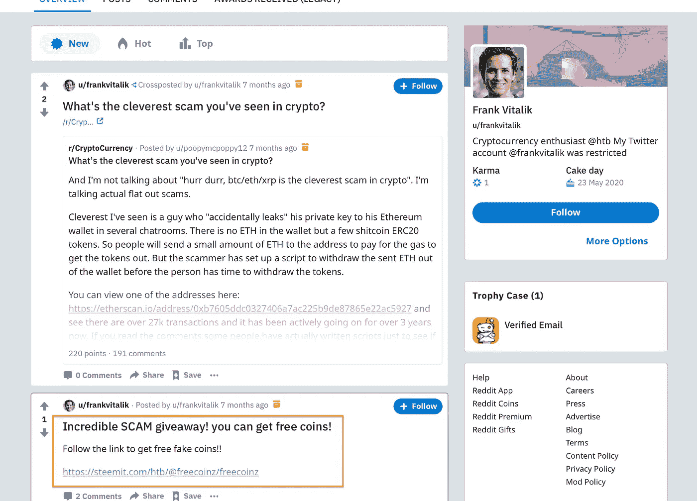**

**点击上面的链接后，我注意到了**散列 id** ，还注意到了评论部分的 **ropsten net** 。**

**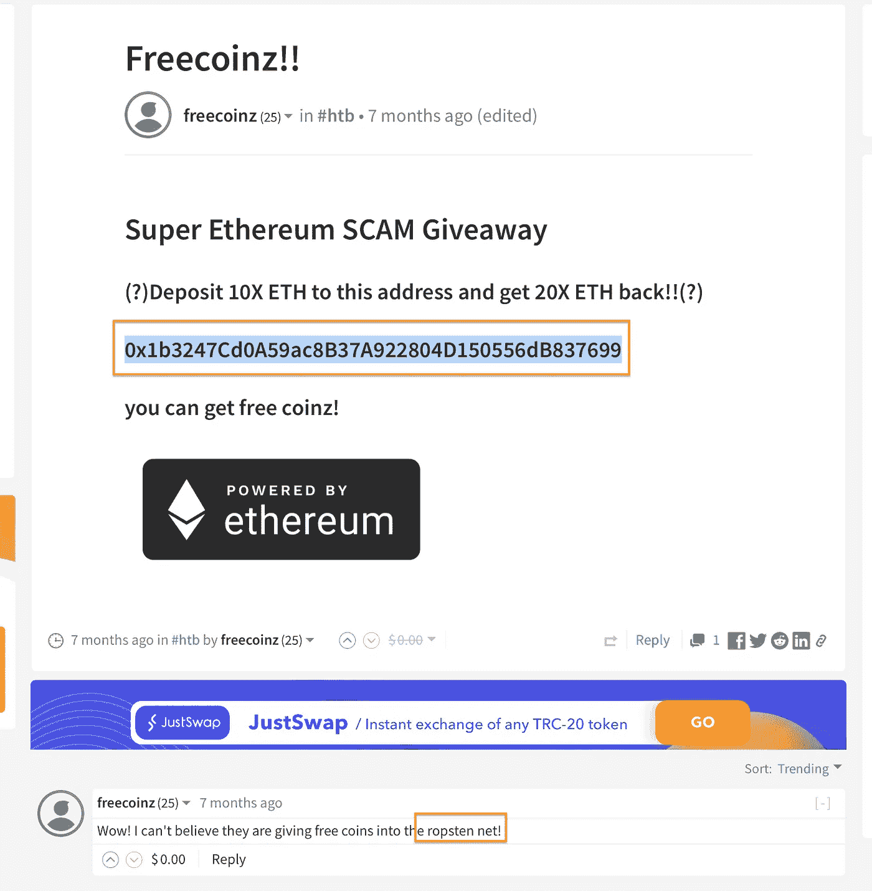**

**谷歌给了我 ropsten net 的 URL，我在那里输入了散列 id。**

******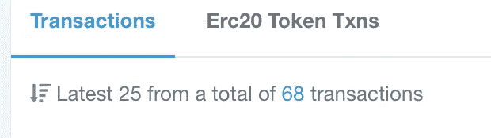**

**点击倒数第二个事务，当您将**哈希**转换为 **UTF-8** 格式**时，您将在**输入 id** 字段中找到该标志。****

**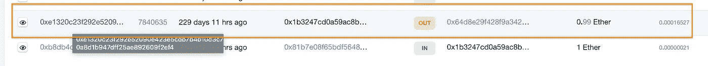****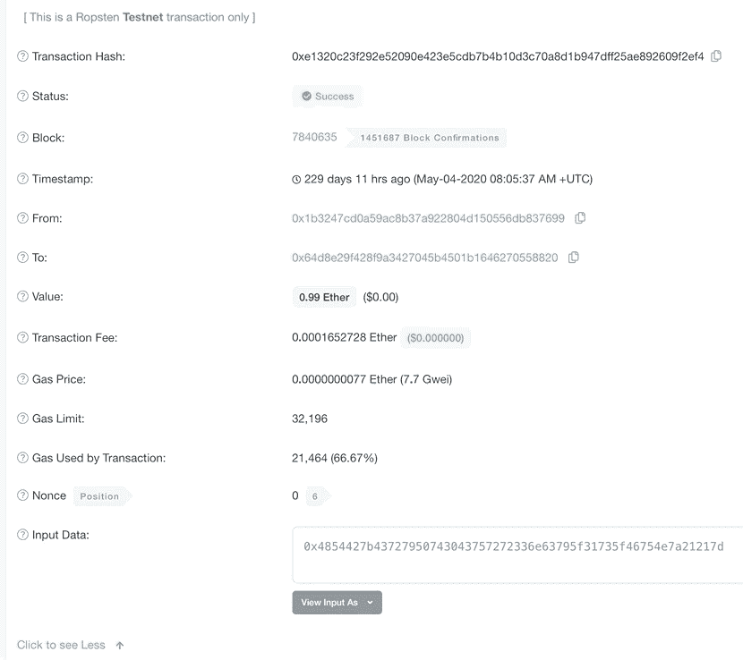**

# **场景 4 -密码泄露**

****“你设法从一个超级安全初创公司的匿名 FTP 服务器上下载了一些有趣的文件。通过一些网络工作(种子或在线密码泄露网站),你也获得了最近的数据泄露转储。你能解锁文件并取回密钥吗？”****

**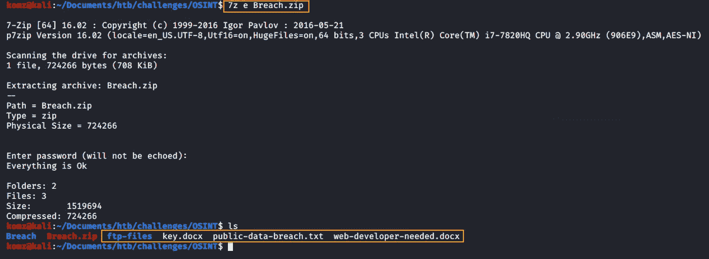**

**打开此文件时，文档 key.docx 会提示输入密码。**

**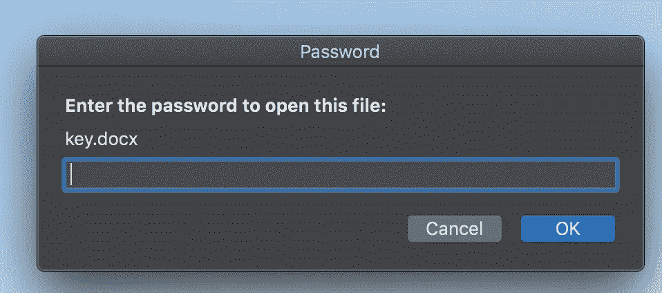**

****public-data-breach.txt** 有一份包括**密码**在内的人员详细信息列表。其中一个密码可能被用来打开这个 **key.docx** 文件。**

**下面显示了 key.docx 文档的信息。注意最后一次修改是在 2019 年 3 月的**中。****

****

**我们知道这里提到的公司叫做**超级安全创业公司**。public-data-breach.txt 还泄露了一些在超级安全初创公司工作的员工密码。**

**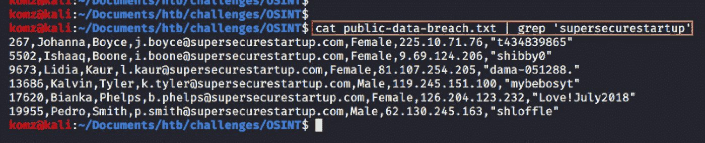**

**这里找到的密码都没用。通过谷歌搜索，我发现卞卡·菲尔普斯是社交媒体上唯一一个提到在超级安全创业公司工作的人。**

**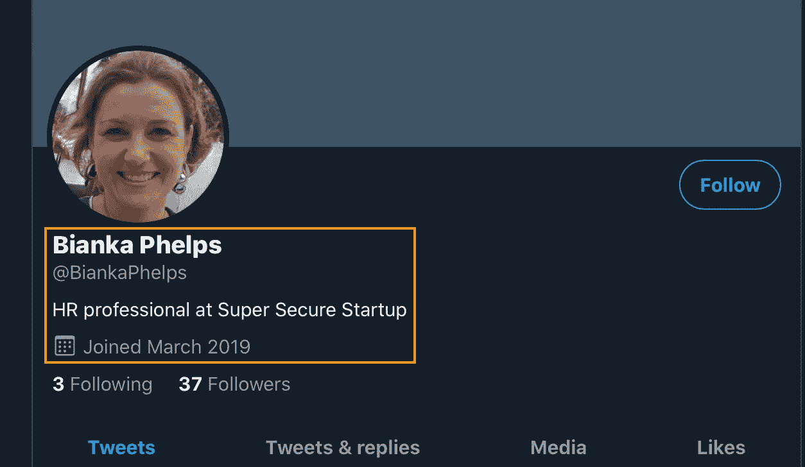**

**注意她提到了 2019 年加入公司+也在 key.docx 信息中最后一次修改是在 Marc h 2019 年。我在 key.docx 密码提示里重新输入了她的密码但是这次我改成了 Love！2019 年 3 月，瞧！成功了！**

**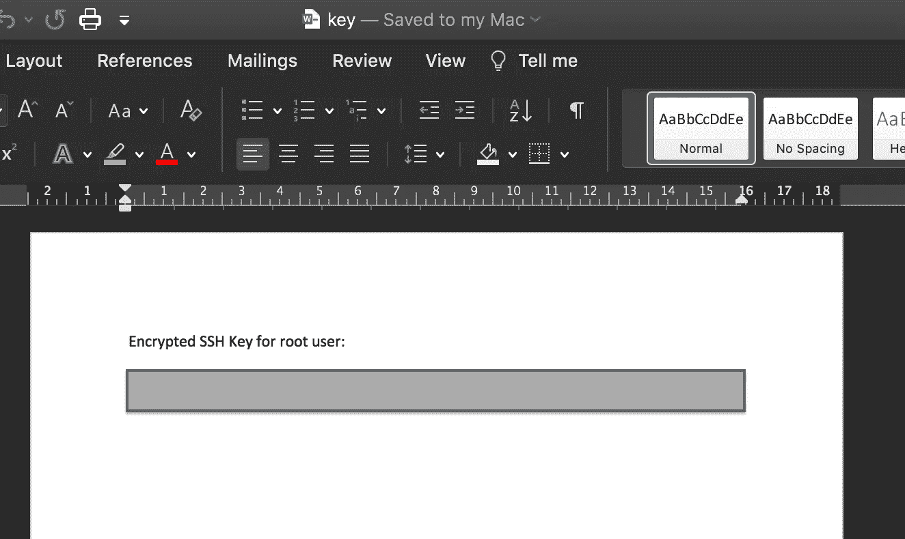**

**找到了解码成 HTB 标志的 base64 编码字符串。**

***未完待续…最后更新:2020 年 12 月***