# 奥辛特道场:小樱

> 原文：<https://infosecwriteups.com/osint-dojo-sakura-37c0fded88b?source=collection_archive---------0----------------------->


[奥辛特道场](https://raw.githubusercontent.com/OsintDojo/public/main/SakuraLogo.png)。

在本文中，我学习了如何使用开源智能(OSINT)技术来识别大量标识符和其他信息，以帮助抓获一名假想的网络罪犯。本次挑战在 [TryHackMe](https://tryhackme.com/) 平台上提供，名称为“**樱室**，由用户“ [*OSINTDojo*](https://tryhackme.com/p/OSINTDojo) ”创建。

# 任务 1:通风报信

## 挑战描述

> OSINT Dojo 最近发现自己成为了网络攻击的受害者。看起来没有重大损害，我们的任何系统也没有任何其他明显的受损迹象。然而，在取证分析过程中，我们的管理员发现了网络罪犯留下的图像。也许它包含一些线索，可以让我们确定谁是攻击者？
> 
> 我们复制了攻击者留下的图像，您可以在您的浏览器[中查看此处](https://raw.githubusercontent.com/OsintDojo/public/3f178408909bc1aae7ea2f51126984a8813b0901/sakurapwnedletter.svg)。

## 挑战问题和答案

> 1.攻击者使用什么用户名？

我可以使用工具 **exiftool** 查看图像的元数据，在这里我可以看到 Export-filename 标记中攻击者的用户名。

```
$ exiftool sakurapwnedletter.svg 
```

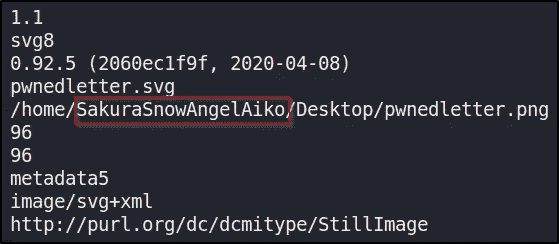

攻击者用户名。

# 任务 2:侦察

## 挑战描述

> 看来我们的攻击者在操作安全上犯了一个致命的错误。他们似乎也在其他社交媒体平台上重复使用自己的用户名。这将使我们更容易通过定位他们的其他社交媒体账户来收集更多信息。

## 挑战问题和答案

> 1.攻击者使用的完整电子邮件地址是什么？

我首先搜索攻击者的用户名“**sakurasnoangelaiko**”。我找到了攻击者的 [Github](https://github.com/sakurasnowangelaiko) 账号和他们的 [LinkedIn](https://www.linkedin.com/in/sakurasnowangelaiko/?originalSubdomain=jp) 账号。在查看 Github 帐户时，我看到了一个包含 PGP 公钥的存储库。

> PGP 密钥是**公共加密密钥**。PGP 密钥可用于对电子邮件和文件进行签名和加密。创建 PGP 密钥时，会生成一个包含公钥和私钥的密钥对。

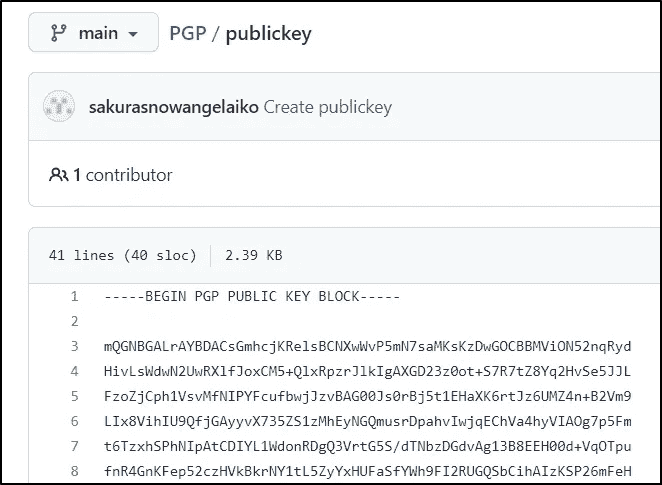

PGP 公钥。

我可以在我的 Linux 机器上使用 **gpg** 工具将公钥的文件内容添加到我的公钥环中，并检索用户的电子邮件。

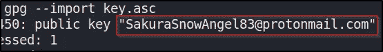

攻击者电子邮件。

> 2.攻击者的真实全名是什么？

查看攻击者 [LinkedIn](https://www.linkedin.com/in/sakurasnowangelaiko/?originalSubdomain=jp) 账户，我可以看到他们的全名是 Aiko Abe，这也与之前在 Github 账户上看到的用户名相匹配。


LinkedIn 账户攻击者的真实全名。

# 任务 3:揭开面纱

## 挑战描述

> 看来网络罪犯已经意识到我们盯上他们了。当我们调查他们的 Github 账户时，我们观察到账户所有者已经开始编辑和删除信息，以摆脱他们的追踪。很可能他们删除了这些信息，因为其中包含了一些有助于我们调查的数据。也许有办法找回他们提供的原始信息？

## 挑战问题和答案

> 1.攻击者拥有加密货币钱包是为了什么加密货币？

查看攻击者的 Github 帐户，我可以看到多个与加密货币相关的存储库。在名为“ETH”的存储库中，我可以看到一个名为“ **miningscript** 的文件，其中只有一行似乎是攻击者以太坊加密货币钱包的占位符。

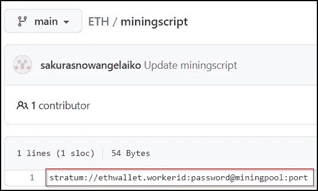

以太坊仓库。

> 2.攻击者的加密货币钱包地址是什么？

如果我选择“*历史*，我可以看到在 2021 年 1 月 23 日有两次提交。

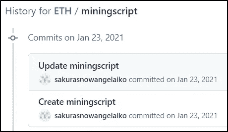

Github 存储库提交历史。

选择标题为“ *Create miningscript* ”的第一个提交提供了攻击者的加密货币钱包地址。

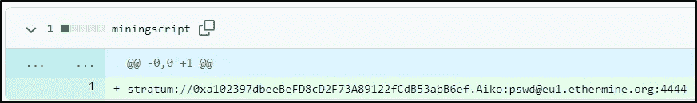

攻击者的加密货币钱包地址。

> 3.攻击者在世界协调时 2021 年 1 月 23 日从哪个矿池收到付款？

搜索“以太坊矿池”，我找到了网站[ethermine.org](https://ethermine.org/)。我搜索了攻击者的钱包地址，发现了一个[支出历史](https://ethermine.org/miners/a102397dbeeBeFD8cD2F73A89122fCdB53abB6ef/payouts)。我可以看到攻击者在 UTC 2021 年 1 月 23 日收到了来自[**ether mine**](https://www.etherchain.org/tx/0xde6bf2f4ee82f9176a2c491aef75737e4a2c7be38e48bdedbc10aba5dbb996fd)**的付款。**

**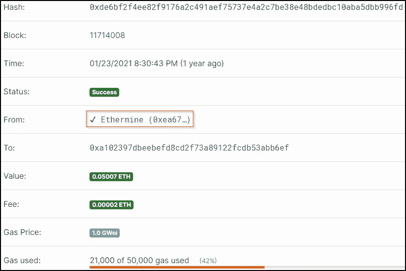**

**采矿池。**

> **4.攻击者使用他们的加密货币钱包交换了哪些其他加密货币？**

**使用网站 [etherscan.io](https://etherscan.io/txs?a=0xa102397dbeeBeFD8cD2F73A89122fCdB53abB6ef) ，我能够识别出**系绳**是攻击者使用他们的加密货币钱包交换的另一种加密货币。**

**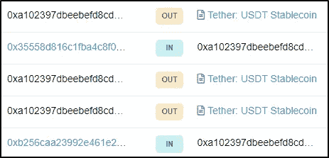**

**系绳加密货币。**

# **任务 4:嘲讽**

## **挑战描述**

> **正如我们所想的那样，网络罪犯完全知道我们在攻击他们之后正在收集他们的信息。他们甚至厚颜无耻地在 Twitter 上给 OSINT Dojo 发消息，嘲笑我们的努力。他们使用的 Twitter 帐户似乎使用了与我们之前跟踪的不同的用户名，也许我们可以找到一些额外的信息来了解他们接下来要去哪里？**
> 
> **我们对攻击者发送给我们的信息进行了截图，您可以在您的浏览器[这里](https://raw.githubusercontent.com/OsintDojo/public/main/taunt.png)查看。**

****

**挑战 4 形象。**

## **挑战问题和答案**

> **1.攻击者当前的 Twitter 句柄是什么？**

**查看提供的图片，我可以看到攻击者的旧 Twitter 句柄是“ *@AikoAbe3* ”。在 Twitter 上搜索这个句柄，我可以看到攻击者当前的 Twitter 句柄是“@ SakuraLoverAiko”。我可以确认这一点，因为个人资料图片与上述挑战文件中看到的图片相匹配。**

****

**攻击者当前的 Twitter 句柄。**

> **2.攻击者保存其 WiFi SSIDs 和密码的位置的 URL 是什么？**

**如果我浏览攻击者帐户的推文历史，我可以看到一个关于在暗网上保存他们的 WiFi SSIDs 和密码的帖子。**

**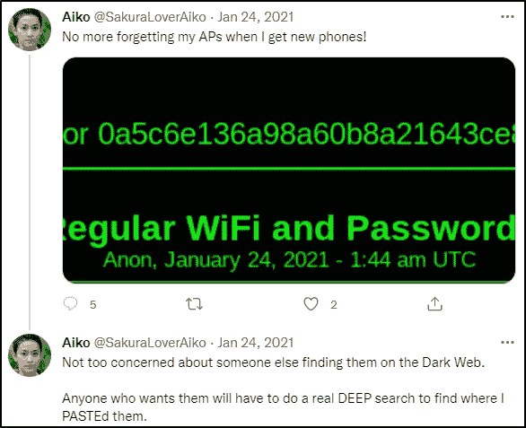**

**黑暗网络推文。**

**对于这个挑战，我决定使用提示中提供的[图像](https://raw.githubusercontent.com/OsintDojo/public/main/deeppaste.png)，因为这个答案的黑暗网站可能会上下波动几个小时。**

**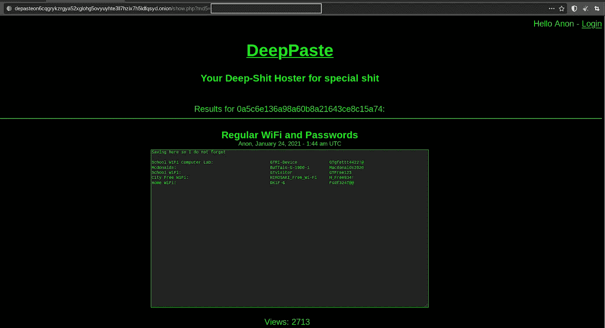**

**黑暗网站。**

**我可以看到黑暗网站的完整网址，MD5 散列混淆。我们可以简单地将网站上看到的 MD5 散列值附加到 URL 上。**

> **3.攻击者家庭 WiFi 的 BSSID 是什么？**

**可以看到攻击者家里 WiFi 的 SSID 是“ *DK1F-G* ”。我可以使用网站[Wigle.net](https://wigle.net/login)并执行高级搜索来检索攻击者家庭 WiFi 的 BSSID。**

**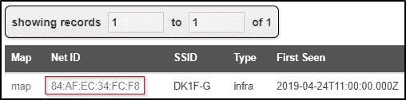**

**攻击者家庭 WiFi 的 BSSID。**

# **任务 5:在家**

## **挑战描述**

> **根据他们的推文，看起来我们的网络罪犯确实像他们声称的那样回家了。他们的推特账户上似乎有很多照片，这应该能让我们拼凑出他们回家的路线。如果我们跟踪他们留下的痕迹，我们应该能够跟踪他们从一个地方到下一个地方的运动，一直到他们的最终目的地。一旦我们确定了他们的最终目的地，我们就可以确定应该将我们的发现转发给哪个执法机构。**

## **挑战问题和答案**

> **1.哪个机场离攻击者登机前分享照片的地点最近？**

**在浏览攻击者的推文历史时，我看到了他们在登上回家的航班前发布的一些樱花的照片。在照片中，我可以看到远处有一个巨大的白色方尖碑，似乎是华盛顿纪念碑。**

**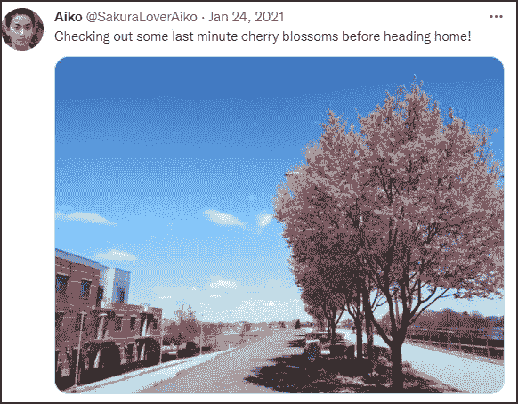**

**华盛顿纪念碑的推特帖子。**

**离华盛顿纪念碑最近的机场是罗纳德·里根华盛顿国家机场机场，也被称为 DCA T1。**

> **2.袭击者最后一次在哪个机场停留？**

**攻击者的下一条推文显示了他们最后停留时去过的头等舱休息室的名称。**

****

**我可以看到休息室属于日本航空公司(JAL)，在谷歌上快速搜索[樱花休息室](https://www.jal.co.jp/en/inter/service/lounge/hnd/sakura/#top)，显示它位于东京羽田国际机场(HND)。**

> **3.在攻击者共享的地图中，当他们最后一次坐飞机回家时，可以看到哪个湖？**

**攻击者在推特上发布了他们国家的卫星图像，其中包括一个湖泊。**

**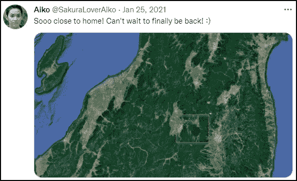**

**卫星图像。**

**根据之前的推文，我知道袭击者在东京羽田国际机场登机前。打开日本的谷歌地图，我搜索了类似的地标，发现了与上面推文中看到的相同的岛屿和湖泊。**

**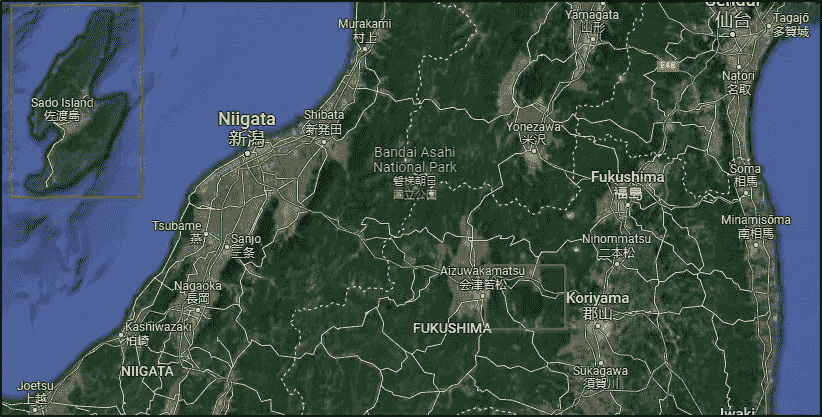**

**日本谷歌地图。**

**放大湖面，我能看到它的名字。**

**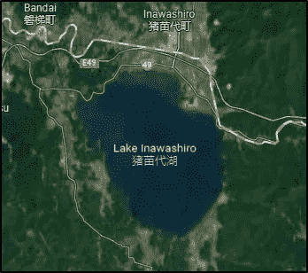**

**湖名。**

> **4.攻击者可能认为哪个城市是“家”？**

**利用我目前为止在整个调查过程中收集的信息，我知道攻击者的国籍是日本人，住在日本北部的某个地方。看前面的 WiFi SSID 列表，可以看到有一个 SSID 叫做“ ***弘前 _ 免费 _Wi-Fi*** ”。**

****

**SSID 列表。**

**弘前是日本北部一个城市的名字，也是这次挑战的答案。**

**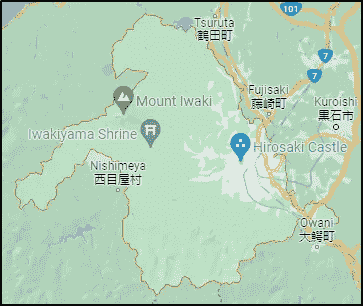**

**日本弘前。**

# **最后的想法**

**我真的很喜欢在这个房间里工作，有机会学习更多关于 OSINT 技术的知识。挑战进行得很顺利，我学到了很多通过分析照片和社交媒体账户来收集信息的方法。谢谢你一直读到最后，继续黑下去😄！**