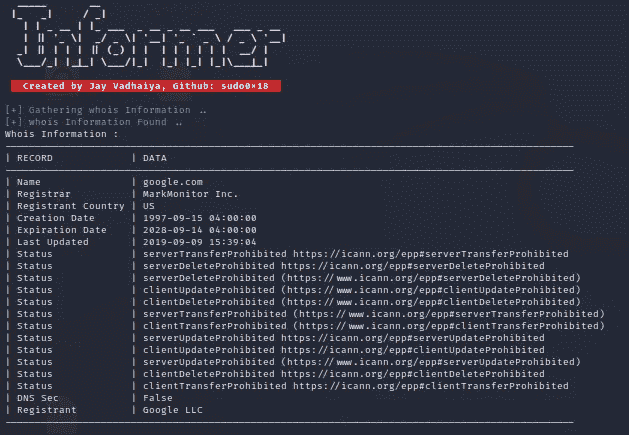
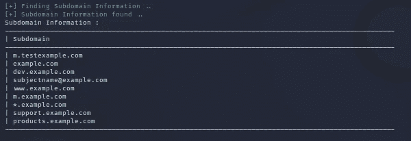
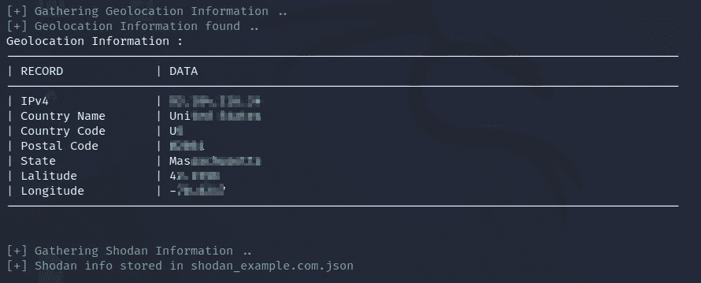

# 用告密者收集信息

> 原文：<https://infosecwriteups.com/osint-information-gathering-with-informer-28176a704cf6?source=collection_archive---------1----------------------->

众所周知，信息收集在网络安全和道德黑客是非常重要的。你对目标了解得越多，你获得的成功就越多。我们将看到基于 OSINT 的一个非常好的信息收集工具[](https://github.com/sudo0x18/informer)***。***

****

**在您开始之前，**您可以加入我们的 discord 服务器，与志同道合的人交流，分享您可以与他人分享的一切，以帮助他们，并让人们回答您的问题。****

**[](https://discord.gg/VKJSmqDN5P) [## 加入赛博空间不和谐服务器！

### 查看 Discord 上的 CyberVerse 社区——与 106 名其他成员一起玩，享受免费语音和文本聊天。

不和谐. gg](https://discord.gg/VKJSmqDN5P) 

Informer 是用 python 编程语言制作的基于 OSINT 的信息收集工具。它具有 whois 信息收集、地理位置信息收集、DNS 信息收集、子域信息收集和 shodan 信息收集等功能。

> GitHub 链接:[https://github.com/sudo0x18/informer](https://github.com/sudo0x18/informer)

# 1.下载和设置

要下载和安装，您必须在设备上安装 git 和 python。用 git 将存储库克隆到您的计算机设备中，并安装所有需求。

```
#Clone repo
git clone [https://github.com/sudo0x18/informer.git](https://github.com/sudo0x18/informer.git)#Move into directory
cd informer#Install requirements
pip install -r requirements.txt
```

# 2.用法和菜单

理解每个工具的用法和可用选项非常重要。让我们很快地看一下。

```
***python3 informer.py --help***Options:
 -**h, --help** Show this help message and exit
 -**t TARGET, --target** **TARGET** Target domain name.
 **-d , --dns** Get DNS Information
 **-g , --geolocation** Get Geolocation Information.
 **-s , --shodan** Get Shodan Information.
 **-sd, --subdomain** Get Subdomain Information.
 **-o OUTPUT, --output OUTPUT** Save output to the desired file.
```

# 3.Whois 信息和 DNS 信息收集

Informer 使 whois 信息和 DNS 信息的收集非常快速和简单。我们只需要提供一个有效的域名并指定有效的标志就可以得到想要的结果。

```
***python3 informer.py -t google.com -d***# -t : Specify the target domain
# -d : Tells informer to fetch DNS info
```



# 4.子域信息收集

在 web 应用程序的 pen-test 中，收集子域信息是非常重要的。 ***告密者*** 让这件事变得非常简单快捷有效。您可以收集以下子域信息。

```
***python3 informer.py -t example.com -sd***#-sd : Tells informer for sub-domain info gathering
```



# 5.其他选项及其用法

informer 还提供位置信息收集、shodan 信息，并将输出保存到文件中。它会自动将 shodan 信息存储在一个名为 shodan_ <domain>的文件中。json 有很多缩进。</domain>

```
***python3 informer.py -t example.com -g -s -o filename.txt***# -g : For geo-location info gathering
# -s : For shodan info gathering
# -o : To store the output in a file
```

**

**感谢您阅读完本文。这是我人生的第一篇文章。我希望这篇文章对你有所帮助。关注我，获取更多有趣的文章和信息丰富的博客帖子。**

**[](https://discord.gg/PM6TUYXD) [## 加入赛博空间不和谐服务器！

### 查看 Discord 上的 CyberVerse 社区——与 106 名其他成员一起玩，享受免费语音和文本聊天。

不和谐. gg](https://discord.gg/PM6TUYXD) 

## 来自 Infosec 的报道:Infosec 每天都有很多内容，很难跟上。[加入我们的每周简讯](https://weekly.infosecwriteups.com/)以 5 篇文章、4 条线索、3 个视频、2 个 GitHub Repos 和工具以及 1 个工作提醒的形式免费获取所有最新的 Infosec 趋势！**