# 奥辛特——西班牙语

> 原文：<https://infosecwriteups.com/osint-lespion-d4798d5fb44?source=collection_archive---------0----------------------->


[间谍密探](https://www.vectorstock.com/royalty-free-vector/spy-secret-agent-finger-gun-gesture-vector-23443589)

这篇短文介绍了我对名为“*间谍*”的 CTF 挑战的解决方案，这是一个开源情报(OSINT)挑战，可在[网络卫士](https://cyberdefenders.org/blueteam-ctf-challenges/73)网站上获得，由 [BushidoToken](https://twitter.com/BushidoToken) 创建。

# 放弃

我喜欢在一篇文章之前添加一个简短的免责声明，以鼓励人们在阅读本文之前尝试挑战，因为这篇文章中显然会有**剧透****。我相信，如果你先自己尝试，然后在遇到困难或需要提示时再回来写这篇文章，你会更喜欢这个挑战。所以不要再拖延了，让我们开始吧！**

# **挑战描述**

> **一位客户的网络遭到破坏并导致您离线，您被指派调查该事件并确定攻击者的身份。**
> 
> **事件响应人员和数字法医调查人员目前正在现场，并已进行初步调查。他们的发现表明，攻击来自一个单一的用户帐户，很可能是一个内部人员。**
> 
> **调查事件，找到内部人员，并揭露攻击行为。**

**对于这个挑战，我们还提供了三个文件来帮助我们的调查。**

**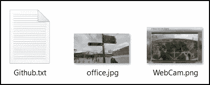**

**挑战文件。**

# **挑战问题**

> **1.File -> Github.txt:内部人员添加到他的 Github 库的 API 密匙是什么？**

**在 *github.txt* 挑战文件中，我们提供了以下链接:**

```
[https://github.com/EMarseille99](https://github.com/EMarseille99)
```

**访问这个 Github 页面，我可以看到有 14 个资源库。我从查看最新的名为“[Project-Build-Custom-log in-Page](https://github.com/EMarseille99/Project-Build---Custom-Login-Page)”的存储库开始。在这个存储库中，有两个 JavaScript 文件，分别名为“ *Login Page.js* ”和“ *fsociety.js* ”。查看" *Login Page.js* "文件的内容，我可以看到内部人员添加到他的 GitHub 库的 API 密匙。**

**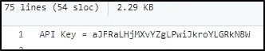**

**API 密钥。**

> **2.File -> Github.txt:内部人员添加到他的 Github 库的明文密码是什么？**

**仍然查看“ *Login Page.js* ”文件的内容，如果我向下滚动，可以看到一个 base64 编码的密码值。**

**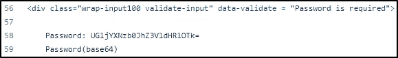**

**Base64 编码的密码。**

**解码这个 Base64 字符串提供了这个问题的答案。**

> **3.File -> Github.txt:知情人使用了什么加密货币挖掘工具？**

**如果我查看其他可用的存储库，我可以看到 xmrig Github 项目的一个分支。XMRIG 是一个利用系统 CPU 挖掘加密货币的开源应用程序。**

**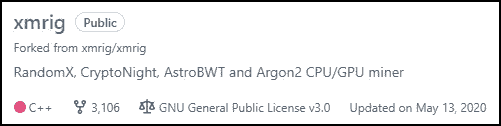**

**XMRIG 加密货币挖掘工具。**

> **4.知情人上的什么大学？**

**在内部人员的 Github 页面上，我可以看到他们是软件顾问公司的后端程序员。**

****

**Github 个人资料详情。**

**我在 Google 中执行了以下搜索，以在其他网站上找到任何关于用户“EMarseille99”及其工作公司的参考资料。**

```
"Software Consultants Inc" EMarseille99
```

**根据我上面的搜索，返回了四个结果。**

****

**搜索结果。**

**访问 LinkedIn 页面，可以看到知情者就读的大学是索邦大学。**

****

**知情者的 LinkedIn 个人资料。**

> **5.知情人在哪个游戏网站有账户？**

**查看内部人士 LinkedIn 帐户上的 about 部分，我可以看到他们有一个 Steam 帐户。**

**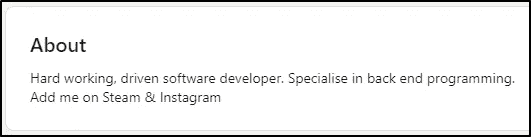**

**知情者的 LinkedIn 关于部分。**

**我还可以使用一个名为 recon-ng 的工具，如下图所示，该工具可以识别一个用户名为“EMarseille99”的 steam 帐户。**

```
[recon-ng][default] > marketplace install profiler
[*] Module installed: recon/profiles-profiles/profiler
[*] Reloading modules...
[recon-ng][default] > modules load profiler
[recon-ng][default][profiler] > info
[recon-ng][default][profiler] > options set SOURCE EMarseille99
SOURCE => EMarseille99
[recon-ng][default][profiler] > run
.....
[recon-ng][default][profiler] > show profiles
```

**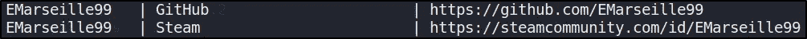**

**识别蒸汽账户。**

> **6.insider Instagram 个人资料的链接是什么？**

**回顾之前在问题 4 下看到的四个搜索结果，我们还能够找到该知情人的 Instagram 个人资料。**

```
https://www.instagram.com/emarseille99/
```

> **7.知情者假期去哪里了？(仅限国家)**

**看知情人的 Instagram 账号，可以看到六张图。**

**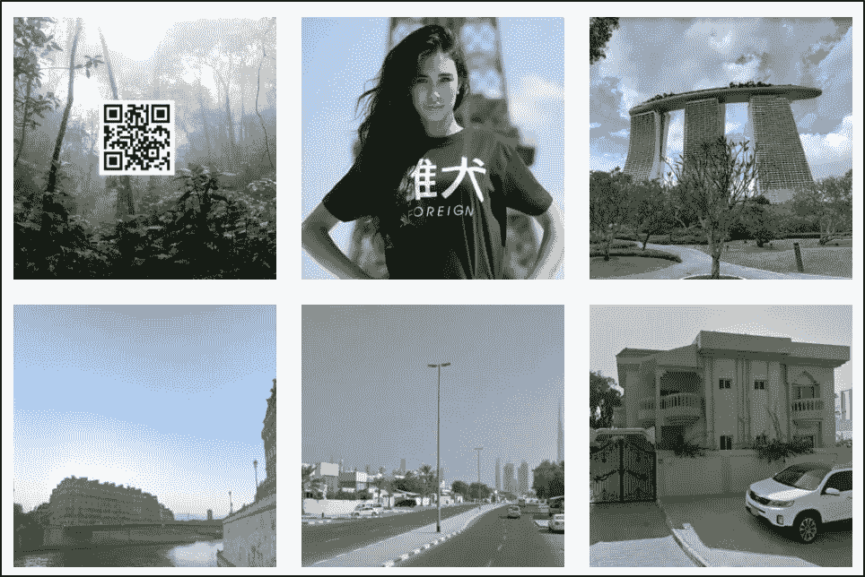**

**知情人的 Instagram 照片。**

**我用 [**ImgInn**](https://imginn.org/) 查看 Instagram 照片，在第三张图片下发现了一条评论。**

**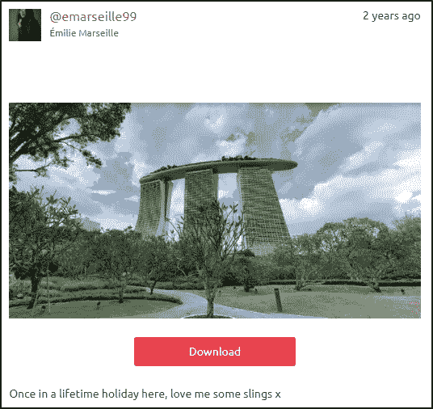**

**知情人的 Instagram 假期照。**

**使用谷歌图像镜头，我进行了快速图像查找，并确定该建筑是新加坡滨海湾金沙酒店。**

> **8.知情人家住哪里？(仅限城市)**

**我首先回顾了知情人 Instagram 账户上的最后两张照片。第一张图片看起来是一个温暖的沙漠气候，背景是一座非常大的摩天大楼。**

**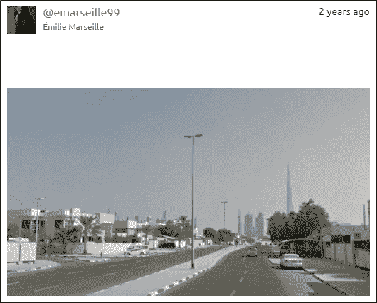**

**与非常高的摩天大楼的照片。**

**第二张图片显示了阿拉伯联合酋长国(UAE)的国旗和一条关于拜访朋友和家人的评论。**

**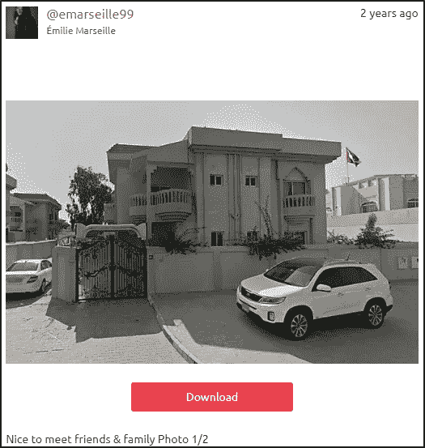**

**与阿联酋国旗合影。**

**根据这些信息，我认为第一张照片中的摩天大楼是位于迪拜市的迪拜塔。**

> **9.File -> office.jpg:已经给你提供了一张公司办公的大楼的图片。该公司位于哪个城市？**

**我们提供了下面的办公室图像如下所示。**

**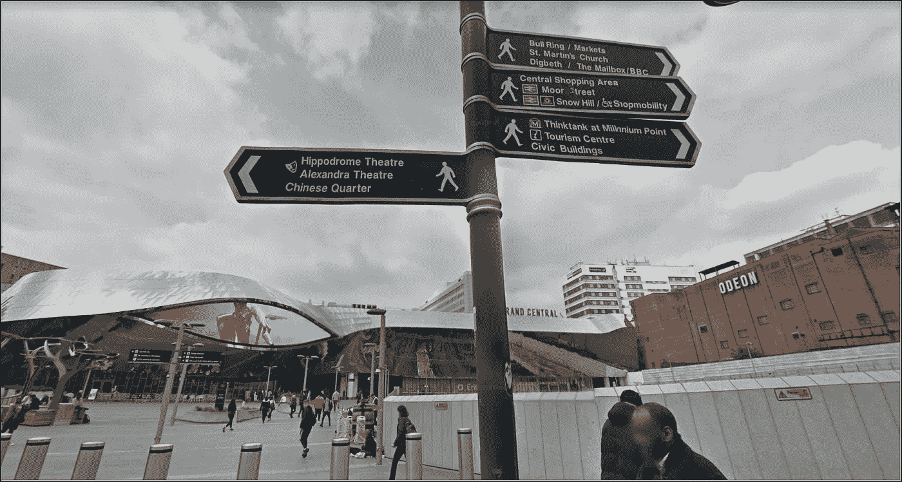**

**公司办公室形象。**

**我能看到竞技场剧院的标志，它位于伯明翰。**

> **10.File -> Webcam.png:根据您提供的情报，我们的地面监视单位现在可以监视到嫌疑人的可疑地址。他们看见他们离开公寓，跟着他们去了机场。他们的飞机起飞了，已经在另一个国家着陆。我们的情报小组用这个 IP 摄像头发现了目标。这个相机是什么状态？**

**下面可以看到提供的网络摄像头图像。**

**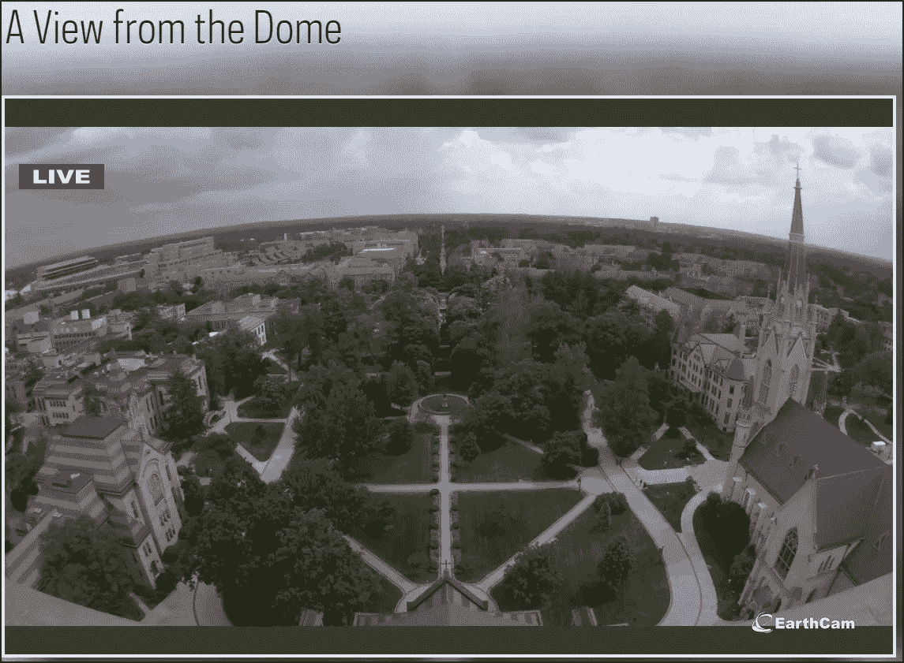**

**网络摄像头图像。**

**为了回答这个问题，我使用网站 [TinEye](https://tineye.com/) 进行了反向图像查找，得到了一个结果。**

**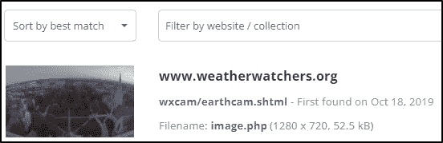**

**TinEye 反向图像搜索结果**

**选择这个结果并导航到网站，我找到了匹配的图像并被重定向到 EarthCam 网站。这表明该摄像机位于印第安纳州的圣母大学。**

**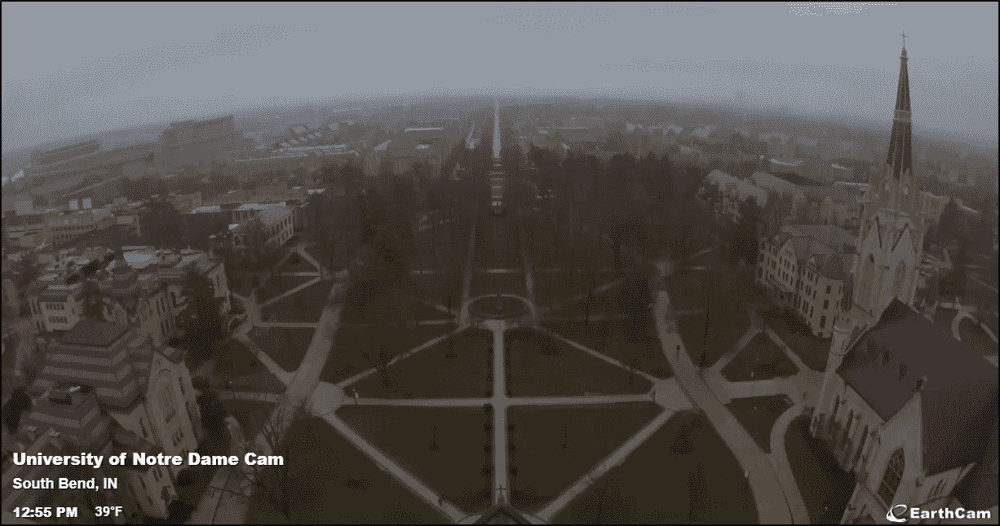**

**圣母大学摄像机。**

# **结束语**

**这是一个有趣的挑战，帮助人们更多地了解 OSINT 技术，以及通过检查社交媒体账户、图像和开源代码可以找到什么信息。谢谢你一直读到最后，继续黑下去😄！**