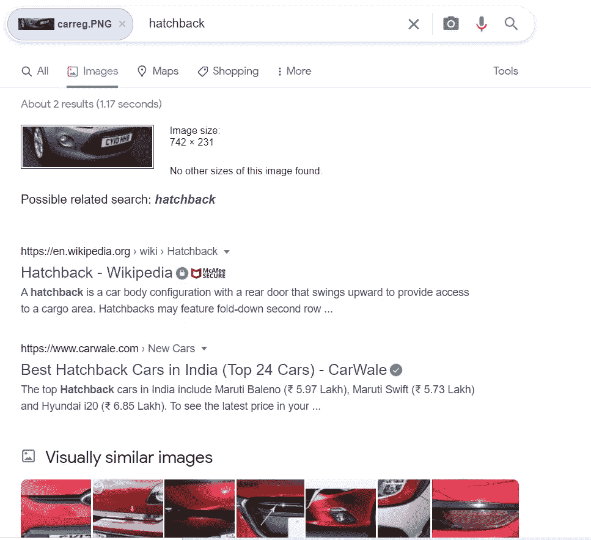
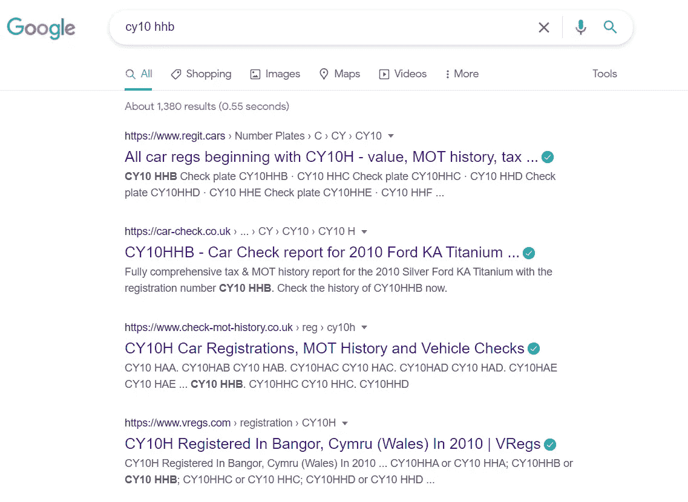
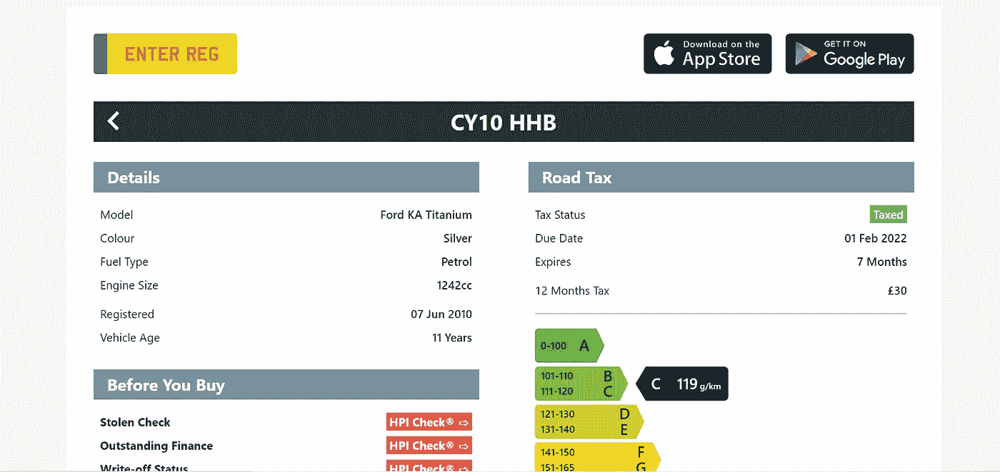
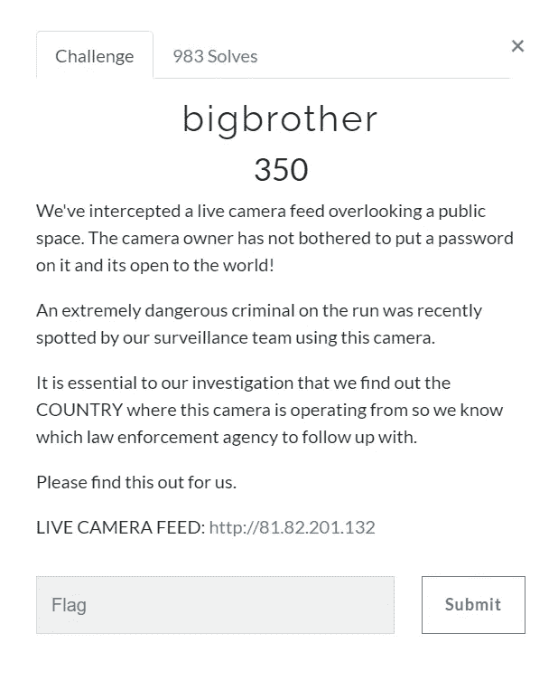
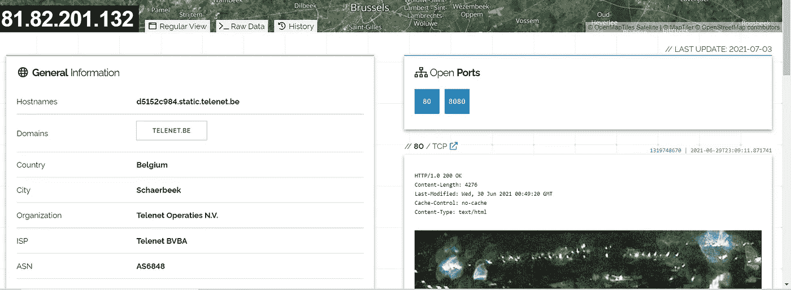
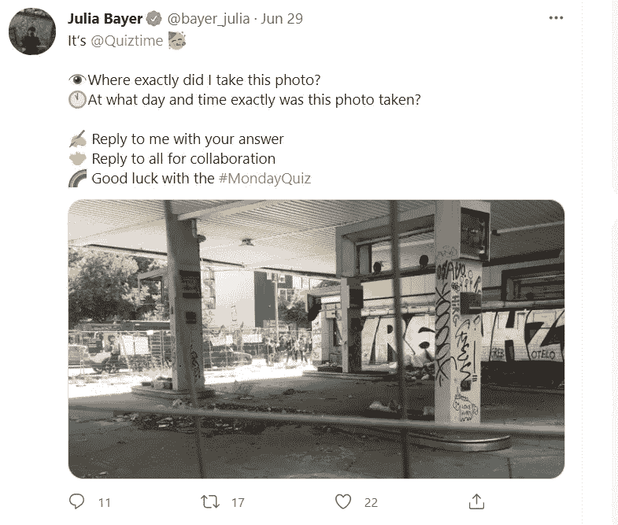
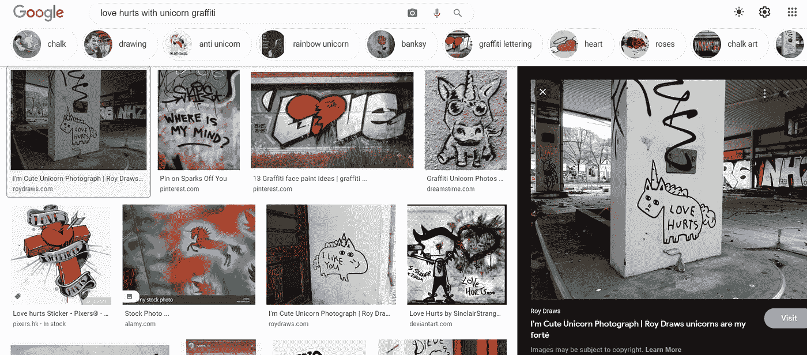
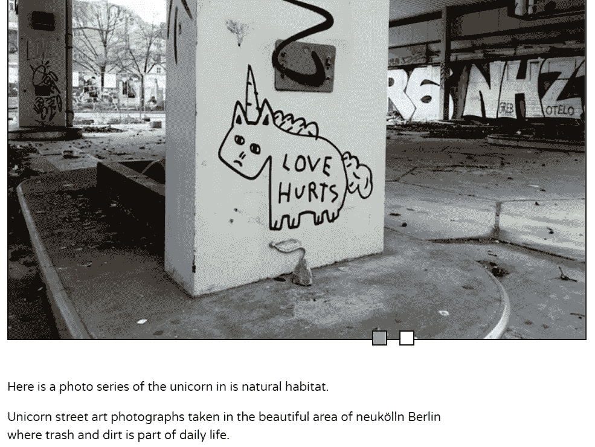
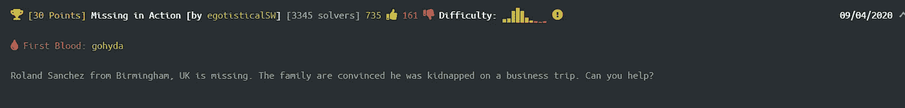

# 开源情报周刊

> 原文：<https://infosecwriteups.com/osint-open-source-intelligence-dd92f920766a?source=collection_archive---------1----------------------->

第一周

你好。！！希望你一切都好。

这个博客是一本信息丰富、激动人心的 OSINT 书籍的第一页。不要认为这有一些冗长乏味的信息被丢弃。

即使你不是一个对攻击性安全、调查或取证感兴趣的人，也要试试这篇博客,因为这会帮助你理解

# 怎样才能有效利用搜索引擎？

# 如何评估给定信息中的微小细节，以及如何从中获取更大的图像？

# 最后，你也可以享受一些 T2 的乐趣。(这一点非常重要😉)

在这个每周一次的博客中，我将发布一个精选的列表，列出使用 OSINT 中不同的方面和方法解决的挑战。

此外，我还表达了我通常用来解决这些挑战的方法，因此它可能不会直接向您指出解决方案。

这些挑战的主要来源是:

1.  这是一个很棒的资源，可以提高我们查找地理位置信息的技巧。

 [## 让我们探索世界吧！

### GeoGuessr 是一款地理游戏，带你环游世界，挑战你的认知能力…

www.geoguessr.com](https://www.geoguessr.com/) 

2.OSINT dojo 推荐的不同 ctf 和小考。

 [## 奥辛特道场

### 你好，欢迎来到奥辛特道场！OSINT Dojo 是一个项目，旨在指导那些开源新手…

www.osintdojo.com](https://www.osintdojo.com/) 

3.黑掉盒子:

 [## 最佳黑客培训

### 加入一个动态增长的黑客社区，通过最…

www.hackthebox.eu](https://www.hackthebox.eu/) 

4.Twitter 中的 Quiztime 页面

 [## JavaScript 不可用。

### 编辑描述

twitter.com](https://twitter.com/quiztime) 

本周的挑战是:

奥辛特道场的 ctf 是

 [## 网络社会|网络侦探 CTF

### 网络侦探 CTF 是一个专注于网络的 CTF，由卡迪夫大学网络协会创建

ctf.cybersoc.wales](https://ctf.cybersoc.wales/) 

1)

所以在这个挑战中，我们得到了一张汽车的照片，我们的目标是找到它的品牌和制造月份。

听起来很酷吧！！！！

好了，准备好你的调查帽子，让我们开始我们的问题。

这是我们从被指派给我们感兴趣的人的**代理**那里得到的图像。

因此，我们将使用的第一个工具是……..

**谷歌**

你们中的大多数人可能会对此表示惊讶，但是让我告诉你这是怎么可能的..

谷歌有很多我们不知道的功能，其中之一就是谷歌反向图片搜索。

 [## 谷歌图片

### 谷歌图片。网上最全面的图像搜索。

www.google.com](https://www.google.com/imghp?hl=EN) 

这允许我们通过**上传我们拥有的**图像来在互联网上搜索特定的图像。

我们也可以使用 **Yandex 反向图像**进行同样的搜索。

作为一名调查者，我们使用的工具越多，获得相关信息的机会就越多，所以总是尝试我们所拥有的一切。

我们有结果了……

我们得到了这种车身结构，许多公司都生产这种车身..所以有点死路一条。

我们可以看到的另一个信息是注册号

**CY10 HHB**

搜索这个我们得到:

这个页面的第二个链接给了我们所有需要的信息来构建我们的旗帜，甚至更多。

# 旗帜:**福特 6 月**

甚至有移动应用程序来做同样的事情，如果你有一些建议，请告诉我！！

— — — — — — — — — — — — — — — — — — — — — — — — — — — — — — —

2)

下一个挑战是我们得到一个网站，通过它我们可以访问世界上某个地方的实时监控摄像头。

我们需要找到这个摄像机所在的**国家，以便找到一个危险的罪犯。(又一个惊险刺激的任务……)**

现在，我们的武器库中又增加了一个工具，这是我个人最喜欢的，也是我们为 OSINT 提供的最好的工具之一……

**庄丹**

 [## Shodan 搜索引擎

### 立即注册网站只是互联网的一部分。使用 Shodan 发现一切，从发电厂，移动…

www.shodan.io](https://www.shodan.io/) 

这就像是**互联网连接设备**的搜索引擎。

因此，我们可以访问网络摄像头、服务器等设备。

> 虽然我们可能有一些业主张贴的限制..😂😂

因此，通过 shodan，我们可以搜索特定的网络摄像头的 IP 地址。

又一个挑战解决了…我们发现了这个国家

# 国旗:比利时

3)

我会附上图片，如果你有兴趣找到这些答案，请尝试一下。

所以我们应该找到照片拍摄的地点和时间。

使用图像反向搜索似乎不起作用，所以我们必须找到这是使用不同的方法。

> 通常来自这方面的挑战并不直接。

所以仔细看照片，我们可以看到墙上有许多涂鸦，所以通过其中一个搜索，我们得到:

搜索:爱伤害与独角兽涂鸦

得到了确切的图片和访问网页，我们得到了位置的信息。

太好了……

所以地点是柏林新科隆。

另一个线索是人们举着的旗帜，这就像是一种抗议。

所以在寻找国旗上的特殊图案时，我找到了它的**巴勒斯坦**国旗。

另一个位置线索是大楼上的**大旅社告示牌。**

所以现在我们知道柏林发生了一些支持巴勒斯坦的抗议活动。

有了所有这些信息，我们可以找到位置和日期:

## 旗帜:对 Sonnenallee 6(大旅馆)柏林，自由巴勒斯坦示威日期 15.5.21。

# **——————**

我想这个挑战是证明这句话的最好的挑战。

4)

这周最后一个是来自 hackthebox 的。

我们需要找到英国伯明翰的罗兰·桑切斯。

我们再一次对不同的运营商使用相同的工具 Google。

谷歌的运营人员是有效使用它并发挥其最大潜力的关键。

一些常见的有:

1.  <search-term>正文:</search-term>

这仅显示具有我们提到的特定文本字符串的网站。

这有助于我们找到网站，它的正文中有一些我们知道的文本。

2. <search-term>inurl:</search-term>

此运算符与 intext 相同，但它与 url 为的指定字符串相匹配。

3.<search-term>地点:abc.com</search-term>

这将只在我们提到的站点中显示搜索到的查询。

还有很多包含 And，OR，…

**如需更多信息，请使用:**

 [## 谷歌搜索运营商[2021 SEO]

### Google 搜索操作符是特殊的字符和命令(有时称为“高级操作符”)，它们扩展了…

moz.com](https://moz.com/learn/seo/search-operators) 

所以首先我使用了搜索字符串:

搜索:罗兰·桑切斯和英国布里明厄姆

这将显示包含名称和位置的结果。

我们可以看到一个 linkedin 页面和另一个博客页面，上面写着他正在度假。

我的调查员立刻意识到…

hackthebox 的标志格式是 HTB{

有了这个，我们就可以使用 intext 操作符来查找站点，并且它确实工作了。

———————boooommm——————

所以当你读到这篇博客的结尾时，大多数人可能会想

# 这些对我有什么帮助？？？

让我说一些你可以从中获得的广泛的东西。

1.  谷歌的运营商:

如果你是一名程序员，你可以通过以下方式有效地搜索源代码或一些问题

站点:github.com

站点:stackoverflow.com

2.如果你准备买一辆二手车，你可以在网上核实提供的细节，以获得一个清晰的画面。(我并不认为网上的信息是有效的，但检查一下还是有好处的)

3.对于我前面提到的有趣部分，玩 Geoguessr 来猜测我们被丢弃的地方，或者在谷歌街道地图的帮助下在世界不同地方的街道上可视化漫游，甚至可以使用 Shodan 来获得乐趣，我让你去探索。

这就是本周的全部内容…..

让我们迎接更多的挑战和乐趣。

谢谢大家！！！！！！