# HackTheBox 书面报告—块状

> 原文：<https://infosecwriteups.com/oswe-like-boxes-series-0x01-htb-blocky-write-up-1ac98e50dee7?source=collection_archive---------2----------------------->

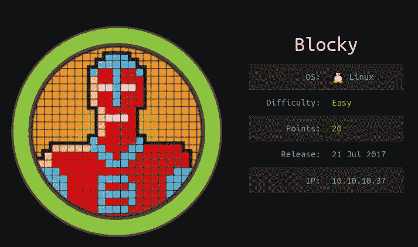

嗨，伙计们，今天我们将看看来自 Hackthebox 的块状盒子。这是一台非常简单的机器，有两种解决方案。一个是有意的，另一个是无意的。预定方式的总结部分。

## 摘要

*   共有 4 个开放端口 **21** 、 **22** 、 **80** 和 **25565** 。
*   迎面来到**端口 80** ，那里有一个 **wordpress** 页面，获取用户名**凹口**。
*   使用 **ffuf** 或任何其他 web fuzzer 找到名为 **/plugins** 的目录。
*   下载**block core . jar**并使用 **JD-GUI** 检查，获取密码。
*   用你找到的用户名**缺口**和密码 SSH 入框。
*   特权升级的基本 **sudo -i** 。

## 扫描端口

像往常一样，我们将从 **nmap** 扫描开始，我使用 nmap 的方式是首先扫描所有端口，然后进行服务扫描，并为我找到的开放端口运行默认脚本。

```
**nmap -p- -vv -T5 10.10.10.37 -oN nmapscan**
```

我使用了 **-vv** ，因为如果 nmap 发现较低编号的开放端口，它会立即向我们显示，这样在扫描时，我可以查看这些端口。我觉得这样扫描比较快。

```
**nmap -p21,22,80,8192,25565 -sVC -vv -T4 -oN nmapscan2 10.10.10.37**
```

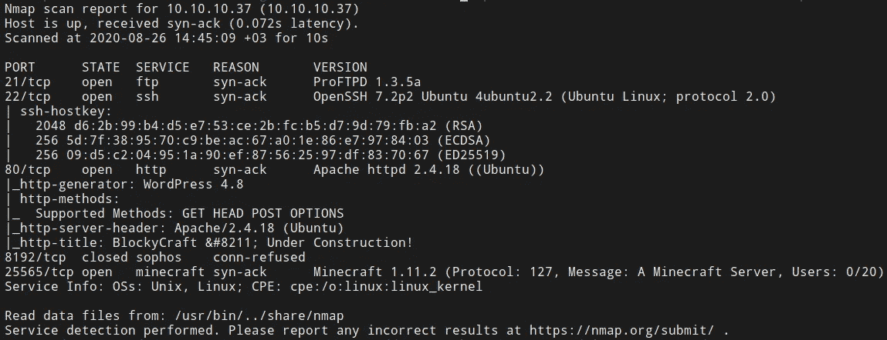

有 ftp 和 ssh 端口，因为 ftp 上没有匿名登录，我们还没有凭证，我们将查看一下**端口 80** 。还有一个《我的世界》服务器，但不可利用。

## 获取用户名

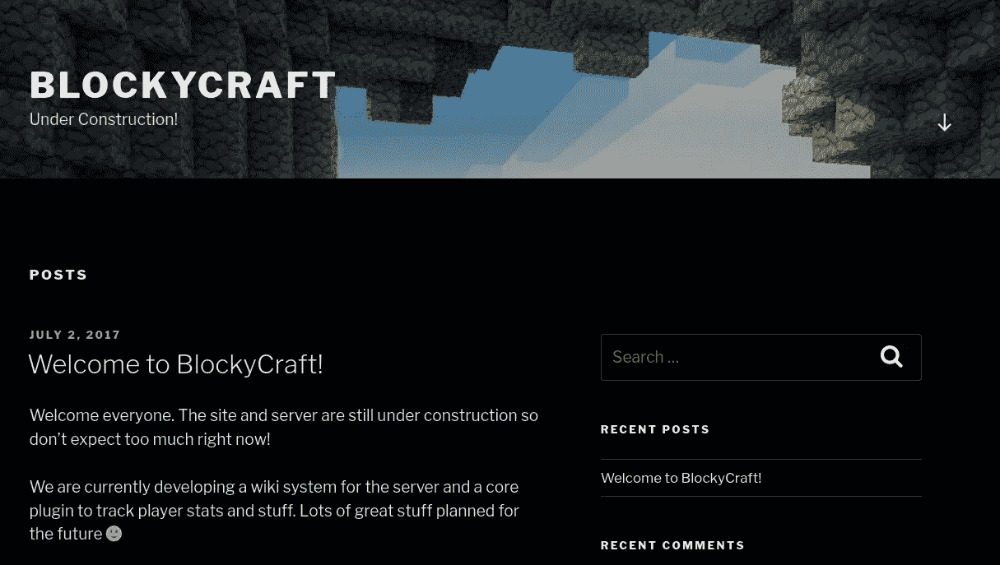

当我们转到端口 80 时，我们可以看到这个 wordpress 页面，通过点击其中一个帖子，我们可以看到我们用户的用户名。

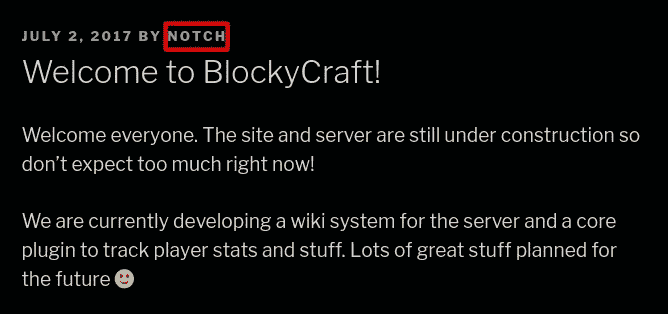

还可以用**枚举 wordpress 上的用户？author=1** 参数。

## 网络起毛

在主目录上，我们有 wordpress，但是让我们模糊一下，看看是否有其他目录或文件。为此，我使用 **ffuf** 和**directory-list-2.3-medium . txt**作为单词表。

```
**ffuf -u "**[**http://10.10.10.37/FUZZ**](http://10.10.10.37/FUZZ)**" -w ~/gitClones/SecLists/Discovery/Web-Content/directory-list-2.3-medium.txt -e .php,.txt**
```

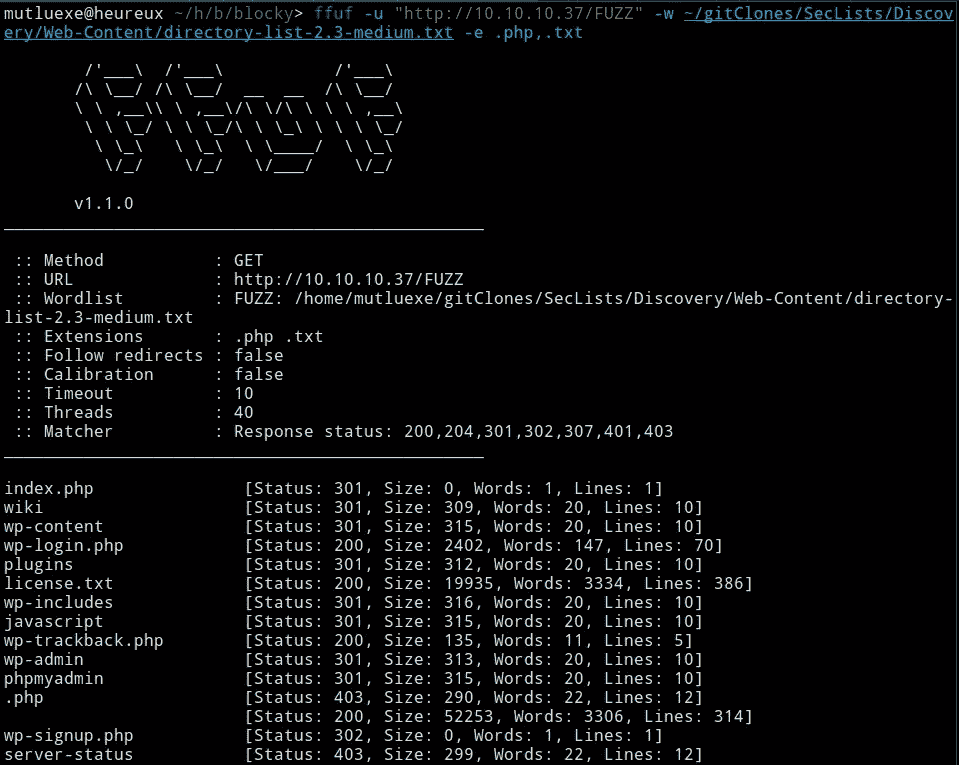

在 **wiki** 页面上什么也没有，有一些 wordpress 相关页面和**插件**页面。请记住，phpmyadmin 和 wp-login.php**还有**T42，因为我们将在稍后的非预期解决方案中处理它们。

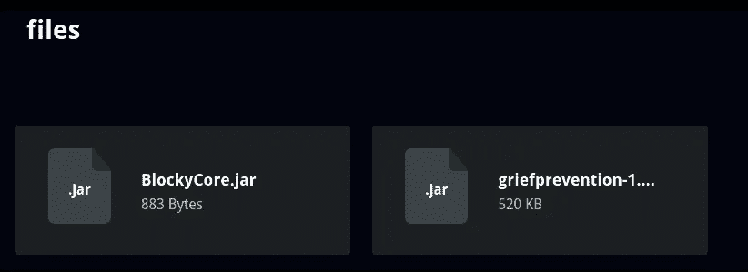

我们在**插件**目录中有两个文件，我都下载了，但是在 griefprevention 文件中没有什么有趣的东西，实际上它是 minecraft 的一个补丁或者类似的东西。

你可以用 **JD-GUI** 检查它，但我用 **7z** 提取它，并使用我们的万能工具**“字符串”** :p

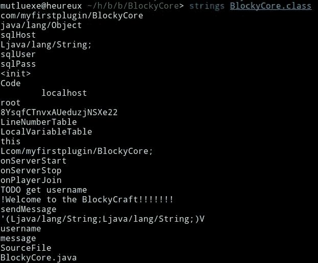

实现密码"**8 ysqfctntnvxaueduzjnsxe 22 "。经过一些尝试和错误之后，我能够用这个密码和 notch 用户连接 SSH。**

## 权限提升

在获得带有用户缺口的 shell 后，我检查了它是否像往常一样是 sudoers 之一。的确是这样；

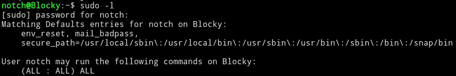

这部分没有什么特别的，非常简单。

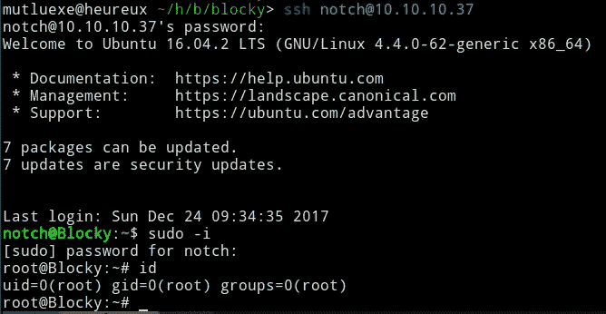

## 意外的方式

记住 **phpmyadmin** ，**wp-login.php**页面和 BlockyCore 凭证。当我第一次看到凭证时，我想我应该输入 phpmyadmin，因为有 sqlUser，sqlPass 值。

当我拿着凭证进入时，我看到了 wordpress 数据库。

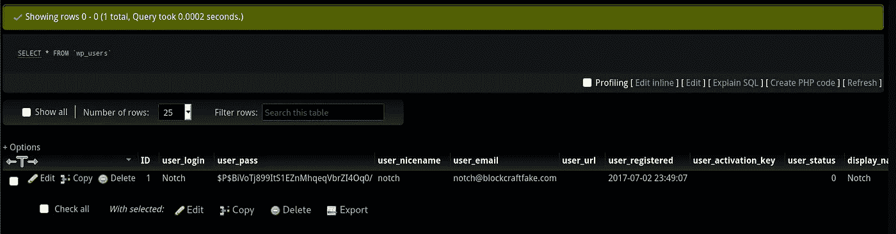

首先，我试图破解它，但不能改变它的自定义密码。要改变它，我们必须得到我们的密码的散列版本。

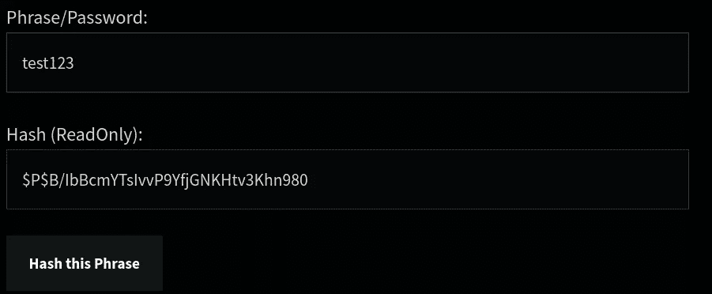

我了解到哈希类型是 **phpass** ，所以用这个在线生成器生成了它。

[](https://ehikioya.com/wordpress-password-hash-generator/) [## 密码散列生成器

### 最后更新于 2019 年 8 月 19 日上午 07:51 由这个 WordPress 密码哈希生成器使用官方 WordPress…

ehikioya.com](https://ehikioya.com/wordpress-password-hash-generator/) 

## 带有 Web Shell 的访问机器

我们已经在 wordpress 上更改了 notch 的密码，所以我们可以在登录后访问 **wp-admin** 。之后的过程很简单，也很有名。使用主题，你可以编辑主题 php 页面并轻松获得外壳。您也可以使用插件来实现这一点。

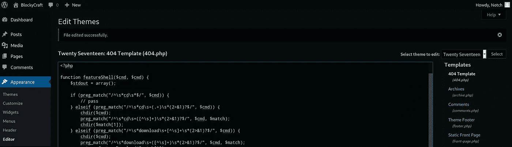

从**外观- >编辑器**，我换了**404.php**页面，用 **p0wny** 外壳编辑。这是我喜欢的，你当然可以选择其他页面或其他 web 外壳。

[](https://github.com/flozz/p0wny-shell) [## flozz/powny-shell

### p0wny@shell:~#是一个非常基本的单文件 PHP shell。它可用于在服务器上快速执行命令，当…

github.com](https://github.com/flozz/p0wny-shell) 

您可以在上访问 404.php

```
**http://10.10.10.37/wp-content/themes/twentyseventeen/404.php**
```

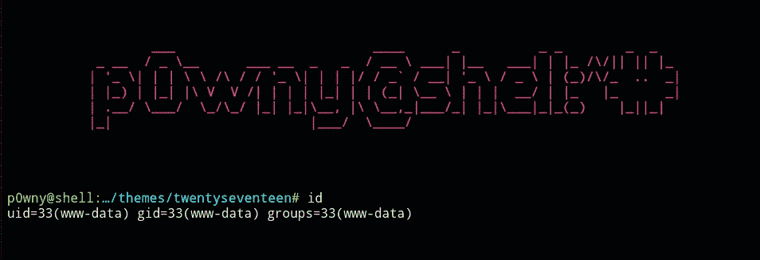

我们将 shell 作为 www-data 用户。由于这个盒子很旧了，我试图避免使用内核漏洞，所以我试图找到另一种方法。

我们可以看到 notch 用户的主目录，有一个 minecraft 文件夹，里面有一些。jar 文件。

在 TJnull 的列表中，有一个关于“JD-GUI 的良好实践”的注释，因为 BlockyCore.jar 太简单了，我想我必须处理它们。挣扎了一段时间后，我一无所获。

## 内核开发

我们最后的手段是搜索内核漏洞，因为内核版本是 4.4.0-62-generic 可能有一个。

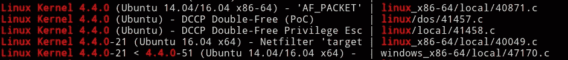

正如你在 searchsploit 结果上看到的，有一些漏洞，但是当你检查 DCCP Double-Free 是在我们的内核版本上测试的。

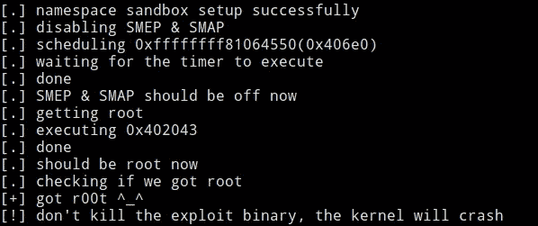

它工作，但非常不稳定，我不得不尝试了几次，它崩溃了，所以我不建议使用它。

> 那都是乡亲们！祝您愉快:)

## ***联系我***

> [推特](http://twitter.com/mutluexe)
> 
> [领英](http://linkedin.com/in/mutluexe)
> 
> [黑客盒子](https://www.hackthebox.eu/profile/112790)