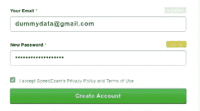
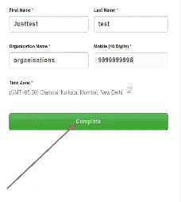
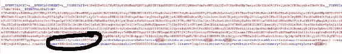
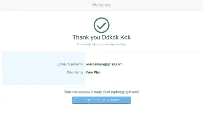
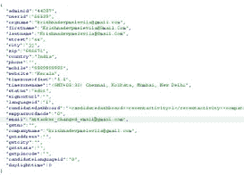
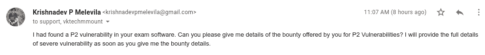
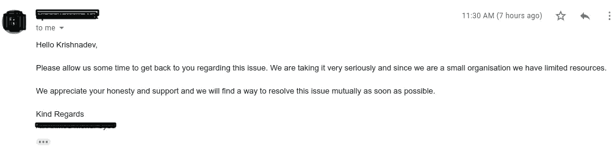
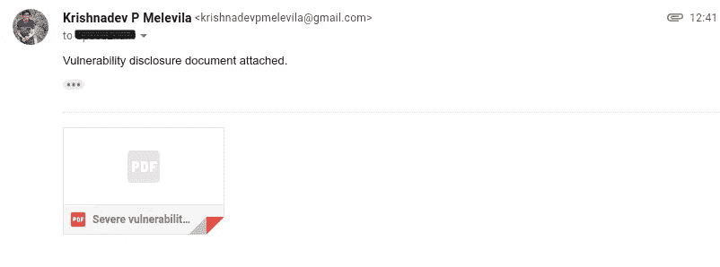
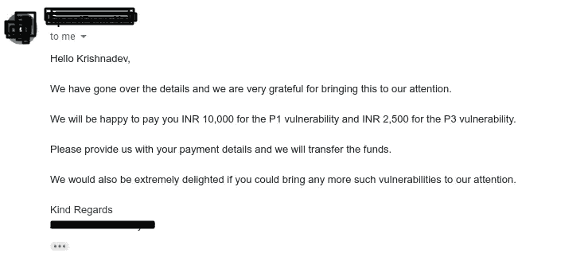

# 使用响应操作的 OTP 旁路和帐户接管

> 原文：<https://infosecwriteups.com/otp-bypass-and-account-takeover-using-response-manipulation-685ad4e1ea76?source=collection_archive---------0----------------------->

谁是克里希纳德夫·P·梅勒维拉？

> Krishnadev P Melevila 是一名企业家、网络安全专家、谷歌认证数字营销人员和全栈开发人员。我也是 Nodeista Infotech 的创始人。要了解更多细节，只需谷歌我的名字。

嘿，伙计们，这是我的第一笔虫子奖金(这意味着我第一次因为虫子而得到报酬)。

根据网站政策，我不能透露网站名称，所以我提到它是 example.com。

这个网站是一个考试软件，在这里我们可以添加考试，添加学生，生成考试报告，给学生发邮件等…

这个网站在订阅的基础上运行，一个机构可以在这个网站上注册并添加考试，每个学生将获得一个用户 id 并通过考试。

米卡·鲍梅斯特在 [Unsplash](https://unsplash.com/s/photos/hacking?utm_source=unsplash&utm_medium=referral&utm_content=creditCopyText) 上的照片

让我们来看看漏洞。

该站点有两个漏洞。一个是 P1 人，另一个是 P3 人。

example.com(P3)的第一大弱点

关于漏洞的❖:用户可以在 example.com 上成功注册，无需 OTP 验证

❖漏洞原因:响应确认 OTP 请求的 OTP 传递

❖如何再现:

向 https://example.com/createaccount.aspx?plan=1 的[发出请求，输入任何邮件和密码(邮件可以是 blabla@gmail.com、blabla@yahoo.com 等任何东西)，然后点击创建账户。](https://admin.speedexam.net/createaccount.aspx?plan=1)

**完成表格的下一部分，打开打嗝，打开拦截，然后点击完成按钮。**

**一旦您发送请求，您将收到带有“hdverifycode”参数的回复，该参数与发送到我们已经给出的邮件的动态口令相同。这里我得到的 OTP 是:10822**

**一旦您转发请求，您将看到一个如下所示的输入动态口令的屏幕。在这里输入我们从响应中收到的 OTP(这里是 10822)**

**点击确认并完成**

**现在，我们已经准备好了一个完全激活的帐户，无需任何 OTP 验证和电子邮件验证。**

这就是我在 example.com 网站上绕过 OTP 的方法。

现在让我们来看看 P1 的弱点。

**example . com(P1)上的 2 号漏洞**

**关于漏洞:攻击者用户无需任何认证就可以更改目标用户的所有设置。**

**漏洞原因:1。序列化容易暴力破解的 Userid 和 admin id 以及响应和请求操作漏洞。**

**如何繁殖:**

*   **利用之前的漏洞，用一个假的邮件 id 制作一个攻击者账号。**
*   也建立一个目标客户
*   现在我们知道，服务器以相同的注册顺序给出所有管理员 id 和用户 id，也就是说，如果一个用户在网站上注册，他将获得用户 id 1104 和管理员 id 2231，当另一个用户注册时，他将分别获得 2232 和 1104 作为用户 id 和管理员 id。
*   所以我们要利用这个漏洞。通过拦截来自攻击者登录站点的任何请求，我们将获得攻击者的用户 id 和管理员 id，比如分别为 2231 和 1104。这意味着 2231 和 1104 之前的所有数字分别是随机用户的有效用户 id 和管理员 id。
*   因此，我所做的只是进入攻击者帐户的帐户设置，更改邮件并将其发送给入侵者。在那里，我将管理员 id 和用户 id 更改为目标的 id，并转发请求。

*   我一转发它，就打开了一个新的匿名窗口，并试图用旧邮件登录，但我无法登录，因为我们改变了邮件。是的，它成功了！！！！！！
*   现在全款已经拿下来了。这是 P1 的一个弱点。

**通过这种方式，攻击者可以窃取考试数据，更改考试，添加讲师，更改地址，更改电子邮件，即:该漏洞的范围是完全账户接管。**

**披露概要**

**错误报告时间:20–07–2021 时间:IST 时间上午 11:07**

**首次回应:2021 年 7 月 20 日时间:IST 时间上午 11:30**

**漏洞报告提交时间:2021 年 7 月 20 日 IST 时间:下午 12:41**

**IST 时间下午 01:36 分，对其进行分类并奖励 167 美元的赏金**

我的社交档案:

Instagram:[https://instagram.com/krishnadev_p_melevila](https://instagram.com/krishnadev_p_melevila)

https://facebook.com/krishnadevpmelevilaofficial